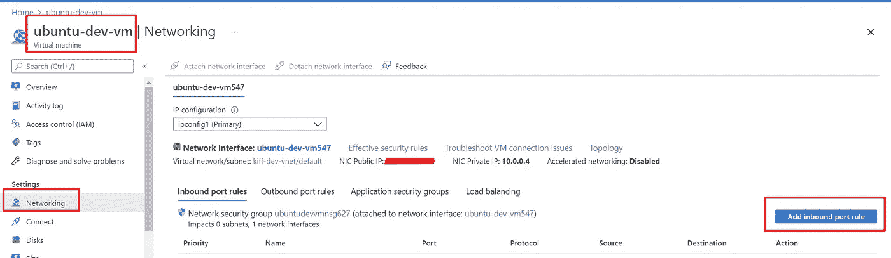
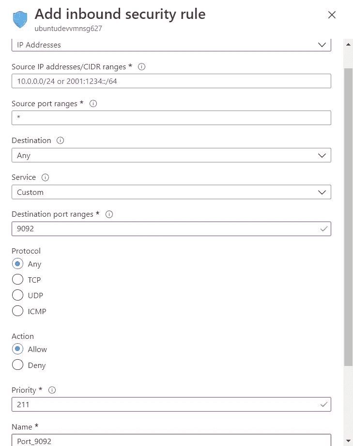

# 使用 Kafka 进行系统集成

> 原文：<https://blog.devgenius.io/using-kafka-for-system-integration-cc272b214740?source=collection_archive---------4----------------------->

# 概观

如果您想使用 Kafka 连接位于不同机器或不同网络上的多个系统，本文将对您有所帮助。

在本文中，我将向您展示如何:

*   在 Azure 上的专用 Linux 服务器上创建 Kafka 集群
*   手动安装和配置 Kafka
*   将您的 Kafka 集群暴露给不同的机器
*   使用单独的生产者和消费者测试您的 Kafka 集群

# 在 Azure 上创建虚拟机

第一步是在我们现有的或新的资源组中创建新的资源，例如 Linux 服务器。' Ubuntu Server 20.04 LTS 版'

创建实例时要记住的事项:

*   虚拟机(cpu、内存)的大小，对于开发和测试 B1 实例，1 个 vcpu 和 2 个 GiB 就足够了，对于生产环境，将需要更多功率。还要记住，Kafka 可以水平扩展(更多实例)，而 RabbitMQ 可以垂直扩展(更强大)
*   允许 SSH 入站端口
*   使用 SSH 公钥(新的或现有的)
*   OS 磁盘类型(取决于工作负载)，我选择标准 SSD

在我们的虚拟机成功部署后，您可以使用终端登录，例如。Windows 终端并键入:

```
ssh -i Path\\To\\Private\\Key.pem <vm-user-name-you-choose>@<public-ip-of-vm>
```

下一步:

# 安装 Java jre 和 jdk

安装 Java 最简单的选择是使用 Ubuntu 打包的版本。默认情况下，Ubuntu 20.04 包括开放 JDK 11，这是 JRE 和 JDK 的开源版本。

要安装此版本，请先更新软件包索引:

```
sudo apt update
```

接下来，检查 Java 是否已经安装:

```
java -version
```

如果当前没有安装 Java，您将看到以下输出:

```
Output
Command 'java' not found, but can be installed with:sudo apt install openjdk-11-jre-headless  # version 11.0.11+9-0ubuntu2~20.04, or
sudo apt install default-jre              # version 2:1.11-72
sudo apt install openjdk-13-jre-headless  # version 13.0.7+5-0ubuntu1~20.04
sudo apt install openjdk-16-jre-headless  # version 16.0.1+9-1~20.04
sudo apt install openjdk-8-jre-headless   # version 8u292-b10-0ubuntu1~20.04
```

执行以下命令来安装默认的 Java 运行时环境(JRE ),这将从 OpenJDK 11 安装 JRE:

```
sudo apt install default-jre
```

JRE 将允许你运行几乎所有的 Java 软件。

使用以下工具验证安装:

```
java -version
```

您将看到类似如下的输出:

```
Output
openjdk version "11.0.11" 2021-04-20
OpenJDK Runtime Environment (build 11.0.11+9-Ubuntu-0ubuntu2.20.04)
OpenJDK 64-Bit Server VM (build 11.0.11+9-Ubuntu-0ubuntu2.20.04, mixed mode, sharing))
```

为了编译和运行一些特定的基于 Java 的软件，除了 JRE 之外，您可能还需要 Java 开发工具包(JDK)。要安装 JDK，请执行以下命令，这也将安装 JRE:

```
sudo apt install default-jdk
```

通过检查 Java 编译器`javac`的版本，验证是否安装了 JDK:

```
javac -version
```

您将看到以下输出:

```
Output
javac11.0.11
```

下一步:

# 安装卡夫卡

# 步骤 1 —为 Kafka 创建用户

因为 Kafka 可以通过网络处理请求，所以您的第一步是为该服务创建一个专用用户。在有人破坏 Kafka 服务器的情况下，这可以最大限度地减少对你的 Ubuntu 机器的损害。但是因为我们已经有了一个用户，并且我们的服务器只为我们的消息代理服务，所以我们可以使用那个用户，并且它已经附带了 sudo 特权。

如果我们没有用户，您可以执行以下操作:

```
sudo adduser kafka
```

按照提示设置密码并创建`kafka`用户。

接下来，使用`adduser`命令将`kafka`用户添加到`sudo`组。您需要这些权限来安装 Kafka 的依赖项:

```
sudo adduser kafka sudo
```

您的`kafka`用户现已准备就绪。使用`su`登录账户:

```
su -l kafka
```

现在您已经创建了一个特定于 Kafka 的用户，您已经准备好下载并提取 Kafka **二进制文件**。

**不要安装源文件，使用二进制文件！！！**

# 步骤 2 —下载并解压缩 Kafka 二进制文件

让我们将 Kafka 二进制文件下载并解压到我们的`kafka`用户主目录的专用文件夹中。

首先，在`/home/kafka`中创建一个名为`Downloads`的目录来存储您的下载:

```
mkdir ~/Downloads
```

使用`curl`下载 Kafka 二进制文件:

```
curl "<https://downloads.apache.org/kafka/3.1.0/kafka_2.13-3.1.0.tgz>" -o ~/Downloads/kafka.tgz
```

创建一个名为`kafka`的目录，并切换到这个目录。这将是 Kafka 安装的基本目录:

```
mkdir ~/kafka && cd ~/kafka
```

使用`tar`命令提取您下载的归档文件:

```
tar -xvzf ~/Downloads/kafka.tgz --strip 1
```

我们指定了`--strip 1`标志，以确保归档文件的内容是在`~/kafka/`本身中提取的，而不是在其中的另一个目录(比如`~/kafka/kafka_2.13-3.1.0/`)中提取的。

现在我们已经成功下载并提取了二进制文件，我们可以开始配置我们的 Kafka 服务器了。

下一步:

# 设置 Kafka 配置

# 步骤 1 —配置 Kafka 服务器

Kafka 的默认行为是不允许你删除一个**主题**。[Kafka 主题](https://kafka.apache.org/documentation/#intro_concepts_and_terms)是可以发布消息的类别、群组或订阅源名称。要对此进行修改，您必须编辑配置文件。

Kafka 的配置选项在`server.properties`中指定。用`nano`或你喜欢的编辑器打开这个文件:

```
nano ~/kafka/config/server.properties
```

首先，添加一个允许我们删除卡夫卡主题的设置。将以下内容添加到文件的底部:

```
delete.topic.enable = true
```

其次，通过修改`logs.dir`属性来改变 Kafka 日志存储的目录:

```
# 'kafka' being the username
log.dirs=/home/kafka/logs
```

第三，改变内部和外部将暴露卡夫卡的听众(端口应该不同):

```
listeners=INTERNAL://0.0.0.0:19092,EXTERNAL://0.0.0.0:9092
listener.security.protocol.map=INTERNAL:PLAINTEXT,EXTERNAL:PLAINTEXT
advertised.listeners=INTERNAL://10.0.0.4:19092,EXTERNAL://20.201.63.123:9092
inter.broker.listener.name=INTERNAL
```

**注意**:内部是虚拟机的私有 IP 地址，外部是虚拟机的公共 IP 地址

保存并关闭文件。现在您已经配置了 Kafka，下一步是配置 zookeeper。

有一篇很好的文章，您可以查看关于 Kafka 连接的更多选项:

[卡夫卡的听众——解释](https://rmoff.net/2018/08/02/kafka-listeners-explained/)

# 步骤 2 —配置 Zookeeper 服务器

Zookeper 的默认行为会将数据保存在/tmp 中，会引发问题。要对此进行修改，您必须编辑配置文件。

Zookeeper 的配置选项在`zookeeper.properties`中指定。用`nano`或你喜欢的编辑器打开这个文件:

```
nano ~/kafka/config/zookeeper.properties
```

修改我们保存 zookeeper 数据的位置:

```
dataDir=/home/kafka/zookeeper
```

保存并关闭文件。现在您已经配置了 Zookeeper，下一步是创建 systemd 单元文件，以便在启动时运行和启用 Kafka 服务器。

# 步骤 3 —创建 Systemd 单元文件并启动 Kafka 服务器

在本节中，您将为 Kafka 服务创建 [systemd 单元文件](https://www.digitalocean.com/community/tutorials/understanding-systemd-units-and-unit-files)。这将帮助您以与其他 Linux 服务一致的方式执行常见的服务操作，例如启动、停止和重新启动 Kafka。

Zookeeper 是 Kafka 用来管理其集群状态和配置的服务。它被用于许多分布式系统中。如果你想了解更多，请访问官方动物园管理员文档。

为`zookeeper`创建单位档案:

```
sudo nano /etc/systemd/system/zookeeper.service
```

在文件中输入以下单位定义:

/etc/systemd/system/zookeeper . service

```
[Unit]
Requires=network.target remote-fs.target
After=network.target remote-fs.target[Service]
Type=simple
User=kafka
ExecStart=/home/kafka/kafka/bin/zookeeper-server-start.sh /home/kafka/kafka/config/zookeeper.properties
ExecStop=/home/kafka/kafka/bin/zookeeper-server-stop.sh
Restart=on-abnormal[Install]
WantedBy=multi-user.target
```

`[Unit]`部分指定 Zookeeper 需要网络和文件系统准备好才能启动。

`[Service]`部分指定 systemd 应该使用`zookeeper-server-start.sh`和`zookeeper-server-stop.sh` shell 文件来启动和停止服务。它还指定如果 Zookeeper 异常退出，应该重新启动它。

添加此内容后，保存并关闭文件。

接下来，为`kafka`创建 systemd 服务文件:

```
sudo nano /etc/systemd/system/kafka.service
```

在文件中输入以下单位定义:

/etc/systemd/system/Kafka . service

```
[Unit]
Requires=zookeeper.service
After=zookeeper.service[Service]
Type=simple
User=kafka
ExecStart=/bin/sh -c '/home/kafka/kafka/bin/kafka-server-start.sh /home/kafka/kafka/config/server.properties > /home/kafka/kafka/kafka.log 2>&1'
ExecStop=/home/kafka/kafka/bin/kafka-server-stop.sh
Restart=on-abnormal[Install]
WantedBy=multi-user.target
```

`[Unit]`部分指定该单元文件依赖于`zookeeper.service`。这将确保`zookeeper`在`kafka`服务启动时自动启动。

`[Service]`部分指定 systemd 应该使用`kafka-server-start.sh`和`kafka-server-stop.sh` shell 文件来启动和停止服务。它还指定如果 Kafka 异常退出，应该重新启动它。

现在您已经定义了单元，使用以下命令启动 Kafka:

```
sudo systemctl start kafka
```

为确保服务器已成功启动，请检查`kafka`单元的日志:

```
sudo systemctl status kafka
```

您将收到如下输出:

```
Output
● kafka.service
     Loaded: loaded (/etc/systemd/system/kafka.service; disabled; vendor preset: enabled)
     Active:active (running) since Wed 2021-02-10 00:09:38 UTC; 1min 58s ago
   Main PID: 55828 (sh)
      Tasks: 67 (limit: 4683)
     Memory: 315.8M
     CGroup: /system.slice/kafka.service
             ├─55828 /bin/sh -c /home/kafka/kafka/bin/kafka-server-start.sh /home/kafka/kafka/config/server.properties > /home/kafka/kafka/kafka.log 2>&1
             └─55829 java -Xmx1G -Xms1G -server -XX:+UseG1GC -XX:MaxGCPauseMillis=20 -XX:InitiatingHeapOccupancyPercent=35 -XX:+ExplicitGCInvokesConcurrent -XX:MaxInlineLevel=15 -Djava.awt.headless=true -Xlog:gc*:file=>Feb 10 00:09:38 cart-67461-1 systemd[1]: Started kafka.service.
```

您现在有一个 Kafka 服务器监听端口`9092`。

您已经启动了`kafka`服务。但如果重启服务器，Kafka 不会自动启动。要在服务器启动时启用`kafka`服务，请运行以下命令:

```
sudo systemctl enable kafka
```

我发现对调试非常有帮助的一个命令是:

```
sudo journalctl --follow -u kafka.service
```

您将收到如下输出:

```
-- Logs begin at Thu 2022-03-03 12:47:53 UTC. --
Mar 03 19:03:41 ubuntu-dev-vm systemd[1]: kafka.service: Main process exited, code=exited, status=1/FAILURE
Mar 03 19:03:41 ubuntu-dev-vm systemd[1]: kafka.service: Failed with result 'exit-code'.
Mar 03 19:04:43 ubuntu-dev-vm systemd[1]: Started kafka.service.
Mar 03 19:04:46 ubuntu-dev-vm systemd[1]: kafka.service: Main process exited, code=exited, status=1/FAILURE
Mar 03 19:04:46 ubuntu-dev-vm systemd[1]: kafka.service: Failed with result 'exit-code'.
Mar 03 19:05:11 ubuntu-dev-vm systemd[1]: Started kafka.service.
Mar 03 19:15:47 ubuntu-dev-vm systemd[1]: Stopping kafka.service...
Mar 03 19:16:02 ubuntu-dev-vm systemd[1]: kafka.service: Succeeded.
Mar 03 19:16:02 ubuntu-dev-vm systemd[1]: Stopped kafka.service.
Mar 03 19:16:18 ubuntu-dev-vm systemd[1]: Started kafka.service.
```

这将跟随你的 kafka.service 状态的实时更新，现在你可以打开另一个终端来读取日志或做其他事情，并检查你的服务的实时状态。

在这一步中，您启动并启用了`kafka`和`zookeeper`服务。在下一步中，您将在 Azure vm 网络上设置入站规则。

注意:Kafka 安装帮助来自:

[如何在 Ubuntu 20.04 | DigitalOcean 上安装 Apache Kafka](https://www.digitalocean.com/community/tutorials/how-to-install-apache-kafka-on-ubuntu-20-04)

下一步:

# 在 Azure vm 上添加入站端口规则以公开 Kafka

# 在 Azure 门户中打开“网络”选项卡

1.  第一件事就是打开你的 Azure 门户。
2.  然后打开我们需要添加入站规则的虚拟机。
3.  打开网络选项卡
4.  单击添加入站端口规则按钮



# 添加入站端口规则(您可以根据需要添加自定义规则)

1.  从来源下拉列表中选择 Ip 地址
2.  输入您想要加入白名单的 Ip 地址
3.  输入目的地端口
4.  设置较高的优先级(较低的数字)
5.  输入规则名称



我们都完成了！

现在，下一步我们可以做一些测试，看看我们的 Kafka 集群是否如我们所愿地工作。

下一步:

# 创建 Kafka 生产者和消费者来测试我们的 Kafka 集群

# 创建卡夫卡主题

首先，我们需要创建一个 kafka 主题，从中我们可以产生和消费消息。

为此，我们需要登录 Kafka 所在的虚拟机。

然后转到 kafka 文件夹并键入:

```
bin/kafka-topics.sh --bootstrap-server INTERNAL://10.0.0.4:19092 --create --topic test --partitions 1
```

# 创建生产者

下一步，我们可以创建服务人员或控制台应用程序。我将向您展示一个服务人员的例子:

1.  从 Visual Studio 创建默认的服务工作应用程序
2.  安装汇流器。NuGet 的卡夫卡包
3.  将这段代码复制到 Worker 类中

```
public class Worker : BackgroundService
    {
        private readonly ILogger<Worker> _logger; public Worker(ILogger<Worker> logger)
        {
            _logger = logger;
        } protected override async Task ExecuteAsync(CancellationToken stoppingToken)
        {
            while (!stoppingToken.IsCancellationRequested)
            {
                _logger.LogInformation("Worker running at: {time}", DateTimeOffset.Now); string brokerList = "20.201.63.123:9092"; // public ip of kafka's virtual machine
                string topicName = "test"; var config = new ProducerConfig 
                { 
                    BootstrapServers = brokerList,
                    SecurityProtocol = SecurityProtocol.Plaintext,
                }; using (var producer = new ProducerBuilder<string, string>(config).Build())
                {
                    Console.WriteLine("\\n-----------------------------------------------------------------------");
                    Console.WriteLine($"Producer {producer.Name} producing on topic {topicName}.");
                    Console.WriteLine("-----------------------------------------------------------------------");
                    Console.WriteLine("To create a kafka message with UTF-8 encoded key and value:");
                    Console.WriteLine("> key value<Enter>");
                    Console.WriteLine("To create a kafka message with a null key and UTF-8 encoded value:");
                    Console.WriteLine("> value<enter>");
                    Console.WriteLine("Ctrl-C to quit.\\n"); var cancelled = false;
                    Console.CancelKeyPress += (_, e) => {
                        e.Cancel = true; // prevent the process from terminating.
                        cancelled = true;
                    }; while (!cancelled)
                    {
                        Console.Write("> "); string text;
                        try
                        {
                            text = Console.ReadLine();
                        }
                        catch (IOException)
                        {
                            // IO exception is thrown when ConsoleCancelEventArgs.Cancel == true.
                            break;
                        }
                        if (text == null)
                        {
                            // Console returned null before 
                            // the CancelKeyPress was treated
                            break;
                        } string key = null;
                        string val = text; // split line if both key and value specified.
                        int index = text.IndexOf(" ");
                        if (index != -1)
                        {
                            key = text.Substring(0, index);
                            val = text.Substring(index + 1);
                        } try
                        {
                            // Note: Awaiting the asynchronous produce request below prevents flow of execution
                            // from proceeding until the acknowledgement from the broker is received (at the 
                            // expense of low throughput).
                            var deliveryReport = await producer.ProduceAsync(
                                topicName, new Message<string, string> { Key = key, Value = val }); Console.WriteLine($"delivered to: {deliveryReport.TopicPartitionOffset}");
                        }
                        catch (ProduceException<string, string> e)
                        {
                            Console.WriteLine($"failed to deliver message: {e.Message} [{e.Error.Code}]");
                        }
                    } // Since we are producing synchronously, at this point there will be no messages
                    // in-flight and no delivery reports waiting to be acknowledged, so there is no
                    // need to call producer.Flush before disposing the producer.
                }
            }
        }
    }
```

运行应用程序并编写一些东西

您应该会看到以下输出:

```
info: KafkaProducer.Worker[0]
      Worker running at: 03/04/2022 16:18:31 +01:00-----------------------------------------------------------------------
Producer rdkafka#producer-1 producing on topic test.
-----------------------------------------------------------------------
To create a kafka message with UTF-8 encoded key and value:
> key value<Enter>
To create a kafka message with a null key and UTF-8 encoded value:
> value<enter>
Ctrl-C to quit.> Hello Hello from producer
info: Microsoft.Hosting.Lifetime[0]
      Application started. Press Ctrl+C to shut down.
info: Microsoft.Hosting.Lifetime[0]
      Hosting environment: Development
info: Microsoft.Hosting.Lifetime[0]
      Content root path: C:\\Projects\\KafkaProducer\\KafkaProducer
delivered to: test [[0]] @1
>
```

# 创建消费者

下一步，我们可以创建服务人员或控制台应用程序。我将向您展示一个控制台应用程序的示例:

1.  安装汇流器。NuGet 的卡夫卡包
2.  在 Program.cs 类中编写以下代码:

```
var brokerList = "20.201.63.123:9092"; // public ip of kafka's vm
var topics = new List<string> { "test" };
Console.WriteLine($"Started consumer, Ctrl-C to stop consuming");CancellationTokenSource cts = new CancellationTokenSource();
Console.CancelKeyPress += (_, e) => {
    e.Cancel = true; // prevent the process from terminating.
    cts.Cancel();
};var config = new ConsumerConfig
{
    // the group.id property must be specified when creating a consumer, even 
    // if you do not intend to use any consumer group functionality.
    GroupId = new Guid().ToString(),
    BootstrapServers = brokerList,
    // partition offsets can be committed to a group even by consumers not
    // subscribed to the group. in this example, auto commit is disabled
    // to prevent this from occurring.
    EnableAutoCommit = true
};using (var consumer =
    new ConsumerBuilder<Ignore, string>(config)
        .SetErrorHandler((_, e) => Console.WriteLine($"Error: {e.Reason}"))
        .Build())
{
    consumer.Assign(topics.Select(topic => new TopicPartitionOffset(topic, 0, Offset.Beginning)).ToList()); try
    {
        while (true)
        {
            try
            {
                var consumeResult = consumer.Consume(cts.Token);
                // Note: End of partition notification has not been enabled, so
                // it is guaranteed that the ConsumeResult instance corresponds
                // to a Message, and not a PartitionEOF event.
                Console.WriteLine($"Received message at {consumeResult.TopicPartitionOffset}: ${consumeResult.Message.Value}");
            }
            catch (ConsumeException e)
            {
                Console.WriteLine($"Consume error: {e.Error.Reason}");
            }
        }
    }
    catch (OperationCanceledException)
    {
        Console.WriteLine("Closing consumer.");
        consumer.Close();
    }
}
```

启动应用程序。

您应该会看到以下输出:

```
Started consumer, Ctrl-C to stop consuming
Received message at test [[0]] @1: $Hello from producer
```

就是这样！

# 结束注释

使用了合流代码的例子。用于. Net 的 Kafka 软件包。其他示例可以查看他们的 github 帐户:

[confluent-Kafka-dot net/master confluent Inc/confluent-Kafka-dot net 的例子](https://github.com/confluentinc/confluent-kafka-dotnet/tree/master/examples)

对于其他配置和设置，请使用 Kafka 官方文档，其中包含最新信息:

[](https://kafka.apache.org/documentation/) [## 阿帕奇卡夫卡

### 下面是对 Apache Kafka 的一些流行用例的描述。有关这些领域的概述…

kafka.apache.org](https://kafka.apache.org/documentation/) 