# 使用机器学习来预测患者的糖尿病状态

> 原文：<https://blog.devgenius.io/using-machine-learning-to-predict-patients-diabetes-status-481643dc7389?source=collection_archive---------0----------------------->

# "数据科学家严重短缺。"

米（meter 的缩写））斯通布拉克(图灵奖获得者)，2020 年 3 月。

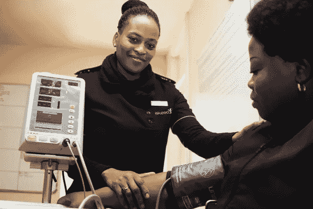

www.unsplash.com

在本文中，我们将介绍一些关于**机器学习**的基础知识，并使用 **Python 库**来实现它们。我会尽量简单，避免使用太多的*【技术术语】*来表达那些在编程或机器学习方面还不扎实的人。

## 关于数据集

该数据集包含来自患者的 2000 个观察结果，具有 8 个特征和一个表明他们是否患有糖尿病的目标。关于患者的 8 个记录特征包括怀孕、葡萄糖、血压、皮肤厚度、胰岛素、身体质量指数、糖尿病谱系功能(基于家族的糖尿病可能性)和年龄。这里的目标名为“结果”，如果患者有糖尿病，则为“1”，如果没有糖尿病，则为“0”。

𝐅𝐞𝐚𝐭𝐮𝐫𝐞𝐬 (𝐈𝐧𝐝𝐞𝐩𝐞𝐧𝐝𝐞𝐧𝐭 𝐕𝐚𝐫𝐢𝐚𝐛𝐥𝐞𝐬 𝐨𝐫 𝐈𝐧𝐩𝐮𝐭):

1.  怀孕
2.  葡萄糖
3.  血压
4.  表皮厚度
5.  胰岛素
6.  身体质量指数
7.  糖尿病谱系功能
8.  年龄

𝐓𝐚𝐫𝐠𝐞𝐭 (𝐃𝐞𝐩𝐞𝐧𝐝𝐞𝐧𝐭 𝐕𝐚𝐫𝐢𝐚𝐛𝐥𝐞 𝐨𝐫 𝐎𝐮𝐭𝐩𝐮𝐭):

1.  结果

## 想了解一些机器学习的基础知识？

机器学习是一门训练计算机根据数据做出决策的科学，而不是针对每种情况进行显式编程。机器学习可以大致分为两个分支，即**监督**和**非监督**学习。

**监督学习:**是机器学习的一种最常见的分支，通常是人们在使用术语**机器学习**时所指的，并且是**学习**的任务，即基于示例**输入输出对**将**输入**映射到**输出**的功能。最常见的**监督学习**是**分类模型，**如**决策树**，其目的是根据输入和**回归**对观察值进行分类，后者根据一组输入变量预测标量响应变量。

**无监督学习:**是一种类型的**机器学习**算法，用于从由没有标记响应的输入数据组成的数据集进行推断。最常见的**无监督学习**方法是**聚类分析**，用于探索性数据分析，寻找数据中隐藏的模式或分组。

此外，数据科学项目中一个关键但被忽视的步骤是**数据可视化**和**探索性数据分析(EDA)** 。 **EDA** 是一个必要的步骤，以便在我们训练模型和查看有助于决策的结果之前，更好地了解我们的数据看起来如何，以及它是否符合所有要求。

## 我们在本文中的范围

在本文中，我们将使用:

通过一个名为`**scikit-learn**`的流行库对方法进行分类，这个库处理算法背后的大量技术数学。

**二。NumPy:** 一个 Python 库，允许我们处理数组、矩阵和执行线性代数(它代表数值 Python)。

**三。Pandas:** 一个 Python 库，提供了快速、灵活、富于表现力的数据结构，用于处理*关系数据*和*标签数据。它是用 Python 进行实际的、真实世界的数据分析的一个基本的高级构建块。

**四。**两个流行的 Python 库，用于创建可视化( **Matplotlib** 和 **Seaborn** )以及查看数据分析第一步中使用的一些常用步骤。

总的来说，我们将看看如何通过**探索性数据分析(EDA)** 来理解糖尿病数据集。我们还将看看如何用**糖尿病数据集**训练一个模型( **k 近邻**分类算法)，并使用它来预测新患者是否患有糖尿病。最后，我们将讨论确定我们的模型有多好的各种方法。

## 先决条件

对于本文，我将使用**Python**&**Jupyter 笔记本**。

使用 **Python** 最简单的方法是通过 [**Anaconda**](https://docs.anaconda.com/anaconda/install/) ，因为它附带了你可能需要的所有必需的包。

**小心！**笔记本本质上是 Python 的一个交互会话，因此当你创建变量时，它们会被存储在内存中。当不按顺序重新运行单元时(即，在运行上一个单元之前运行一个单元)，这可能会有问题，因此您的代码可能不会按预期运行。这对于那些不太熟悉编程的人来说尤其成问题，但是即使是有经验的用户也会被它绊倒，因为它不直观。

**本文使用的笔记本和数据集可以在 Github 上** [**这里**](https://github.com/nuhu-ibrahim/Articles/tree/main/Machine%20Learning) **找到。**

## 探索性数据分析

首先，我们需要导入一些常用于 EDA 和可视化的库。Matplotlib 和 Seaborn 是 Python 中两个简单的绘图库。

𝐍𝐨𝐭𝐞:是一个样式表，我们用它来使我们的可视化看起来更像样。

```
import numpy as np
import pandas as pd# We will use the Seaborn library
import seaborn as sns# Matplotlib forms basis for visualisation in Python
import matplotlib.pyplot as plt# Set the default style for plots
plt.style.use('Datern.mplstyle')
colors = plt.rcParams["axes.prop_cycle"]()#Gradient colours
from matplotlib.colors import LinearSegmentedColormap
nodes = [0,0.5,1.0]
color = ['#00ACF0','#ffffff']
cmap = LinearSegmentedColormap.from_list("", list(zip(nodes, color)))%config InlineBackend.figure_format='retina'
```

现在，我们将糖尿病数据集(`diabetes-dataset.csv`)加载到笔记本中，并开始探索其中的特征:

```
df = pd.read_csv('diabetes-dataset.csv')
```

然后，我们可以使用 Panda，使用`.dtypes`查看数据集中的特征类型，或者使用`.info()`查看更多细节

```
df.dtypes
```

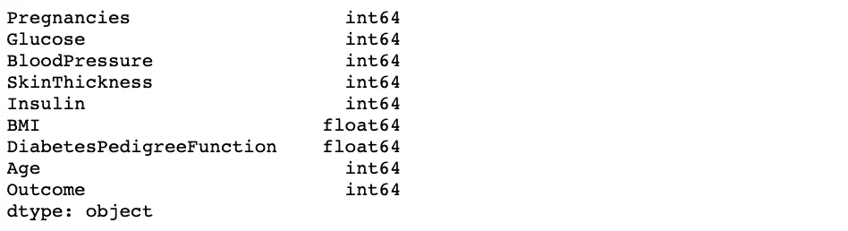

```
df.info()
```

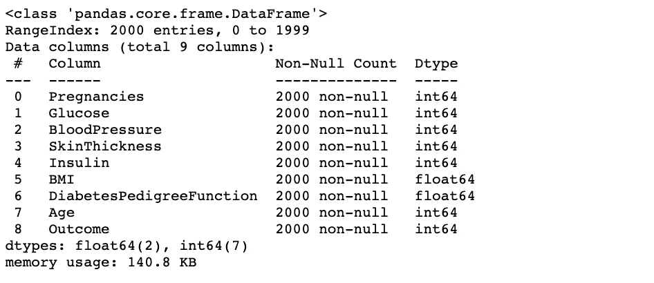

现在来看看我们的一些数据，我们可以使用`.head()`来查看前 5 个条目

```
df.head()
```

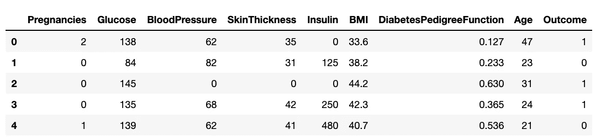

我们可以使用`.tail()`和`.sample()`查看数据的其他部分

```
# Prints the last 10 entries 
df.tail(10)
```

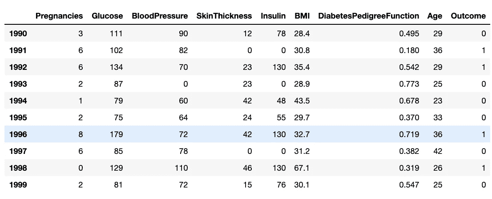

```
# Produces a random sample from the data
df.sample(frac=.01)
```

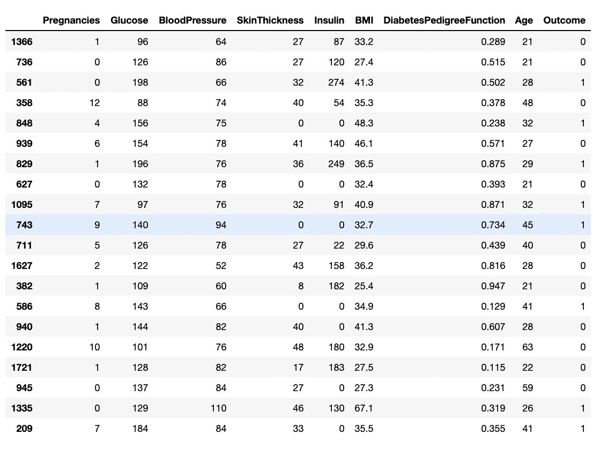

在我们开始可视化之前，我们还可以更好地理解数据集中的定量变量，这些变量有助于理解我们的连续数据，使用`.describe()`:

```
df.describe()
```

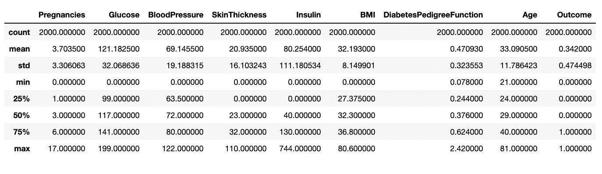

# 数据可视化

数据可视化是我们数据的图形化表示。我们使用图表、图形和地图来更容易地查看数据集中的趋势和其他特征。

```
# Now we make continous plots of quantitative data
fig=plt.figure(figsize=(20,20))
for i,col in enumerate(df.drop(['Outcome'],axis=1)):
    ax=fig.add_subplot(4,2,i+1)
    sns.distplot(df[col])
```

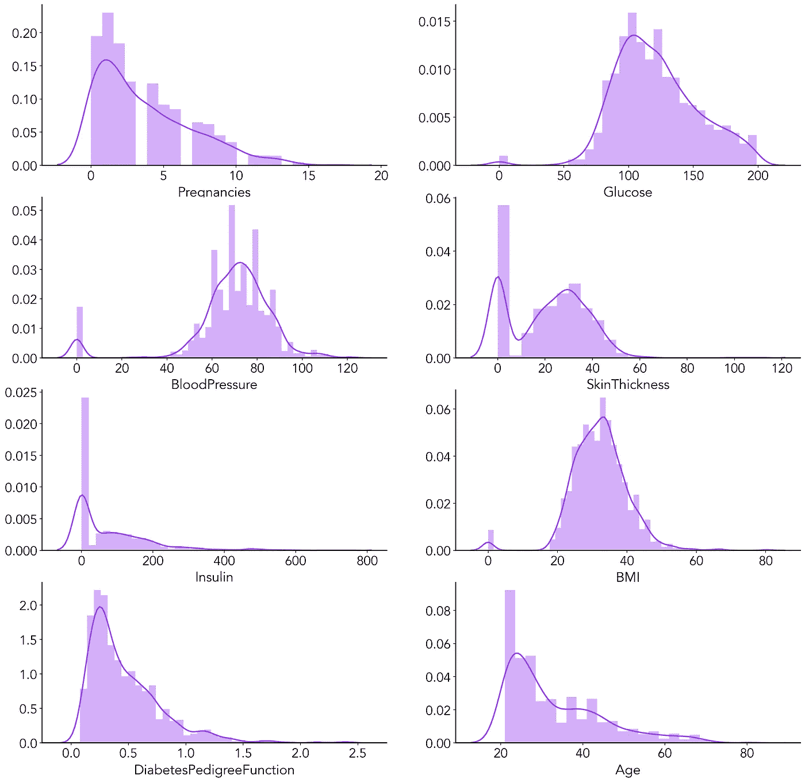

## 观察

1.  血压、葡萄糖和身体质量指数分布均匀。
2.  皮肤厚度、糖尿病谱系功能、怀孕和年龄是正(右)倾斜的。
3.  血压、皮肤厚度、胰岛素和身体质量指数具有可以被视为异常值的零值。

```
_ = sns.countplot(x='Pregnancies', hue='Outcome', data=df).set(title='Pregnancies against Outcome', xlabel='Pregnancies', ylabel='Outcome')
```

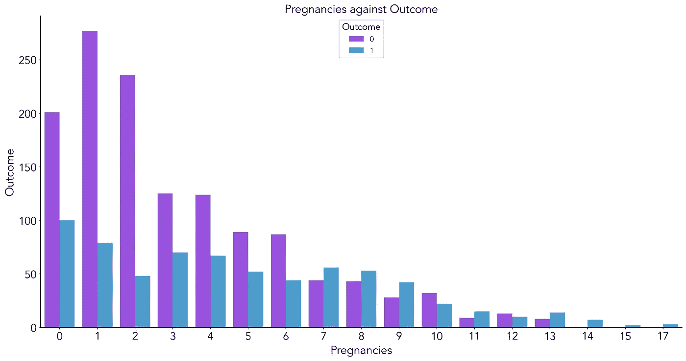

## 解释

我们将在这里观察到，尽管有更多的人怀孕次数少，但可以假设怀孕次数多的人更有可能患有糖尿病。这是因为怀孕次数少(0-2 次)的女性中不到一半患有糖尿病。然而，一半或超过一半的怀孕 3 次以上的患者患有糖尿病。

```
_ = sns.countplot(x='Outcome', data=df).set(title='Patients Diabetes Status Count', xlabel='Outcome', ylabel='Count')
```

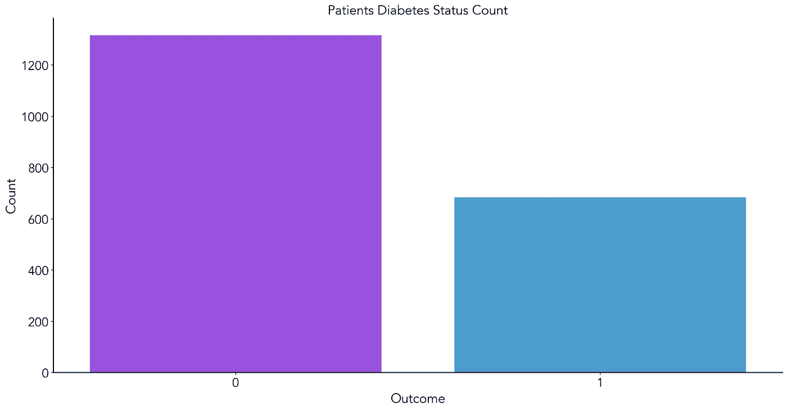

## 解释

这个柱状图显示了更多的人没有患糖尿病。

```
_ = sns.countplot(x='Pregnancies', data=df).set(title='Patients Pregnancies Status Count', xlabel='Pregnancies', ylabel='Count')
```

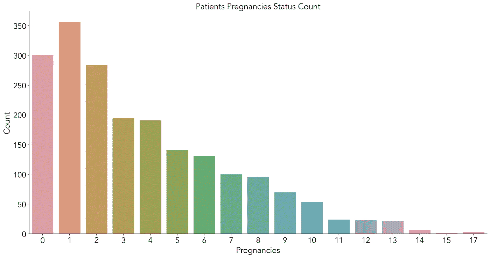

## 解释

接受观察的人越多，怀孕次数越少。

# 分类(K-最近邻)

分类是监督学习的一个众所周知的领域，其中目标变量采取类别的形式，例如给定一个电子邮件示例，分类它是否是垃圾邮件。在这个例子中，我们将使用`k-nearest-neigbour`分类器，这是最直观的分类算法之一。`k-nearest-neighbors`分类器是一种简单的算法，它存储所有可用的案例，并根据相似性度量(例如，距离函数)对新案例进行分类。

## 构建我们的模型

现在我们已经准备好构建我们的初始模型了。`Scikit-learn`内置了一个`KNeighborsClassifier`模块，这对我们来说非常简单。在这里，我们将看到如何预测患者是否可能患有糖尿病。

我们将首先为我们的目标和特征创建两个独立的数据框架。

```
# Create feature and target arrays
y = df["Outcome"].values
X = df.drop(["Outcome"], axis = 1)
```

由于 KNN 使用观测值之间的距离(不一定是欧几里德距离),我们将需要调整我们的数据:

```
#Scaling - crucial for knn
from sklearn.preprocessing import StandardScaler
ss = StandardScaler()
X = ss.fit_transform(X)
```

现在我们需要将数据分成训练集和测试集。请注意，我们分为 80%的训练和 20%的测试。

```
from sklearn.model_selection import train_test_split# Split into training and test set
X_train, X_test, y_train, y_test = train_test_split(X, y, test_size = 0.2, random_state = 42, stratify = y)
```

最后，是时候构建和训练我们的模型了:

```
from sklearn.neighbors import KNeighborsClassifier# Create a k-NN classifier
knn1 = KNeighborsClassifier()# Fit the classifier to the training data
knn1.fit(X_train,y_train)
```

## 检查我们模型的准确性

现在我们需要确定我们的模型有多好。最常见的度量是准确性，即在根据数据集的 20%测试数据测试模型时，我们做对了多少与做错了多少，这些数据不是用于训练模型的训练数据的一部分。

```
# Print the accuracy
print(knn1.score(X_test, y_test))
```

**我们的模型可以以 81%的准确率预测某人是否可能患有糖尿病——这是可以接受的！。**

非常感谢 [**Datern**](https://twitter.com/DaternSocial) 激励我写下这篇文章。

就这样吧。

让我们继续这次谈话。在 Twitter 上关注我**@**[**_ NuhuIbrahim**](https://twitter.com/_NuhuIbrahim)。