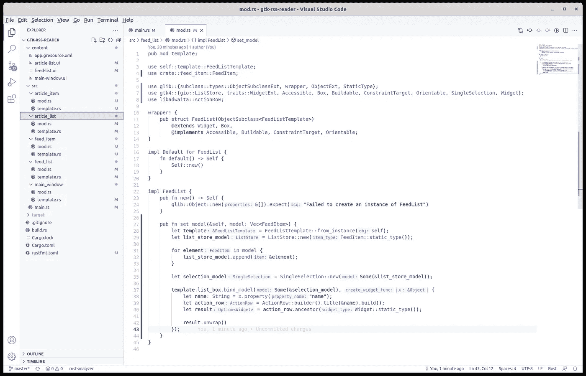

# 使用模型将数据绑定到 Rust 中的 GTK4 定制小部件

> 原文：<https://blog.devgenius.io/using-models-to-bind-data-to-gtk4-custom-widgets-in-rust-379dd9d1bf4d?source=collection_archive---------5----------------------->


照片由 [GuerrillaBuzz Crypto PR](https://guerrillabuzz.com/) 在 [Unsplash](https://unsplash.com/photos/gC_aoAjQl2Q) 上拍摄

到目前为止，编写我们的 libadwaita RSS 阅读器已经是一个相当长的旅程了。我们学习了[模板](/using-template-files-in-rust-for-a-gtk4-libadwaita-ui-8322694cbc3c)、[资源](/bundling-templates-into-resources-in-rust-for-the-gtk4-ui-eb387a7918bf)、[响应](/using-the-libadwaita-leaflet-widget-for-a-responsive-gtk4-ui-in-rust-73bbc2f4025)和[自定义](/refactoring-gtk4-ui-templates-in-rust-68cbef1a1778)小部件和[属性](/adding-properties-to-custom-gtk4-widgets-in-rust-67d4bbed8b08)。当我们准备处理点击事件和实际的 RSS 数据时，我们需要一个缺失的要素:数据模型。我们想要分配我们的`FeedList`和`ArticleList`实际数据。现在我们在模板文件中这样做:在`article-list.ui`和`feed-list.ui`中，但那只是硬编码的数据。我们希望为这些小部件数组分配实际值，这些值可以在应用程序使用过程中改变。和往常一样，你可以在 [github](https://github.com/raduzaharia-medium/gtk-rss-reader-models) 上找到代码。

正如我们上次看到的[，GTK4 实现了一种 MVC:它有视图、模型和控制器。视图就是小部件。`FeedList`和`ArticleList`是窗口小部件，我们的`ListBox`也是，我们在它们中使用它们来显示数据行。`ListBox`可以通过调用它的`bind_model`函数来接收数据模型。让我们看看它是怎么做的。](/adding-properties-to-custom-gtk4-widgets-in-rust-67d4bbed8b08)

## 列表框数据模型


照片由[托马斯·博尔曼斯](https://unsplash.com/@thomasbormans?utm_source=medium&utm_medium=referral)在 [Unsplash](https://unsplash.com?utm_source=medium&utm_medium=referral) 上拍摄

`ListBox`小部件允许几种类型的数据模型。它们都包含正常的日常数据，但它们也定义了`ListBox`中允许的选择类型。您可以选择单项或多项。你也可以完全没有选择。注意这种类型的交互是如何链接到`ListBox`数据模型的。这种情况发生在所有的 GTK 部件上。数据模型不仅仅是简单的数据，它们还定义了小部件行为的各个方面。

在决定选择模型后，我们准备用数据填充它，并用`bind_model`函数将它分配给`ListBox`。但是选择模型不允许任何类型的数据。物品必须是 GTK `GObjects`。所以我们必须从那里开始:我们需要为`FeedList`小部件创建一个数据模型，它将把`ListBox`与类型为`GObject`的项目绑定在一起。我们就叫它`FeedItem`。是的，我们必须为`ArticleList`做同样的事情。

## `The FeedItem`



更新的项目结构—注意 article_item 和 feed_item

数据模型看起来就像小部件，但是它们没有扩展小部件或其他类。但是它们有一个`template.rs`并且它们需要`ObjectImpl`函数。让我们看看`mod.rs`是什么样子的:

```
mod template;use glib::{wrapper, Object};
use template::FeedItemTemplate;wrapper! {
  pub struct FeedItem(ObjectSubclass<FeedItemTemplate>);
}impl FeedItem {
  pub fn new(name: &str, url: &str) -> Self {
    Object::new(&[("name", &name), ("url", &url)])
      .expect("Failed to create `FeedItem`.")
  }
}
```

与小部件一样，`FeedItem`被包装在启用了`ObjectSubclass`语法的`wrapper!`宏中。子类是`FeedItemTemplate`，我们稍后会看到。我们剩下的就是接收提要名称及其 URL 的构造函数`new`。`FeedItemTemplate`包含更多实施细节:

```
use glib::{
  object_subclass,
  once_cell::sync::Lazy,
  subclass::{object::ObjectImpl, types::ObjectSubclass},
  ParamFlags, ParamSpec, ParamSpecString, ToValue, Value,
};
use std::cell::Cell;#[derive(Default)]
pub struct FeedItemTemplate {
  name: Cell<String>,
  url: Cell<String>,
}#[object_subclass]
impl ObjectSubclass for FeedItemTemplate {
  const NAME: &'static str = "FeedItem";
  type Type = super::FeedItem;
}impl ObjectImpl for FeedItemTemplate {
  fn properties() -> &'static [ParamSpec] {
    static PROPERTIES: Lazy<Vec<ParamSpec>> = Lazy::new(|| {
      vec![
        ParamSpecString::new("name", "name", "The name of the RSS 
          feed", Some(""), ParamFlags::READWRITE)
        ParamSpecString::new("url", "url", "The url of the RSS 
          feed", Some(""), ParamFlags::READWRITE),]
    });
    PROPERTIES.as_ref()
  } fn set_property(&self, _obj: &Self::Type, _id: usize, value: &Value, pspec: &ParamSpec) {
    match pspec.name() {
      "name" => {
        let name_string = value.get()
          .expect("The value needs to be of type `String`.");
        self.name.replace(name_string);
      }
      "url" => {
        let url_string = value.get()
          .expect("The value needs to be of type `String`.");
        self.url.replace(url_string);
      }
      _ => unimplemented!(),
    }
  }fn property(&self, _obj: &Self::Type, _id: usize, pspec: &ParamSpec) -> Value {
    match pspec.name() {
      "name" => {
        let result = self.name.take();

        self.name.set(result.clone());
        result.to_value()
      }
      "url" => {
        let result = self.url.take(); self.url.set(result.clone());
        result.to_value()
      }
      _ => unimplemented!(),
    }
  }
}
```

该结构保存数据定义:`url`和`name`。接下来我们看到一些熟悉的东西:上一篇文章中的属性实现，当时我们向小部件添加了属性。那完全一样，是同一个概念。就像 GTK `Widget`也会是一只`GObject`。你瞧，是的:`ObjectImpl`是`GObject`的一部分，而`Widget`扩展了它。

类型是相当挑剔的。你必须消费它来获取它的价值，所以我们用`take`来做，但是我们必须用`set`把价值放回去。这使得我们的属性 getter 有点尴尬，但它就是这样。

好了，带有 getters 和 setters 的两个属性:这就是我们的`FeedItem`的全部内容。当然，我们也需要创建一个包含文章标题和摘要的`ArticleItem`。

## 将模型应用于列表框


Susan Q Yin 在 [Unsplash](https://unsplash.com?utm_source=medium&utm_medium=referral) 上拍摄的照片

`FeedList`包含了`ListBox`并且它是唯一能够与之对话的，所以我们必须添加一个新的函数来允许它将来自外部的模型绑定到内部的`ListBox`。我们将在`FeedList`的`mod.rs`中通过更新其实现来做到这一点:

```
impl FeedList {
  pub fn new() -> Self {
    glib::Object::new(&[])
      .expect("Failed to create an instance of FeedList")
  } pub fn set_model(&self, model: Vec<FeedItem>) {
    let template = FeedListTemplate::from_instance(self);
    let list_store_model = ListStore::new(FeedItem::static_type()); for element in model {
      list_store_model.append(&element);
    } let selection_model = SingleSelection::new(Some(&list_store_model)); template.list_box.bind_model(Some(&selection_model), |x| {
      let name: String = x.property("name");
      let action_row = ActionRow::builder().title(&name).build();
      let result = action_row.ancestor(Widget::static_type()); result.unwrap()
    });
  }
}
```

因此，我们这里已经有了`new`函数，我们添加了`set_model`。这将接收到`model`，它只是一个`FeedItem`的数组。请注意在那之后我们是如何做的，正如我们在文章开头所说的:我们创建了`ListStore`模型、`SingleSelection`模型，然后我们将它绑定到`list_box`。但是这里有一点故事。看看`bind_model`不仅需要数据，还需要一个回调来指示`ListBox`如何创建类型为`ActionRow`的项目。

现在剩下的就是从主窗口初始化发送模型到`FeedList`和`ArticleList`(现在):

```
impl ObjectImpl for MainWindowTemplate {
  fn constructed(&self, obj: &Self::Type) {
    self.parent_constructed(obj); let feed_model = vec![
      FeedItem::new("The Verge", "https://www.theverge.com/rss/index.xml"),
      FeedItem::new("Ars Technica", "https://feeds.arstechnica.com/arstechnica/features"),
      FeedItem::new("Hacker News", "https://news.ycombinator.com/rss"),
    ]; self.feed_list.set_model(feed_model); let article_model = vec![
      ArticleItem::new("The Verge - Article 1", "Article 1 summary placed in a handy label widget"),
      ArticleItem::new("The Verge - Article 2", "Article 2 summary placed in a handy label widget"),
      ArticleItem::new("The Verge - Article 3", "Article 3 summary placed in a handy label widget"),
      ArticleItem::new("The Verge - Article 4", "Article 4 summary placed in a handy label widget"),
    ]; self.article_list.set_model(article_model);
  }
}
```

这里没什么特别的。不过有一点，`article_list`的`set_model`有点古怪。当您绑定模型以将摘要放入小部件的扩展中时，您必须正确配置`ExpanderRow`:

```
template.list_box.bind_model(Some(&selection_model), |x| {
  let title: String = x.property("title");
  let summary: String = x.property("summary"); let expander_content = &Label::builder()
    .label(&summary)
    .halign(Align::Start)
    .margin_top(24)
    .margin_bottom(24)
    .margin_start(12)
    .margin_end(12)
    .build();
  let expander_content_widget = expander_content
    .ancestor(Widget::static_type()); let expander_row = ExpanderRow::builder().title(&title).build();
  let expander_row_widget = expander_row
    .ancestor(Widget::static_type()); expander_row.add_row(&expander_content_widget.unwrap());
  expander_row_widget.unwrap()
});
```

如果你看一下`article-list.ui`，标签对象的所有属性都来自我们的模板。然后我们有对`expander_row`的额外`add_row`调用，它将`Label`添加为扩展子节点。

这是另一篇文章的结尾。和往常一样，代码在 github 上，可以随时查看。也可以在评论区随意提问，尤其是当你发现文章缺乏解释的时候。谢谢你和我一起学习这个教程。只多了两个部分:[处理点击事件](/event-handling-for-gtk4-widgets-in-rust-d3c3f89b092f)和读取实际的 RSS 数据。下次见！