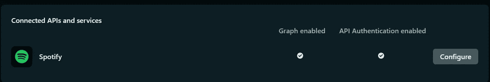
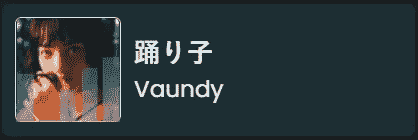

# 使用 Netlify Graph 为我的 Gatsby 站点创建一个简单的“正在播放”小部件

> 原文：<https://blog.devgenius.io/using-netlify-graph-to-create-a-simple-now-playing-widget-for-my-gatsby-site-92170f46f869?source=collection_archive---------8----------------------->

我的个人网站在“关于我”区域有一个小部分，我在那里展示了我最近在 Spotify 上听的一些歌曲，这些歌曲是由 [spotify-source](https://github.com/leolabs/gatsby-source-spotify) 插件在构建时生成的。我通常每周都会重建我的网站，所以这对于我来说非常有效，可以让我对自己最近的音乐品味有所了解。

但是一个显示我正在听的音乐的小部件怎么样呢？这可能不是那么有用，但我认为这将是一个有趣的小练习，因为我目前没有在我的网站上使用任何无服务器功能。我们当然可以通过直接查询 spotify rest API 来实现这个特性，但是在没有任何存储的情况下处理认证有点麻烦。要么生成一次刷新令牌，并在每次请求时使用它来查询新的访问令牌，要么使用外部存储解决方案。选项一是糟糕的实践，选项二会增加另一层复杂性。

对我们来说很好，Netlify 刚刚推出了一个名为 Graph 的新功能。Graph 为我们抽象了身份验证，并方便地提供了一个 GraphQL 端点来查询 Spotify API。请记住，这项功能仍在开发中。

# 连接 Spotify 和 Netflify Graph

**Spotify:** 首先我们需要在 Spotify 端设置 OAuth 连接。只需在您的 S [potify 开发者仪表盘](https://developer.spotify.com/dashboard/applications)中创建一个新应用，并生成您的客户端 id 和密码。至于重定向 uri，您需要加入白名单`[https://serve.onegraph.com/oauth/spotify/receive](https://serve.onegraph.com/oauth/spotify/receive)`,因为 Netlify 正在使用 OneGraph 来提供这一特性。

**Netlify:** 通过提供您生成的客户端 id 和密码，在 Netlify 上的图表设置中连接 Spotify，并激活身份验证和图表浏览器。此后，您应该会看到两者都处于活动状态。



# 创建无服务器功能

如果您还没有，安装 netlify cli 是很重要的

```
npm install netlify-cli -g
```

并将您的存储库链接到您的 netlify 项目

```
netlify link
```

为了生成函数，我们使用图形浏览器，通过图形特性启动 Netlify dev

```
netlify dev --graph
```

这将为您提供一个图形编辑器的 URL，在这里我们可以轻松地从 Spotify API 中选择我们需要的任何内容来创建我们的小部件。

## 使用图形编辑器创建 API 处理程序

如果您曾经使用过 GraphQL，这个界面应该非常熟悉，在这里我们可以选择小部件所需的所有节点。别忘了先在`Authentication`下认证到 Spotify 端点。


正在播放小部件的查询如下所示:

保存您的更改并生成处理程序

`Actions -> Generate Handler`

这将与您的本地项目同步，并生成必要的文件:`./netlify/functions/<QueryName>`。只需确保打开生成的文件并选择正确的身份验证令牌，如下所示:

```
const accessToken = event.authlifyToken;
```

# 创建组件



最终的组件看起来像这样

首先，让我们创建一个函数来处理对新创建的函数的调用。

非常直接。如果您使用 axios 或类似的库，您可以切换这些库的代码，但是我目前没有使用任何客户端站点请求库，所以我选择使用默认的 fetch。反正我也不需要支持 [IE 或者 Opera Mini](https://caniuse.com/fetch) 。

## 自定义挂钩

因为我更喜欢使用 TypeScript，所以我将从键入我们的函数响应开始:

为了封装所有的 API 处理，让我们创建一个自定义钩子来负责轮询我们的函数。我不想发送太多请求，所以我想到了两种轮询方法。要么是静态轮询，它会在某个时间间隔后触发一个请求，要么是“计算”轮询，它会计算我们当前正在听的歌曲的剩余时间，并在此时间后触发一个请求。

在初始渲染之后，我们使用`useEffect`钩子来启动我们的`setTimeout`‘循环’,它将获取我们的函数并计算下一个请求应该何时发送。

## 小部件

这个小部件本身非常简单。我们的自定义钩子负责轮询我们的函数，如果我们当前在监听任何东西，我们就简单地呈现我们的小部件。因为我的站点是用 Tailwind CSS 构建的，所以我将用相应的 Tailwind 类来设计组件的样式。对于专辑封面前面的一个简单的“均衡器”效果，为了更好地传达小部件的意思，我们简单地在一个绝对容器中创建几个跨度，并向这些跨度添加一个 CSS 动画。如果我们将每个条上的动画延迟不同的时间，我们会得到典型的“均衡器”效果。

# 跨页面更改保持播放器

我希望播放器在页面变化时保持不变，而不是在每一页重新加载。为此我们可以配置`gatsby-browser.js`和`gatsby-ssr.js`使用`wrapPageElement`功能或者使用[布局插件](https://www.gatsbyjs.com/plugins/gatsby-plugin-layout/)。两者都将正确地充实我们的网站，但我选择了布局插件。

只是不要忘记移除页面中的布局包装，并在布局包装中安装 now playing 组件。

# 结论

我在设置 OneGraph 处理程序时遇到了一些问题。这些问题通过断开我的本地存储库的链接、删除 Netlify 文件夹并重新开始很快得到解决，但这表明这个特性仍在开发中，应该谨慎使用。另一方面，对于我简单的博客来说，这是一件有趣的事情，而不是必要的事情，这与我无关。OneGraph 端点似乎也没有完美地反映官方的 [Spotify Rest API](https://developer.spotify.com/documentation/web-api/reference/#/) ，这有点奇怪，我不得不发出测试请求，评估响应并相应地生成我的请求。多亏了 GraphQL explorer，这变得非常容易，但还是有点棘手。

总之，这个新功能非常适合我的用例，我期待着集成更多这样的项目。