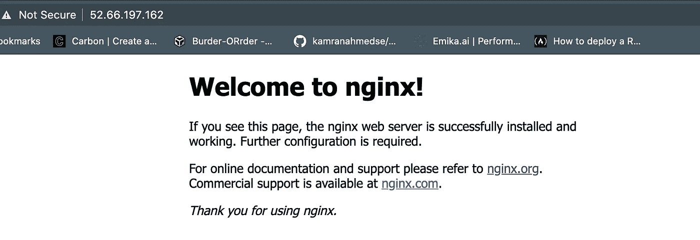
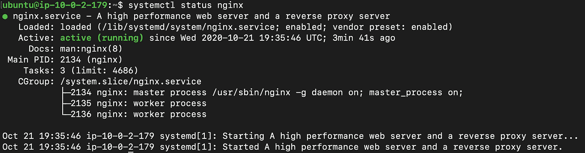
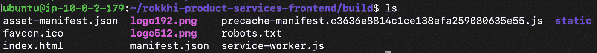
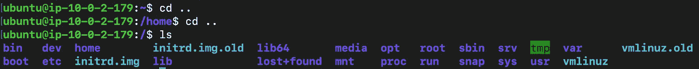
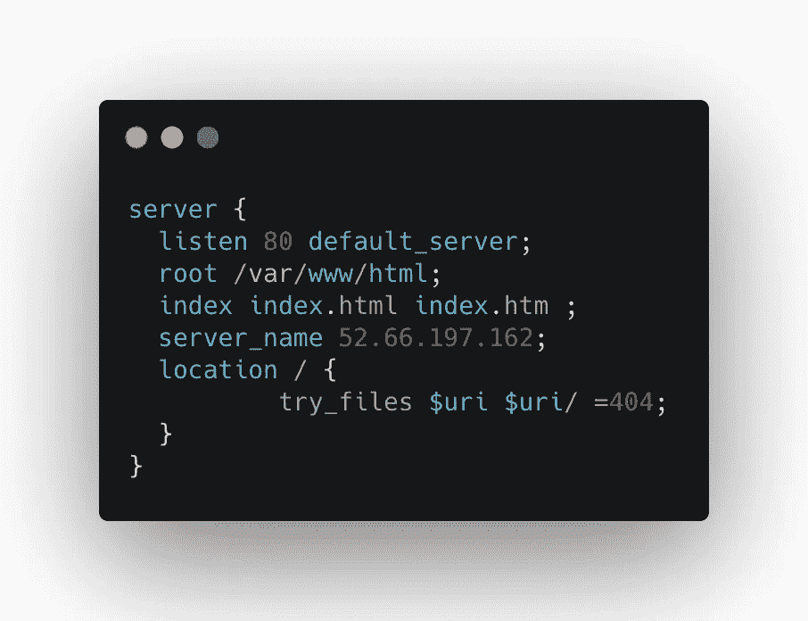
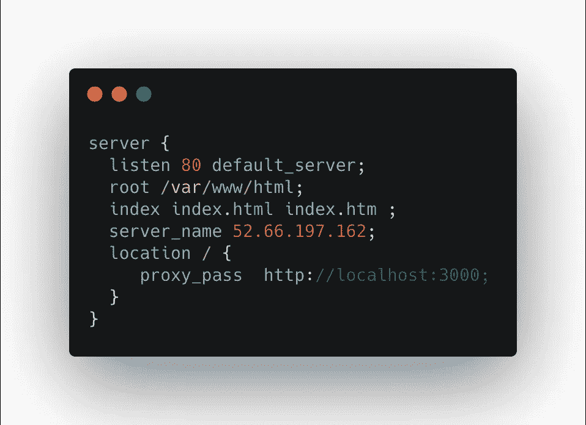

# 使用 NGINX 服务 React 应用程序(静态与反向代理)

> 原文：<https://blog.devgenius.io/using-nginx-to-serve-react-application-static-vs-proxy-69b85f368e6c?source=collection_archive---------0----------------------->


[RKTKN](https://unsplash.com/@rktkn?utm_source=unsplash&utm_medium=referral&utm_content=creditCopyText) 在 [Unsplash](https://unsplash.com/s/photos/engine?utm_source=unsplash&utm_medium=referral&utm_content=creditCopyText) 上拍照

因此，您已经构建了一个非常棒的 react 应用程序。怎么能给人看呢？react 的一个优点是它生成静态资产。所以你可以像其他静态网站一样提供服务。

今天我们将看到如何在 ubuntu 服务器中使用 Nginx 来服务 react 应用程序。NGINX 是一个强大的工具，我们可以使用 React 来利用它的强大功能。

我们的目标服务器可以是任何 ubuntu 服务器实例，如 AWS 中的 EC2 实例或 Digital ocean 中的 Droplet，甚至是您的本地机器。

在 aws 或 digital ocean 中有大量关于设置服务器的教程。我不想再谈这个了。我们将继续关注`Nginx`和`React`的设置。

假设您已经有了一个 EC2 实例或数字海洋水滴并正在运行。现在进入你的机器。

## 步骤 1:安装节点和 NPM

好了，现在你的机器里有你的项目了，现在安装节点和 npm。首先，启用节点源

```
curl -sL https://deb.nodesource.com/setup_12.x | sudo -E bash -
```

然后安装节点

```
sudo apt install nodejs
```

检查节点版本

```
node --version
```

检查 npm 版本

```
npm --version
```

## 步骤 2:安装 NGINX

运行以下命令

```
sudo apt install nginx
```

使用以下命令检查它是否安装正确

```
nginx -v
```

此时，如果您转到您的服务器 IP 地址，它看起来会像这样



nginx 安装成功

现在启用 Nginx，以便它在服务器重启时自动启动。

```
sudo systemctl enable nginx
```

或者您可以通过输入以下命令来检查 Nginx 的状态

```
systemctl status nginx
```

这将给出以下输出



Nginx 已经启动并运行

## 步骤 3:将您的项目放入服务器

把你的项目放到你的机器上。如果你使用 HTTPS，它看起来会像

```
git clone your_repository_address
```

## 步骤 4:构建您的项目

进入项目根目录，然后像往常一样构建 react 应用程序

```
npm install
npm run build
```

这些命令将创建一个优化的生产构建，并将资源放在构建文件夹下。如果你进入你的构建文件夹，它看起来会像这样。



构建文件夹的内容

这里有我们的 index.html 文件和缩小的 js 包，可以用来服务我们的网站。

> 提示:您可以避免在您的服务器内部进行整个构建过程，只需在本地构建项目，然后使用 scp 之类的工具将它们转移到您的远程机器上。因为我们提供静态文件，这就足够了。

## 步骤 5:将构建文件夹项目复制到 var/www/html 中

现在回到我们机器的根文件夹，在这里, **ls** 命令的结果将给出如下输出



我们机器的根文件夹

现在将构建文件夹的内容复制到`**var/www/html**`中。这是可选的。你可以把你的文件放在任何你喜欢的地方。您可以为每个项目创建单独的文件夹，并将生成的资源保存在那里。

为简单起见，我们将它们放在`var/www/html/build`下。所以它将是我们的根。

```
sudo cp -r /home/ubuntu/your-project-folder/build/. /var/www/html
```

## **步骤 6:配置 NGINX 来服务静态文件**

现在我们需要配置 Nginx 来服务这些文件。编写以下命令。我在这里使用纳米。

```
sudo nano /etc/nginx/sites-available/default
```

然后编辑命令，使文件的最终内容如下所示



nginx 配置

这里的内容非常简单。

*   我们正在收听`**port**` 80
*   **`**root**`将是我们放置静态内容的位置**
*   **【index.html】将成为我们的档案**
*   **`**server_name**`将是我们服务器的 IP 地址。也可以是你可以使用的其他域名。**
*   **在里面`**location**`我们可以提供静态内容，如图片或 pdf 等。现在我们用它作为后备内容。**

**然后使用以下命令保存文件。如果你熟悉`nano`你就已经知道他们了！**

```
CNTRL + X
Y (for yes) 
Enter
```

**现在我们需要重启 **NGINX** 来看看结果。**

```
sudo service nginx restart
```

**如果我们转到服务器的 IP 地址[http://your_ip_address_here]，我们将有望看到 react 应用程序启动并运行。**

## **第 6 步(备选):将 NGINX 配置为代理:**

**有时，我们使用像 PM2 或 forever 这样的包来运行 react 应用程序。我们使用内置于 create-react-app 中的节点服务器来运行它们。但一个问题是，每当我们必须访问它时，我们需要在地址中键入端口号。例如，如果我们在这个服务器的端口 300(通常的端口)上运行 react 应用程序，要访问我们的站点，我们需要进入`[http://your_ip_address_here](http://your_ip_address_here):3000`您的浏览器。Nginx 可以解决这个问题。**

**为此，我们可以从项目的根目录中运行以下命令来运行应用程序。我们不会在这里深入讨论这个话题。要使用 forever 运行 react 应用程序，我们可以在项目内部使用以下命令。**

```
forever start -c "yarn start" ./
```

**或者使用 pm2**

```
pm2 start node_modules/react-scripts/scripts/start.js --name "your-project-name"
```

**现在，如果我们从浏览器访问`[**http://your_ip_address_here**](http://your_ip_address_here)**:3000**`地址，我们可以看到我们的应用已经启动并运行。**

**现在，我们将启用防火墙来阻止对所有端口的访问**

```
sudo ufw status  // it will say our firewall is inactivesudo ufw enable  // it will enable our firewallsudo ufw app list // it will list the apps 
```

**如果我们现在检查状态，它将是活动的，但如果我们想访问我们的应用程序，我们将无法做到这一点，因为防火墙会阻止我们。我们需要运行以下命令来允许访问。**

```
sudo ufw allow 'Nginx HTTP'  // to allow http only (enough for now)sudo ufw allow 'Nginx HTTP'  // to allow https sudo ufw allow 'Nginx Full'  // to allow full nginx
```

**现在访问我们的服务器，我们不会看到我们的应用程序运行，因为我们不允许端口 3000 对外开放。**

**我们需要配置我们的 Nginx 将端口`80`转发到我们的`3000`端口。为此，我们需要再次配置 Nginx，就像之前一样。这一次的内容将是**

****

**像以前一样保存文件。**

**这里我们使用 proxy_pass 来说明我们需要将请求重定向到端口`80`到`localhost:3000`，我们的应用程序在这里运行。**

**干杯！现在我们可以在[http://your _ server _ IP _ address](http://your_server_ip_address)上访问我们的应用程序，而无需在地址末尾指定端口！**

## **步骤 7:使用 LetsEncrypt 添加 SSL 证书**

**使用 Nginx 很容易为我们的站点附加一个免费的 SSL 证书。运行以下命令在我们的 ec2 实例中安装`certbot`。**

```
sudo apt-add-repository -r ppa:certbot/certbot
sudo apt-get update
sudo apt-get install python3-certbot-nginx
sudo certbot --nginx -d yourdomain.com -d www.yourdomain.com
```

**它会要求你的电子邮件，你就大功告成了。**

**该证书的有效期为 90 天。您必须运行以下命令来更新您的证书。**

```
certbot renew --dry-run
```

**您必须将您的 IP 地址添加到您的 DNS 服务器才能生效。**

**现在，如果你去`[https://yourdomain.com](https://yourdomain.com)`，你会看到它正在 HTTPS 上空播放。**

**今天就到这里吧。编码快乐！:D**

```
**Get in touch with me via** [**LinkedIn**](https://www.linkedin.com/in/56faisal/) **or my** [**Personal Website**](https://www.mohammadfaisal.dev/)**.**
```

**[](https://betterprogramming.pub/21-best-practices-for-a-clean-react-project-df788a682fb) [## 清洁 React 项目的 21 个最佳实践

### 提高代码质量的实用建议

better 编程. pub](https://betterprogramming.pub/21-best-practices-for-a-clean-react-project-df788a682fb) [](https://javascript.plainenglish.io/20-essential-parts-of-any-large-scale-react-app-ee4bd35436a0) [## 任何大型 React 应用程序的 20 个基本部分

### 如果您正在编写企业级代码，您需要了解这一点

javascript.plainenglish.io](https://javascript.plainenglish.io/20-essential-parts-of-any-large-scale-react-app-ee4bd35436a0) [](https://javascript.plainenglish.io/45-npm-packages-to-solve-16-react-problems-a9ab18946224) [## 45 个 NPM 软件包解决 16 个 React 问题

### 关于如何选择完美的 npm 包的深入指导

javascript.plainenglish.io](https://javascript.plainenglish.io/45-npm-packages-to-solve-16-react-problems-a9ab18946224) [](https://betterprogramming.pub/the-7-traits-of-a-rock-star-react-developer-747fbb001c05) [## 摇滚明星 React 开发者的 7 个特质

### 造成差异的习惯

better 编程. pub](https://betterprogramming.pub/the-7-traits-of-a-rock-star-react-developer-747fbb001c05)**