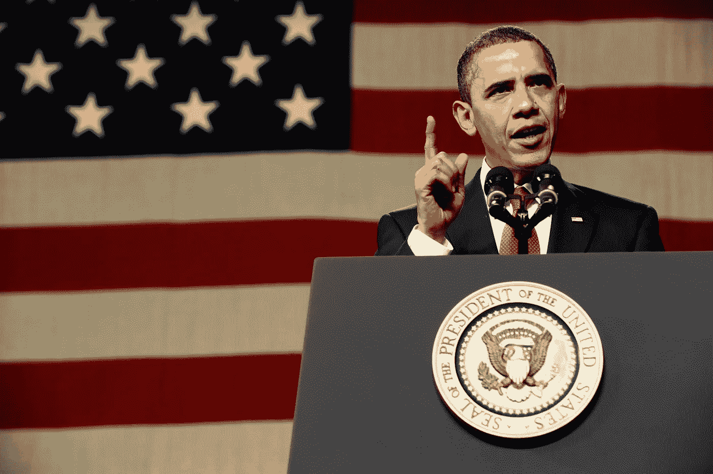
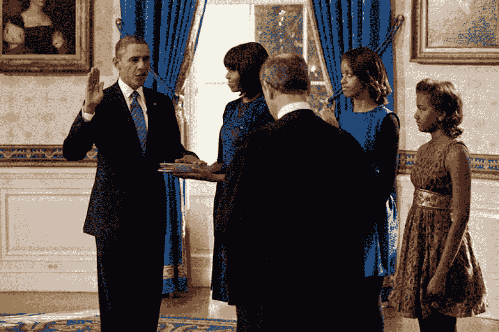
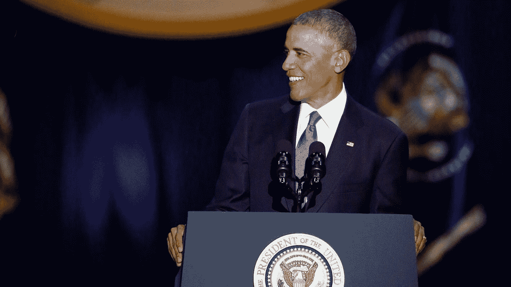

# 使用 NLP 分析奥巴马总统任期第一部分

> 原文：<https://blog.devgenius.io/using-nlp-to-analyze-the-obama-presidency-part-1-639d98205205?source=collection_archive---------14----------------------->

## 找到媒体关于奥巴马总统任期内的热门词汇

[图片](https://citizentruth.org/obama-said-he-would-intervene-to-stop-sanders-from-winning-2020-per-report/)来自公民真相

我们都知道媒体是无情的商业机器。我们已经看到媒体在涉及到总统这样的公众人物时是多么的尖刻。也许有一天我也会成为媒体的受害者，但是现在，我在一个不错的地方，一个不知名的作家和教育家。无论如何，我想看看媒体是如何描绘前总统巴拉克·奥巴马担任总统期间的。

如果你一直关注我的[教育 Python 博客](https://www.pythonalgos.com/blog)的文章，你就会知道我是一个[自然语言处理](https://pythonalgos.com/2021/11/23/what-is-natural-language-processing-nlp/)的爱好者。我决定使用纽约时报存档的标题和文本 API 对媒体在奥巴马总统任期内的言论做一些 NLP 分析。在这篇文章中，我的分析的第一部分，我们将看看从 2008 年 11 月到 2017 年 1 月与奥巴马相关的最常见的短语。[点击此处查看相关教程，了解如何自己完成这项工作。](https://pythonalgos.com/2021/12/12/ask-nlp-the-medias-portrayal-of-obama-part-1/)

# 奥巴马总统任期内标题中最常见的短语

[点击这里以列表形式查看奥巴马总统任期内标题中最常用的短语](https://pythonalgos.com/2021/12/12/ask-nlp-the-medias-portrayal-of-obama-part-1/#most-common-phrases-about-obama-in-headlines-from-2008-to-2017)。

让我们从列表中提取信息，看看最常用的短语。

## 每年最常出现的与奥巴马相关的词汇——第一任期

来自维基媒体的图片

2008:内阁，胜利，选择，交易，教育，希望，报告，违约，誓言，诽谤。好吧，其中一些是你所期望的。例如:内阁、获胜、交易、希望、报告和承诺。我不太确定是否违约，我认为教育与他的实际政策有关。诽谤绝对是种族歧视。对于一个白人总统来说，这不会在任何标题中被提及。

2009 年:法案、政策、努力、旅行、预算、就职典礼、团队、视频、午餐、提名人。这里没什么特别的。2009 年发表了大量关于奥巴马的文章，但我认为任何总统的就职年都是如此。当我为特朗普和拜登(也许还有布什)做分析时，我们必须拭目以待。

2010 年:演讲、议程、团队、访问、外交、被提名人、家庭、顾问、顾问、助手。又一次没有太多异常。似乎在 2010 年有很多关于奥巴马顾问的讨论。这对我很有意义，因为 2010 年是一个中期年。更多关于他的团队的谈话，这个团队与顾问和助手联系在一起。他的家庭第一次被提到前 10 名，所以我猜媒体已经没有话题可谈了。

2011 年:政策、访问、会议、广告、助手、工作计划、Re、聚会、地盘、假期。更多关于他的政策的谈话，第一次提到他的就业计划。据我所知，这件事应该早点提到，但媒体会做媒体会做的事。他的假期今年进入了前 10 名，我不确定他是否在 2011 年度过了很多假期，如果你知道，请发表评论让我知道！其他一切似乎都很正常，当然会有广告，因为他寻求连任。

2012:政策、选民、角色、支持者、转变、评论、访问、优势、事件、盟友。2012 年似乎是真正关注奥巴马连任的一年。有道理，竞选总统是除了已经是总统之外的一份全职工作。媒体更加关注他的政策，这很好。

## 每年最常出现的与奥巴马相关的词——第二任期

[图片](http://bdnewsnet.com/story/barack-obama-last-public-speech-2016/)来自 bdnewsnet

2013 年:计划、议程、提名人、顾问、会议、旅行、电话、助手、信息、小组。2013 年似乎是非常正常的一年。老实说，我很惊讶，我们已经看到了工作计划之类的东西，但在这些头条新闻中仍然没有提到患者保护与平价医疗法案，没有任何关于医疗保健的内容。主要是奇怪，因为这是在 2010 年实施的，多年来一直有抱怨和赞扬。

2014:行程、计划、努力、盟友、任命、助手、幕僚、诉讼、倡议、批评。考虑到这个任命突然出现在这里，你会认为奥巴马在 2014 年任命了一名最高法院法官，但不，那是在 2009 年(索托迈尔)和 2010 年(卡根)。奥巴马今年会有更多的旅行。看起来媒体又开始厌烦了，因为他们在谈论他的西装。我想知道 2014 年批评家们在说些什么。

2015:谈话、规则、图书馆、胜利、程序、参议员、秩序、助手、老兵、特工。我不知道这到底是怎么发生的，但出于某种原因，参议员奥巴马名列榜首。到这个时候，奥巴马已经 7 年没有当参议员了。我不确定这些人服用了什么药物，但我想知道。除此之外，看起来奥巴马今年做了更多的教育工作(图书馆)，赢得了更多的东西(胜利)，实施了更多的计划，并为退伍军人做了一些工作。

2016:演讲、努力、行程、提名人、总统、否决、议程、幕僚、访问、策略。到目前为止，已经有很多关于奥巴马演讲和谈话的谈论。我同意这个报道，他做了一些很好的演讲。2016 年也看到媒体谈论他的总统任期，考虑到这是它的结束，这是有道理的。我肯定他今年也否决了很多事情。令我惊讶的是，斯卡利亚死后，没有任何关于他被拒绝最高法院提名的消息。

2017 年:遗产，政策，法规，特使，监察机构，卫生计划，卫生法，工作人员，特朗普围攻，音乐遗产。2017 年 1 月，可能是对奥巴马总统任期最贴切的总结。最后，关于健康计划的平价医疗法案排在了前十名。当然，特朗普也在这里，他在 2016 年确实赢了。一个令人惊讶的转折是音乐遗产。

感谢阅读！如果你喜欢这个，请在 Twitter 上与你的朋友分享。更多有趣的 NLP 项目和评论，记得关注我，[唐](https://www.medium.com/@ytang07)。要了解更多关于 Python 中的 NLP，请查看[如何构建你自己的人工智能文本摘要器](https://pythonalgos.com/2021/11/28/build-your-own-ai-text-summarizer-in-python/)。

*更多内容尽在*[*blog . dev genius . io*](http://blog.devgenius.io)*。*