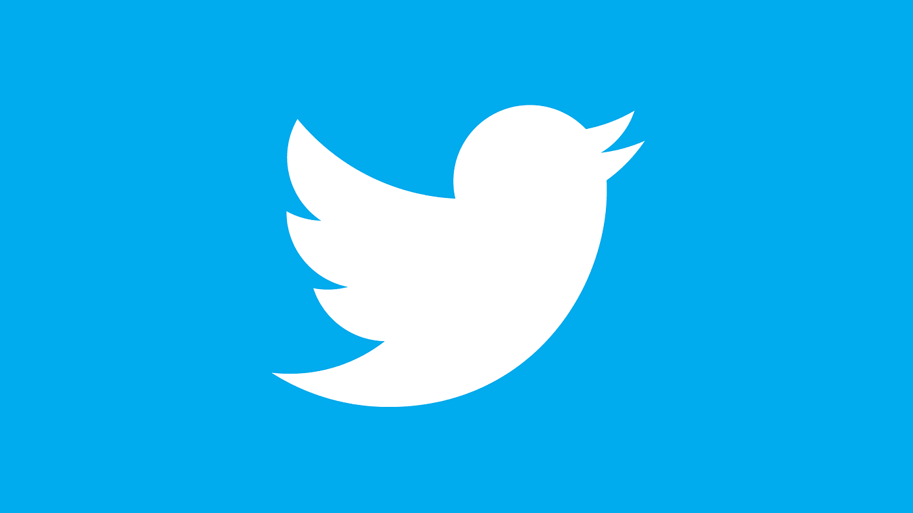
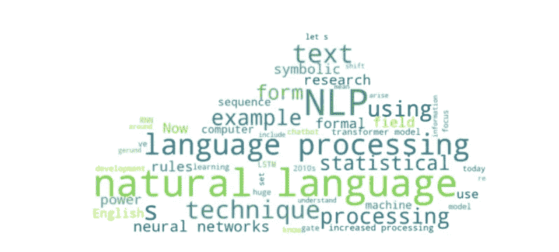

# 使用 NLP 向 Twitter 影响者学习

> 原文：<https://blog.devgenius.io/using-nlp-to-learn-from-twitter-influencers-bd4d60f877a8?source=collection_archive---------10----------------------->

## 有影响力的人在推特上都在说些什么？

[来自 DeviantArt 的图像](http://sebianoti.deviantart.com/art/Twitter-wallpaper-pack-356926781)

Twitter 是流氓的天下。所有最疯狂的事都会在推特上说。像埃隆·马斯克这样的人和温迪这样的品牌已经通过 Twitter 扬名立万。Twitter 让我们看到人们真正的样子。

我确信，通过分析世界上最有影响力的一些人的推文，可以学到一些东西。我创建了一个 Twitter 程序，[根据搜索词](https://pythonalgos.com/2021/12/26/scrape-the-text-from-all-tweets-for-a-search-term/)提取推文，[分析文本](https://pythonalgos.com/2021/12/29/using-nlp-to-get-insights-from-twitter/)。在接下来的几个月里，我会分析并向 Twitter 上的名人学习。以下是我正在做的事情以及我将如何去做。这个项目使用 Twitter API 和文本 API。

# 涉及自然语言处理技术

[图片来自正在进行的 2020 年代自然语言处理的十年(作者)](/are-the-2020s-the-decade-of-natural-language-processing-6304d6d6b9c4)

[自然语言处理](https://pythonalgos.com/2021/11/23/what-is-natural-language-processing-nlp/)是一个宽泛的话题。它包含许多不同的技术，例如确定[文本极性](https://pythonalgos.com/2021/11/10/natural-language-processing-what-is-text-polarity/)、[命名实体识别](https://pythonalgos.com/2021/11/07/the-best-way-to-do-named-entity-recognition-ner/)，以及识别[词性](https://pythonalgos.com/2021/11/06/natural-language-processing-part-of-speech-tagging/)。对于这个项目，我对简单的事情不感兴趣，尽管我们将使用文本极性。我们要做一些更复杂的自然语言处理。我们将做总结，找出最常见的短语，最常见的命名实体，并获得情感/极性。

## 人工智能概述

我们要做的任务之一是获取推文的摘要。 [AI 文本摘要](https://pythonalgos.com/2021/11/28/build-your-own-ai-text-summarizer-in-python/)使用 NLP 来为我们获取文本摘要。通过这种方式，我们可以了解推特上发生了什么，而不必阅读所有的推特。

## 寻找最常用的短语

NLP 还可以帮助我们找到最常见的短语。从一组 Tweets 中最常见的短语可以让我们了解用户那周在做什么。像摘要一样，这给了我们一个快速了解用户想法的方法。

## 查找最常见的命名实体

一组推文中最常见的命名实体将让我们了解用户在推文中谈论的是谁、什么、何时、何地。为了得到[最常见的命名实体](https://pythonalgos.com/2021/12/28/find-the-most-common-named-entities-by-type/)，我们需要得到命名实体，然后对它们进行拆分和排序。

## 情绪/极性

这个是比较基础的一个。我们可以简单地通过几乎任何 NLP 模型运行文本，并获得极性。极性和情绪或多或少是可以互换的词。获得一组推文的情绪可以告诉我们用户的推文在上周有多积极或消极。

# 我有兴趣分析的 Twitter 影响者

我有一个很长的名单，上面都是我想从 Twitter 上分析的人。我不得不减少它，因为我想分析的一些人，如奥普拉、泰勒·斯威夫特和杰伊·Z，他们每周发的推特不够多，无法获得一份像样的推特列表。我最终选择了这个列表。

1.  埃隆·马斯克——他在推特上很疯狂，我想知道他在聊些什么。他怎么能发这么多微博，还能经营一堆成功的企业？
2.  比尔·盖茨——这家伙在 80 年代和 90 年代的微软是个怪物。他现在软化了，但我们都知道这个家伙接管了软件行业，基本上垄断了一段时间。我很好奇他现在在做什么，他在推特上谈论一些重要的事情，比如气候、要读的书和其他时事。
3.  汤姆·比利欧——我喜欢他的故事。[他从一名没有目标的教师成长为一家独角兽公司的创始人](https://blog.startupstash.com/you-dont-have-to-be-a-born-entrepreneur-to-scale-a-business-to-over-1-billion-e99a59784f7b)。他现在通过他的采访分享知识，这很棒。他采访了一大群挑战人类知识极限的有趣的人。
4.  史蒂夫·哈维——用他自己的话说，史蒂夫·哈维是“一个失控的家伙”。我觉得这家伙很搞笑。他主持家庭纠纷，总是在环球小姐上出错。我想知道他说了什么。
5.  马克·库班——我想我第一次看马克·库班是在《鲨鱼池》里。他说了一些非常有趣的事情。他在推特上的照片更棒，他抽着雪茄，戴着一顶斜撑着的帽子。让我想起了乔丹。
6.  盖伊·川崎——盖伊·川崎基本上做了我想做的事情。他是传道者，我是技术传道者。他是亚洲人，我是亚洲人。我想像这家伙一样，所以当然，我要跟踪他，看看他在干什么。
7.  巴拉克·奥巴马——在写这篇文章的时候，他是推特上关注最多的人。另外，他是互联网上最受欢迎的总统。我已经对他做了相当多的分析，集中在他担任总统期间的媒体上。我很好奇这个人自己在说什么。

如果你喜欢这篇文章，请分享到 Twitter！为了无限制地访问媒体文章，今天就注册成为[媒体会员](https://www.medium.com/@ytang07/membership)！别忘了关注我，[【唐】](https://www.medium.com/@ytang07)，获取更多关于技术的文章，[自然语言处理](https://pythonalgos.com/2021/11/23/what-is-natural-language-processing-nlp/)，等等！