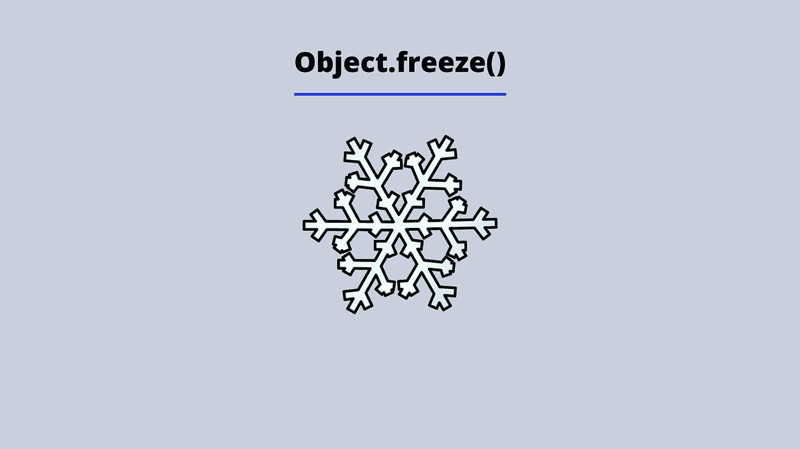

# 在 JavaScript 中使用 Object.freeze()

> 原文：<https://blog.devgenius.io/using-object-freeze-in-javascript-b1824fd36b6f?source=collection_archive---------7----------------------->



下面是这篇文章的视频演示。

ES6 引入了 *let* 和 *const* 来声明变量。当你使用 const 声明一个变量时，你不能像下面的例子那样重新分配这个变量。

```
const aValue = 1;
aValue = 2;
//Returns ---> Uncaught TypeError: Assignment to constant variable.
    at <anonymous>:1:3
```

在上面的例子中，我们使用 const 声明了一个名为*的变量，并赋值为 1。接下来，我们尝试将值 2 重新赋给变量，并抛出一个*类型错误*。*

```
const ourObject = {
  animalOne: "Cat",
  animalTwo: "Dog",
  animalThree: "Sheep"
}; ourObject = {}
VM178:1 Uncaught TypeError: Assignment to constant variable.
 at <anonymous>:1:4
```

我们再次尝试这样做，但是这次使用一个名为 *ourObject* 的对象，我们遇到了同样的错误。

当我们使用术语“可变的”时，我们描述的是某些东西是可以改变的。JavaScript 中使用 const 赋给变量的对象(包括对象、数组和函数)是可变的。理解这一点很重要，因为使用 const 只是阻止变量名(标识符)被重新分配，而不是对象本身。如果我们想将 *animalOne* 属性更改为 cow，我们可以执行以下操作:

```
const ourObject = {
  animalOne: "Cat",
  animalTwo: "Dog",
  animalThree: "Sheep"
};ourObject.animalOne = "Cow";console.log(ourObject);
//Returns ---> 
// {animalOne: 'Cow', animalTwo: 'Dog', animalThree: 'Sheep'}
```

明确地说，这对于诸如字符串(不可变的)之类的原始数据类型是不起作用的。如下例所示:

```
const ourString = "Hi";
ourString[1] = "o";console.log(ourString);
//Returns ---> 'Hi'
```

总而言之，你可以改变或变异对象本身，但是你不能改变存储对象的变量的名字或标识符。这就好比说，你可以改变你房子的装修，但你不能改变你的地址。

**我们如何阻止物体变异？**

我们已经阐明，你不能仅仅通过使用 const 来阻止. object 中的数据变异。可以使用 JavaScript 提供的名为 *freeze* 的方法。此方法是对象标准内置对象的一部分。一旦你使用了这个函数，你将不能改变对象，如果你使用严格模式运行你的代码，将会抛出一个错误。函数的返回值将是传递给函数的对象。该函数的语法如下:

```
Object.freeze(objectname);
```

让我们在*我们的对象*上试试这个函数。

```
const ourObject = {
  animalOne: "Cat",
  animalTwo: "Dog",
  animalThree: "Sheep"
};Object.freeze(ourObject);/* 
Returns --->const ourObject = { animalOne: "Cat",
  animalTwo: "Dog",
  animalThree: "Sheep"
};
*/ourObject.animalOne = "Cow";console.log(ourObject);/* 
Returns --->const ourObject = { animalOne: "Cat",
  animalTwo: "Dog",
  animalThree: "Sheep"
};
*/
```

在上面的例子中，我们声明了变量 ourObject，并给一个对象分配了三个属性， *animalOne* 、 *animalTwo* 和 *animalThree* 。然后我们继续冻结返回我们的对象的对象。当我们试图将第一个属性值更改为字符串 *cow* 和 console.log 对象时。什么都没有改变，原始对象被返回。

您也可以在不想更改的数组(数组是一种对象)上使用此选项，如下例所示:

```
const ourArray = [1, 2, 3];
Object.freeze(ourArray);//Returns ---> [1, 2, 3]ourArray[0] = 100;console.log(ourArray);
//Returns ---> [1, 2, 3]
```

我希望你喜欢这篇文章，请随时发表任何意见，问题或反馈，并关注我的更多内容！