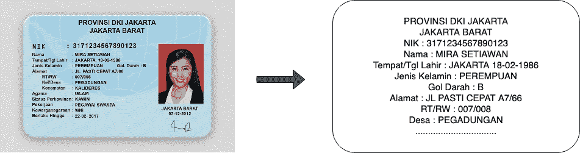
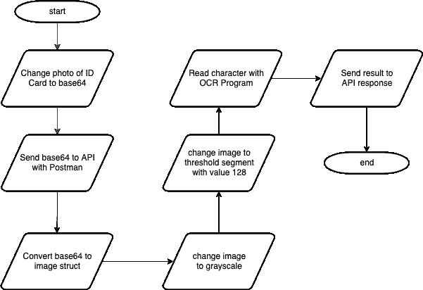
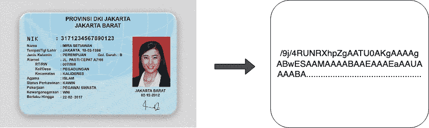
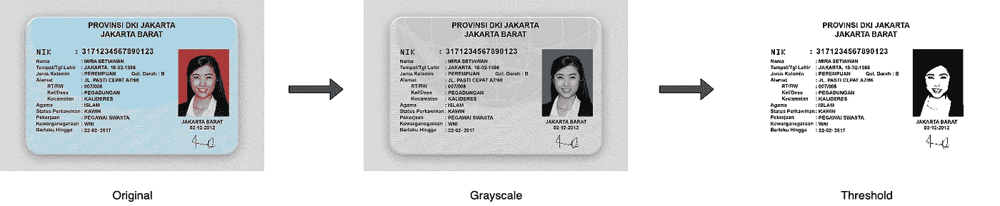

# 使用 OCR 技术支持 Tesseract & Golang 的 KYC 过程

> 原文：<https://blog.devgenius.io/using-ocr-technology-to-support-the-kyc-process-with-tesseract-golang-fe432fb4d1d0?source=collection_archive---------2----------------------->



使用 OCR 技术支持 Tesseract & Golang 的 KYC 过程

这是我的第一篇英文文章。抱歉，如果有一个错误的选择和单词的位置😅

# 什么是 OCR？

光学字符识别或光学字符阅读器(OCR)是将图像转换为计算机可识别的 ASCII 字符的过程。

# 什么是 KYC？

**了解您的客户** (KYC)标准旨在保护金融机构免受欺诈、腐败、洗钱和恐怖融资的侵害。

KYC 过程通常需要照片识别，如身份证，护照等。金融公司通常一次处理大量的 KYC，这确实需要大量的资源，包括人力和时间。使用 OCR 技术可以节省高达 80%的 KYC 流程，处理时间仅为 2 秒。

# 应该准备什么？

*   IDE (Visual Studio 代码等。)
*   戈朗。我推荐 1.15 或以上版本
*   邮递员
*   身份证照片。我是从[https://www . toko talk . com/help/upload-KTP-untuk-verifikasi-identitas/](https://www.tokotalk.com/help/upload-ktp-untuk-verifikasi-identitas/)拿的假的😁

# golang 使用了哪些模块？

*   github.com/anthonynsimon/bild
*   github.com/otiai10/gosseract/v2
*   github.com/gofiber/fiber/v2
*   github.com/tidwall/gjson

# 我将为 OCR 程序创建的算法流程



# 第一步:API

我用 fiber 和 gjson 模块制作了一个带有“ocr”端点的 API，以帮助简化 json 请求的管理。API 运行在端口 **8000** 上，你可以随意更改它。

# 第二步:图像到 base64



我使用网站[https://www.base64-image.de/](https://www.base64-image.de/)帮我把图像转换成 base64。需要记住:我们不需要 string**" data:image/JPEG；base64，"**当我们发送到 API 时。

# 第三步:图像处理算法

从上面的算法，我们可以描述如下。原始图像转换为灰度，然后转换为阈值。



# 第四步:用 OCR 读取字符

从上面的代码，我们已经完成了创建一个 OCR 程序来读取身份证。这是一个来自我们上面拍摄的图像 ID 卡的请求和响应的例子。

请求:

```
POST /ocr HTTP/1.1
Host: localhost:8000
Content-Type: application/json{
    "img": "/9j/4RUNRXhpZgAATU0AKgAAAAgABwESAAMAAAABAAEAAAEaAAUA..."
}
```

回应:

我们得到的结果。我们可以将它处理成数据，使 KYC 过程更容易，例如通过匹配身份证号码或可以自动填充身份证数据等。

[](https://www.linkedin.com/in/mseptian/) [## Muhamad Septian -全栈工程师- Investree | LinkedIn

### 查看穆罕默德·塞普蒂安在世界上最大的职业社区 LinkedIn 上的个人资料。穆罕默德有 2 份工作列在…

www.linkedin.com](https://www.linkedin.com/in/mseptian/)