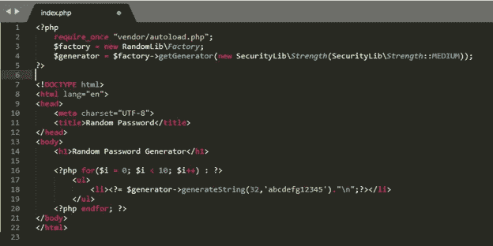

# 用 Composer 在 PHP 编程中使用预先存在的库或组件

> 原文：<https://blog.devgenius.io/using-preexisting-libraries-or-components-in-php-programming-with-composer-faee79dd10ae?source=collection_archive---------3----------------------->

朋友们好。我是新加坡卡拉旺大学的阿贡·普拉博沃。这次我将分享一些关于在 PHP 编程中使用库或预先存在的组件的信息。当然，这是为了让我们更容易编码，这样我们就不必完全从头开始编码。让我们开始第一次讨论。

# 重用、库和预先存在

首先，我们讨论重用、库和预先存在。重用是在不重写或更改代码的情况下重用一段代码。而库是可用于特定规范的代码包。预先存在是一个术语，指的是以前已经存在的库或组件。

实施“重用”的优势:

*   减少编写代码的冗余(重复)
*   节省时间
*   节约资源

代码重用旨在通过利用在软件产品开发过程中以某种形式创建的资产来节省时间和资源并减少冗余(重复)。

重用的关键思想是，一次编写的部分计算机程序可以或应该用于以后编写的另一个程序的构造中。

## 重用方法

重用方法概念中的各种方法是:

*   设计和代码选择
*   软件库
*   软件框架
*   基于组件的开发
*   应用程序生成器
*   设计模式
*   产品线

## 实现重用的障碍

当然，在实现重用的过程中，有几种东西会成为障碍，至少有两种障碍，即有意识的障碍和无意识的障碍。

1.  实现的障碍

*   不是这里制造的
*   许可/法律问题
*   不是根据非功能需求
*   调整解决方案的问题
*   失去控制

2.未被注意的障碍

*   没有预料到解决方案的存在
*   寻找解决方案中的问题

## 图书馆的类型

*   用户界面创建(引导、数据表、JQueryUI)
*   图像编辑(想象，PHP 图形作品，斑马图像)
*   导入/导出到某些文档格式(TCPDF、PHPOffice)
*   复杂算法(人工神经网络库，人工神经网络库)
*   以及其他等等

## 图书馆许可证

在使用本库时，需要考虑的是 GPL & LGPL 许可证。对于拥有 GPL 许可证的库，它不能用于专有软件。同时，LGPL 可以用于专有软件。

## 如何获得图书馆

要得到这个库，我们至少有两种方法。即直接从提供商的网站下载并使用库管理器(Composer)。

*   直接从库提供商的网站下载文件
    1。库或单元之间的依赖关系是手动完成的
    2。更新图书馆是通过检查网站/知识库
    3 来完成的。不需要额外的软件
*   使用图书馆管理器(Composer)
    1。库或单元之间的依赖可以自动完成
    2。更新库很容易
    3。需要附加软件

# 将预先存在的库或组件与现有源代码集成

## 安装作曲者

## 使用作曲家

打开[packagist.org](https://packagist.org/)然后寻找要使用的包

例如，我们将使用打包程序 ircmaxell/random-lib，该打包程序用于生成安全随机数

指定要安装的 packagist 的位置，例如:C:\xampp\htdocs\jwd，并使用命令下载 packagist

> composer 需要 ircmaxell/random-lib

等待安装过程完成

注意名称空间、用途和类名，并注意 Composer 库中单元和执行函数之间的依赖关系

在 jwd 文件夹中创建一个新文件，并输入以下代码

该程序将生成 10 个不同的密码

# 更新所使用的库或库组件或预先存在的组件

## 如何更新库的示例

使用 composer 更新库，可以通过运行项目目录中的命令来完成:

#作曲家更新'

## Memeriksa 库 yang Sudah '过时'

避免使用过时或过时的库。使用命令:composer outdated 检查是否有过期和可更新的库依赖项。直接更新下载的库，更新过程通过直接在相关网站/库存储库上检查来执行。

# 结论

在复用的应用中选择工件(单元)必须根据需要进行调整。集成预先存在的库或组件需要注意过时的单元和组件之间的依赖关系。使用 Composer 可以轻松更新库、库组件或预先存在的组件

谢谢你

# 参考

[https://web . archive . org/web/20140122163130/http://www . red hat . com/f/summit files/presentation/may 31/Open % 20 source % 20 dynamics/Troan _ opensourcepropertypersp . pdf](https://web.archive.org/web/20140122163130/http://www.redhat.com/f/summitfiles/presentation/May31/Open%20Source%20Dynamics/Troan_OpenSourceProprietyPersp.pdf)

拉里·特罗恩(2005)。[《从专有角度看开源》](https://web.archive.org/web/20140122163130/http:/www.redhat.com/f/summitfiles/presentation/May31/Open%20Source%20Dynamics/Troan_OpenSourceProprietyPersp.pdf) (PDF)。 [*红帽*](https://en.wikipedia.org/wiki/RedHat) *峰会 2006* [*纳什维尔*](https://en.wikipedia.org/wiki/Nashville) 。redhat.com。第 10 页。于 2014 年 1 月 22 日从[原件](http://www.redhat.com/f/summitfiles/presentation/May31/Open%20Source%20Dynamics/Troan_OpenSourceProprietyPersp.pdf) (pdf)存档。检索于 2015 年 12 月 29 日。

[http://www . red hat . com/f/summit files/presentation/may 31/Open % 20 source % 20 dynamics/Troan _ opensourcepropertypersp . pdf](http://www.redhat.com/f/summitfiles/presentation/May31/Open%20Source%20Dynamics/Troan_OpenSourceProprietyPersp.pdf)

伦巴第山集团。[“什么是软件复用？”](http://lombardhill.com/what_reuse.htm)。*lombardhill.com*。伦巴第山集团。检索于 2014 年 10 月 22 日。