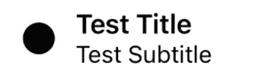
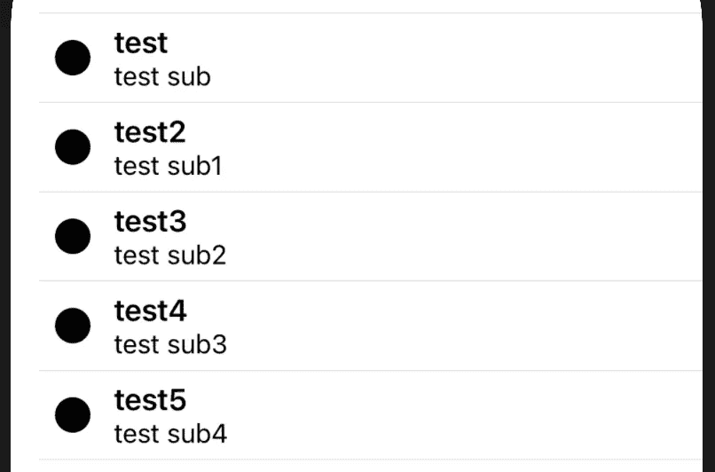
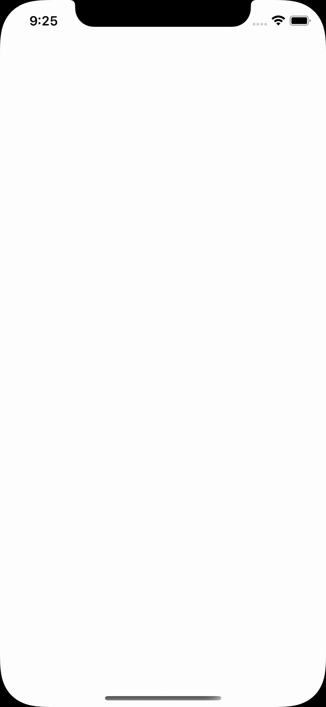

# swift ui–使用协议、ObservableObject 和@Published 属性包装器

> 原文：<https://blog.devgenius.io/using-protocols-observableobject-and-published-property-wrappers-in-swiftui-576933b46509?source=collection_archive---------2----------------------->

阿恩尔·哈萨诺维奇在 [Unsplash](https://unsplash.com?utm_source=medium&utm_medium=referral) 上拍摄的照片

# 背景

我确信任何 iOS 开发者现在都知道，iOS 应用开发的未来是 [SwiftUI](https://developer.apple.com/xcode/swiftui/) 。苹果新的 UI 开发语言现在已经发布了第二个主要版本。而我个人的感觉是，这个框架还没有准备好迎接黄金时代(就像 Swift 刚来的时候一样。它缺少一些相当关键的功能)，我们可能还有一个或两个版本可以用来构建一个完整的应用程序。不可否认，这是未来的趋势，当它运行良好时，构建 UI 会变得容易得多。

由于 SwiftUI 是未来的趋势，我一直在研究团队如何将他们现有的架构迁移到新技术上。迁移到 SwiftUI 会带来许多挑战，我们将在下面讨论。如标题所示，我们将探索如何使用 presenter 来控制 SwiftUI 视图。不管你使用哪种架构，是 VIPER，MVVVM，VIP，MVP 等等。只要视图的逻辑和状态已经从视图本身中抽象出来，那么它就可以被正确地进行单元测试。

# 例子

# 列表项目视图

让我们从在 SwiftUI 中创建一个例子开始。例如，我们将创建一个简单的列表视图来显示一些新闻。让我们首先创建一个简单的列表视图:

这是一个非常直接的观点，但是让我们一步一步来看。

1.  首先，我们为视图定义模型。我们有一个 id，这样我们就可以符合[可识别的](https://developer.apple.com/documentation/swift/identifiable)。这允许 SwiftUI 唯一地识别视图中的每个模型，并帮助执行诸如动画和重新排序之类的事情。我们也有一个标题，可选的副标题和一个图像字符串。希望这里没有太可怕的东西。
2.  现在我们自己定义视图。SwiftUI 中的视图是符合视图协议的简单结构，而不是 UIKit 中 UIView 的子类。这是一个简单的 Hstack 与一个图像视图，然后 2 个标签堆叠在对方的顶部。参见下面的屏幕截图。
3.  最后，我们有预览代码来注入一个在预览中使用的示例模型。

# 列表视图

现在我们的列表中已经有了条目，让我们创建一个简单的列表视图来显示这些条目。

好了，我们这里有什么:

1.  一个简单的 ContentView，它有一组列表项视图模型和一个主体。主体使用我们之前创建的 ListItemView 列出了列表的内容。简单的
2.  这里我们有一些测试数据来显示我们的列表是有效的。如果我们预览这个视图，我们会看到类似这样的内容:

那很好，但是它不是特别有活力。这就是演示者或视图模型的用武之地。如果我们看看对 MVP 和 T2 和 MVVM 的描述，我们会发现他们有着相似的角色:

> *演示者作用于模型和视图。它从存储库(模型)中检索数据，并将其格式化以显示在视图中。*

还有进一步的抽象层(比如交互器和用例)。然而，在这个讨论中，我们不太关心它们，而是更关心视图和拥有视图状态和逻辑的呈现者之间的关系。

# 抽象出国家

因此，目前我们有一个非常无状态的 SwiftUI 视图，只显示硬编码的列表。现在让我们尝试将列表项抽象到另一个注入视图的对象中。这个对象将负责获取我们的项目并为视图加载它们。

这就是 [ObservableObject](https://developer.apple.com/documentation/combine/observableobject) 出现的地方。

> *当你的类型符合 ObservableObject，你就在创造一个新的真理来源，教会 SwiftUI 如何对变化做出反应。*
> 
> *换句话说，您正在定义视图呈现其 UI 和执行其逻辑所需的数据。SwiftUI 使用这种依赖性来自动保持视图的一致性，并显示数据的正确表示。*
> 
> *我们喜欢将 ObservableObject 视为您的数据依赖表面。这是模型的一部分，向视图显示数据，但不一定是完整的模型。*

因此，让我们更新我们的示例，将我们的项目列表移动到一个符合该协议的单独的类中。

这里的 [@Published](https://developer.apple.com/documentation/combine/published) 属性包装器与 ObservableObject 一起工作，每当值改变时通知 SwiftUI，以便触发更新。

我们还看到了 [@ObservedObject](https://developer.apple.com/documentation/swiftui/observedobject) 属性包装器。这会导致此视图订阅分配给它的 ObservableObject，并在对象更新时使视图无效。

这很棒，它允许我们从视图外部注入一个对象，这个对象可以管理视图的获取和提供，只要 listItems 变量更新，视图就会自动更新！

# 解耦依赖

现在这里有一个问题，你能看到吗？这个视图在视图本身和 presenter 类之间有一个依赖关系。现在，如果你正在遵循坚实的原则，例如，喜欢分离你的类和层之间的依赖关系，我们将需要删除视图和演示者之间的依赖关系。

为此，让我们将 ListPresenter 类改为一个协议:

这看起来应该是一个直截了当的变化…错了！您现在将开始看到大量的错误。主要原因来自我们新协议的降级:

> *在协议中声明的属性“列表项”不能有包装器*

这里的问题正如错误所述。我们不能在协议中使用属性包装器！这将导致一点问题，因为我们现在无法通过@Published properties 利用 SwiftUI 的良好集成，或者看起来如此…

让我们暂时后退一步，@Published 属性包装器实际上是做什么的？@Published 属性包装器实质上提供了一个发布者，SwiftUI 系统可以订阅该发布者，以便监听值的更新。这实际上是一个实现细节。面向协议编程的一个关键点是将函数的实现从依赖关系中抽象出来，使其不知道内部的工作方式。通过尝试将属性包装器应用到协议中，我们正在尝试强制执行该变量应该如何在幕后实现。事实上，如果我们的协议的实现类愿意的话，它们可以创建自己的包装器自定义实现。

# 修复错误

好了，让我们从移除协议中的@Published 属性包装开始:

太好了！但是，现在出现了一系列不同的错误…我们需要注意的关键错误是:

> *协议‘list presenter’只能用作通用约束，因为它具有自身或关联的类型要求*

没错，我们已经解决了“已发表”的谜题，但现在又出现了另一个问题。为了使我们的 ListPresenter 协议与视图中的 ObervedObject 属性包装兼容，它必须扩展 ObservableObject。现在这里的问题是 ObservableObject 使用了一个 associatedtype。这意味着，如果我们希望使用它或持有对它的引用，我们必须进行类型擦除(更多信息，请阅读我的[以前关于类型擦除的帖子](https://pyartez.github.io/type-erasure/what-is-type-erasure))或使用一般约束。

最简单的解决方案是对视图使用通用约束。查看下面的代码:

所以这里发生了什么变化。您现在会注意到，我们已经在视图中添加了一个泛型类型 T。在实现 View 协议时，我们还添加了一个通用约束，表明只有当 T 类型是 ListPresenter 时，这里的 init 和 body 实现才有效。现在，在这个实例中，这样做很好，因为我们只打算在 ListPresenter 类中使用这个视图。这将删除错误，代码现在可以编译了。让我们更新代码，并运行一个小测试，以确保我们仍然得到 SwiftUI 的所有反应良好。

我们已经更新了 list presenter 实现类，以便在 5 秒钟后更新列表项。很好很容易。如果我们用下面的 5 个项目初始化我们的视图，那么 5 秒钟后我们的列表应该减少到计时器中设置的 2 个项目。

现在让我们将它作为应用程序的一部分运行，看看会发生什么:

正如您所看到的，5 秒钟后，项目列表减少到 2 个项目，这证明我们的实现是可行的，并且我们仍然能够挂钩到组合和 SwiftUI 向我们展示的不错的秘密酱，以允许我们更新我们的视图。我见过一些关于堆栈溢出的疯狂的实现和解决方法。希望这个实现更好一点！

下载[示例项目](https://github.com/pyartez/swiftui-presenter)来自己运行它(Xcode 12.4)

*原载于 2021 年 2 月 9 日*[*https://pyartez . github . io*](https://pyartez.github.io/swiftui/using-protocols-observableobject-published-property-wrappers-swiftui.html)*。*