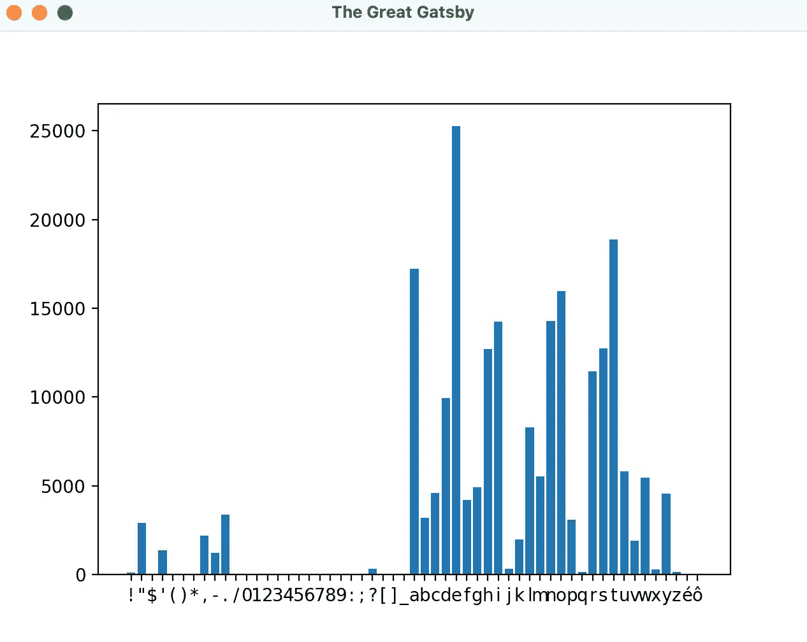

# 使用 Python 和 Matplotlib 绘制文本中的字符

> 原文：<https://blog.devgenius.io/using-python-and-matplotlib-to-plot-characters-in-text-1e2e8fa3d67b?source=collection_archive---------7----------------------->

你不想知道 f·斯科特·菲茨杰拉德用了多少次字母 e 吗？

[](https://www.pexels.com/photo/pie-graph-illustration-669621/)

*Lukas 在 Pexels 上拍摄的照片*

*虽然本指南是为初学者准备的，但我们不会在这里安装 python 或代码编辑器，也不会复习一些介绍性的编程概念，比如变量和循环。你可以在这里* [*下载 python*](https://www.python.org/downloads/)*！*

本文的目标是帮助您开始使用 python 绘制数据。我们将创建一个条形图来绘制给定文本文件中字符的频率。在这种情况下，文本文件包含了不起的盖茨比的内容。

# 步骤 1:创建您的虚拟环境

这个项目的环境相对较小。虚拟环境允许您向工作区添加额外的功能，而不会影响计算机的其他部分！

创建一个目录，并在您的代码编辑器和终端中打开它(*，在这里您运行命令*)。

我们跑吧:

```
$ python3 -m venv venv
$ source venv/bin/activate
```

我们可以安装必要的依赖项

```
$ pip3 install matplotlib
```

让我们也创建两个文件，read.txt 和 wordcount.py

我们将使用 wordcount.py 来分析 read.txt 中的文本

# 第二步:阅读课文

我们可以相对简单地开始，

*   首先，它导入了我们的绘图和排序库
*   其次，我们使用了内置的 open 函数，它允许我们打开一个文件进行读写
*   然后，我们读取文件中的文本，并将其存储到文本变量中
*   最后，我们关闭文件，因为我们不再使用它

这就是我们“读取”文件并将内容存储在变量中所要做的一切

# 第三步:分析人物

我们跟踪字符的最佳方式是使用 python 字典(在其他编程语言中称为 hashmap)。

词典是存储数据的一种非常有用的方式。像一本真正的字典一样，它会有一个“单词”列表，你可以查看单词的定义。

在编程中，这个概念被推广到“键/值”对。这意味着我们可以设置字典，这样当我向字典查询' a '时，它将返回' a '出现的总次数。

所以我们来编码吧！

让我们回顾一下这里发生了什么

*   首先我们定义一个空字典
*   接下来，我们使用 def 关键字定义一个函数。这个函数接受一个变量“character”，检查它是否是一个空格(空格、制表符、换行符)。*您可以添加额外的选择标准，例如****is alpha()****来确定字符是否为字母*
*   然后检查它是否已经在字典中。如果它在字典中，它会将值改为之前的值加 1 ( *因为我们正在计算这个字符*)否则它会向字典中添加一个新条目，初始计数为 1
*   然后我们循环遍历文本变量中的每个字符，其中“I”代表一个单独的字符，我们保存并运行我们的函数来计数它们
*   最后，我们使用 OrderdedDict 导入按字母顺序对字典进行排序

# 第四步:画出来！

现在我们的数据集已经创建好了，让我们把它组织成轴并绘制出来！

我们将创建一个列表来表示每个轴

```
num_list = []
char_list = []
```

这些列表将相互对应，因此如果 char_list 中的项目 1 是‘a ’, num _ list 中的项目 1 将是对应的频率。让我们也把它编码出来

我们使用两个变量遍历我们创建的字典中的键/值对，然后将它们添加到我们的数据列表中

最后，让我们使用 matplotlib 来创建和保存这个条形图

*   首先，我们创建一个新的图形。该图是整体窗口
*   给图形添加一个绘图
*   用我们选择的数据添加一个条形图
*   下载图像
*   显示图像

## 是时候测试一下了！

使用下面的代码运行您的文件，并为我们的结果做好准备！

```
$ python3 wordcount.py
```



成功！

为了回答我在文章开头提出的问题，字母 e 在《了不起的盖茨比》中被使用了 25000 多次！哇！

# 结论

在本文结束时，我希望您对 matplotlib 和数据科学有所了解。您可以使用我们今天编写的代码进行一些简单的数据分析，例如，您知道“e”是英语中最常用的字母吗？在我们的例子中，F. Scott Fitzgerald 肯定经常使用它！

您可以在我的 GitHub 上查看整个项目:

[](https://github.com/daminals/Wordcount_plot) [## GitHub - daminals/Wordcount_plot

### 画出给定文本中字符的频率

github.com](https://github.com/daminals/Wordcount_plot) 

如果你对更多这样的文章感兴趣，一定要关注我并留下评论！