# 使用 Python Pandas 将 ISO 国家代码转换成字符串，用作 SQL 查询的值

> 原文：<https://blog.devgenius.io/using-python-pandas-to-turn-iso-country-codes-into-a-string-to-use-as-values-for-a-sql-query-ad598bdd17d1?source=collection_archive---------2----------------------->

# 摘要、代码、资源

## 问题

当使用 SQL 查询一个表([基于这个数据集](https://data.worldbank.org/indicator/st.int.arvl))时，您意识到您的一个列使用了 3 个字符的 ISO 国家代码。然而，除了*实际的*国家代码之外，这些 3 字符代码中的一些不是国家，而是地理区域或国家组。如何过滤掉行，只剩下国家*和*？

## 回答

使用 Python Pandas 库抓取 ISO 国家代码并将这些值转换成一个字符串。然后将该字符串用作后续 SQL 查询的值(可能如下所示):

```
SELECT * FROM [your_table]
WHERE country_code IN ([values from the generated list-as-string separated by commas and encased by single / double quotes]);
```

# 密码

```
# Libraries used in this code
from bs4 import BeautifulSoup
import requests
import csv 
import pandas as pd 

# I found these ISO country codes on the below URL. Pandas makes it easy to read HTML and manipulate it. Very cool!
iso_codes = pd.read_html("https://www.iban.com/country-codes")

# I create a data frame, starting at an index of 0.
df = iso_codes[0]

# But really, all I care about is the 3-digit country code. So I'll make that the df (dataframe) and strip out the index
df = df['Alpha-3 code'].to_string(index=False)

# From here, I'll save this little guy as a text file.
with open("./countries.txt", "w") as f:
    f.write(df)

# I'll set up a list. *** This was my approach, but if you find a better way, feel free to comment or adjust. ***
my_list = []

# Then I'll open that text file and read it in.
file = open("./countries.txt", "r")
countries = file.read()

# I need to remove the "new line" identifiers, so I'm doing that here. 
my_list = countries.split('\n')

# Once I do that, I can create two new strings. I do this with f-Strings. Great article on using them here: https://realpython.com/python-f-strings/ 

# I have two options here: one where the codes are contained by single quotes, the other with double quotes. Oracle Autonomous Database likes single quotes, but your DB may differ.

countries_string_single_quotes = ','.join(f"'{x}'" for x in my_list)

countries_string_double_quotes = ','.join(f'"{x}"' for x in my_list)

# From here, I take those strings and save them in a text file. You don't have to do this; you can print and copy/paste the string. But this might be an excellent addition if you want to refer to these later without running all the code. 

with open("./countries_as_list_single_quotes.txt", "a") as f:
    f.write(countries_string_single_quotes)

with open("./countries_as_list_double_quotes.txt", "a") as f:
    f.write(countries_string_double_quotes)
```

## GitHub 回购详细信息

你可以在我的 [GitHub 库](https://github.com/chrishoina/reddit)中找到这篇文章的代码。该存储库包括以下内容:

*   我为解决这个问题创建的 [Python 代码](https://github.com/chrishoina/reddit/blob/main/iso_codes_pandas.py)
*   一个`[countries.txt](https://github.com/chrishoina/reddit/blob/main/countries.txt)` [文件](https://github.com/chrishoina/reddit/blob/main/countries.txt)，在代码中途生成(用于以后处理的临时占位符)
*   [‘单引号’。txt 文件](https://github.com/chrishoina/reddit/blob/main/countries_as_list_single_quotes.txt)—3 个字符的 ISO 国家代码被格式化为一个字符串。这些值用**单引号**括起来；通篇逗号
*   [“双引号”。txt 文件](https://github.com/chrishoina/reddit/blob/main/countries_as_list_double_quotes.txt)—3 个字符的 ISO 国家代码被格式化为一个字符串。这些值用**双引号**括起来；通篇逗号

## 资源

*   [最初的 Reddit 帖子](https://www.reddit.com/r/datasets/comments/zehqsv/world_bank_tourism_dataset_how_to_remove/)提示了这个帖子
*   [ISO 国家代码列表](https://www.iban.com/country-codes)(又名“Alpha-3”)
*   [世界银行国际旅游，到达人数图表](https://data.worldbank.org/indicator/st.int.arvl)(是什么导致了这篇文章)

计算机编程语言

*   [将一个. txt 文件读入一个列表](https://www.geeksforgeeks.org/how-to-read-text-file-into-list-in-python/)
*   [从文本文件中移除换行符(又名“\n”)](https://stackoverflow.com/questions/64978308/remove-n-python-from-calling-a-txt-file)
*   [使用 F 字符串迭代](https://stackoverflow.com/questions/12007686/join-a-list-of-strings-in-python-and-wrap-each-string-in-quotation-marks)(针对这种特殊情况)

熊猫

*   [用熊猫阅读 HTML 表格](https://pbpython.com/pandas-html-table.html)
*   [熊猫](https://pandas.pydata.org/docs/reference/api/pandas.read_html.html) `[read_html](https://pandas.pydata.org/docs/reference/api/pandas.read_html.html)` [功能](https://pandas.pydata.org/docs/reference/api/pandas.read_html.html)
*   [熊猫数据帧](https://pandas.pydata.org/docs/reference/api/pandas.DataFrame.to_string.html) `[to_string](https://pandas.pydata.org/docs/reference/api/pandas.DataFrame.to_string.html)` [API](https://pandas.pydata.org/docs/reference/api/pandas.DataFrame.to_string.html)

结构化查询语言

*   [关于 IN 和 NOT IN 表达式的有用文章](https://docs.data.world/documentation/sql/concepts/intermediate/IN_and_NOT_IN.html)
*   [数据库和用 SQL 过滤](https://swcarpentry.github.io/sql-novice-survey/03-filter/)文章

# 深入了解

## 背景

前几天在 r/datasets 子编辑里偶然发现[这个问题](https://redd.it/zehqsv):

我花了一上午的时间思考如何着手这件事，经过反复试验，我制定了一个计划。我决定获取 ISO 国家代码列表(我在这里找到了[和](https://www.iban.com/country-codes))，并在 SQL 语句中使用它们作为过滤值(稍后在 [Oracle SQL Developer Web](https://www.oracle.com/database/sqldeveloper/technologies/db-actions/) )。

经过一些研究，我找到了成功查询的正确 SQL 语法。

```
SELECT * FROM [your_table]
WHERE country_code IN ([values from the generated list-as-string separated by commas and encased by single / double quotes]);
```

从那时起，我知道我需要逆向研究那些 ISO 国家代码。意思是我需要像这样的东西:

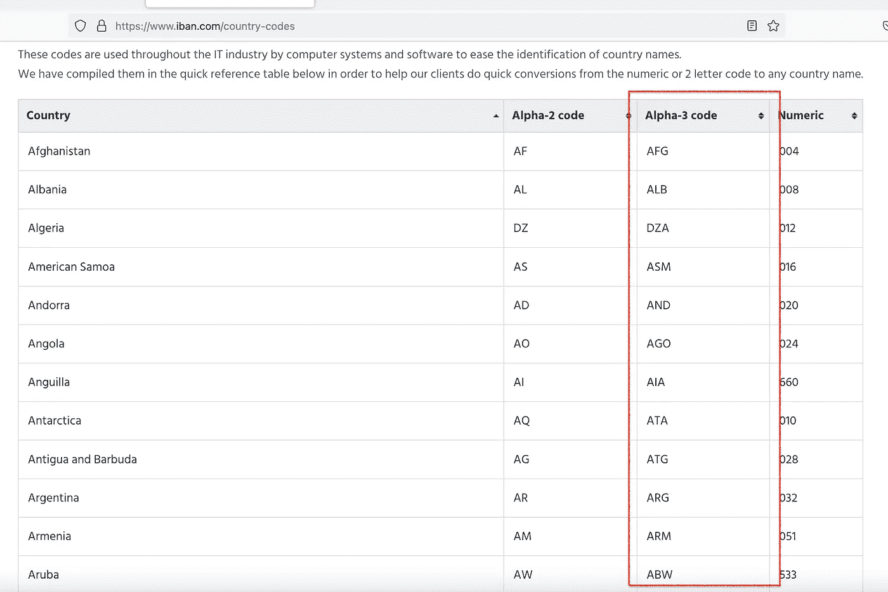

我感兴趣的国家代码列。

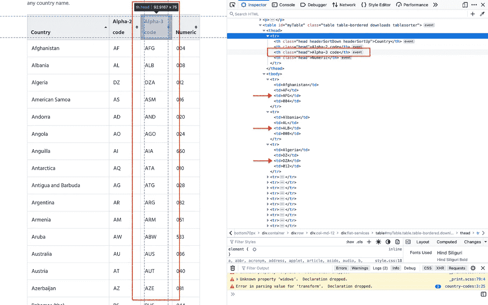

查看这个表的 HTML，我对其中的元素感兴趣。

把它变成更可行的东西。事实证明，抓住这个非常简单。在这个练习中，我主要使用 Pandas，但是首先，我需要导入一些库:

```
# Libraries used in this code
from bs4 import BeautifulSoup
import requests
import csv 
import pandas as pd 
```

接下来我就用熊猫的`read_html`函数(这个感觉像作弊，但是很不可思议)来读表。

```
# I found these ISO country codes on the below URL. Pandas makes it easy to read HTML and manipulate it. Very cool!
iso_codes = pd.read_html("https://www.iban.com/country-codes")

# I create a data frame, starting at an index of 0.
df = iso_codes[0]
```

这很疯狂，但这是打印输出的样子:

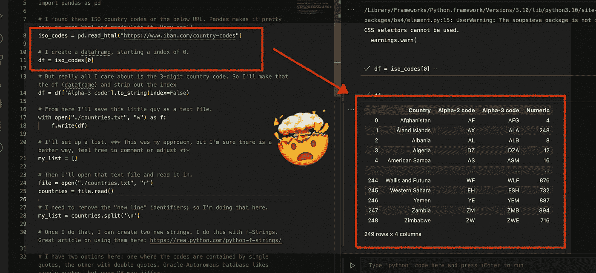

熊猫`read_html()`功能*强大*。

如果你眯着眼睛，你可以在图像中看到一个“Alpha-2 代码”和一个“Alpha-3 代码”列。从这里，我需要分离出 3 代码列。所以我把数据框改造成了单列；删除索引(这是可选的，如果需要，可以保留索引；也许您想在数据库中创建一个单独的表)。

```
# But really, all I care about is the 3-digit country code. So I'll make that the df (dataframe) and strip out the index
df = df['Alpha-3 code'].to_string(index=False)
```

我会将此数据框保存为. txt 文件。

```
# From here, I'll save this little guy as a text file.
with open("./countries.txt", "w") as f:
    f.write(df)
```

这只是暂时的(仅供参考:这是我能想出如何做到这一点的唯一方法)。它看起来会像这样:

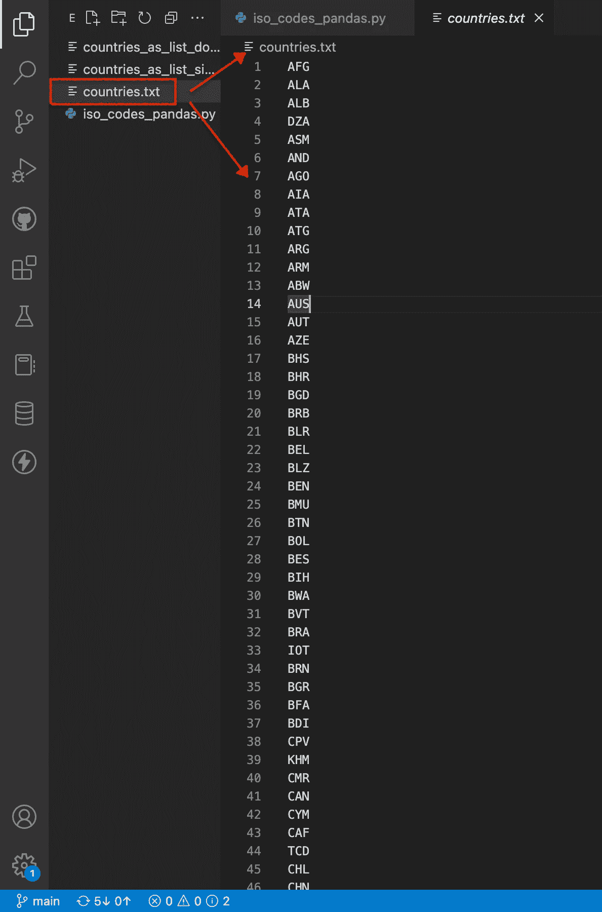

暂时的。3 字符 ISO 国家代码的 txt 文件。

接下来，我获取临时文本文件并读入它。我将把它添加到一个列表中，所以我将首先创建一个空列表(恰当地命名为“`my_list`”)。我还需要从列表中删除换行符；否则，如果我不这样做，那么当我创建我的值的字符串(在最后一步中)时，该字符串将如下所示:

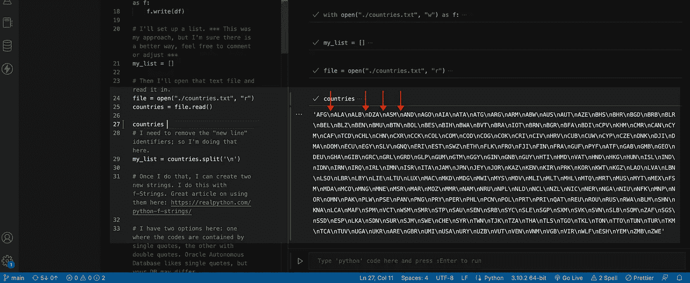

带有“\n”字符的“国家”字符串。

我用这段代码删除了换行符:

```
# I need to remove the "new line" identifiers, so I'm doing that here. 
my_list = countries.split('\n')
```

*几乎是*的值串看起来像这样:

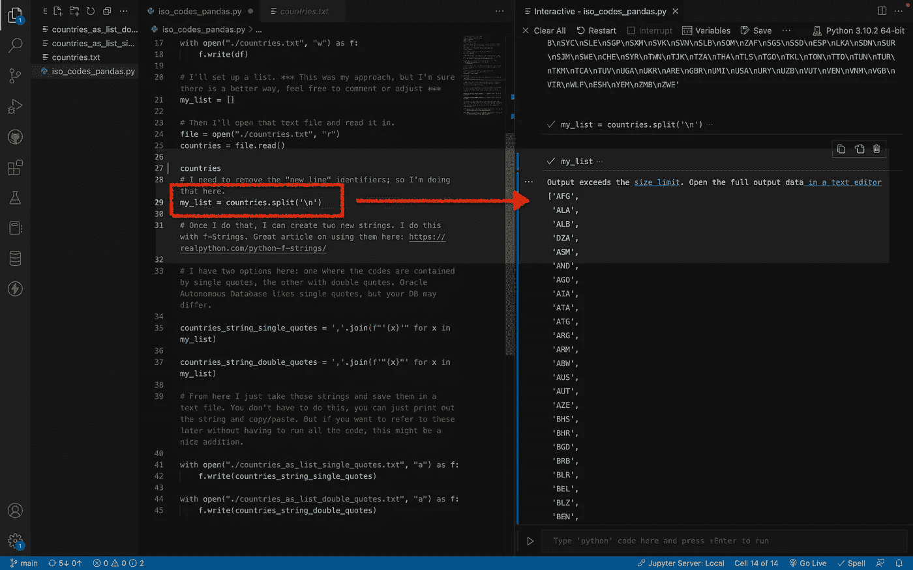

新的行字符现在已被删除。

我使用 F-Strings 创建以下两个字符串:分别是`countries_strings_single_quotes`和`countries_strings_double_quotes`。需要学习 F 字符串(或者，更正式的说法是，*文字字符串插值*)？没问题！查看以下三个资源:

*   [更实用的文章](https://realpython.com/python-f-strings/)
*   [更具技术性的摘要/提案](https://peps.python.org/pep-0498/)
*   [直接来自 Python 文档](https://docs.python.org/3/reference/lexical_analysis.html#f-strings)

F 弦的代码如下。我循环遍历我的 _list 并用逗号分隔 x(我正在迭代的东西)(这就是连接)。

```
# Once I do that, I can create two new strings. I do this with f-Strings. Great article on using them here: https://realpython.com/python-f-strings/ 

# I have two options here: one where the codes are contained by single quotes, the other with double
# quotes. Oracle Autonomous Database likes single quotes, but your DB may differ.

countries_string_single_quotes = ','.join(f"'{x}'" for x in my_list)

countries_string_double_quotes = ','.join(f'"{x}"' for x in my_list)
```

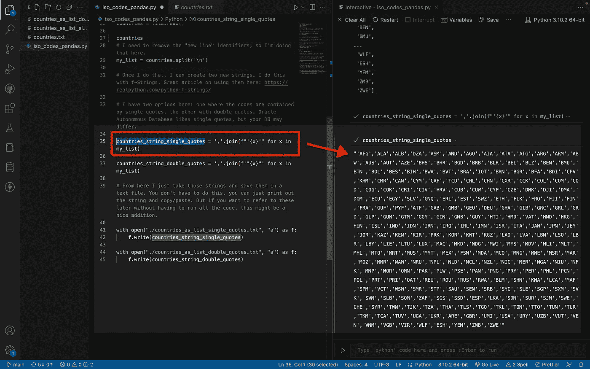

新的*单引号字符串。*

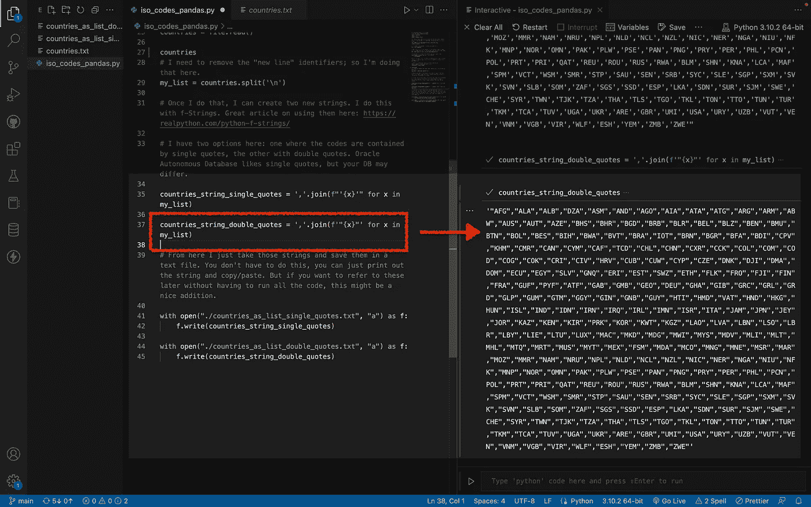

新的双引号字符串。

而现在我有了这两个对象(它们叫对象吗？？).我会将它们分别保存为文本文件。一个文件的 3 个字符的代码用单引号括起来，另一个用双引号括起来。代码:

```
# From here, I take those strings and save them in a text file. You don't have to do this; you can print
# and copy/paste the string. But this might be a nice addition if you want to refer to these later 
# without running all the code. 

with open("./countries_as_list_single_quotes.txt", "a") as f:
    f.write(countries_string_single_quotes)

with open("./countries_as_list_double_quotes.txt", "a") as f:
    f.write(countries_string_double_quotes)
```

文本文件现在看起来像这样:

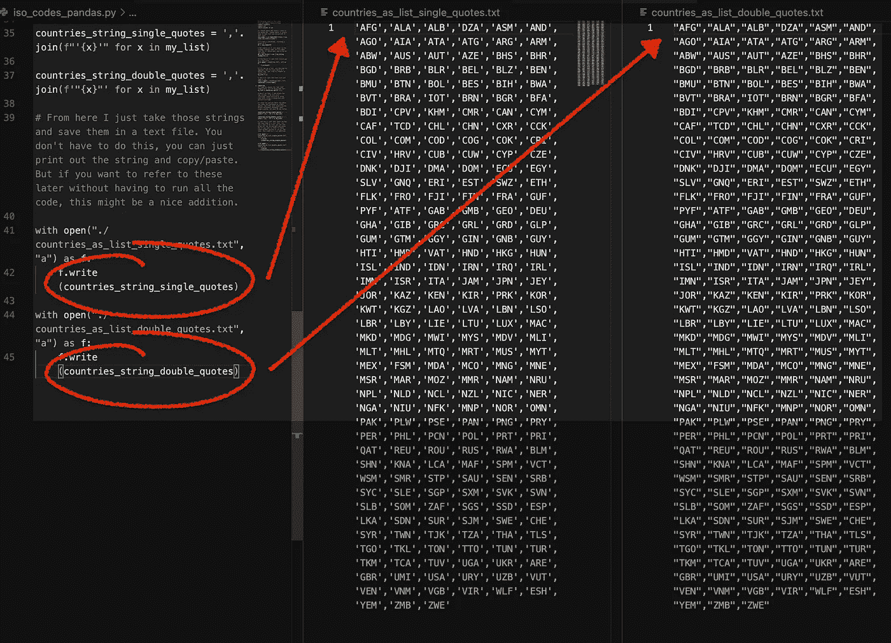

国家代码现在用一个长字符串表示。很酷，是吧？

# SQL 时间

我们到了！让你看看我现在能做什么！

我从世界银行获取 CSV 数据，并将其加载到我的自治数据库中。我们回来的实习生蕾拉制作了一个视频，展示了如何做到这一点；你可以在这里查看:

一旦我的表被创建，我就做了一个`SELECT [columns] FROM`。在这里你可以看到我的“开始状态”。

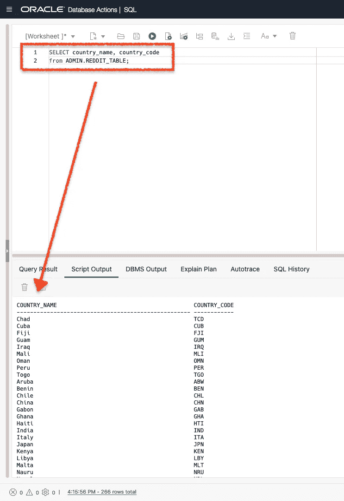

乍一看，这看起来不错。

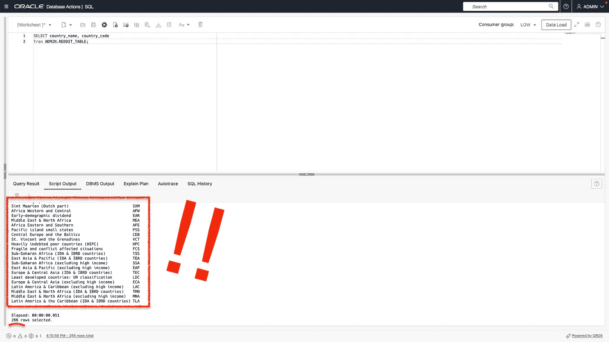

但是一旦你向下滚动，你可以看到所有的非国家和地区。

有 266 个条目；有些是国家，有些不是。如果你还记得的话，最初的问题问的是如何过滤掉非国家。下一个！

这是最精彩的部分。我可以将我创建的字符串用于 SQL 查询，如下所示:

```
SELECT * from ADMIN.REDDIT_TABLE
WHERE COUNTRY_CODE IN('AFG','ALA','ALB','DZA','ASM','AND','AGO','AIA','ATA',
'ATG','ARG','ARM','ABW','AUS','AUT','AZE','BHS','BHR','BGD','BRB','BLR','BEL',
'BLZ','BEN','BMU','BTN','BOL','BES','BIH','BWA','BVT','BRA','IOT','BRN','BGR',
'BFA','BDI','CPV','KHM','CMR','CAN','CYM','CAF','TCD','CHL','CHN','CXR','CCK',
'COL','COM','COD','COG','COK','CRI','CIV','HRV','CUB','CUW','CYP','CZE','DNK',
'DJI','DMA','DOM','ECU','EGY','SLV','GNQ','ERI','EST','SWZ','ETH','FLK','FRO',
'FJI','FIN','FRA','GUF','PYF','ATF','GAB','GMB','GEO','DEU','GHA','GIB','GRC',
'GRL','GRD','GLP','GUM','GTM','GGY','GIN','GNB','GUY','HTI','HMD','VAT','HND',
'HKG','HUN','ISL','IND','IDN','IRN','IRQ','IRL','IMN','ISR','ITA','JAM','JPN',
'JEY','JOR','KAZ','KEN','KIR','PRK','KOR','KWT','KGZ','LAO','LVA','LBN','LSO',
'LBR','LBY','LIE','LTU','LUX','MAC','MKD','MDG','MWI','MYS','MDV','MLI','MLT',
'MHL','MTQ','MRT','MUS','MYT','MEX','FSM','MDA','MCO','MNG','MNE','MSR','MAR',
'MOZ','MMR','NAM','NRU','NPL','NLD','NCL','NZL','NIC','NER','NGA','NIU','NFK',
'MNP','NOR','OMN','PAK','PLW','PSE','PAN','PNG','PRY','PER','PHL','PCN','POL',
'PRT','PRI','QAT','REU','ROU','RUS','RWA','BLM','SHN','KNA','LCA','MAF','SPM',
'VCT','WSM','SMR','STP','SAU','SEN','SRB','SYC','SLE','SGP','SXM','SVK','SVN',
'SLB','SOM','ZAF','SGS','SSD','ESP','LKA','SDN','SUR','SJM','SWE','CHE','SYR',
'TWN','TJK','TZA','THA','TLS','TGO','TKL','TON','TTO','TUN','TUR','TKM','TCA',
'TUV','UGA','UKR','ARE','GBR','UMI','USA','URY','UZB','VUT','VEN','VNM','VGB',
'VIR','WLF','ESH','YEM','ZMB','ZWE')
ORDER BY COUNTRY_CODE ASC;
```

一旦我执行了 SQL 语句，就只剩下列表中的国家了。我在另一个窗口中打开了结果，这样您就可以看到一个样本。

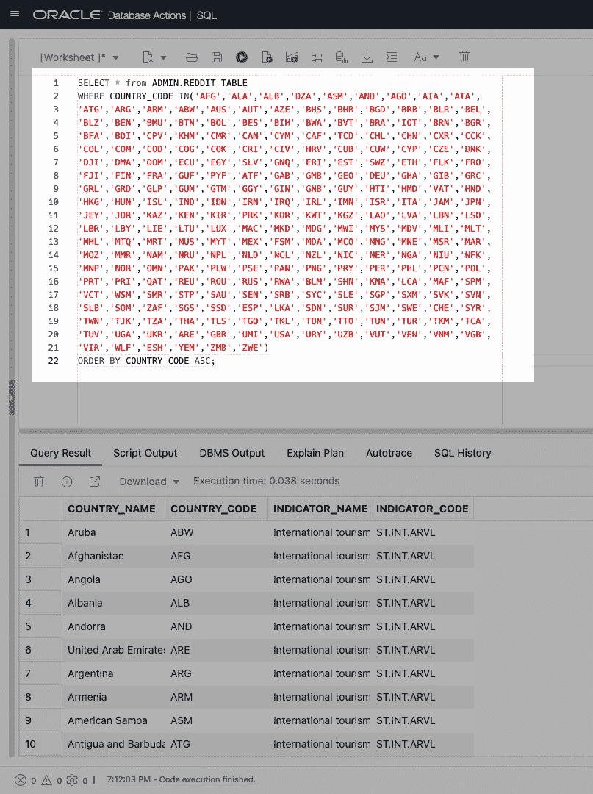

运行中的 SQL 查询—使用新的字符串形式的值。

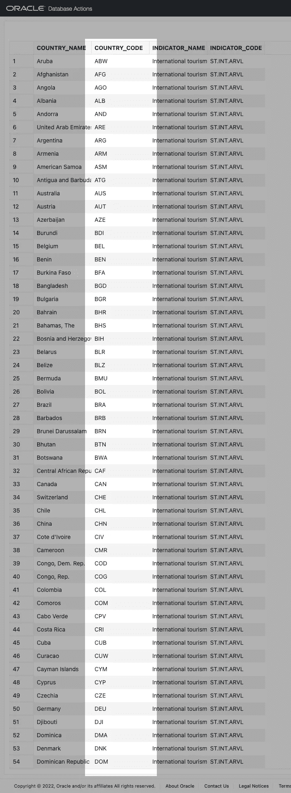

另一个窗口中的 SQL 查询结果。

# 结束了

所以是的，就是这样！我不知道这是不是最好的方式，但这很有趣。我很好奇(如果你已经走了这么远)，你怎么看？你会怎么做？让我知道。

还有两件事:记得分享这个和…

# 别忘了跟着

如果您还没有分享或关注，请务必分享或关注:

*   [推特](https://twitter.com/chrishoina)
*   [YouTube](https://www.youtube.com/user/chrishoina/)
*   [抖音](https://www.tiktok.com/@chrishoina)
*   [博客](http://followthecoffee.com)
*   [GitHub](https://github.com/chrishoina)
*   [领英](https://www.linkedin.com/in/chrishoina/)
*   [乳齿象](https://mastodon.technology/web/@chrishoina)
*   [不和谐](https://discord.gg/seYeAPgq9E)
*   [堆栈溢出](https://stackoverflow.com/users/9552864/chris-hoina)