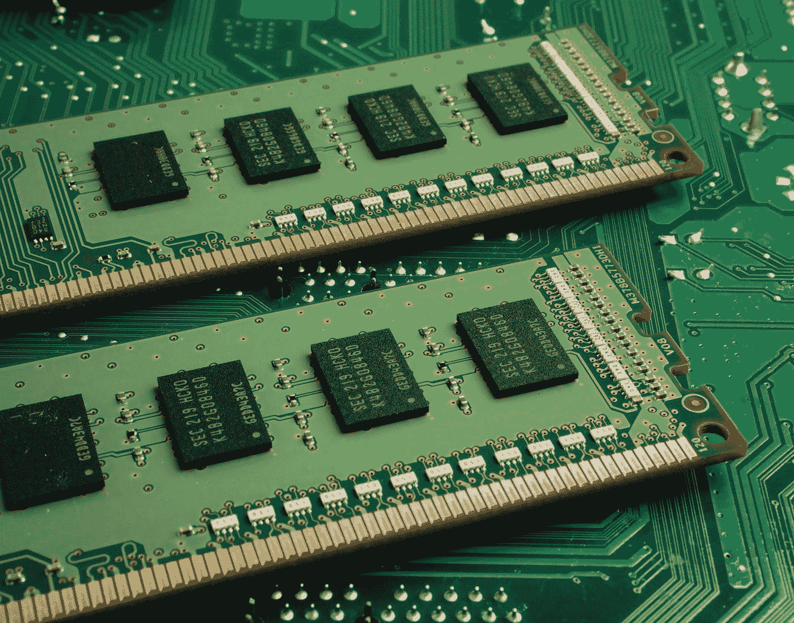
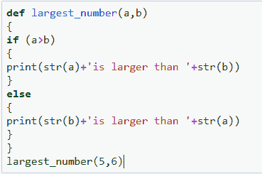

# 使用 Python 和大括号

> 原文：<https://blog.devgenius.io/using-python-with-braces-96dd8e4e8e59?source=collection_archive---------27----------------------->

迈克尔·泽兹奇在 [Unsplash](https://unsplash.com?utm_source=medium&utm_medium=referral) 上的照片

# 你好。

我们都喜欢 python，我的意思是，你还能在哪里找到如此简单而强大的编程语言(暂时忘掉‘Go’吧)。在 python 的帮助下，你几乎可以做任何事情…从简单的自动化脚本到为你最喜欢的电影预定座位，再到在《侠盗猎车手 v》中创建一个深度神经网络来为你驾驶汽车。

但是这种语言有一个大…大…..就像真正的大问题:'**缩进** '…在 python 中，你不使用老式的'**{ }【T7]':(但你被迫使用' **':'** 和 **'\t'** :/
好吧…好吧，你们中的许多人可能会想"*老兄…只要有一个 IDE 就行了…你不需要仅仅为了该死的'缩进*"而创建什么东西，但让我告诉你…你曾经写过 300 行吗*字面意思 Vim* …手动迭代 300 行修复缩进？？*没有？那你就不懂了。不仅在 RaspberryPi 上，如果你曾经用 python 做过竞争性编码，在 InterviewBit 这样的网站上，你也会得到同样的“**缩进错误**”。我是认真的……仅仅因为我在 Windows 上写了代码，并把它转移到一些基于 Linux 的操作系统上，并不意味着我需要重新修改整个代码。***

那是我决定开发 python++的时候，你知道我喜欢 python，但我也喜欢用 JAVA 和 C++编写代码，所以我决定融合它们的优势……就像 JAVA 和 C++的缺点是**’；”** ( *错误:第 8 行缺分号:p*)……我的意思是拜托，如果你知道第 *X* 行缺分号你自己搞定就好了……何必麻烦我呢，不过 C++和 JAVA 的加分点就是他们用的是**' { } '**……*好老大括号*……你绝对不会出现缩进错误。

所以，我在你预装的 python 上创建了这个 *python++* 一个简单的包装器，在这里你可以使用 python 的所有特性，除了**加上好的旧括号{}** :)…和分号(如果你喜欢的话)。

你只需要添加 *python++就可以了。exe* 到你的路径，调用 python++而不是 python。你需要调用‘python ++ model . py’而不是‘python model . py’
哦，是的，现在你也可以在记事本中编写代码并执行它，而不用担心“缩进”。

请参见下面的 python++代码片段:

相信我，这是一个 Python3.7++代码:)

> 现在来说说**bug**……
> ->python ++有 bug 吗？这是第一个 alpha 版本……肯定有问题。
> - >我们说的是哪种虫子？除了你需要在单独的行中写' { '和' } '之外，没什么。好吧，对我来说这不是一个大问题，但是我什么时候能修复它呢？
> >在接下来的两周内，版本 2 将会发布，其中这个 BUG 将会被修复。:)
> - >好的……嗯……还有其他问题吗？
> >暂时没有，除了只在 Python 3.7.3 上测试过 Windows 10(2020 年 3 月更新)。

**下载 alpha build**[**<<点击这里> >**](https://drive.google.com/file/d/1yBUb6PQfyc8vOpZSa50F2AYq2_2Bi0JZ/view?usp=sharing)