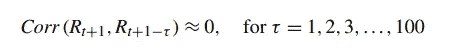

# 使用 R 检验金融回报的程式化事实

> 原文：<https://blog.devgenius.io/using-r-to-examine-the-stylized-facts-of-financial-returns-39b86ff4fb4b?source=collection_archive---------2----------------------->

## 波动聚集、厚尾和非正态分布趋势

[粘土银行](https://unsplash.com/@claybanks?utm_source=medium&utm_medium=referral)在 [Unsplash](https://unsplash.com?utm_source=medium&utm_medium=referral) 拍摄的照片

S 通常准确但不总是准确的事情被称为**程式化的事实**。我们从对标准普尔 500 指数收益的数据分析中观察到许多典型的事实，这些事实通常适用于其他资产。

我将使用标准普尔 500 指数的每日股票价格。笔记本可以从 [Kaggle](https://www.kaggle.com/robinaz/stylized-facts-of-financial-returns) 下载。对于每日回报，我们观察以下程式化的事实:

# **1。没有自相关**

日收益的自相关性很小。换句话说，根据他们的过去，回报几乎是不可能预测的。

这可以描述如下:

让我们开始吧！

首先上传你需要的**库**，**上传数据**并计算**日志回报**:

计算回报的自相关性:

**图 1**

**图 2**

**图 1 和图 2** 显示了标准普尔 500 指数每日回报率与滞后 1 至 100 天回报率的相关性。这是回报条件均值非常低的一个证据。

# 2.非正态分布/厚尾

日收益率的无条件分布不服从正态分布。

**图 3**

**图 3** 显示了每日 S & P 500(1)回报数据的**直方图**，具有正态分布曲线。请注意直方图在零附近比正态分布更加突出。

虽然直方图不是分析极端情况的理想图形工具，但极端回报在日回报中也比在正态分布中更常见。我们说日收益率分布有厚尾。

> 厚尾意味着比正态分布更大的亏损(和盈利)的可能性。在风险管理中，恰当地捕捉这些肥尾是至关重要的。

尽管直方图中的**额外峰度**和厚尾很明显，但我们可以用数字证明我们样本的经验分布的峰度高于正态分布的峰度(等于 3)。

> **样本峰度，度量直方图的尾部厚度。样本超额峰度定义为样本峰度减 3，衡量数据样本相对于正态分布的尾部厚度。**

检查 **QQ 图**，一个比较密度的流行工具，是另一个有益的可视化练习。与理论(正态)分布相比，经验分位数显示在 **QQ 图**中。

> **如果我们的样本是从正态分布中抽取的，结果应该是一条直线。肥尾的存在可以通过偏离这条直线来表示。**

**图 4**

图 4 表明返回数据不是正态分布的。

# 3.不对称或负偏

股票市场偶尔会出现非常大的下跌，但不会出现同样大的上涨。因此，回报分布是**不对称或负偏态**。一些市场，如外汇市场，倾向于显示较少的偏斜证据。

> **偏度，衡量直方图的不对称性。**

skewnes 的值介于-0.5 和-1 之间，因此返回的数据是适度倾斜的。

# **4。波动聚类**

方差，例如，通过收益率的平方来衡量，显示出与过去正相关。这叫做**波动聚类**。这在每日或每周这样的短时间范围内最为明显。

对金融时间序列的这种观察导致了在金融预测和衍生品定价中使用 **GARCH 模型**。

**图 5**

平方对数收益的显著自相关显示在**图 5** 中。换句话说，对数收益既不相关也不独立。

**图 6**

# **5。杠杆效应**

股票和股票指数显示方差和收益负相关。这通常被称为**杠杆效应** t，因为只要债务保持不变，股价下跌就会增加金融机构的杠杆。

这种杠杆的增加可以解释与价格下跌相关的方差的增加。杠杆效应可以通过结合**e arch**、**n arch**或**t arch**模型来获得。

**图 7**

**GARCH** 是对称的，没有捕捉到金融回报数据中的不对称性。

**图 7** 通过新闻影响曲线整合了 **EGARCH、TGARCH 和 apARCH** 模型，捕捉到了**杠杆**效应。

# 6.条件非正态

即使用随时间变化的波动性度量来标准化残差，它们仍然比正态尾部更厚。我们将此称为**条件非正态性**的证据。

**图 8**

应用 GARCH(1，1)模型后，**直方图**和 **QQ-plot** 显著改善。但是，我们仍然可以观察到一条肥大的尾巴。

感谢您的阅读。我将在另一篇博客中详细讨论 GARCH 型模型。