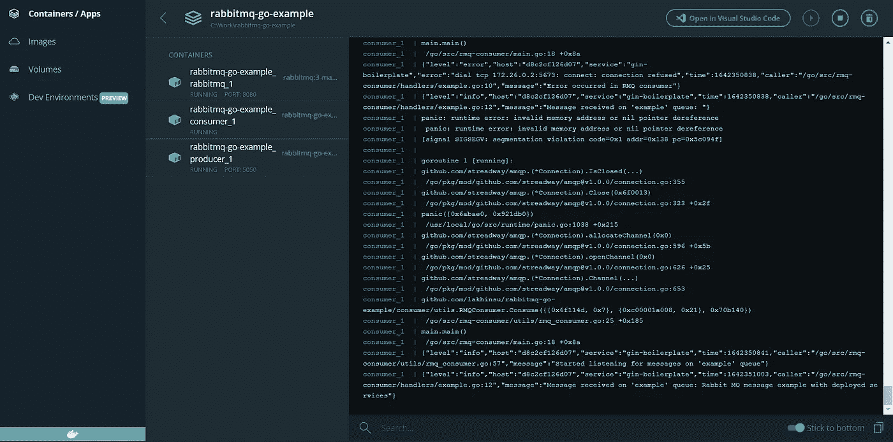
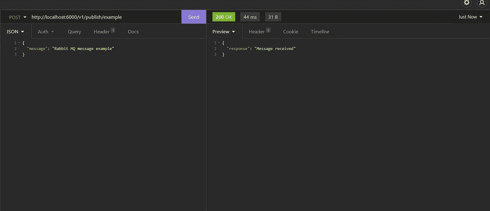
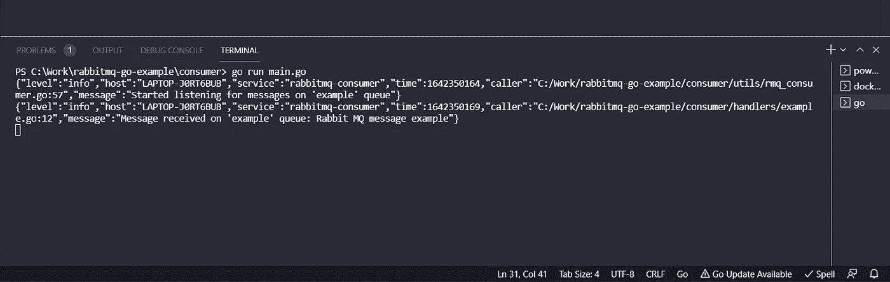
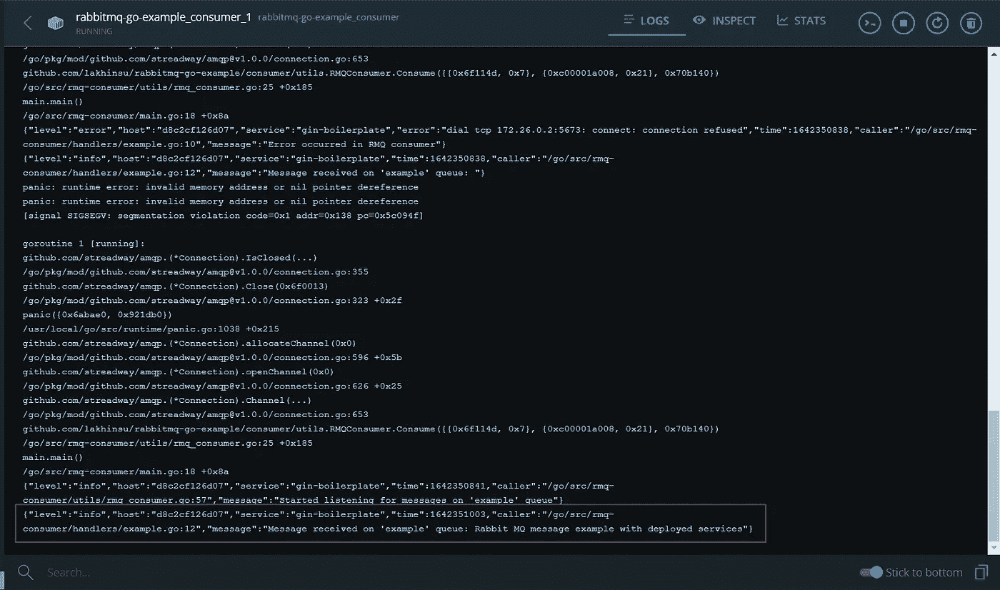

# 将 RabbitMQ 与 Golang 和 Docker 一起使用

> 原文：<https://blog.devgenius.io/using-rabbitmq-with-golang-and-docker-e674831c959c?source=collection_archive---------0----------------------->



故事预览图像

# 介绍

在这篇博客中，我将介绍如何在 Golang 中创建 RabbitMQ 生产者和消费者，并使用 docker-compose 将 RabbitMQ 部署到我们的服务中。

## 兔子 q

RabbitMQ 是最受欢迎的消息代理之一。RabbitMQ 是轻量级的，易于在内部和云中部署。

各种服务之间的可靠通信是任何应用程序的基础构件之一。RabbitMQ 支持各种通信模型，如消息队列、发布/订阅等。

> 生产者是将消息放入消息队列的服务。
> 
> 消费者是一种服务，当消息队列中的消息可用时，它会使用该消息。一旦消息被消费，消费者服务就可以执行为消息指定的任务。

# 运行 RabbitMQ

在创建生产者和消费者服务之前，让我们使用 Docker 构建一个独立的 RabbitMQ 实例。

首先，让我们创建一个基本的`rabbitmq.conf`文件作为 RabbitMQ 配置的占位符。从 RabbitMQ 3.9 开始，不赞成通过 Docker 特定环境变量进行配置，因此需要创建一个配置文件。更多详情，请参考 [RabbitMQ 文档](https://www.rabbitmq.com/configure.html)。

```
listeners.tcp.default = 5673
```

这里，我们只是改变默认的 TCP 端口，但是可以根据需要在这个文件中添加更多的配置。

现在让我们为 RabbitMQ 服务创建 docker-compose 文件。

在这里，我们将本地的`rabbitmq.conf`文件挂载到`/etc/rabbitmq/rabbitmq.conf`中。

我们使用了`rabbitmq:3-management`镜像，它包含了管理 RabbitMQ 实例的附加插件。对于我们的开发环境，我们将 5673 端口作为 5000，将 15672 端口作为 8080，用于 RabbitMQ 管理 UI `(http://localhost:8080)`。

此外，我们正在创建一个桥接网络`rabbitmq-example`，稍后我们将使用它来部署我们的生产者和消费者容器。

# 生产者

让我们创建一个基本的生产者服务，它将在消息队列中发布消息。我将使用我的 [REST API 样板代码](https://github.com/lakhinsu/gin-boilerplate)来创建一个 REST 服务，它将在收到 POST 请求时在队列中发布一条消息。

这里有一些发布消息的关键代码片段，查看我的 [GitHub repo](https://github.com/lakhinsu/rabbitmq-go-example) 获取完整代码。

在这段代码中，我们创建了一个包含队列名称和连接字符串字段的 RMQProducer 结构，可以根据需要在这里添加更多的字段。

我们的代码正在使用[https://github.com/streadway/amqp](https://github.com/streadway/amqp)rabbit MQ 客户端库。这个库非常成熟，甚至出现在官方的 [RabbitMQ 教程](https://www.rabbitmq.com/tutorials/tutorial-one-go.html)中。

我们的 REST 处理程序将使用`PublishMessage`方法在*示例*队列中发布消息。

由`PublishMessage`方法执行的步骤，

1.  使用指定的连接字符串通过 RabbitMQ 拨号。
2.  打开一个频道。
3.  声明一个队列来发布消息。声明一个队列是幂等的，一个新的队列只有在它不存在时才会被创建，否则，将使用现有的队列。
4.  在指定的队列上发布消息。

我们将发布一条内容类型为“text/plain”的新消息，并在 POST 请求中接收有效负载。

在这里，下面这段代码创建了一个新的`RMQProducer`,将队列名和连接字符串作为参数。

```
connectionString := utils.GetEnvVar("RMQ_URL")rmqProducer := utils.RMQProducer{consts.EXAMPLE_QUEUE,connectionString,}
```

# 消费者

接下来，让我们创建一个 Go 服务，它将不断地监听指定队列上的消息，并在收到消息后执行一些操作。

这里，我们定义了一个具有字段`Queue`(监听消息的队列的名称)`ConnectionString` (RabbitMQ 连接字符串)和`MsgHandler`(一旦接收到消息就会调用的函数)的结构。

由`Consume`方法执行的步骤，

1.  用 RabbitMQ 拨号。
2.  打开一个频道。
3.  用指定的名称声明队列。注意，我们还在消费者中声明了队列，因为当消费者启动时，队列可能不存在。RabbitMQ 中的队列声明是幂等的。
4.  开始使用消息，一旦收到消息，就用消息有效负载调用`MsgHandler`函数。

现在让我们创建一个基本的消息处理函数。

一旦在*示例*队列中收到消息，我们的`HandleExample`函数将被调用。这里，我们只是记录消息，但是这可以用所需的业务逻辑来代替。

现在让我们初始化我们的消费者服务。

这里，我们使用`RMQConsumer`声明了一个新的消费者，并开始使用`Consume()`方法监听消息。

这些是创建消费者的关键代码片段，完整代码请参考我的 [GitHub repo](https://github.com/lakhinsu/rabbitmq-go-example) 。

让我们测试我们的生产者和消费者服务，

1.  调用 REST API 来生成消息



使用失眠症 REST 客户端调用 REST API

2.让我们检查我们的消费者控制台的日志消息



消费者收到的消息

在控制台中，我们可以看到消息被消费者成功接收。

既然我们已经测试了生产者和消费者服务的工作情况，让我们使用 docker-compose 来部署这些服务。

# 部署这些服务

为了部署这些服务，我们将修改之前创建的 docker-compose.yaml 文件。

这里，我们已经指定了我们的生产者和消费者服务依赖于 RabbitMQ 实例，并且还为我们的 RabbitMQ 实例指定了`healthcheck`。

使用`docker-compose up`命令部署我们的服务。


RabbitMQ 实例、生产者和消费者服务的 Docker 容器。

我们的 RabbitMQ 实例、生产者和消费者服务已成功部署。

这里，我们已经添加了生产者和消费者服务以及必要的环境变量。我们可以使用 5050 端口访问 REST 服务。

让我们通过调用部署的 REST 服务来验证我们的配置，让我们检查 docker 容器中的消费者服务日志。



消费者在 docker 容器中收到的消息

# 闭幕词

这是一个使用 RabbitMQ 作为 Golang 的消息队列并创建一个`docker-compose.yaml`文件来部署我们的服务的基本例子。在 my [GitHub repo](https://github.com/lakhinsu/rabbitmq-go-example) 查看完整代码。此外，您可以随意以任何方式和能力使用示例代码。

# 参考

*   [https://www.rabbitmq.com/#getstarted](https://www.rabbitmq.com/#getstarted)
*   [https://hub.docker.com/_/rabbitmq](https://hub.docker.com/_/rabbitmq)
*   [https://docs.docker.com/compose/](https://docs.docker.com/compose/)
*   [https://www.rabbitmq.com/configure.html](https://www.rabbitmq.com/configure.html)
*   [https://www.rabbitmq.com/tutorials/tutorial-one-go.html](https://www.rabbitmq.com/tutorials/tutorial-one-go.html)
*   [https://www.rabbitmq.com/devtools.html#go-dev](https://www.rabbitmq.com/devtools.html#go-dev)
*   [https://github.com/lakhinsu/gin-boilerplate](https://github.com/lakhinsu/gin-boilerplate)

**感谢您的阅读！**