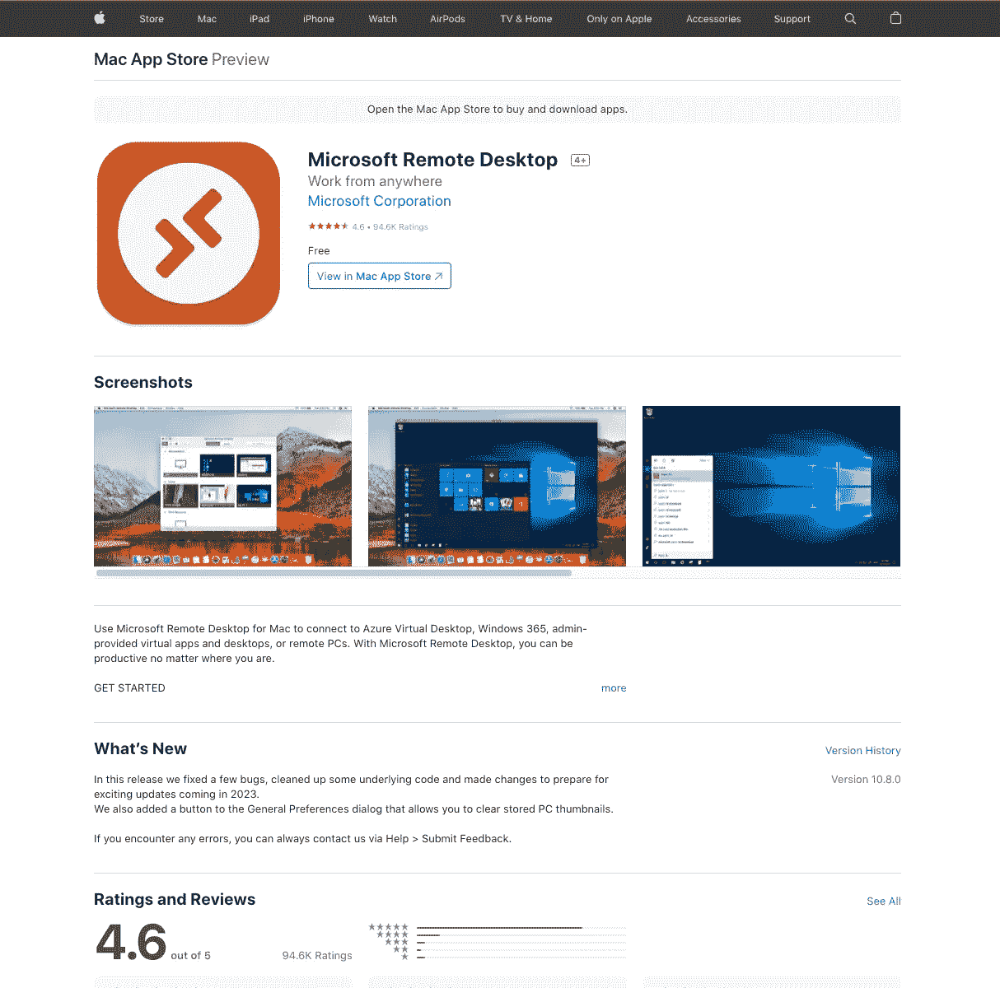
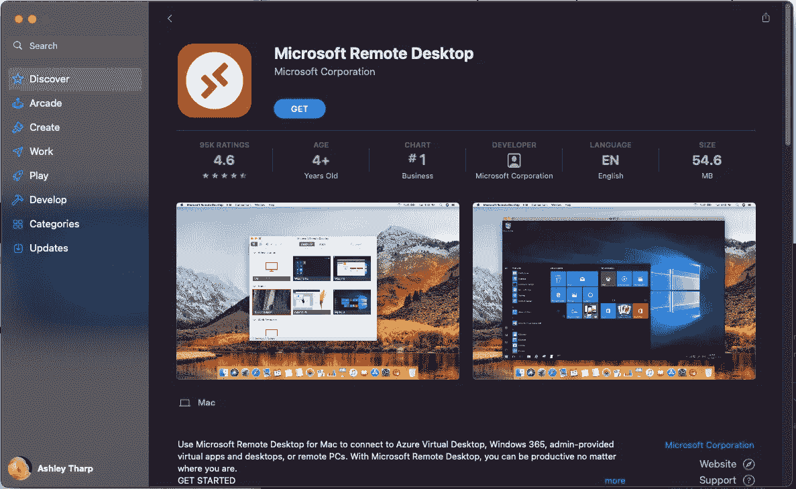
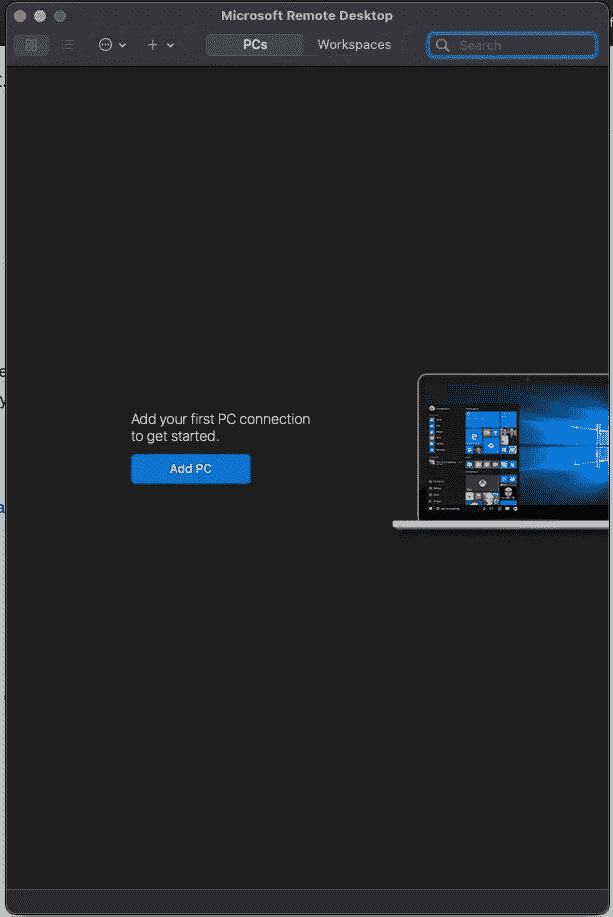
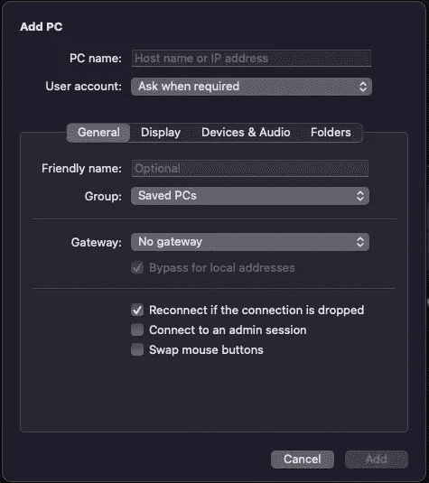

# 在 Mac 上使用 RDP 通过 VPN 连接到 Windows 机器

> 原文：<https://blog.devgenius.io/using-rdp-to-connect-to-a-windows-machine-over-vpn-on-a-mac-5184b368c2a2?source=collection_archive---------16----------------------->

## 如何使用屏幕截图

转到[这一页](https://apps.apple.com/us/app/microsoft-remote-desktop/id1295203466?mt=12)

点按“在 Mac App store 中查看”按钮。

单击获取按钮。

单击添加电脑按钮

填写这张表格

