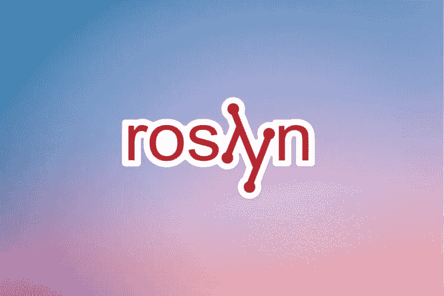

# 使用 Roslyn 分析器进行静态代码分析

> 原文：<https://blog.devgenius.io/using-roslyn-analyzers-for-static-code-analysis-733cc20fc17d?source=collection_archive---------5----------------------->



除了开发最简单的软件系统，代码质量是非常重要的。质量差的代码很难维护，如果不检查，会导致软件交付的严重问题。

因此，一致的[代码评审](https://audacia.co.uk/technical-blog/our-guidelines-for-code-review)是任何软件开发项目的重要部分。然而，手动代码审查过程可能非常耗时。如果你把所有的时间都花在检查正确的大小写和其他语法错误上，那么你就没有时间去检查代码中真正重要的部分。

通过使用静态代码分析工具，您可以自动化许多更普通的标准检查，这样代码评审就可以更少地关注语法，而更多地关注那些更高层次的领域。所有这些都很难自动化，但是在代码评审过程中增加了更多的价值。

在 Audacia，我们使用 Roslyn Analyzers 来自动化我们的一些代码审查过程，并确保我们始终达到我们的编码标准。本文将概述 Roslyn 分析仪，包括如何配置这些分析仪，以及我们如何从 Audacia 的这些工具中获益。

# 什么是静态代码分析？

静态代码分析在代码编译时运行，并通过对照一组(或多组)规则分析源代码来执行。例如，ReSharper 会告诉你什么时候你违反了该工具认为重要的规则。

使用这些工具可以帮助企业按照编码标准自动审查代码，从而提高代码审查过程的效率。企业能够更主动地维护代码质量，更有效地测试代码质量。

在像 C#这样的语言中，类和方法的命名有一定的约定。例如，一个类、方法或属性用 Pascal 大小写命名(大写首字母)，而参数和变量用 Camel 大小写命名(小写首字母)。

在 pull 请求期间逐个检查所有这些约定将非常耗时。

如果您在代码审查期间花费所有的时间来查看他们是否使用了正确的用例类型以及所有这些东西，那么您可能没有时间来检查代码中真正重要的是什么。实施的行为是否正确？有什么 bug 吗？

# 罗斯林

[Roslyn](https://github.com/dotnet/roslyn) 是 C#(和 VB)编译器的名字，它主要由微软作为开源项目开发。自 Visual Studio 2015 以来，该平台一直是默认的 C#编译器，实际上是用 C#本身编写的——与用 C++编写的第一代 C#编译器形成对比。

除了编译源代码，它还公开了一组 API，允许自定义代码与编译器进行交互。这就是罗斯林分析仪的用武之地。

Roslyn 设计了一个 API surface，允许第三方编写与某些编译器事件挂钩的代码，并可以对 C#代码进行自定义分析。

# 罗斯林分析仪

Roslyn Analyzers 是一种工具，可以分析您的代码的样式、设计和其他问题。该工具在您键入时对您的代码进行分析，并在编辑器中报告诊断结果。实际上，这意味着编译器不断地到达和评估语法树的不同部分。

Roslyn Analyzers 使用自己的 API 来验证关于源代码的某些条件，如果需要，还会以编译警告和错误的形式反馈给编译器。一个例子就是[风格警察](https://www.nuget.org/packages/StyleCop.Analyzers/)。

# 配置分析仪

开发人员可以通过配置 Roslyn analyzers 对如何分析他们的代码进行粒度控制。实现这一点的一种方法是设置规则的严格程度。作为一个分析器的作者，您能够定义在编译过程中当某些东西违反规则时(例如警告或建议)所创建的诊断的严重性。

可以使用 Roslyn SDK 编写分析器“规则”,每个规则指定:

*   规则 ID —例如，StyleCop 分析仪都有以“SA”开头的 ID，例如“SA1201”
*   规则的实际逻辑，即对源代码的一些分析，并检查源代码是否满足规则的要求
*   可选的代码修复，它指示罗斯林应该进行哪些代码更改来修复违规。

所有这些事件都是开发人员可以配置的。例如，您可能希望确保方法的命名是正确的，或者您的代码中没有超过一定数量的参数。

通过编写一些自定义代码，您可以指示 Roslyn 结合预设参数来分析您的代码。

开发人员也可以覆盖分析器。可以在不同的级别以不同的方式覆盖分析器。

这种配置大部分是通过`.editorconfig`完成的。

```
# Multiple enum values are placed on the same line of code.
dotnet_diagnostic.SA1136.severity = none

# Two sibling elements which each start on their own line have different levels of indentation.
dotnet_diagnostic.SA1137.severity = suggestion

# Use literal suffix notation instead of casting.
dotnet_diagnostic.SA1139.severity = warning
```

# 实现分析器

对于分析器的作者来说，在实现时需要考虑一些需求。每个分析器都有一个标题和一条消息，它可以是一个格式化的字符串，允许开发人员提供动态内容。其他关键要素包括:

`DiagnosticDescriptor`:这是一个对象，包含关于分析器信息的元数据。

`DiagnosticId`:每个分析仪都需要一个 ID，当违反规则时会显示出来。

所有这些领域都将出现在 Visual Studio、Rider、VS 代码或构建输出中。这些区域会显示出来，告诉开发人员哪里出错了。

每个规则可以与一个类别相关联，例如命名、性能和风格。

然后，您可以指定严重性。违反规则时分配的默认严重性，具有下列值之一:

*   隐藏的
*   信息
*   警告
*   错误

这个过程的第一部分包括覆盖`Initialize`方法。这是编译器在启动和注册所有分析器时会调用的。

```
public override void Initialize(AnalysisContext context) 
{
     context.EnableConcurrentExecution();
     context.ConfigureGeneratedCodeAnalysis(GeneratedCodeAnalysis
     Flags.None);
     context.RegisterSyntaxNodeAction(AnalyzerVariable, SyntaxKind.
     LocalDeclarationStatement);
}
```

Roslyn 然后进入发现阶段，在这个阶段，它将试图找到任何带有这个诊断分析器属性的东西。找到这段代码后，编译器将调用它的 initialise 方法。然后，该方法可以告诉 Roslyn 在编译过程中应该何时触发这个分析器。

在此过程中，会添加一些默认区域:

*   `ConfigureGeneratedCodeAnalysis`:生成的代码可以区别对待。例如，一个实体框架迁移将被归类为生成的代码，因为它可能会违反您自己的编码标准，但是您不一定希望它破坏您的构建，因为您实际上不能做太多来控制它。
*   `EnableConcurrentExecution`:同一个分析器可以注册多个动作，所以你可以让它触发语法树的不同区域。启用并发执行允许该过程并行发生，从而在整个过程中提高效率。

# 我们如何在 Audacia 使用罗斯林分析仪

Audacia 发现 Roslyn Analyzers 是一个非常有价值的工具，可以自动执行例行代码检查，从而维护我们的编码标准。

例如，我们的一个定制分析器是`FieldWithUnderscoreAnalyzer`。我们的编码标准之一是私有字段应该以下划线为前缀。鉴于这是我们的标准之一，我们有一个分析仪，可以自动检查这个标准。

```
[DiagnosticAnalyzer(LanguageNames.CSharp)]
public sealed class FieldWithUnderscoreAnalyzer : DiagnosticAnalyzer
{
    public const string Id = DiagnosticId.FieldWithUnderscore;

    private const string Title = "Private field not prefixed with an  underscore";
    private const string MessageFormat = "Field '{0}' is not prefixed with an underscore.";
    private const string Description = "Private fields should be prefixed with an underscore.";

    private static readonly DiagnosticDescriptor Rule = new DiagnosticDescriptor(Id, Title, MessageFormat, DiagnosticCategory.Naming, DiagnosticSeverity.Warning, isEnabledByDefault: true, description: Description);

    public override ImmutableArray<DiagnosticDescriptor> SupportedDiagnostics => ImmutableArray.Create(Rule);

    public override void Initialize(AnalysisContext context)
    {
        context.EnableConcurrentExecution();
        context.ConfigureGeneratedCodeAnalysis(GeneratedCodeAnalysisFlags.None);
        context.RegisterSymbolAction(AnalyzeField, SymbolKind.Field);
    }

    private static void AnalyzeField(SymbolAnalysisContext context)
    {
        var field = (IFieldSymbol)context.Symbol;
        if (!ShouldAnalyze(field))
        {
            return;
        }

        if (!field.Name.StartsWith("_", StringComparison.Ordinal))
        {
            var diagnostic = Diagnostic.Create(Rule, field.Locations[0], field.Name);
            context.ReportDiagnostic(diagnostic);
        }
    }

    private static bool ShouldAnalyze(IFieldSymbol field)
    {
        if (field.IsStatic && field.IsReadOnly)
        {
            return false;
        }

        if (field.IsConst)
        {
            return false;
        }

        if (field.DeclaredAccessibility == Accessibility.Public ||
            field.DeclaredAccessibility == Accessibility.Internal)
        {
            return false;
        }

        return true;
    }
}
```

这里分析器记录的是符号动作，而不是语法节点动作。分析器正在检查某个东西是否是字段符号，以及它是否应该被相应地分析。

我们不希望 static readonly、const、public 或 internal 字段作为前缀，因此任何这些类型的字段都会被分析器忽略。否则，分析器将检查字段名是否以下划线开头。

我们还有一个代码修复提供程序，可以自动插入下划线。与分析器一样，您需要从某个类继承，并用某个属性修饰它。一旦你注册了这个代码修复，罗斯林将运行你的代码。从这里，您将收到一个语法标记，可用于插入该字符串，并在它前面加上一个下划线。然后你可以把它反馈到你的源代码树中。

```
[ExportCodeFixProvider(LanguageNames.CSharp, Name = nameof(FieldWithUnderscoreCodeFixProvider)), Shared]
public sealed class FieldWithUnderscoreCodeFixProvider : CodeFixProvider
{
    public sealed override ImmutableArray<string> FixableDiagnosticIds => ImmutableArray.Create(FieldWithUnderscoreAnalyzer.Id);

    public sealed override FixAllProvider GetFixAllProvider()
    {
        return WellKnownFixAllProviders.BatchFixer;
    }

    public sealed override async Task RegisterCodeFixesAsync(CodeFixContext context)
    {
        var root = await context.Document.GetSyntaxRootAsync(context.CancellationToken).ConfigureAwait(false);
        var diagnostic = context.Diagnostics.First();
        var token = root.FindToken(diagnostic.Location.SourceSpan.Start);
        context.RegisterCodeFix(
            CodeAction.Create("Prepend '_' to field", c => PrependUnderscore(context.Document, token, c), FieldWithUnderscoreAnalyzer.Id),
            diagnostic);
    }

    private async Task<Solution> PrependUnderscore(Document document, SyntaxToken declaration, CancellationToken cancellationToken)
    {
        var newName = $"_{declaration.ValueText}";
        var semanticModel = await document.GetSemanticModelAsync(cancellationToken).ConfigureAwait(false);
        var symbol = semanticModel.GetDeclaredSymbol(declaration.Parent, cancellationToken);
        var solution = document.Project.Solution;

        return await Renamer.RenameSymbolAsync(solution, symbol, newName, solution.Workspace.Options, cancellationToken).ConfigureAwait(false);
   }
}
```

通过编写一些代码，我们能够自动修复代码。我们发现这是有效管理特定编码标准的有效方法。

# 代码分析的一致性

本文对罗斯林分析器进行了深入分析，重点介绍了它们的一些优点，并说明了如何使用该工具在代码分析中提供一致性。

正如我们已经讨论过的，罗斯林分析器不仅在标记代码错误方面非常有用，而且在代码修复过程的自动化方面也非常有用。罗斯林分析器还能够根据您的编码标准创建定制配置，能够显著提高效率，并确保团队能够专注于真正重要的事情:构建健壮、设计良好的系统。

[Audacia](https://audacia.co.uk/) 是一家总部位于英国利兹的软件开发公司。在我们的[技术见解博客](https://audacia.co.uk/technical-blog?utm_source=Medium+&utm_medium=Organic+&utm_campaign=Tech_RoslynAnalyzers)上查看来自我们的顾问、业务分析师、开发人员和测试人员团队的更多技术见解。

本文由奥达西亚工程总监 [Richard Brown](https://uk.linkedin.com/in/richard-brown-2513b37a) 撰写。