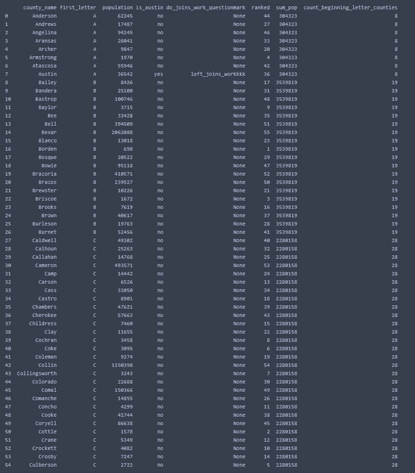

# 在 Python 和 Jupyter 笔记本中使用 SQL

> 原文：<https://blog.devgenius.io/using-sql-in-python-and-jupyter-notebook-457768b45b71?source=collection_archive---------7----------------------->

# **入门**

我会很简短——这篇文章背后的想法是简单地向您展示如何编写 sql 来操作您的数据。如果你只是不知道如何编写那段`pandas`代码，但你是 sql 方面的专家——这里有几个步骤让你开始。

*   在 python 程序中编写 sql，除了这个方法之外，还有很多方法。这个方法将讨论`pandasql`。

# 导入库和数据

这些都上传到了我的 github 上——只需将 repo 和 cd 复制到那个目录中。

```
#import the libraries
import pandas as pd
import pandasql as ps#display options
pd.set_option('display.max_rows', 500)
pd.set_option('display.max_columns', 500)
pd.set_option('display.width', 1000)#import the csv
df = pd.read_csv('austin_cases.csv')
```

# 普通熊猫命令/代码

我相信你已经习惯于看到正常熊猫代码是什么样子了。这是我为了演示`pandasql`而写的一个非常小的笔记本的片段:

```
#add a first letter column because it's hard to do in pandasql
df['first_letter'] = df['County_Name'].astype(str).str[0]#dropna
df = df[df['County_Name'].notna()]#convert population dtype
df = df.replace(',','', regex=True)
df['Population'] = df.Population.astype(int)
```

您正在创建变量、向您的`df`添加列、替换字符、重置索引等等。但是当你需要`rank over partition`或者`case when`什么的时候，你会怎么做呢？如果你是初学者，困难的方法是搜索你想写的代码，希望你问的问题足够具体，以至于弹出一些 stackoverflow 帖子。简单的作弊方式(因为你真的应该学习如何在 python 中做到这一点，但我明白，有时你只是没有时间去学习它的新功能)。

# 创建查询变量并编写 SQL:

我不打算过多地讨论这个查询——假设您正在尝试用 python 编写 sql，您可能已经知道如何编写 sql 了。但是有一些排名，`case whens,`子查询，分组，排序功能等。在查询中。Pandasql 非常健壮——你可以用任何其他 sql 语言做任何你能做的事情(至少对于`select`语句)。我没有和`inserts` `deletes`等乱七八糟。

```
##sql time
select_query = """
select
    df.County_Name as county_name
    ,df.first_letter
    ,df.Population as population
    ,case when df.County_Name = 'Austin' then 'yes' else 'no' end as is_austin --CASE STATEMENTS WORK
    ,case when df1.county_name_joined is not null then 'left_joins_workkkk' else null end as do_joins_work_questionmark --looks like it works to me
    ,rank() over (order by df.Population) as ranked --RANK FUNCTION WORKS
    ,df2.sum_pop
    ,df2.count_beginning_letter_counties
from df df
left join ( --JOINS WORK
    select
        df.County_Name as county_name_joined
        ,df.Population as population_joined
    from df df
    where df.County_Name = 'Austin'
    ) df1 on df.County_Name = df1.county_name_joined
left join (
    select
        df.first_letter
        ,sum(df.Population) as sum_pop
        ,count(df.Population) as count_beginning_letter_counties
    from df df
    group by
        1
    ) df2 on df.first_letter = df2.first_letter
where 
    lower(df.County_Name) like 'a%'
        or lower(df.County_Name) like 'b%'
        or lower(df.County_Name) like 'c%'
group by
    1,2,3,4,5
order by
    df.County_Name
--limit 30
"""
```

# 调用您的查询变量并打印出来

这是最后一步。这实际上只是三个步骤——导入库真的不应该被认为是一个步骤！使用您的查询创建变量，并调用该变量。然后坐回到你的椅子上，说“好了，儿子”。

```
#display the query results
print(ps.sqldf(select_query, locals()))
```



搞定儿子

# 结论

随时向我提问。这是非常基本的东西，但无论如何祝你好运！

马克斯·巴德