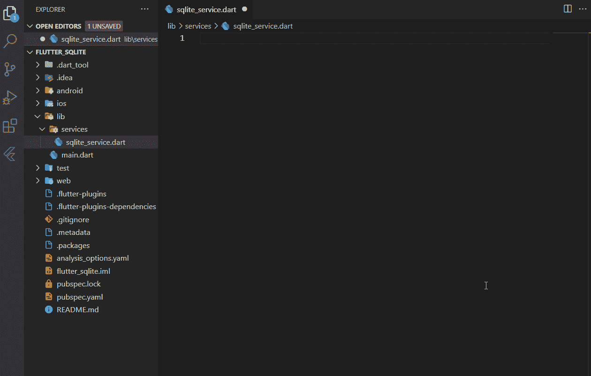
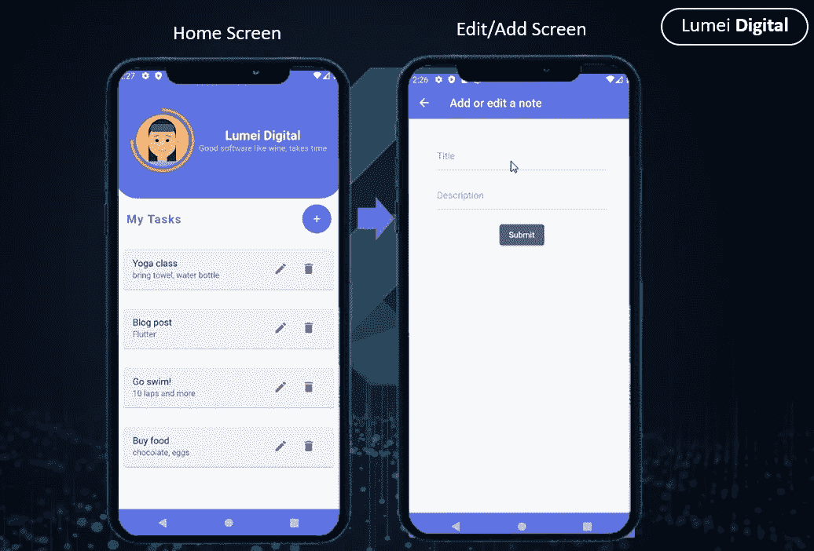
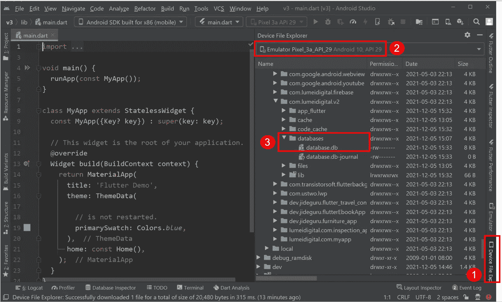

# 在 Flutter 中使用 SQLite

> 原文：<https://blog.devgenius.io/using-sqlite-in-flutter-4b16e5ef36dc?source=collection_archive---------0----------------------->

本文将使用 **sqflite** 插件离线保存结构化数据，并在 Flutter 应用程序中创建数据库、存储、更新和删除数据(CRUD)。


在 Flutter 鲁美数字中使用 SQLite(UI 的一部分由 Mitesh Chodvadiya 设计)

# 🟤第 1 部分:开始

**Flutter** 是一款移动应用 SDK，用于为 iOS 和 Android 构建高性能、高保真的应用。Flutter 与现有代码一起工作，被世界各地的开发人员和组织使用，并且是免费和开源的。

本文将向您展示如何在更短的时间内构建漂亮、高性能的应用程序，并使用一个小型的 **SQLite** 数据库在本地保存和操作数据。

SQLite 数据库是一个轻量级的嵌入式数据库。它的数据库是一个文件。 **SQLite** 通常被移动设备、中小型流量网站用于版本转换系统、财务分析工具、媒体编目和编辑套件、CAD 软件包、记录保存程序等。使用 **SQLite** 的优点包括 **:**

✅It 可以用于任何编程语言和任何设备

数据库的✅The 大小通常限制为 2GB

✅和更多关于 W3C 学校的信息

# 目录

*   在颤振中启用 **Sqflite**
*   在颤振中创建模型
*   使用 Flutter 中的模型创建表格
*   在 SQLite 中插入/更新/删除(CRUD)数据
*   在 Flutter 中显示 SQLite 中的数据
*   优化 SQLite 的颤振性能
*   下载 SQLite 文件
*   升级 SQLite 中的表模式

# 🟤第二部分:在颤振中启用 **Sqflite**

***SQLite*** 是一个开源的关系数据库，可以用来存储和操作数据，如添加、删除和移除数据。

它不需要服务器或后端代码，所有数据都保存在设备上的文本文件中。请点击查看更多信息。

步骤 1️⃣:将 **sqflite** 包添加到 pubspec.yaml 中

访问 [pub.dev](https://pub.dev/packages/sqflite/install) 并在文件`pubspec.yaml`中添加`sqflite:^2.0.0+4`

```
environment:
  sdk: ">=2.12.0 <3.0.0"dependencies:
  flutter:
    sdk: flutter
  sqflite: ^2.0.0+4
  path: ^1.8.0
```

**步骤** 2️⃣:在 Flutter 中添加`path:^1.8.0`插件

path 插件是 Dart 的跨平台路径操作库，它有助于指定包含数据库的文件的位置。

例如，如果要加入数据库的路径:



将 **Sqflite** 包添加到 Flutter-鲁美数字

**第一步** 3️⃣:跑酒馆找人

# 你会支持 awesome❤️

> 请帮我获得 100 名追随者。

# 🟤在 SQLite 中创建了一个表

**步骤** 1️⃣:在服务文件夹中创建一个`sqlite_service.dart` 文件。

```
import 'package:sqflite/sqflite.dart';
import 'package:path/path.dart';class SqliteService {
  Future<Database> initializeDB() async {
    String path = await getDatabasesPath();

    return openDatabase(
      join(path, 'database.db'),
      onCreate: (database, version) async {
         await database.execute( 
           "CREATE TABLE Notes(id INTEGER PRIMARY KEY AUTOINCREMENT,  
           description TEXT NOT NULL)",
      );
     },
     version: 1,
    );
  }
}
```

**步骤** 2️⃣:初始化数据库

✅ `getDatabasePath()`:获取默认的数据库位置。

✅ `openDatabase()`:接受一个强制的`String`作为参数，它是数据库的路径。

✅:我们使用包`path`中的方法`join()`把给定的路径连接成一个单一的路径，例如我们会得到`databasepath/database.db`。

✅ `onCreate()`回调:第一次创建数据库时会调用它，它会执行上面的 SQL 查询来创建表`notes`。这是创建表和初始填充表的地方。

# 🟤第 3 部分:创建一个颤振模型

我们的目标是将数据保存到数据库，例如，保存待办事项列表应用程序的注释列表，因此我们创建了一个类`Note`，它将包含与注释相关的不同字段。

基本上，这个模型定义了可以从数据库的表中提取的字段。

```
class Note{ 
  final int id; 
  final String description;

  Note({this.id, this.description});

  Note.fromMap(Map<String, dynamic> item): 
    id=item["id"], description= item["description"];

  Map<String, Object> toMap(){
    return {'id':id,'description': description};
  }
}
```

我们创建了一个名为`Note.fromMap()`的命名构造函数和一个名为`toMap()`的方法，将数据转换成映射，反之亦然，以操作 SQLite 数据库中的数据。

# 🟤在 SQLite 中将数据插入到一个表中

让我们开始在`sqlite_service.dart` 文件中创建 CRUD 方法

```
class SqliteService{

  Future<int> createItem(Note note) async {
    int result = 0;
    final Database db = await initializeDB();
    final id = await db.insert(
      'Notes', note.toMap(), 
      conflictAlgorithm: ConflictAlgorithm.replace); }
}
```

✅ `createItem()`会记下一张纸条，然后将纸条插入表格`Notes`。

✅ `insert()`方法:它接受两个参数`String table, Map<String, Object?> values`，这就是为什么我们在模型类中创建一个`toMap()`方法。

# 🟤从 SQLite 的一个表中获取数据

```
class SqliteService{ 
  Future<List<Note>> getItems() async {
    final db = await SqliteService.initizateDb();
    final List<Map<String, Object?>> queryResult = 
      await db.query('Notes', orderBy: NoteColumn.createdAt);
    return queryResult.map((e) => Note.fromMap(e)).toList();
  }
}
```

✅我们使用`query()`这个方法接受一个字符串扩充`Notes`，它是从表`Notes`中检索所有列的表名。

✅`queryResult`返回一个`List`，所以我们使用`map()`方法将`List<Map<String, Object?>>`转换为`List<Note>`。

# 🟤第 4 部分:在 SQLite 中从表中删除数据

```
class SqliteService{ // Delete an note by id
  Future<void> deleteItem(String id) async {
   final db = await SqliteService.initizateDb(); try {
      await db.delete("Notes", where: "id = ?", whereArgs: [id]);
    } catch (err) {
      debugPrint("Something went wrong when deleting an item: $err");
    }
  }
}
```

✅`delete()`方法:我们传递表名并指定我们想要删除表中的行的列。

# 🟤显示来自 SQLite 的数据

我们创建了一个表单，允许用户填写包括注释描述在内的数据。提交表单时，数据将存储在表格的相应列中。


在 Flutter 鲁美数码中使用 **SQLite**



在 Flutter 中使用**SQLite**——鲁美数码

我们将有两个屏幕。让我们从**主页**屏幕开始:

步骤 1️⃣:初始化有状态小部件中的`SqliteService` 类。

在`_HomePageState`中，我们添加了下面的代码:

```
**class** **_HomePageState** **extends** State**<**MyHomePage**>** **{**

  late SqliteService _sqliteService**;**

  @override
  **void** initState**()** **{**
    **super.**initState**();**
    **this.**_sqliteService**=** SqliteService**();**
    **this.**_sqliteService**.**initializeDB**().**whenComplete**(()** async **{**
      await _refreshNotes**();**
      setState**(()** **{});**
    **});**
  **}**
```

我们创建一个类`SqliteService()`的实例，然后调用`initalizeDb()`来创建包含`Notes`表的数据库。当`Future`完成时，我们调用`_refreshNotes()`来获取表中的属性列表。

在`_refreshNotes()`中，我们会有以下内容:

步骤 2️⃣:从主屏幕上的 SQLite 中获取数据

```
// All items
List<Note> _notes = [];// This function is used to fetch all data from the database
void _refreshNotes() async { final data = await SqliteService.getItems();
  setState(() {
    _notes = data;
  });
}
```

✅我们称之为`getItems()`类中定义的`SqliteService().`方法

完成后，将调用`setState(() {});`，这将重建小部件树。

# 🟤优化 SQLite 的颤振性能

**步骤** 1️⃣:将数据库添加到`assets`文件夹中

```
assets/database.db
```

**步骤** 2️⃣:在文件中指定资产`pubspec.yaml`

```
flutter:
  assets:
    - assets/database.db
```

**步骤** 3️⃣:将数据库复制到你的文件系统中

您需要从资产中获得一个新的副本，还是总是复制资产，这取决于您。为了获得更好的性能，最好只复制资源一次，然后打开副本。

```
import 'package:path/path.dart';
import 'dart:typed_data';
import 'package:flutter/services.dart';var databasesPath = await getDatabasesPath();
var path = join(databasesPath, "database.db");

// Check if the database exists
var exists = await databaseExists(path);

if (!exists) {
  // Should happen only the first time you launch your application
  print("Creating new copy from asset");

  // Make sure the parent directory exists
  try {
    await Directory(dirname(path)).create(recursive: true);
  } catch (_) {}

  // Copy from asset
  ByteData data = await rootBundle.load(join("assets", "database.db"));
  List<int> bytes =
  data.buffer.asUint8List(data.offsetInBytes, data.lengthInBytes);

  // Write and flush the bytes written
  await File(path).writeAsBytes(bytes, flush: true);

} else {
  print("Opening existing database");
}
// open the database
db = await openDatabase(path, readOnly: true);
```

# 🟤下载了 SQLite 文件

默认情况下，数据库文件保存在 Android 设备上的文件夹**data/data/your package name/databases**中，而在 iOS 和 macOS 上，它是 Documents 目录。

如果你想检查文件目录，下面的语句将显示路径:

```
String path = await getDatabasesPath();
```

在本教程中，包名为 **com.lumeidigital.v2** 。如果我在 Android Studio 上打开设备文件浏览器，我可以通过访问**data/data/com . lumeidigital . v2/databases 来访问数据库文件。**



SQLite 在 Flutter 中的应用——鲁美数码

现在，选择**数据库**并下载扩展名为**的数据库。db，**右击数据库名称，将文件保存在任何需要的位置，但记住位置，然后点击**另存为**对话框中的**确定**。

为了查看数据库，我们需要一个 SQLite 浏览器，你可以从 https://sqlitebrowser.org/dl/[下载 SQLite 浏览器。从上面的链接为您的设备下载一个合适的 SQLite 浏览器并打开它。](https://sqlitebrowser.org/dl/)

如果使用的是 VS 代码，可以下载一个名为 **SQLite** 的扩展，打开 **database.db.**

> **ctrl + shift + p** 打开数据库


SQLite 在 Flutter 中的应用——鲁美数码

# 🟤升级 SQLite 中的表模式

在 SQLite 中，当数据库打开时，`onCreate()`和`onUpgrade()`被调用。版本号是传递给构造函数的 int 参数，保存在 SQLite 数据库文件中。

✅ `onCreate()`回调:当数据库文件不存在并且刚刚创建时调用。如果`onCreate()`成功返回并且没有抛出异常，则认为数据库是用请求的版本号创建的。

✅ `onUpgrade()`回调:当数据库文件存在但版本号低于构造函数中请求的版本号时调用。基本上，它是在数据库需要升级时使用的。实现应该使用这个方法来删除表、添加表或执行任何其他需要升级到新模式版本的操作。

`onUpgrade()`应该将表模式更新到所请求的版本。

```
Future<Database> initializeDB() async {
    String path = await getDatabasesPath(); return openDatabase(
      join(path, 'database.db'),
      onCreate: (database, version) async {
         await database.execute( "CREATE TABLE properties(id INTEGER PRIMARY KEY AUTOINCREMENT, address TEXT NOT NULL)",
      );
     },
     version: 1,
     onUpgrade: (database, oldVersion, newVersion){()=> ....}
    );
  }
```

更改表模式的两种方法:

1️⃣:删除旧的数据库文件，因此再次运行`onCreate()`回调。在开发期间，当您对已安装的版本有更多的控制并且数据丢失不是问题时，这是完美的。

2️⃣:增加版本号，这样就调用了`onUpgrade()`回调。在开发期间，当数据丢失不成问题时，您可以执行类似于`DROP TABLE IF EXIST <table name>` 的 SQL 来删除现有的表，并调用`onCreate()`来重新创建数据库。

但是，如果发布了应用程序，您需要在`onUpgrade()`回调中实现数据迁移，这样您的用户就不会丢失他们的数据。

# 🟤其他数据库集成

总是需要存储数据。以下是一些可以与 Flutter 一起使用的数据库:

*   [燃烧基地](https://firebase.flutter.dev/docs/overview/)
*   [Supabase](https://supabase.io/)
*   [Hive](https://pub.dev/packages/hive) (本地数据库)
*   [摩尔](https://pub.dev/packages/moor)(本地数据库)

# 更多教程:

*   [颤振动画教程](https://medium.com/@lumeilin301/flutter-animation-tutorial-4eb560eace48)
*   [飘起& Firebase App 教程](https://medium.com/@lumeilin301/flutter-firebase-app-tutorial-part-1-get-started-95cce84939c3)

# 你会支持 awesome❤️

> 请帮我获得 100 名追随者。

**关键词:** Flutter，SQLite，数据库，CRUD。

👉*源代码在* [*Github*](https://github.com/lumei301/flutter-sqlite) 上更新