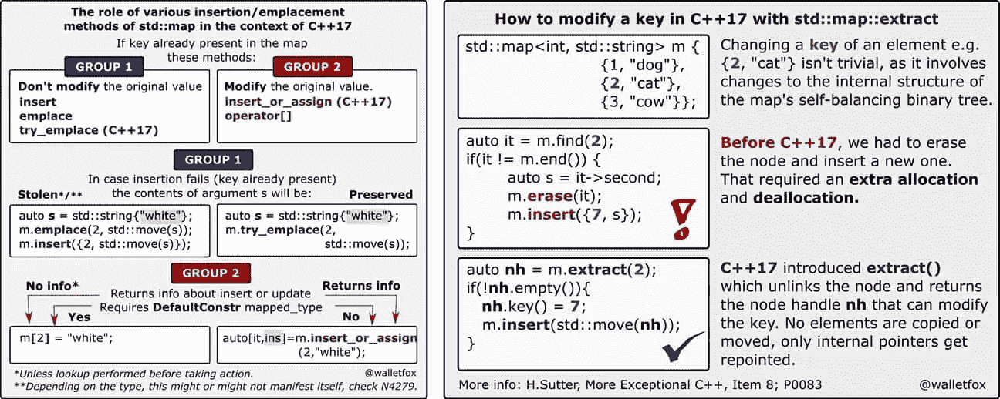

# 在现代 C++中明智地使用 std::map

> 原文：<https://blog.devgenius.io/using-std-map-wisely-with-modern-c-cdc7c2c81b52?source=collection_archive---------5----------------------->



[std::map](https://en.cppreference.com/w/cpp/container/map) 和它的兄弟( [std::multimap](https://en.cppreference.com/w/cpp/container/multimap) ，[STD::unordered _ map](https://en.cppreference.com/w/cpp/container/unordered_map)/[multimap](https://en.cppreference.com/w/cpp/container/unordered_multimap))曾经是我做竞技编程时最喜欢的容器。事实上，我仍然喜欢它们(尽管现在用得不那么频繁了)。而有了[现代 C++](http://www.vishalchovatiya.com/21-new-features-of-modern-cpp-to-use-in-your-project/) ，我们现在有了更多使用 std::map 的理由。这就是为什么我决定写一篇总结这些新特性的文章来讨论这个话题。所以，废话不多说，让我们直接开始吧。

> */！\:本文最初发表于我的* [*博客*](http://www.vishalchovatiya.com/using-std-map-wisely-with-modern-cpp/) *。如果你有兴趣接收我的最新文章，* [*请报名参加我的简讯*](http://eepurl.com/gDNybv) *。*

# [std::map::包含](https://en.cppreference.com/w/cpp/container/map/contains) (C++20)

*   成员函数是迈向代码表现力的良好一步。我也厌倦了写作:

```
if (auto search = freq_of.find(2); search != freq_of.end()) {
    cout << "Found" << endl;
}
// Where assume, freq_of = map<uint32_t, uint32_t>{{3, 1}, {1, 1}, {2, 1}};
```

*   相反，从 C++20 开始，您可以编写:

```
if (freq_of.contains(2)) {
    cout << "Found" << endl;
}
```

> 我们写的代码首先是供人使用的，其次才是供计算机理解的。
> 
> ***——约翰·桑梅兹***

# [STD::map::try _ location](https://en.cppreference.com/w/cpp/container/map/try_emplace)(c++ 17)

*   在插入地图时，我们有两种不同的可能性:

1.  密钥还不存在。创建一个新的键值对。
2.  该密钥已经存在。获取现有项目并对其进行修改。

*   在`std::map`中插入元素的典型方法是使用`operator[ ]`、`std::map::insert`或`std::map::emplace`。但是，在所有这些情况下，我们必须承担默认/专用构造函数或赋值调用的成本。最糟糕的是，如果一个项目已经存在，我们必须删除新创建的项目。

```
int main() {
    vector v{3, 4, 5, 8, 7, 3, 5, 2, 4};
    map<uint32_t, uint32_t> freq_of; for (const auto &n : v) {
        if (const auto &[it, inserted] = freq_of.emplace(n, 1); !inserted) {
            it->second++;  // Exists already
        }
    } assert(freq_of[3] == 2); return EXIT_SUCCESS;
}
```

*   相反:

```
if (const auto &[it, inserted] = freq_of.try_emplace(n, 1); !inserted) {
    it->second++;
}
```

*   但是，从 C++17 开始，有了这个***STD::map::try _ location 方法，只在 key 还不存在的情况下创建条目*** 。如果创建这种类型的对象成本很高，这将提高性能。
*   虽然上面的例子没有展示昂贵的创建项目。但是，是的！每当你遇到这样的情况，一定要知道如何用`std::map::try_emplace`来处理。

# [STD::map::insert _ or _ assign](https://en.cppreference.com/w/cpp/container/map/insert_or_assign)(c++ 17)

*   无论如何都要插入元素。为了方便起见，你用 [std::map::operator[ ]](https://en.cppreference.com/w/cpp/container/map/operator_at) 。哪个好(还有[危险](https://devblogs.microsoft.com/oldnewthing/20190227-00/?p=101072))！除非您对插入或赋值有任何限制。
*   例如，在计算元素的频率时，增加了一个约束，即当一个元素重复(即分配)时，您必须删除小于当前元素的所有元素。
*   在这样的情况下，`std::map::operator[ ]`是不可行的。相反，`***std::map::insert_or_assign***` ***比*** `[***std::map::operator[ ]***](https://dev.tostd::map::operator%5B%20%5D)`更合适，返回的信息更多。它也不要求映射类型的默认构造性。考虑以下同样的例子。

```
int main() {
    vector v{8, 3, 9, 5, 8};
    map<uint32_t, uint32_t> freq_of; for (auto &&n : v) {
        const auto &[it, is_inserted] = freq_of.insert_or_assign(n, 1); if (!is_inserted) { // remove all lesser element then current one if repeated
            freq_of.erase(begin(freq_of), it);
        }
    } assert((freq_of == decltype(freq_of){
                           {8, 1},
                           {9, 1},
                       })); return EXIT_SUCCESS;
}
```

# [std::map::insert](https://en.cppreference.com/w/cpp/container/map/insert) 带提示(C++11/17)

*   在`std::map`中查找项目需要`O(log(n))`时间。插入新项目也是如此。因为必须查找插入它们的位置。因此，简单地插入`M`新项目会花费`O(M * log(n))`时间。
*   为了提高效率，`std::map`插入函数接受一个可选的插入提示参数。插入提示基本上是一个迭代器，它指向将要插入的项的未来位置附近。如果提示是正确的，那么我们得到摊销的`O(1)`插入时间。
*   从性能的角度来看，当项目的插入顺序在某种程度上是可预测的时，这是非常有用的。例如:

```
int main() {
    map<uint32_t, string> m{{2, ""}, {3, ""}};
    auto where(end(m)); for (const auto &n : {8, 7, 6, 5, 4, 3, 2, 1}) { // Items in non-incremental order
        where = m.insert(where, {n, ""});
    } // How it is not done!
    // m.insert(end(m), {0, ""}); for (const auto &[key, value] : m) {
        cout << key << " : " << value << endl;
    } return EXIT_SUCCESS;
}
```

*   一个 ***正确的提示将指向一个现有的元素，该元素大于要插入的元素*** ，这样新插入的键将正好在提示之前。如果这不适用于用户在插入过程中提供的提示，插入函数将退回到非优化插入，再次产生`O(log(n))`性能。
*   对于上面的例子，第一次插入，我们得到了 map 的结束迭代器，因为我们没有更好的提示来开始。在树中安装了 8 之后，我们知道安装 7 会在 8 的前面插入一个新的条目，这证明它是一个正确的提示。这也适用于 6，如果在插入 7 之后放入树中，依此类推。这就是为什么可以使用迭代器的原因，迭代器在上一次插入中被返回用于下一次插入。
*   您可以利用上面的例子来证明使用[快速基准](https://quick-bench.com/q/gF1CXbPkzjOzLxKfRG7X-Uv8lfw)获得的性能提升。

**注:* *要知道在 C++11 之前，插入提示在指向新插入的项的位置之前时被认为是正确的。

# [std::map::merge](https://en.cppreference.com/w/cpp/container/map/merge) (C++17)

*   同 [std::list:splice](https://en.cppreference.com/w/cpp/container/list/splice) ，将元素从一个列表转移到另一个列表。我们有`std::map::merge`，可以合并两个同类型的`std::map`。

```
int main() {
    map<uint32_t, string> fruits{{5, "grapes"}, {2, "tomoto"}};
    map<uint32_t, string> person{{2, "mickel"}, {10, "shree"}};
    map<uint32_t, string> fruits_and_persons; fruits_and_persons.merge(fruits);
    assert(fruits.size() == 0); fruits_and_persons.merge(person);
    assert(person.size() == 1);
    assert(person.at(2) == "mickel"); // Won't overwrite value at 2 i.e.`mickel` assert((fruits_and_persons == decltype(fruits){
                                      {2, "tomoto"},
                                      {5, "grapes"},
                                      {10, "shree"},
                                  })); return EXIT_SUCCESS;
}
```

*   这里要注意的是当有重复时会发生什么！ ***复制的元素不会被转移。他们在右手边的地图*** 中落在了后面。

# [STD::map::extract](https://en.cppreference.com/w/cpp/container/map/extract)(c++ 17

*   与`std::map::merge`批量传输元素不同，`***std::map::extract***` ***连同*** `***std::map::insert***` ***分段传输元素*** 。但是`std::map::extract`更引人注目的应用是修改按键。
*   正如我们所知，for `std::map`键总是唯一的，并且是有序的。因此，用户不能修改已经插入的地图节点的键是至关重要的。为了防止用户修改完全排序的地图节点的键项，在键类型中添加了 [const](http://www.vishalchovatiya.com/when-to-use-const-vs-constexpr-in-cpp/) 限定符。
*   这种限制是完全有效的，因为它使得用户更难以错误的方式使用`std::map`。但是如果我们真的需要改变一些地图项目的键呢？
*   在 C++17 之前，为了更改密钥，我们必须移除并重新插入项目。这种方法的缺点是内存分配和释放，从性能的角度来看，这听起来很糟糕。但是，从 C++17 开始，我们可以删除&重新插入 std::map 节点，而无需重新分配内存。

```
int main() {
    map<int, string> race_scoreboard{{1, "Mickel"}, {2, "Shree"}, {3, "Jenti"}};
    using Pair = map<int, string>::value_type; {
        auto Jenti(race_scoreboard.extract(3));
        auto Mickel(race_scoreboard.extract(1)); swap(Jenti.key(), Mickel.key()); auto [it, is_inserted, nh] = race_scoreboard.insert(move(Jenti)); // nh = node handle
        assert(*it == Pair(1, "Jenti") && is_inserted == true && nh.empty()); race_scoreboard.insert(move(Mickel));
    } assert((race_scoreboard == decltype(race_scoreboard){
                                   {1, "Jenti"},
                                   {2, "Shree"},
                                   {3, "Mickel"},
                               })); return EXIT_SUCCESS;
}
```

*   考虑上面的赛车记分牌的例子，你用`std::map`来模仿赛车的位置。过了一会儿，Jenti 领先了，Mickel 落后了。在这种情况下，我们如何切换这些球员的关键(在赛道上的位置)。
*   `std::map::extract`有两种口味:

```
node_type extract(const_iterator position);
node_type extract(const key_type& x);
```

*   在上面的例子中，我们使用了第二个方法，它接受一个键，然后查找并提取与键参数匹配的 map 节点。第一个接受迭代器，这意味着它更快，因为它不需要搜索条目。

# 如果具有特定键的节点不存在怎么办？

*   如果我们试图用第二种方法提取一个不存在的项目(使用键搜索的方法)，它 ***返回一个空的*** `***node_type***` ***实例，即节点句柄*** 。`empty()`成员方法或重载的 bool 操作符告诉我们一个`node_type`实例是否为空。

# 好吧！那我怎么修改 std::map 键？

*   提取节点后，我们能够使用 `***key()***` ***方法*** 修改它们的键 ***，这给了我们对键的非常数访问，尽管键通常是常量。***
*   注意，为了再次将节点重新插入到地图中，我们必须将它们移动到 insert 函数中。这是有意义的，因为摘录完全是为了避免不必要的复制和分配。此外，当我们移动一个`node_type`实例时，这不会导致任何容器值的实际移动。

# 我还可以修改 std::map 中的关联值吗？

*   是啊！您可以 ***使用访问器方法*** `***nh.mapped()***`(而不是`nh.key()`)来操作`std::map`中的条目片段(或`std::set`元素中的单个数据片段的`nh.value()`)。因此，您可以提取、操作和重新插入密钥，而无需复制或移动其实际数据。

# 但是安全呢？

*   如果您从地图中提取一个节点，然后在将它重新插入目标地图之前抛出一个[异常](http://www.vishalchovatiya.com/7-best-practices-for-exception-handling-in-cpp-with-example/)。
*   调用节点句柄的析构函数，它将正确地清理与节点相关的内存。所以，技术上来说`***std::map::extract***` ***默认情况下(没有插入)会充当***[***STD::map::erase***](https://en.cppreference.com/w/cpp/container/map/erase)！

# 还有呢！互用性

*   使用`std::map::extract`提取的地图节点实际上非常通用。 ***我们可以从一个地图实例中提取节点，并将其插入到任何其他地图甚至 multimap 实例中*** 。
*   在 [unordered_map](https://en.cppreference.com/w/cpp/container/unordered_map) 和 [unordered_multimap](https://en.cppreference.com/w/cpp/container/unordered_multimap) 实例之间，以及与 [set](https://en.cppreference.com/w/cpp/container/set) / [multiset](https://en.cppreference.com/w/cpp/container/multiset) 和各自的[unordered _ set](https://en.cppreference.com/w/cpp/container/unordered_set)/[unordered _ multiset](https://en.cppreference.com/w/cpp/container/unordered_multiset)之间，它也可以工作。
*   为了在不同的映射/集合结构之间移动项目，键、值和分配器的类型需要相同。

# 运算符[ ]与 insert()和 at()之间的差异

这对于有经验的开发人员来说是微不足道的，但我仍然想快速浏览一遍。

# [std::map::operator[ ]](https://en.cppreference.com/w/cpp/container/map/operator_at)

*   **操作**:查找或添加；尝试在 map 中查找具有给定键的元素，如果存在，它将返回对存储值的引用。如果没有，它将使用默认初始化创建一个插入的新元素，并返回对它的引用。
*   **适用性**:
*   对`const std::map`不可用，因为它会创建一个不存在的元素。
*   不适用于没有默认可构造和可赋值的值类型(通俗地说，没有默认构造函数&复制/移动构造函数)。
*   **当密钥存在时**:覆盖它。

# [std::map::insert](https://en.cppreference.com/w/cpp/container/map/insert)

*   **操作**:insert-or-nop；接受 value_type ( `std::pair`)并使用键(第一个成员)和来插入它。由于`std::map`不允许重复，如果有一个现有的元素，它不会插入任何东西。
*   **适用性**:
*   调用中的自由插入需要在外部创建 value_type 并将该对象复制到容器中的不同方式。
*   当项目插入顺序在某种程度上可预测以获得性能时，非常适用。
*   **当键存在时**:不修改映射的状态，而是返回一个迭代器到阻止插入的元素。

# [std::map::at](https://en.cppreference.com/w/cpp/container/map/at)

*   **操作**:找或扔；返回对键与输入键等效的元素的映射值的引用。如果不存在这样的元素，则抛出类型为 [std::out_of_range](https://en.cppreference.com/w/cpp/error/out_of_range) 的[异常](http://www.vishalchovatiya.com/7-best-practices-for-exception-handling-in-cpp-with-example/)。
*   **适用性**:
*   当访问常量映射和元素缺失是逻辑错误时，不推荐使用`at()`。
*   是的，当你不确定元素是否存在时，最好使用`std::map::find()`。因为，抛出并捕捉 [std::logic_error](https://en.cppreference.com/w/cpp/error/logic_error) 异常不会是一种非常优雅的编程方式，即使我们不考虑性能。
*   **当 key 存在时**:返回映射值的引用。

# 离别赠言

如果您看到了上面这篇文章的目录，就会发现超过一半的成员函数都是关于将元素插入到地图中的。对于新手来说，这是焦虑的原因(或者标准委员会会说现代)。但是如果你考虑到语言的新特性和复杂性，这些都是合理的。顺便说一句，这种现代感并没有到此为止，我们确实有其他的专门化也可以用于 map，比如[STD::swap](https://en.cppreference.com/w/cpp/container/map/swap2)(c++ 17)[STD::erase _ if](https://en.cppreference.com/w/cpp/container/map/erase_if)(c++ 20)&一堆比较运算符。