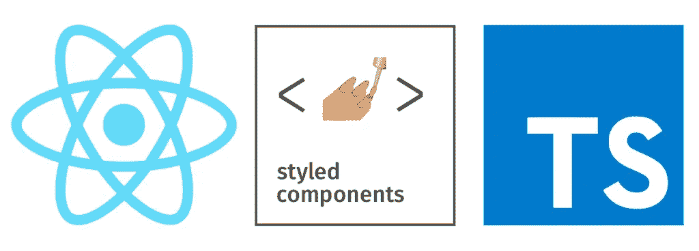
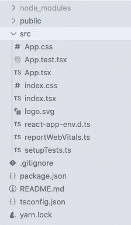

# 通过 Typescript React 使用样式化组件和道具

> 原文：<https://blog.devgenius.io/using-styled-components-and-props-with-typescript-react-a3c32a496f47?source=collection_archive---------0----------------------->



设计和构建时尚的用户界面是前端开发中的一个基本过程。快速、高性能且易于使用的样式库之一是[样式组件](https://styled-components.com/)。

Typescript 是一种构建在 javascript 基础上的令人敬畏的编程语言，尽管用 javascript 编写类似的任务可能需要很多代码，但它的优点是值得的。

# 类型检查

Typescript 是一种严格的类型化语言，就像 Java、C++、C#等，她确保你为每个变量、函数和函数参数设置一个类型。

```
let num: number = 12;
const myFunc = (name: string):string => name + 'john';
```

这是打字稿的基本规则，你可以从她的[文档](https://www.typescriptlang.org/docs/handbook/typescript-from-scratch.html)中了解更多

# 创建 React 应用

我们将首先创建一个支持 typescript 的 react 应用程序，如果您已经有了，可以跳过这一步。

打开您的终端并运行下面的命令

```
npx create-react-app my-app --template typescript# oryarn create react-app my-app --template typescript
```

这将创建一个像下面这样的基本模板



typescript 反应

接下来，通过在根目录下运行以下命令来安装样式化组件和类型定义

```
npm i styled-components @types/styled-components#oryarn add styled-components @types/styled-components
```

# 开发按钮元素

打开 App.tsx 或 App.ts 文件并导入样式化组件包

```
import styled from 'styled-components'
```

在 App 函数上方，创建一个样式化的按钮元素，并在 HTML section 标记中呈现它

```
const BUTTON = styled.button`
  border: 1px dotted yellow;
  background: white;
  color: black;
  font-weight: 500;`const App(){
return (
   <section>
  <BUTTON> First Btn </BUTTON>
  <BUTTON> Second Btn </BUTTON> </section>)}
```

# 将道具传递给组件

属性或简称为 props，用于使 UI 组件更加动态，考虑到你需要两个不同边框颜色的按钮，但是其他 CSS 属性是相同的，你可以向每个按钮传递 props，如果 props 值可用，它应该改变 CSS 属性。

*我们开始吧！*

```
... <BUTTON submit={true}> first Btn </BUTTON>
  <BUTTON pay="shopping"> Second Btn </BUTTON>...
```

在上面的代码片段中，我给了第一个按钮一个属性 *submit* ，数据类型是一个 *boolean* ，给了第二个按钮一个属性 *pay* ，数据类型是一个 *string* 。

现在，我用这两个属性在样式化按钮的顶部定义了一个接口

```
...
 interface IBtn { submit: boolean,
  pay: string}const BUTTON = styled.button`
  border: 1px dotted yellow;
  background: white;
  color: black;
  font-weight: 500;
 `
...
```

现在，您只需将这个接口传递给 styled button，这有助于 typescript 检查组件要接收的 pros 的类型

```
...
const BUTTON = styled.button<IBtn>`
...
```

*简单！对吗？*

然后，我们可以根据组件接收的属性定义 CSS 属性，而 typescript 不会抛出任何错误

```
...
const BUTTON = styled.button<IBtn>`
  border: 1px ${props => props.submit ? 'solid' : 'dotted'} yellow;
  background: white;
  color: black;
  font-weight: ${props => props.pay === "shopping" ? 'bold' : 500};
`
...
```

*恭喜你！*

您已经安全地将道具传递给样式化的组件，而没有让 typescript 对您大喊大叫。我知道你可能想知道为什么我使用一个*接口*而不是一个*类型*，你可以从这篇[文章](https://blog.logrocket.com/types-vs-interfaces-in-typescript/)中读到更多。

感谢您阅读这篇文章，您可以在 [Twitter](https://twitter.com/AI_Lift) 、 [Github](https://github.com/armstrong99) 和 [Linkedin](https://www.linkedin.com/in/ndukwearmstrong/) 上关注我，祝您愉快。