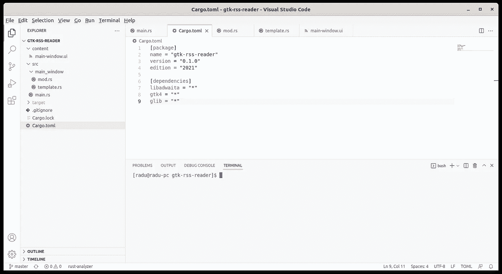
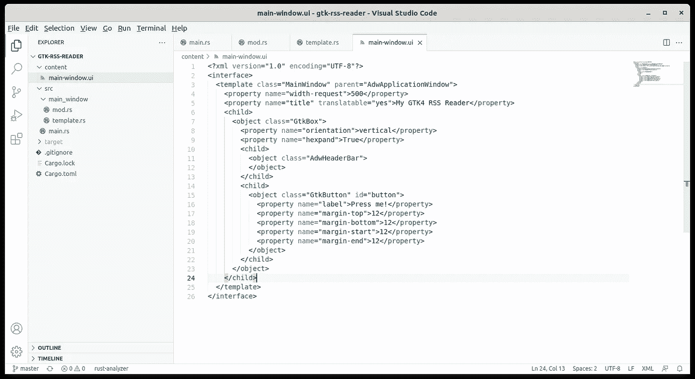
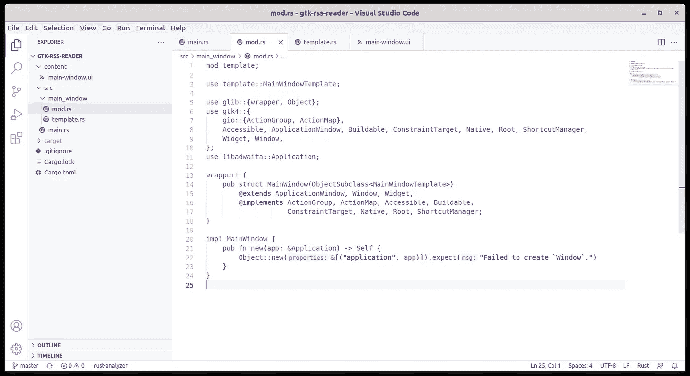
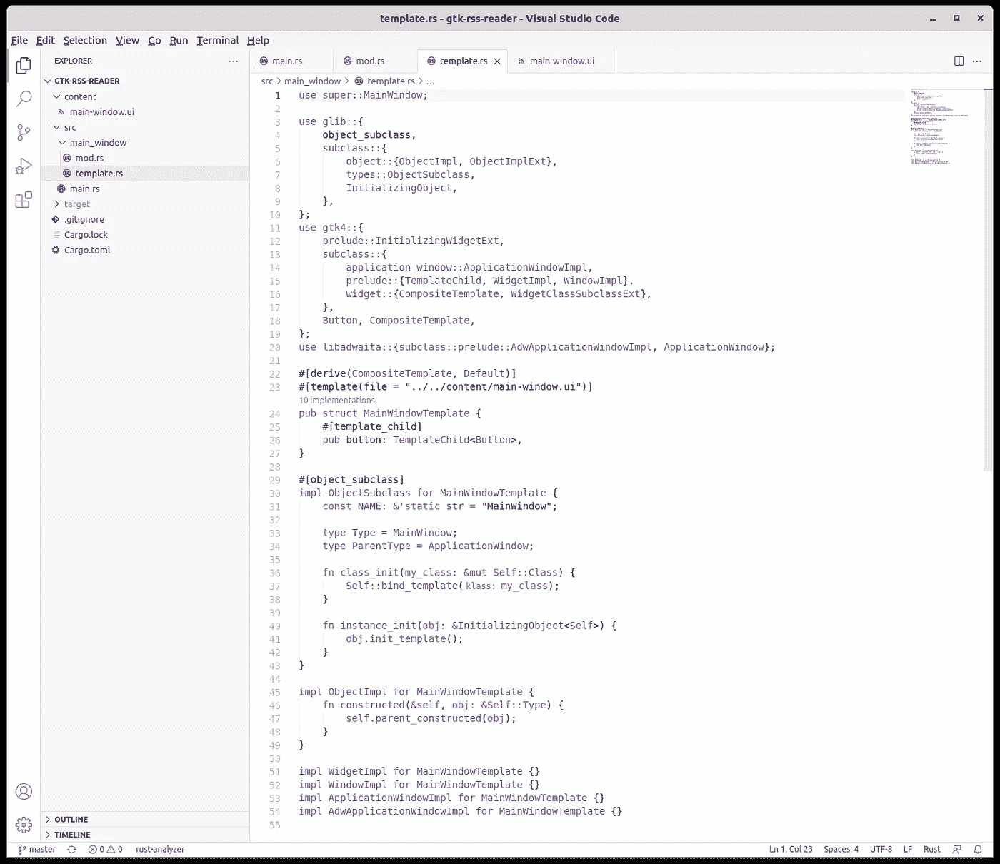
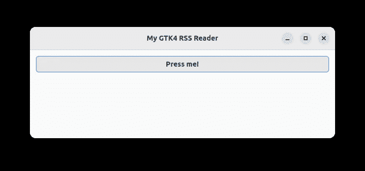

# 在 Rust 中为 GTK4 libadwaita UI 使用模板文件

> 原文：<https://blog.devgenius.io/using-template-files-in-rust-for-a-gtk4-libadwaita-ui-8322694cbc3c?source=collection_archive---------2----------------------->


由 [Kelly Sikkema](https://unsplash.com/@kellysikkema?utm_source=medium&utm_medium=referral) 在 [Unsplash](https://unsplash.com?utm_source=medium&utm_medium=referral) 上拍摄的照片

上次我们开始[为 Rust GTK4 应用程序创建环境，该应用程序将成为 RSS 阅读器。因为我们处理了初始设置，所以 UI 只是使用代码创建的，只是为了查看它的构建和运行。当然，这种策略是不可持续的，因为它创建了大量的代码，并且创建了非常难以阅读和更改的界面。GTK 世界的解决方案是 UI 模板文件。让我们看看它是如何工作的。](https://raduzaharia.medium.com/initial-setup-for-a-gtk4-app-with-libadwaita-in-rust-using-vscode-b6f8c127a75e)

首先，你可以在 [github](https://github.com/raduzaharia-medium/gtk-rss-reader-templates) 上找到这篇文章的代码。我们将改进之前的代码，您可以在这里找到。虽然可以将代码放在一个可以简单克隆的公共 git 存储库中，但是我建议您在阅读本文时自己编写代码，尤其是如果您有一些 Rust 知识的话。

## 更新后的 Cargo.toml 和 main.rs



Cargo.toml 文件中的新依赖项

首先，我们将使用更多的 GTK4 特性，所以我们需要在我们的`Cargo.toml`文件中添加更多的依赖项:

```
[dependencies]
libadwaita = "*"
gtk4 = "*"
glib = "*"
```

从截图中，您已经可以看到一个新的文件夹结构。你可以看到带有`main-window.ui`的`content`文件夹。这将是我们的应用程序 UI 描述，接下来我们将看到它的样子。还有一个新的`main_window`文件夹存放我们的窗口代码。接下来我们会看到这一切，但首先，让我们看看`main.rs`现在是什么样子:

```
mod main_window;
use main_window::MainWindow;use gtk4::{
    prelude::{ApplicationExt, ApplicationExtManual},
    traits::WidgetExt,
};
use libadwaita::Application;fn build_ui(application: &Application) {
    let window = MainWindow::new(application);
    window.show();
}pub fn main() {
    let application = Application::builder()
        .application_id("com.example.gtk-rss-reader")
        .build(); application.connect_activate(build_ui);
    application.run();
}
```

首先，我们在这里再也看不到任何 UI 代码。`build_ui`函数只是实例化了`MainWindow`结构，并将其显示在屏幕上。对于`Application`设置，我们也使用构建器模式，而不是旧的模式:

```
pub fn main() {
    let application = Application::new(
        Some("com.example.gtk-rss-reader"), Default::default());     application.connect_activate(build_ui); 
    application.run();
}
```

## 主窗口 UI 模板



用户界面已被移动到 XML 文件中

现在我们来看看大的变化。首先是`main-window.ui`。使用模板文件进行 UI 定义的目的是获得 UI 的单一描述，而不是一组命令。这样，描述更容易阅读、更改和跟踪。`.ui`文件使用的语言只是一组嵌套的对象和属性。我们将`MainWindow`定义为`AdwApplicationWindow`的后代，并添加一个带有`AdwHeaderBar`和`GtkButton`的`GtkBox`孩子。除了按钮之外，所有这些都是我们之前在代码中所做的:

```
let content = libadwaita::gtk::Box::new(Orientation::Vertical, 0);content.append(&HeaderBar::builder()                                     
    .title_widget(&WindowTitle::new("My GTK4 RSS Reader", ""))                                     
    .build());
```

现在，当您查看上面的代码片段并将其与闪亮的新 XML 进行比较时，您可能会认为用代码编写整个 UI 可能更容易。这当然是少写。但是我们需要记住的是，UI 现在什么都不做，看起来也不怎么样。随着我们不断添加 UI 组件，代码的复杂性将很快压倒冗长的 XML 描述。更不用说 XML diff 和代码 diff 之间更容易的版本跟踪了。

## 窗口用户界面代码



主窗口结构

我们有了模板，太好了。但是正如我们在`main.rs`文件中看到的，我们想要实例化一个`MainWindow`结构，因为你不能实例化 XML。为此，我们将创建一个名为`main_window`的新 Rust 模块，我们在`main.rs`中引用它，如下所示:

```
mod main_window;
use main_window::MainWindow;
```

Rust 模块由`src`文件夹中的`main_window`文件夹和`main_window`文件夹中的`mod.rs`文件组成。这是我们需要遵守的惯例。`MainWindow`模块描述了结构的依赖树:

```
wrapper! {
    pub struct MainWindow(ObjectSubclass<MainWindowTemplate>) 
        @extends ApplicationWindow, Window, Widget,
        @implements ActionGroup, ActionMap, Accessible, Buildable,
            ConstraintTarget, Native, Root, ShortcutManager;
}
```

上面的语法不是典型的 Rust 语法。Rust 没有用于结构的`extends`和`implements`。在`glib`中定义的`wrapper!`宏允许我们说我们的`MainWindow`结构继承自`ApplicationWindow`等等，并实现某些接口。还是那句话，Rust 没有这些概念。锈有结构和特性。这里所发生的是我们使用一个`glib`宏来简化 GTK 窗口小部件和窗口的定义。

我们还为我们的`MainWindow`添加了一个构造函数:

```
impl MainWindow {
    pub fn new(app: &Application) -> Self { 
        Object::new(&[("application", app)])
            .expect("Failed to create `Window`.") 
    }
}
```

该构造函数在`build_ui`函数的`main.rs`中使用，并简单地创建了`MainWindow`。但是模板如何链接到`MainWindow`结构呢？`main-window.ui`叫什么？

再次注意到`wrapper!`呼叫。`MainWindow`定义包含另一点可疑的语法:`(ObjectSubclass<MainWindowTemplate>)`。再说一次，这不是正常的生锈。该括号由`wrapper!`宏启用。他们指示 Rust 构建考虑到`MainWindowTemplate`的`MainWindow`结构。

## 模板代码



将模板链接到主窗口的代码

抱歉巨大的截图。正如我所说的代码也可以在 [github](https://github.com/raduzaharia-medium/gtk-rss-reader-templates) 上找到，但是我想把它作为截图放在这里，这样你就可以知道它应该是什么样子了。它的每一点都很重要，如果你弄乱了这个文件中的任何东西，不管有多小，这个项目都不会编译或者运行。尤其是`use`声明是交易破坏者。

首先，一切开始的`MainWindowTemplate`定义:

```
#[derive(CompositeTemplate, Default)]
#[template(file = "../../content/main-window.ui")]
pub struct MainWindowTemplate {
    #[template_child]
    pub button: TemplateChild<Button>,
}
```

`MainWindowTemplate`来源于`CompositeTemplate`,后者需要某些实现，我们稍后会看到。但是看看`#[template]`的定义。这里是我们最后指定用于窗口的模板的地方。它是一个位于根文件夹中的文件，在`content`子文件夹中，名为`main-window.ui`。这个结构包含什么？定义我们想要使用的`main-window.ui` XML 的哪些部分。在这种情况下，按钮。通过这种方式，我们可以将监听器连接到它，这样我们就可以检测到点击。但这一切都在后面的文章里。

`CompositeTemplate`要求`ObjectSubclass`实现:

```
#[object_subclass]
impl ObjectSubclass for MainWindowTemplate {
    const NAME: &'static str = "MainWindow";

    type Type = MainWindow;
    type ParentType = ApplicationWindow; fn class_init(my_class: &mut Self::Class) {
        Self::bind_template(my_class);
    } fn instance_init(obj: &InitializingObject<Self>) {
        obj.init_template();
    }
}
```

这是一个相当通用的实现，你可以从`main-window.ui`的模板中清除一些细节。`NAME`常数来自该行的`class`:

```
<template class="MainWindow" parent="AdwApplicationWindow">
```

`ParentType`是来自上述同一行的`parent`,但请注意不同之处。在 Rust 代码中，结构名是`ApplicationWindow`，在 XML 中是`AdwApplicationWindow`。如果我们不用`libadwaita`而是直接用 GTK4，我们会写`GtkApplicationWindow`。`Type`是我们之前定义的`MainWindow`结构。

接下来的两个方法是通用的。它们只是初始化模板绑定，如果你不这样做，你会得到一个空窗口。

`CompositeTemplate`还要求通用`ObjectImpl`实现:

```
impl ObjectImpl for MainWindowTemplate {
    fn constructed(&self, obj: &Self::Type) {
        self.parent_constructed(obj);
    }
}
```

当我们有按钮事件处理程序和其他功能代码的时候，我们会在这里写更多，但是现在上面已经足够了。然后是几个更空的实现，再次感谢`CompositeTemplate`:

```
impl WidgetImpl for MainWindowTemplate {}
impl WindowImpl for MainWindowTemplate {}
impl ApplicationWindowImpl for MainWindowTemplate {}
impl AdwApplicationWindowImpl for MainWindowTemplate {}
```

就是这样。构建并运行:

```
#cargo build
#cargo run
```

请注意漂亮的空应用程序窗口:



几乎空无一人的 GTK4 libadwaita 窗口

暂时就这样了。[下次](/bundling-templates-into-resources-in-rust-for-the-gtk4-ui-eb387a7918bf)我们将学习如何将窗口资源与构建的可执行文件捆绑在一起。现在，模板作为一个简单的文件从文件系统中读取。如果你复制应用程序的可执行文件，你将不得不把模板带到任何地方，放在代码期望它所在的同一个文件夹中。不是理想的情况。但是下一次我们将看到 GTK 如何在应用程序可执行文件中提供对捆绑这些模板的支持，以便轻松地分发它们。

一如既往，如果您有任何问题，请在评论区提问。下次见！