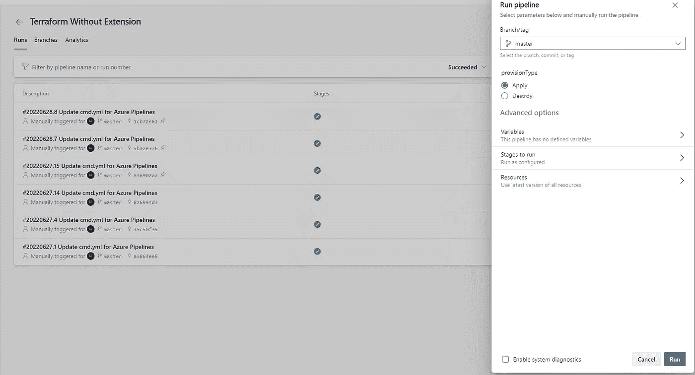

# 在 Azure DevOps 中使用 Terraform，不带扩展

> 原文：<https://blog.devgenius.io/using-terraform-in-azure-devops-without-extensions-a2a5f869aee7?source=collection_archive---------3----------------------->

在本文中，我将演示如何在 Azure DevOps 管道中执行 terraform 操作，而不使用任何 terraform 扩展。

**先决条件:**

1.  您有一个带有 Terraform 代码的 Azure DevOps 项目用于扫描
2.  创建一个变量组来存储秘密，例如 mygroup


**步骤:**

通常，您需要向您的 YAML 管道文件添加 3 个任务，一个安装 terraform，另一个初始化 terraform 配置，最后一个任务是计划和应用配置。附加任务将用于根据参数选择破坏配置。

1.  声明参数和变量

```
parameters:
  - name: provisionType
    type: string
    default: Apply
    values:
      - Apply
      - Destroyvariables:
  - group: mygroup
```

2.安装 Terraform

*注意:如果代理中已经安装了 terraform，则可以跳过该步骤。*

```
- task: Bash@3
    displayName: Install Terraform
    inputs:
      targetType: 'inline'
      script: |
          wget -qO - terraform.gpg [https://apt.releases.hashicorp.com/gpg](https://apt.releases.hashicorp.com/gpg) | sudo gpg --dearmor -o /usr/share/keyrings/terraform-archive-keyring.gpg
          sudo echo "deb [arch=$(dpkg --print-architecture) signed-by=/usr/share/keyrings/terraform-archive-keyring.gpg] [https://apt.releases.hashicorp.com](https://apt.releases.hashicorp.com) $(lsb_release -cs) main" > /etc/apt/sources.list.d/terraform.list
          sudo apt update
          sudo apt install terraform
          terraform --version
```

3.Terraform Init

```
- bash: |
        set -eux  # fail on error
        az login --service-principal -u $ARM_CLIENT_ID -p $ARM_CLIENT_SECRET --tenant $ARM_TENANT_ID
        subscriptionId=$(az account show --query id -o tsv)
        terraform init \
          -backend-config=storage_account_name=$(TerraformBackendStorageAccount) \
          -backend-config=container_name=$(TerraformBackendStorageContainer) \
          -backend-config=key=dev.tfstate \
          -backend-config=resource_group_name=$(TerraformBackendResourceGroup) \
          -backend-config=subscription_id="$ARM_SUBSCRIPTION_ID" \
          -backend-config=tenant_id="$ARM_TENANT_ID" \
          -backend-config=client_id="$ARM_CLIENT_ID" \
          -backend-config=client_secret="$ARM_CLIENT_SECRET" 
    displayName: 'Terraform Init'
    workingDirectory: $(System.DefaultWorkingDirectory)/TF
    env:
      ARM_CLIENT_ID: $(servicePrincipalId)
      ARM_CLIENT_SECRET: $(servicePrincipalKey)
      ARM_TENANT_ID: $(tenantId)
      ARM_SUBSCRIPTION_ID: $(subscriptionId)
```

4.地形规划和应用

```
- bash: |
      az login --service-principal -u $ARM_CLIENT_ID -p $ARM_CLIENT_SECRET --tenant $ARM_TENANT_ID
      terraform plan -out=plan.tfplan -input=false
      terraform apply -input=false -auto-approve plan.tfplan
    displayName: 'Terraform ${{ parameters.provisionType }}'
    condition: eq('${{ parameters.provisionType }}', 'Apply')
    workingDirectory: $(System.DefaultWorkingDirectory)/TF
    env:
      ARM_CLIENT_ID: $(servicePrincipalId)
      ARM_CLIENT_SECRET: $(servicePrincipalKey)
      ARM_TENANT_ID: $(tenantId)
      ARM_SUBSCRIPTION_ID: $(subscriptionId)
```

5.地形破坏

```
- bash: |
      az login --service-principal -u $ARM_CLIENT_ID -p $ARM_CLIENT_SECRET --tenant $ARM_TENANT_ID
      terraform destroy -input=false -auto-approve 
    displayName: 'Terraform ${{ parameters.provisionType }}'
    condition: eq('${{ parameters.provisionType }}', 'Destroy')
    workingDirectory: $(System.DefaultWorkingDirectory)/TF
    env:
      ARM_CLIENT_ID: $(servicePrincipalId)
      ARM_CLIENT_SECRET: $(servicePrincipalKey)
      ARM_TENANT_ID: $(tenantId)
      ARM_SUBSCRIPTION_ID: $(subscriptionId)
```

## 完整管道 yaml

```
trigger: nonepool:
  vmImage: ubuntu-latest
parameters:
  - name: provisionType
    type: string
    default: Apply
    values:
      - Apply
      - Destroyvariables:
  - group: mygroupsteps:
  - task: Bash@3
    inputs:
      targetType: 'inline'
      script: |
          wget -qO - terraform.gpg [https://apt.releases.hashicorp.com/gpg](https://apt.releases.hashicorp.com/gpg) | sudo gpg --dearmor -o /usr/share/keyrings/terraform-archive-keyring.gpg
          sudo echo "deb [arch=$(dpkg --print-architecture) signed-by=/usr/share/keyrings/terraform-archive-keyring.gpg] [https://apt.releases.hashicorp.com](https://apt.releases.hashicorp.com) $(lsb_release -cs) main" > /etc/apt/sources.list.d/terraform.list
          sudo apt update
          sudo apt install terraform
          terraform --version
    displayName: Install Terraform
  - bash: |
        set -eux  # fail on error
        az login --service-principal -u $ARM_CLIENT_ID -p $ARM_CLIENT_SECRET --tenant $ARM_TENANT_ID
        subscriptionId=$(az account show --query id -o tsv)
        terraform init \
          -backend-config=storage_account_name=$(TerraformBackendStorageAccount) \
          -backend-config=container_name=$(TerraformBackendStorageContainer) \
          -backend-config=key=dev.tfstate \
          -backend-config=resource_group_name=$(TerraformBackendResourceGroup) \
          -backend-config=subscription_id="$ARM_SUBSCRIPTION_ID" \
          -backend-config=tenant_id="$ARM_TENANT_ID" \
          -backend-config=client_id="$ARM_CLIENT_ID" \
          -backend-config=client_secret="$ARM_CLIENT_SECRET" 
    displayName: 'Terraform Init'
    workingDirectory: $(System.DefaultWorkingDirectory)/TF
    enabled: true
    env:
      ARM_CLIENT_ID: $(servicePrincipalId)
      ARM_CLIENT_SECRET: $(servicePrincipalKey)
      ARM_TENANT_ID: $(tenantId)
      ARM_SUBSCRIPTION_ID: $(subscriptionId)

  - bash: |
      az login --service-principal -u $ARM_CLIENT_ID -p $ARM_CLIENT_SECRET --tenant $ARM_TENANT_ID
      terraform plan -out=plan.tfplan -input=false
      terraform apply -input=false -auto-approve plan.tfplan
    displayName: 'Terraform ${{ parameters.provisionType }}'
    condition: eq('${{ parameters.provisionType }}', 'Apply')
    workingDirectory: $(System.DefaultWorkingDirectory)/TF
    env:
      ARM_CLIENT_ID: $(servicePrincipalId)
      ARM_CLIENT_SECRET: $(servicePrincipalKey)
      ARM_TENANT_ID: $(tenantId)
      ARM_SUBSCRIPTION_ID: $(subscriptionId)
  - bash: |
      az login --service-principal -u $ARM_CLIENT_ID -p $ARM_CLIENT_SECRET --tenant $ARM_TENANT_ID
      terraform destroy -input=false -auto-approve 
    displayName: 'Terraform ${{ parameters.provisionType }}'
    condition: eq('${{ parameters.provisionType }}', 'Destroy')
    workingDirectory: $(System.DefaultWorkingDirectory)/TF
    env:
      ARM_CLIENT_ID: $(servicePrincipalId)
      ARM_CLIENT_SECRET: $(servicePrincipalKey)
      ARM_TENANT_ID: $(tenantId)
      ARM_SUBSCRIPTION_ID: $(subscriptionId)
```

## 运行管道以应用/销毁



管道

我希望你喜欢阅读这篇文章，随意添加你的评论、想法或反馈，不要忘记在 [linkedin](https://www.linkedin.com/in/babulaparida/) 上联系。