# 使用命令行和 Shell 脚本

> 原文：<https://blog.devgenius.io/using-the-command-line-and-shell-scripting-1f0e84d76a8e?source=collection_archive---------8----------------------->

无论你是 Mac、Windows 还是 Linux 用户，了解如何使用命令行都会对你的日常编码体验有所帮助。

照片由[穆罕默德·M](https://unsplash.com/@mohamed_m?utm_source=medium&utm_medium=referral)在 [Unsplash](https://unsplash.com?utm_source=medium&utm_medium=referral) 上拍摄

命令行界面(CLI)使您能够运行命令或脚本，从而帮助您与系统进行交互。这些命令(或命令行实用程序)大多以二进制文件的形式位于您的系统中，因此无需任何安装即可使用。命令行界面(在 Windows 中也称为命令提示符)不太像图形界面，它允许您在目录(目录指文件夹)之间轻松导航。

命令行实用程序用于导航、搜索、打开和列出文件等。在本文的末尾，您将了解到 shell 脚本，并且我们将使用 Bash 创建一个游戏。所以让我们开始吧。

**1。** `**mkdir**`(制作目录):在当前目录下制作一个新的目录。

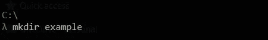

创建名为 example 的目录

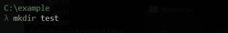

在示例目录中创建新目录

**2。** `**cd**`(更改目录):用于将当前目录更改为另一个目录。您可以通过在每个目录后添加正斜杠`/`来指定多个目录。你也可以用`cd ..`上移一级，用`cd -`移到上一级目录。

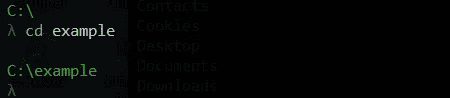

将当前目录更改为另一个调用的示例

**3。** `**pwd**`(打印工作目录):用于查看您当前的工作目录。

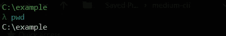

**4。** `**touch**`:用于在当前目录下新建文件，也可以修改文件时间戳。

`touch -m <filename>` —将文件的时间戳修改为当前日期

`touch <filename>` —创建新文件

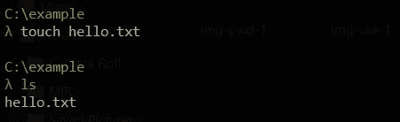

创建名为 hello.txt 的新文件

**5。** `**cat**` (Concatenate):用于将文件内容打印到命令行屏幕。它还用于在新文件或现有文件中追加文件内容。

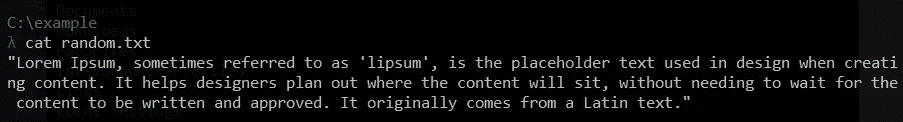

这里，cat 命令用于打印 random.txt 中的文本

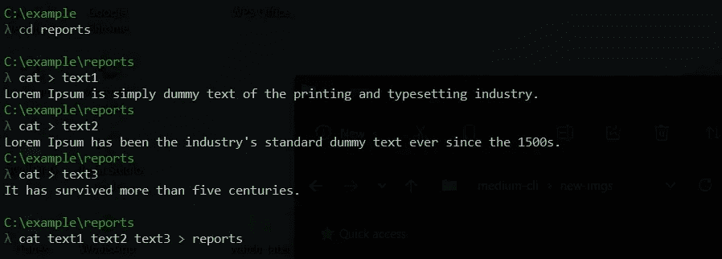

这里，cat 命令用于创建三个文件(text1、text2 和 text3)并将其附加到一个新文件(reports)中

**6。** `**ls**`(列表):用于列出指定目录下的所有内容。除非指定了目录，否则通常会列出当前文件夹中的所有文件和目录。

示例目录中列出的唯一文件是我们用 touch 命令创建的文件

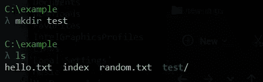

在这里，多个文件和一个目录被列在同一个目录中

`ls`也可以与独特的选项或标签一起使用，它们包括；

*   `-l`:表示长列表格式。它给出了目录中内容的更多信息，无论是；文件或目录、可写或只读生命等等。
*   `-a`:这是全部的意思。也就是说，还包括隐藏文件。请注意，隐藏文件以点(.).
*   `-h`:这意味着人类可读的格式，通常与-l 一起使用。它打印文件的大小。比如`ls -lah`。
*   `-r`:这意味着保留顺序排序。
*   `-t`:表示按修改时间排序。比如`ls -trh`。

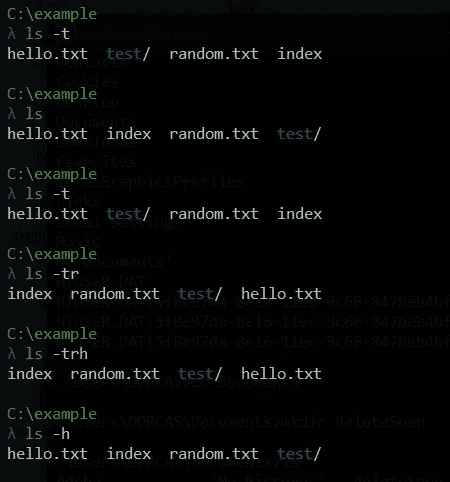

玩弄 ls 及其选项

**7。** `**echo**`:这更像是打印语法。它用于将字符打印到屏幕上。这也用于在文件中添加单词。

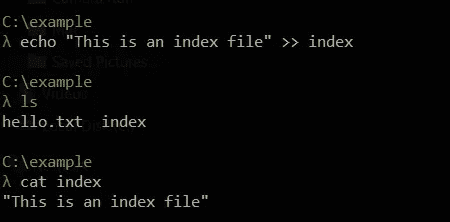

这里，echo 命令用于将单词添加到名为 index 的文件中，我们可以使用 cat 命令查看文件的内容

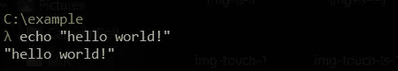

echo 用于将单词打印到命令行屏幕上

**8。** `**less**`:当你想在命令行查看一个大的文本文件时，使用这个命令。使用格式`less [filename]`，箭头键移动，键入`q`退出。

9。 `**rm**`(删除):用于删除当前目录或指定目录下的指定文件。要删除一个目录，添加选项`-r`，这将删除该目录，即使它不是空的。

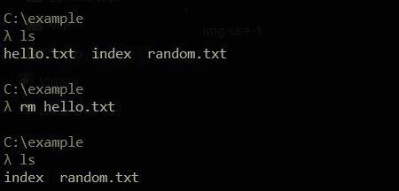

这里的 rm 命令用于删除文件 hello.txt

10。 `**rmdir**`(删除目录):删除指定的空目录。

注意:使用`rm`和`rmdir`时要小心，因为你不能恢复用这些命令删除的文件或目录。

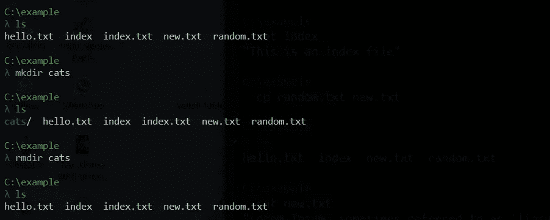

用 *rmdir* 命令创建并删除了一个名为 cat 的目录

**11。** `**cp**`(复制):该命令用于将一个文件的上下文复制到另一个文件或复制一个文件。当复制到现有文件时，它会将以前的文本覆盖到新文件中。

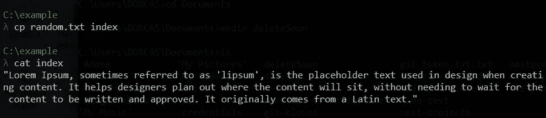

这里，cp 命令用于复制 random.txt

12。 `**mv**`(移动):用于将一个文件的内容剪切到另一个文件中。它也可以用来重命名文件。

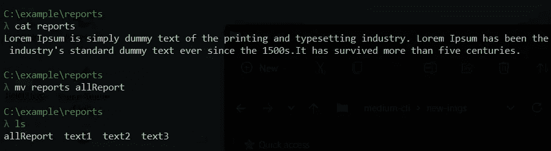

使用 mv 命令将文件从 reports 重命名为 AllReport

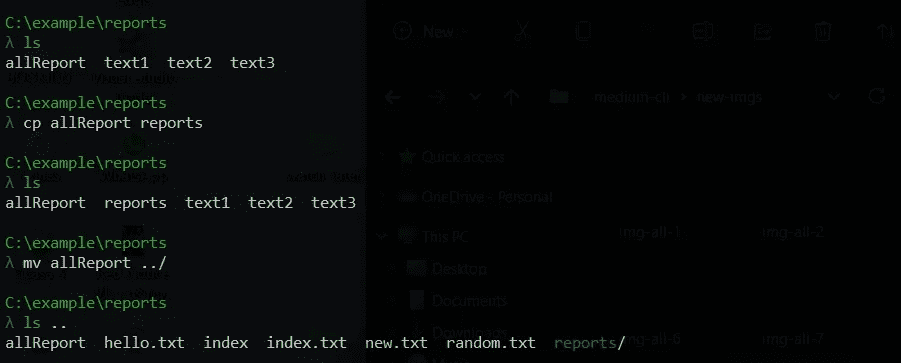

AllReport 通过 mv 命令提升了一个级别

13。 `**wc**`(字数统计):使用此命令统计文件中的行数、字数或字符数。使用`-w`指定字数。

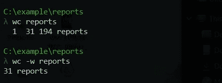

该文件包含 1 行，31 个字和 194 份报告

14。 `**grep**`(全局正则表达式打印):用于搜索指定文件中的字符串。使用 grep 如下:`grep [options] [string] [specified file]`。

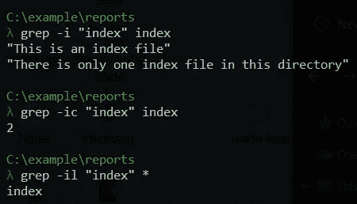

单词 index 包含在索引文件中，在该文件中出现了两次。

15。 `**which**`:此命令指向应用程序、命令或二进制文件在系统中的位置。

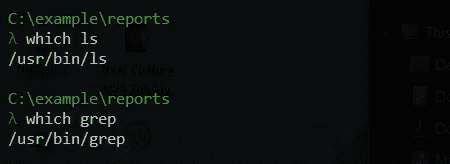

16。 `**history**`:这不是命令而是你的 shell 内置的关键字。它给出了您在终端会话期间运行的所有命令的列表。要搜索特定命令，请将`grep`命令与`history`一起使用。比如`history | grep ls`。

17。 `**alias**`:用于将一段代码替换为您所指的长度。它是命令的快捷方式。您可以通过键入命令`alias`来检查您的所有别名。使用格式为`alias [option] [name] = “[value]”`的别名。

18。 `**chmod**` **(** 改变模式 **)** :该命令用于改变文件模式为读`-r`、写`-w`或可执行`-x`。它主要用于使文件可执行。

**19。** `**ping**` **(** 数据包上网探测器 **)** :该命令用于手动测试网络连接。比如`pink [www.google.com](http://www.google.com)`。

20。 `**tail**`:该命令用于在命令终端打印一个文本文件的最后十行。使用`-n`指定行数，例如`tail -n 4 [filename]`。

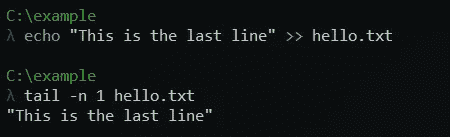

**21:** `**head**`:这是一个命令行实用程序，用于在命令界面打印文本文件的前十行。您可以使用`-n` 指定行数。例如`head -n 4 [filename]`。

**22:** `**whoami**`:这是我是谁的简称，打印与系统关联的用户名。

**23:** `**unzip**`:这是一个命令行实用程序，用于解压缩压缩文件。要获得有关如何使用该命令的更多信息，请在终端中键入`unzip`并按回车键。

# 外壳脚本

shell 是一个解释器，它允许你连接到内核来执行你的程序。内核是操作系统的重要组成部分。它是一种低级语言，有助于软件和硬件组件之间的交互。

Shell 脚本是包含由命令行解释程序执行的程序的文件。它们通常用于与系统相关的操作。Bash 是 shell 的一种，又称为 Bourne shell。

对于本教程，我们将创建一个允许您登录并玩猜谜游戏的脚本。您可以使用自己选择的任何其他编辑器。

首先，创建一个目录，然后将当前目录更改为刚刚创建的目录，并创建一个名为 *game.sh* 的文件。

编码后，用`chmod`命令使文件成为可执行文件，用`bash game.sh`运行脚本

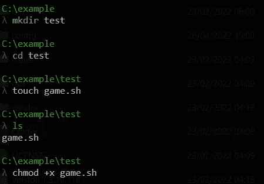

用 bash 创建猜谜游戏的分步指南

在脚本的开头，添加 shebang(尖锐的感叹)。这意味着脚本应该在 bash 中运行。语法`read`用于 bash 中的标准输入，`read -p`允许在标准输入中使用占位符，`read -sp`允许使用占位符和无声类型的密码输入。然后接下来是 *if 子句*来验证用户名和密码是否都包含字符串 *admin* ，否则，过程退出。如果这个通过了，那么我们通过定义三个变量来开始这个游戏；`guess`、`count`和`answer`然后用*循环*读入猜测输入，检查是否等于系统猜测`(answer)`。

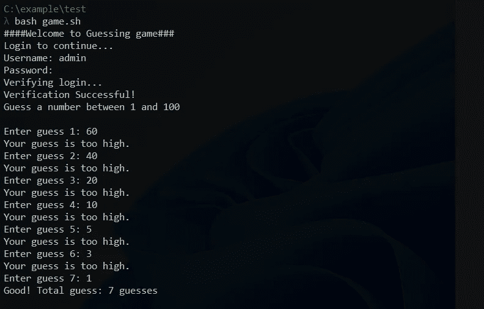

game.sh 的结果

我希望你学到了一些东西。如果您在命令中遇到任何困难，只需键入命令，后跟(双连字符和字符串' help') `— help`来检查该命令的用例。比如`cp — help`。记得练习来提高你的编码体验。

请跟我来，留下掌声。

上帝保佑！

# 参考

Linux 外壳和命令—[https://www.cs.dartmouth.edu/~campbell/cs50/shell.html](https://www.cs.dartmouth.edu/~campbell/cs50/shell.html)

外壳脚本的使用—[https://www.educba.com/uses-of-shell-scripting/](https://www.educba.com/uses-of-shell-scripting/)