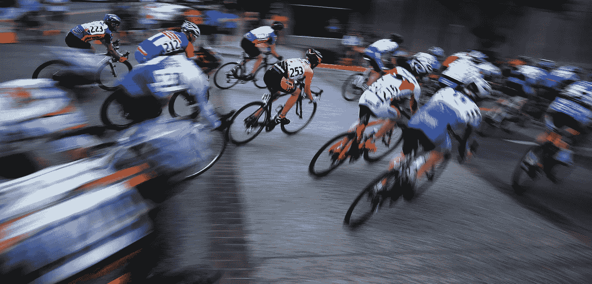
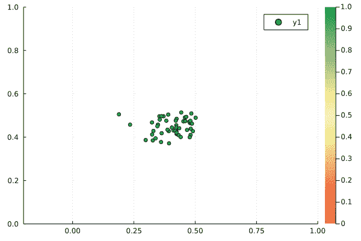

# 使用 Julia 语言模拟自行车比赛中的 peloton

> 原文：<https://blog.devgenius.io/using-the-julia-language-to-simulate-a-peloton-in-a-bicycle-race-5f011ef1d678?source=collection_archive---------11----------------------->

# **简介**

在我的[上一篇关于培养基的文章](https://medium.com/@paul.petersik/a-simple-cellular-automaton-of-plant-epidemics-in-julia-29ac62d87516)中，我展示了如何使用细胞自动机来模拟植物疾病的空间疾病动态。在我下一个对 Julia 语言的小探索中，我想建立一个完全不同的模型。由于我是一个赛车迷，我的目标是建立一个 peloton 模型。

在公路自行车比赛中，最大的车手群体是所谓的 peloton。骑自行车的人成群结队是公路赛的一个非常典型的特征。这是因为骑自行车的人在别人的滑流中骑行时可以节省相当多的能量。征兵效应导致了复杂的战术和游戏理论行为。例如，团队通常会尽可能长时间地保护他们的队长免受逆风的影响，以增加队长赢得比赛的可能性。此外，在脱离群体中，骑手通常合作良好，只要远离终点线，就会在群体中轮换位置。然而，他们越是接近终点，就越是努力为最后的冲刺保存双腿。因此，分裂中的一些骑手变成了叛逃者，群体内的合作迅速瓦解。

在自行车比赛中可以观察到的另一个有趣的现象是所谓的“洗衣机”效应。当许多车手想在比赛的最后阶段到达 peloton 的前面时，它就会出现。由于前面的空间有限，向前挤压的骑手必须将其他人向后推。通常，骑手从外侧开始向前移动，然后通过 peloton 的中心向后移动。因此，peloton 中的骑手可以像“洗衣机”中的衣服一样旋转。

# 理论

因此，让我们尝试使用基于代理的模型来建模一个 peloton。像往常一样，有人已经解决了这个问题。例如，你可以在 [GitHub](https://erickmartins.github.io/files/moped_new.pdf) 上找到一篇关于 Erick Ratamero 的很酷的文章。我从 Erick 的模型中获得了很多灵感。然而，我用一种更抽象和非维度的方式来表述这些概念。

## 群集算法

在自然界中，各种各样的物种都表现出群集行为，也就是说，椋鸟在夏末和秋季形成大群，然后迁徙到它们的冬季栖息地。由于一个 peloton 与一群鸟有一些相似之处，我使用了一种改进的群集算法来模拟代理的移动。有趣的是，只有三条规则代理人必须遵守，这样群集行为才会出现:

*   **凝聚力**:对群体平均位置的吸引
*   **分离**:来自邻近代理的排斥
*   **对准**:向平均移动方向调整移动方向

对于 peloton 模型，我们可以省略*对准*规则，因为我们将在直线道路上模拟 peloton，而道路规定了运动的方向。在典型的群集模型中，计算分离的代理的邻域包括位于该代理周围一定距离内的所有其他代理。为了使 peloton 模型更真实一点，并模拟人类视觉，只有代理前面的邻居被考虑用于分离。

此外，为了简化模型，仅对相对于 peloton 平均速度的药剂速度进行建模。因此，参照系以质子的平均速度运动。这将使以后更容易生成漂亮的动画。

## 高能成分

如上所述，peloton 的前跑者比隐藏在滑流中的骑行者消耗更多的能量。然而，过了一会儿，他们筋疲力尽，需要回到珀洛东，在那里他们可以从努力中慢慢恢复过来。

这里，通过引入一个*能量*变量来模拟这种行为。只要一个代理人在其他代理人的滑流中运动，它的值就增加到某个最大值，但是如果代理人面临逆风，它的值就下降得相当快。然后，如果一个代理人的能量下降到某个值以下，代理人开始向后移动到 peloton。

# 在 Julia 中实现

为了建立模型，使用了两个`struct`,一个用于代理，另一个用于模型本身。此外，我使用外部构造函数用标准设置初始化模型，这将产生良好的动态效果。

一个代理的群集行为是通过在所有其他代理上循环，计算到其他代理的方向和距离，并使用这些变量来计算内聚和分离来计算的。注意，这种群集算法的实现紧密遵循 Agents.jl 库的*群集*示例，您可以在这里找到[。](https://juliadynamics.github.io/Agents.jl/stable/examples/flock/)

为了计算一个代理的能量使用，我们需要再次循环所有代理，并计算到其他代理的方向和距离。一个代理离它前面的其他代理越近，它的能量使用就越小。能量使用甚至可以变成负值，这意味着代理可以在一定程度上恢复。

最后，将群集算法和模型的能量分量结合在一个阶跃函数中。此外，还引入了随机运动和偏置项。偏向项将把代理推向道路中心以及它期望的等级。

代理的期望等级在循环结束时被更新(第 34 行)。`update_desired_rank!` 函数(第 1–9 行)模拟了耗尽的代理不能停留在 peloton 前面，开始向后移动并被向前挤压的其他代理取代的行为。

现在，我们将使用散点图上的一个循环来绘制该模型的动力学，在散点图上，我们根据代理的能量来给标记着色。

# 结果

最后，我们可以生成一个漂亮的动画！对我来说，从上面看这已经很像一个 peloton 了。

我知道，自行车比赛不仅仅是我上面实施的这些简单规则，你可以疯狂地实施例如游戏理论组件、面向上坡/下坡的道路或遵循自己团队策略的团队。然而，我猜这是另一篇博文😉。

我希望你喜欢这篇小博文。你可以在这里找到 peloton 模型[的完整代码。](https://gist.github.com/pjpetersik/8821b0fe2279c05ce10f29b982d030f4)