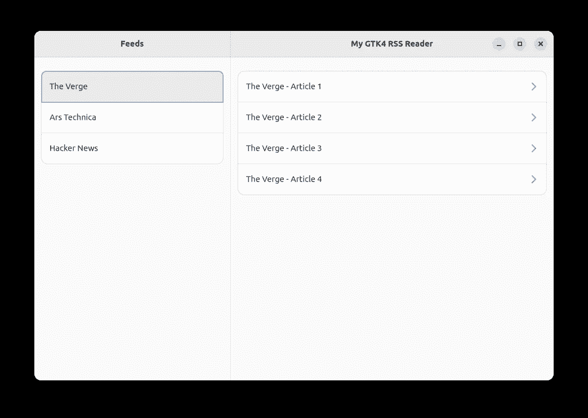

# 在 Rust 中使用 libadwaita 传单小部件来响应 GTK4 用户界面

> 原文：<https://blog.devgenius.io/using-the-libadwaita-leaflet-widget-for-a-responsive-gtk4-ui-in-rust-73bbc2f4025?source=collection_archive---------1----------------------->


卢克·波特在 [Unsplash](https://unsplash.com?utm_source=medium&utm_medium=referral) 上拍摄的照片

我们正在使用 libadwaita 和 Rust 创建一个 GTK4 RSS 阅读器，使用 VSCode 编写所有内容。上次我们学习了如何使用[模板](/using-template-files-in-rust-for-a-gtk4-libadwaita-ui-8322694cbc3c)，然后我们使用[资源](/bundling-templates-into-resources-in-rust-for-the-gtk4-ui-eb387a7918bf)将所有东西捆绑在最终的可执行文件中。这一切都很好，只是缺少了一点:我们实际上从来没有为我们的 RSS 阅读器编写 UI。我们所做的一切都是在一个空的窗口上。这篇文章将改变这种情况，因为今天我们将最终构建我们的应用程序的 UI。

这也可能是引入一个小免责声明的最佳时机:这只是一个教程。是的，我们将阅读实际的 RSS 文件。是的，我们将把我们的按钮和小部件链接到实际代码。但是，这个应用程序不会是一个日常可用的 RSS 阅读器的完美的最终版本。我们将使用预定义的 RSS 源，我们不会标记阅读的文章。这只是一个教程，帮助你站稳脚跟，用 Rust 编写现代的 GTK4 应用程序。一如既往，代码可在 [github](https://github.com/raduzaharia-medium/gtk-rss-reader-mock-ui) 上获得。

## 应用程序窗口



应用程序窗口的初始外观

上面的截图是我们想要实现的，它只是一个框架。我们还不会加载实际的文章，我们只是想有一个可用的模拟来帮助我们理解我们想从应用程序中得到什么。

为此，我们将使用一些 libadwaita 和 GTK4 小部件。首先，UI 的主要布局将是一个 libadwaita 传单小部件。上次我们的`main-window.ui`是这样的:

```
<?xml version="1.0" encoding="UTF-8"?>
<interface>
  <template class="MainWindow" parent="AdwApplicationWindow"
    <property name="width-request">500</property>
    <property name="title" translatable="yes">
      My GTK4 RSS Reader
    </property> <child>
      <object class="GtkBox">
        <property name="orientation">vertical</property>
        <property name="hexpand">True</property>
        <child>
          <object class="AdwHeaderBar"></object>
        </child>
        <child>
          <object class="GtkButton" id="button">
            <property name="label">Press me!</property>
            <property name="margin-top">12</property>
            <property name="margin-bottom">12</property>
            <property name="margin-start">12</property>
            <property name="margin-end">12</property>
          </object>
        </child>
      </object>
    </child>
  </template>
</interface>
```

一扇空窗。让我们移除子组件并添加传单小部件:

```
<?xml version="1.0" encoding="UTF-8"?>
<interface>
  <template class="MainWindow" parent="AdwApplicationWindow"
    <property name="width-request">800</property>
    <property name="height-request">500</property>
    <property name="title" translatable="yes">
      My GTK4 RSS Reader
    </property> <child>
      <object class="AdwLeaflet" id="leaflet">
        <property name="can-swipe-back">True</property>
        <property name="hexpand">True</property> <child></child>
        <child></child>
        <child></child>
      </object>
    </child>
  </template>
</interface>
```

请注意，我还更改了`width-request`并添加了一个`height-request`来给我们的应用程序一个更好的初始大小。我们添加了带有一个`id`、三个空的子部件和两个属性的`AdwLeaflet`小部件。

传单部件有三个部分:左窗格、分隔符和右窗格。它也是有求必应。如果窗口变得太窄，它将隐藏右窗格，直到用户选择左窗格中的内容。当发生这种情况时，如果`can-swipe-back`属性是`True`，它会自动在标题中显示一个后退按钮，这样用户就可以返回到左侧窗格。像这样:


显示两个窗格和一个分隔符的宽传单


一次显示一个窗格的窄页

在 libadwaita 的最新版本中，`can-swipe-back`被重新命名为`can-navigate-back`。不幸的是，在我的设置中，虽然这个属性的 Rust 绑定名为`can-navigate-back`，但是`main-window.ui`文件并不识别它，所以现在我们只能在模板中使用`can-swipe-back`。但是在未来的 libadwaita 版本中，必须使用`can-navigate-back`。

我们的传单小部件也有一个设置为`True`的`hexpand`属性。这使它扩大到填满整个窗口宽度。好了，让我们将这三个孩子添加到我们的传单部件中。

## 第一个孩子:左窗格


我们的 RSS 阅读器应用程序的左窗格

左窗格应该包含一个带有一些 RSS 源的垂直列表。它还应该有一个很好的周围填充，所以它不会看起来拥挤。它应该有一个标题说“饲料”。列出的 RSS 源应该是可点击的。简而言之，我们的窗格将有两个子元素:标题和列表框。让我们看看:

```
<child>
  <object class="GtkBox">
    <property name="orientation">vertical</property>

    <child>
      <object class="AdwHeaderBar">
        <binding name="show-end-title-buttons">
          <lookup name="folded">leaflet</lookup>
        </binding> <property name="title-widget">
          <object class="AdwWindowTitle">
            <property name="title">Feeds</property
          </object>
        </property>
      </object>
    </child> <child>
      <object class="GtkListBox">
      </object>
    </child>
  </object>
</child>
```

左窗格子包含一个`GtkBox`。这是一个布局小部件，它只是为内容设置一个流。流向由我们在这里设置为`vertical`的`orientation`属性给出。所以这个`GtkBox`的所有子代都会从上到下流动。

第一个也是最顶端的子元素将是标题栏:`AdwHeaderBar`。如果窗口足够小，标题栏必须显示正常 Gnome 窗口*的关闭、最小化和最大化按钮。记住传单部件的响应行为。如果窗口太小，它将一次只显示一个窗格。因此，如果我们的 id 为`leaflet`的传单是`folded`，如我们在`binding`中看到的，我们设置它显示带有`show-end-title-buttons`的窗口按钮。接下来，我们通过将一个`AdwWindowTitle`小部件设置到它的`title-widget`属性来给它一个标题。*

下一个子控件将是一个`GtkListBox`小部件:

```
<object class="GtkListBox">
  <property name="selection-mode">single</property>
  <property name="hexpand">True</property>>

  <property name="margin-top">24</property>
  <property name="margin-bottom">24</property>
  <property name="margin-start">12</property>
  <property name="margin-end">12</property> <style>
    <class name="boxed-list"/>
  </style> <child>
    <object class="AdwActionRow">
      <property name="title">The Verge</property>
    </object>
  </child>
  <child>
    <object class="AdwActionRow">
      <property name="title">Ars Technica</property>
    </object>
  </child>
</object>
```

我们通过添加`margin`属性来填充它。我们还设置了`hexpand`属性，将其拉伸到可用的最大宽度。我们还将其配置为允许使用`selection-mode`属性选择`single`项。接下来我们给它一个 libadwaita `boxed-list`风格。这将使它看起来像一个适当的 libadwaita 列表。然后我们添加孩子:列表中的每个条目都是一个包含`AdwActionRow`的`child`对象。如果我们有更多的孩子，我们简单地添加更多的`child`项目。左窗格到此为止。

## 第二个孩子:分离器


我们的 RSS 阅读器应用程序的分隔符

我们希望在窗格之间添加一个漂亮的分隔符，因此对于中间的传单子代，我们只需添加:

```
<child>
  <object class="AdwLeafletPage">
    <property name="navigatable">False</property>
    <property name="child">
      <object class="GtkSeparator" />
    </property>
  </object>
</child>
```

我们简单的把一个`AdwLeafletPage`加一个`GtkSeparator`作为孩子。传单页面是一个特殊的传单内容小部件，通过将`navigatable`属性设置为`False`，当窗口太窄时，它会自动隐藏。

## 第三个孩子:文章列表


应用程序的最终用户界面部分

对于第三个孩子，我们有与第一个孩子相同的情况:一个垂直方向的 GtkBox，它显示一个`AdwHeaderBar`小部件和一个`GtkListBox`与我们之前做的一样。这次标题栏有点不同:

```
<object class="AdwHeaderBar">
  <binding name="show-start-title-buttons">
    <lookup name="folded">leaflet</lookup>
  </binding> <child>
    <object class="GtkButton">
      <binding name="visible">
        <lookup name="folded">leaflet</lookup>
      </binding> <property name="icon-name">go-previous-symbolic</property>
    </object>
  </child> <property name="title-widget">
    <object class="AdwWindowTitle">
      <property name="title">Content</property>
    </object>
  </property>
</object>
```

这一次，标题包含一个带有`go-previous-symbolic`图标的额外后退按钮。只有当我们的`leaflet`是`folded`时，这个按钮才会是`visible`。

RSS 阅读器应用程序的框架构建到此结束。同样，你可以在这里找到代码。我希望这篇文章能对一些标准的 libadwaita 小部件有所启发，也希望你在实现这个项目的时候会有乐趣。

如果你看看我们的模板文件，你会发现它开始变得冗长、复杂和难以阅读。[下一次](/refactoring-gtk4-ui-templates-in-rust-68cbef1a1778)我们将看到一些重构选项，我们必须提高可读性，并重用模板的某些部分。如有任何问题，请在评论区提问，希望能在下一篇文章中见到你！