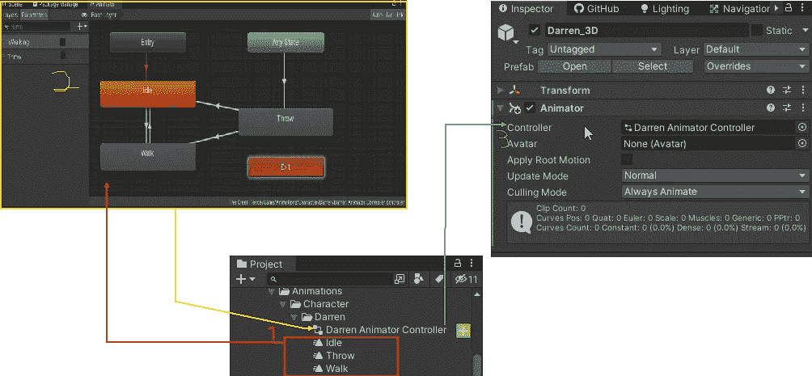
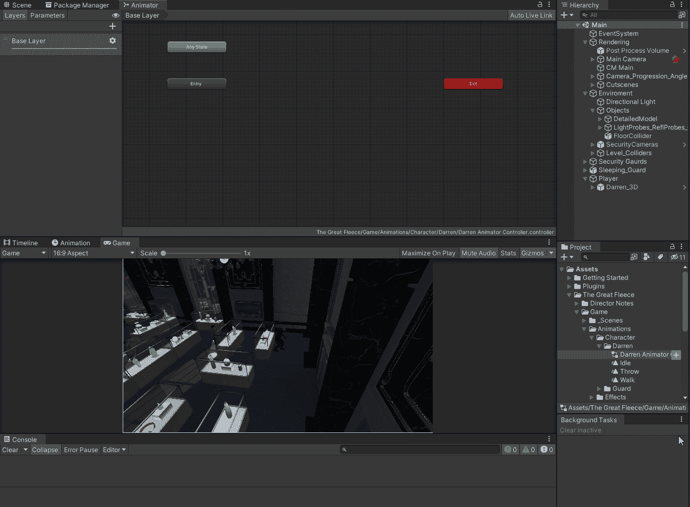
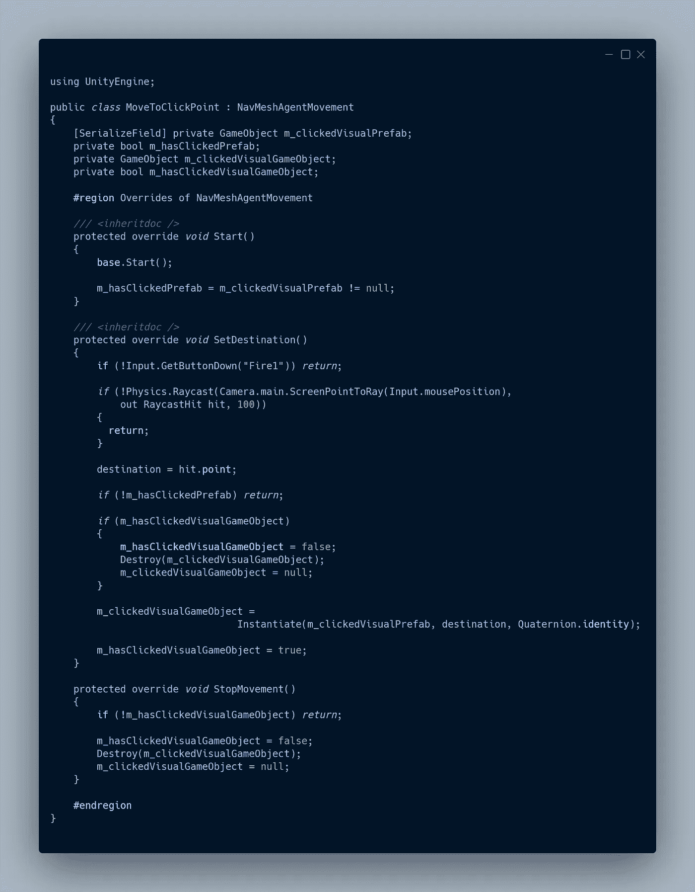

# 使用 Unity 动画系统

> 原文：<https://blog.devgenius.io/using-the-unity-animation-system-2fe137a56008?source=collection_archive---------4----------------------->

## 为玩家设置一个简单的动画控制器。

1.  [**动画剪辑**](https://docs.unity3d.com/2021.1/Documentation/Manual/AnimationClips.html) 在 Unity 中创建或[从外部源导入](https://docs.unity3d.com/2021.1/Documentation/Manual/class-AnimationClip.html)
2.  [**动画剪辑**](https://docs.unity3d.com/2021.1/Documentation/Manual/AnimationClips.html) 放置在 [**动画窗口**](https://docs.unity3d.com/2021.1/Documentation/Manual/AnimatorWindow.html) 中。
3.  正在被动画化的游戏对象被分配了一个 [**Animator 控制器资源**](https://docs.unity3d.com/2021.1/Documentation/Manual/Animator.html) 。

# 设置动画

创建一个 [**动画师控制器资产**](https://docs.unity3d.com/2021.1/Documentation/Manual/Animator.html) 这允许我为我的角色或**对象维护所有的动画。**

双击控制器将打开 [**动画窗口**](https://docs.unity3d.com/2021.1/Documentation/Manual/AnimatorWindow.html) 。这就是我可以设置 [**动画状态**](https://docs.unity3d.com/2021.1/Documentation/Manual/AnimationStateMachines.html) 称为 [**状态机**](https://docs.unity3d.com/2021.1/Documentation/Manual/StateMachineBasics.html) 和逻辑(**， [**行为**](https://docs.unity3d.com/2021.1/Documentation/Manual/StateMachineBehaviours.html) ， [**动画参数**](https://docs.unity3d.com/2021.1/Documentation/Manual/AnimationParameters.html) 等。)我可以通过代码来触发。**

****

**我可以添加一个**动画剪辑，方法是将它从项目窗口拖到 [**Animator 窗口**](https://docs.unity3d.com/2021.1/Documentation/Manual/AnimatorWindow.html) ，或者右击创建一个状态并选择其中一个选项。如果我创建了一个空状态，并且我想让它使用一个剪辑，我必须在检查器窗口中添加这个剪辑。我可以有一个空状态，它不做任何事情，也没有附加动画剪辑。****

****************

****从选定的剪辑创建状态****

****每个状态机都有一个入口点和一个出口点。从入口点到至少一个称为默认状态的状态总是有一个转换。这是使用状态机时将启动的状态。默认状态设置为添加到状态机的第一个状态。我可以在任何时候通过右键单击我想要作为默认状态的状态并选择设置为层默认值来更改它。****

********

****现在我已经添加了我的剪辑，我需要一些 [**动画参数**](https://docs.unity3d.com/2021.1/Documentation/Manual/AnimationParameters.html) 用于我的过渡。对于散步和闲散，我将使用一个 bool 正在散步。对于投掷，我将使用触发投掷。****

********

****现在我可以创建我的 [**转场**](https://docs.unity3d.com/2021.1/Documentation/Manual/StateMachineTransitions.html) 。****

****当“行走”为真时，我想从空闲过渡到无混合行走，而不是等待当前动画结束播放(有退出时间)。当“行走”为 false 时，我想转换回空闲状态，不进行混合，并且不等待当前动画结束播放。我想从任何状态转换到 Throw 而不进行混合，并且在触发 Throw 时不要等待当前动画结束播放(有退出时间)。一旦投掷动画完成，我想根据行走是真还是假从投掷过渡到行走或空闲。****

********

****现在我需要给我的角色分配这个动画师。****

********

****现在我可以玩测试游戏，并通过更改 animator 窗口中的值来触发动画变化。****

********

# ****逻辑中的编码****

****现在我已经设置了控制器，我需要从我的球员运动代码中传递逻辑。要做到这一点，我需要能够访问 [**动画组件**](https://docs.unity3d.com/2021.1/Documentation/ScriptReference/Animator.html) ，我需要它在检查器中是可分配的，因为动画组件很可能是在一个子对象上。****

********

****我将代码放在了错误的行为中，不得不将其移动到“移动到点击”行为中。确保您正在编辑正确的行为总是一个好主意。****

********

****在我忘记之前，我需要在我的检查员分配这个。****

********

****现在我可以设置 [**动画参数**](https://docs.unity3d.com/2021.1/Documentation/Manual/AnimationParameters.html) 当玩家开始行走时为真，当玩家到达目的地时为假。****

****有多种方法可以通过 string 或 int 设置一个 [**动画参数**](https://docs.unity3d.com/2021.1/Documentation/Manual/AnimationParameters.html) 。字符串速度较慢，对性能要求更高。****

********

****我将使用 int 方法。为了获得字符串参数的 id，我将使用名为 string to hash 的静态方法。****

********

****我还将使用我的 IDE 来自动完成这项工作。第一次使用 set 参数时，我将使用 string 方法，然后使用上下文将其更改为 int 方法。IDE 将自动为我创建 int id，并将方法更改为使用 int 方法。这是使用 IDE 帮助加快我的工作流程的一个很好的方法。****

********

****它有时会起作用。****

********

****我知道问题出在我的代码中，因为这个参数确实是在 Animator 中设置的。问题实际上是我在哪里检查代理是否在移动。****

********

****为了解决这个问题，我需要修改代码，改为使用停车距离。我最初没有使用停止距离，因为我正在处理浮动。在用`Debug.Log(agent.remainingDistance)`运行了一些测试后，我意识到 NavMesh 代理在到达目的地后会将剩余距离设置为 0。****

********

****现在，如果我第二次点击一个新的目的地，它就工作了。这与我代码中的逻辑顺序有关。我设置目标向量，我检查停止移动，这是真的，因为我还没有告诉代理它需要移动。然后我告诉代理，它需要移动。要解决这个问题，我要做的就是把停止移动代码移到告诉代理它需要移动之后。****

********

****现在它的工作方式正是我想要的。逻辑的顺序很重要。我还可以添加一个检查，检查路径是否没有挂起。根据 [**Unity 脚本 API**](https://docs.unity3d.com/2021.1/Documentation/ScriptReference/AI.NavMeshAgent-destination.html) 设置的目的地可能在几帧内不可用。上面的返回只负责一帧。未决路径会处理它，需要一个以上的帧。****

****************

## ****最终代码****

****我把所有的动画代码都移到了抽象类中，现在我不需要在我想使用动画的其他类中实现它。****

****************