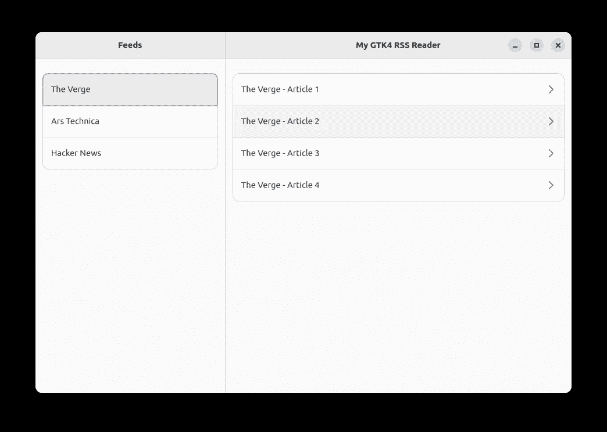
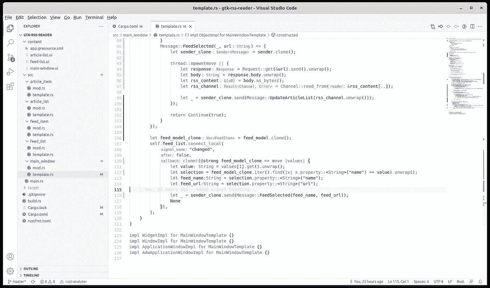
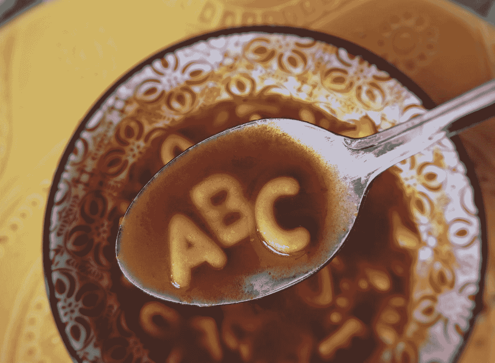

# 使用线程和消息在 GTK4 小部件中加载数据

> 原文：<https://blog.devgenius.io/using-threads-and-messages-to-load-data-in-a-gtk4-widget-5e1da3b0621d?source=collection_archive---------1----------------------->


照片由[雷·哈灵顿](https://unsplash.com/@raymondo600?utm_source=medium&utm_medium=referral)在 [Unsplash](https://unsplash.com?utm_source=medium&utm_medium=referral) 上拍摄

这是我们的[教程](/initial-setup-for-a-gtk4-app-with-libadwaita-in-rust-using-vscode-b6f8c127a75e)的最后一部分，在这里我们学习了如何使用 [libadwaita](/using-the-libadwaita-leaflet-widget-for-a-responsive-gtk4-ui-in-rust-73bbc2f4025) 和 GTK4 编写一个非常简单的 RSS 阅读器应用程序。到目前为止，我们已经学习了很多 GTK 和用户界面的概念，每一个都以自己的方式有趣而有用。从[数据模型](/using-models-to-bind-data-to-gtk4-custom-widgets-in-rust-379dd9d1bf4d)到[信号](/event-handling-for-gtk4-widgets-in-rust-d3c3f89b092f)和[属性](/adding-properties-to-custom-gtk4-widgets-in-rust-67d4bbed8b08)，每一个工具都建立在另一个之上，创建了一个能够支持任何 UI 应用的坚实平台。

我们构建的应用程序，一个普通的未完成的 RSS 阅读器，经历了很多变化，越来越多的扩展，以至于它不能再被认为是一个有教育意义的例子。如果有人直接看这最后一篇文章的代码，他们肯定会感到困惑。这就是为什么我建议从头到尾遵循整个教程。和往常一样，这些代码可以在 github 上找到。

上次我们让应用程序在`FeedList`小部件上处理[点击事件](/event-handling-for-gtk4-widgets-in-rust-d3c3f89b092f)。当我们从`FeedList`中选择一个 RSS 提要时，我们用与`FeedList`选择相关的随机数据填充`ArticleList`。我们现在要做的是从`FeedList`选择的条目 URL 中加载实际的 RSS 数据，并在`ArticleList`中显示可用的文章。为了做到这一点，我们需要避免 UI 在加载数据时没有响应。让我们看看怎么做。

## 为多线程设置代码



我们的适度的和迄今为止无用的 RSS 阅读器应用程序

上次我们谈到了线程，因为我们试图避免在单独的线程上处理 GTK 事件。但是这一次，我们需要设置应用程序来处理这个问题，因为如果我们在主线程上发出 HTTP 请求，应用程序在等待 HTTP 调用返回时不能做任何事情。它在处理 HTTP 请求时所做的所有工作都发生在主窗口线程上，使它没有响应。这实质上意味着窗口将在等待 HTTP 调用返回时冻结。

另一方面，如果我们开始产生线程，Rust 将开始创建越来越困难的检查，阻碍我们访问我们创建的几乎任何局部变量，包括我们对`FeedList`、`ArticleList`的引用以及我们从 HTTP 调用中获得的答案。那么这一切有什么用呢？

GTK4 提供了一种机制来避免这种情况。它被称为 MPSC 频道 API，位于`glib`机箱中。它有几个部分:第一，沟通渠道:

```
let (sender, receiver) = MainContext::channel(PRIORITY_DEFAULT);
```

接下来，一个消息枚举来保存我们的消息类型:

```
enum Message {
  UpdateArticleList(Channel),
  FeedSelected(String, String),
}
```

我们有两种类型的消息:`FeedSelected`用于通知在`FeedList`上发生了点击，而`UpdateArticleList`用于通知我们读取 RSS 数据的 HTTP 调用返回了数据。

消息处理程序:

```
receiver.attach(None, move |x| match x {
  Message::UpdateArticleList(data) => {
    let mut article_model = vec![]; for item in data.items() {
      article_model.push(
        ArticleItem::new(
          &item.title.clone().unwrap(),    
          &item.description.clone().unwrap()));
    } article_list_clone.set_model(article_model);
    return Continue(true);
  }
  Message::FeedSelected(_, url) => {
    let sender_clone = sender.clone(); thread::spawn(move || {
      let response = Request::get(&url).send().unwrap();
      let body = response.body.unwrap();
      let rss_content = body.as_bytes();
      let rss_channel = Channel::read_from(&rss_content[..]); let _ = sender_clone.send(
        Message::UpdateArticleList(rss_channel.unwrap()));
    }); return Continue(true);
  }
});
```

我们将处理程序附加到`receiver`对象，并处理两条消息:`UpdateArticleList`接收 RSS 数据，而`FeedSelected`接收文章`name`和`url`。我们没有对文章`name`做任何事情，所以我们使用`_`丢弃了那个变量。`UpdateArticleList`处理程序简单地读取 RSS `items`数组并将它们添加到`article_model`中，然后将模型设置为`article_list`。

`FeedSelected`处理程序正在创建一个线程，它在这个线程上向提要的 URL 发出 HTTP 请求。该请求使用`curio`板条箱。它使用`rss`箱解析接收到的 RSS 数据。你在这里看到的`Channel`结构与 MPSC 频道 API 无关，它只是一个 RSS 频道:一个 RSS 文章的容器。解析完 RSS 数据后，`FeedSelected`处理器发送一条消息，宣布我们可以更新文章列表了。

## 改进的提要选择事件



重构后的代码结构一瞥

重构了所有这些代码后，我们的`FeedList` click 事件处理程序现在简单多了:

```
let feed_model_clone = feed_model.clone();
self.feed_list.connect_local("changed", false, 
  clone!(@strong feed_model_clone => move |values| {
    let value: String = values[1].get().unwrap();
    let selection = feed_model_clone.iter()
      .find(|x| x.property::<String>("name") == value).unwrap(); let feed_name:String = selection.property::<String>("name");
    let feed_url:String = selection.property::<String>("url"); let _ = sender_clone
      .send(Message::FeedSelected(feed_name, feed_url)); None
  }),
);
```

我们在这里所做的就是获取选定的提要信息:T1 和 T2，并通过在我们的 MPSC 频道上发送消息来宣布我们有了一个新的选择。就是这样。

## 太容易了



[西格蒙德](https://unsplash.com/@sigmund?utm_source=medium&utm_medium=referral)在 [Unsplash](https://unsplash.com?utm_source=medium&utm_medium=referral) 上拍照

现在，我让一切听起来太简单了，当然房间里有一头大象。看看那些克隆的变量。似乎每次我们想在线程或事件处理程序中使用变量时，即使它应该在本地线程上工作，我们也总是克隆变量。还有另一个奇怪的情况:如果我们克隆了`feed_model`、用于`channel`的`sender`变量和其他所有东西:为什么它仍然工作？为什么`receiver`仍然从克隆的`sender`中获取消息？难道不应该是一个不同的实例吗？为什么他们还联系在一起？

所有这些都与不同的 Rust 语言机制有关，需要一整篇文章来解决。简而言之，是的，我们克隆了变量:但是如果你仔细观察，我们总是在一个闭包里捕获它们。这种特定于 Rust 的语法允许整个机制工作，即使它看起来不应该工作。

此外，如果你为 The Verge 和 Ars Technica 运行应用程序，不幸的是，它们不使用 RSS，而是使用 Atom 格式的提要。应用程序不会为这些返回任何东西，你也不会看到文章。我很晚才在教程中意识到这一点，我决定不切换到其他提要:你可以使用任何你喜欢的 RSS 提要，随意更改 URL。

除此之外，这次我们的项目只修改了两个文件。第一个是`Cargo.toml`，用于增加两个板条箱:

```
[package]
name = "gtk-rss-reader"
version = "0.1.0"
edition = "2021"[dependencies]
libadwaita = "*"
gtk4 = "*"
glib = "*"
rss = "*"
curio = "*"[build-dependencies]
libadwaita = "*"
```

还有一个`main_window`档:`template.rs`。基本上，这里的代码是对`MainWindow`模板代码的主要重构。请在 [github](https://github.com/raduzaharia-medium/gtk-rss-reader-threads) 随意查看这些变化。如果我包含整个`template.rs`文件，那会浪费很多空间，因为它实在太大了。

在这一点上，我感谢你们在整个旅程中与我同行。这篇文章完成了 GTK4 和 libadwaita 教程，我希望它是有用的，读起来有趣，对你们所有人都有意思。如果我错过了什么或者我解释得不好，请随时使用评论区。

如果你有更好的文字，更容易理解的解释，更好地理解整个教程中所描述的内容，请留下评论，我会尽力做得更好。我希望这篇教程尽可能的有用，尽可能的让更多的开发者了解 GTK。最好的问候，并留下来为其他系列！