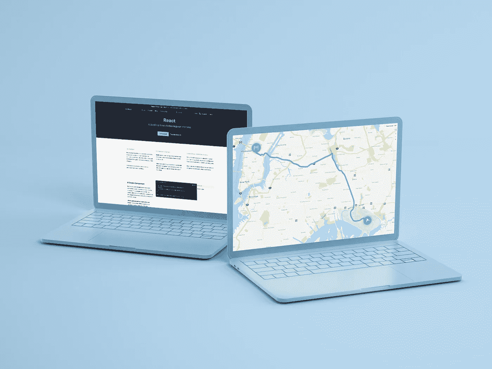
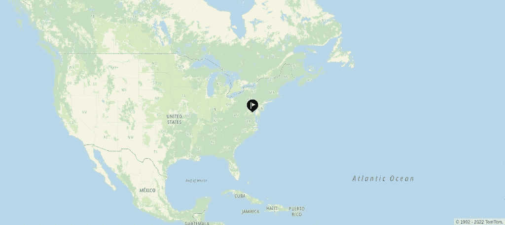
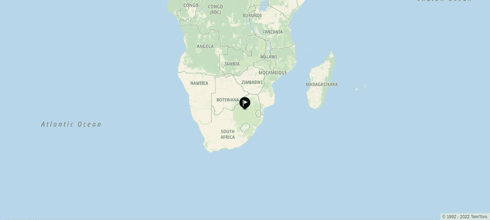
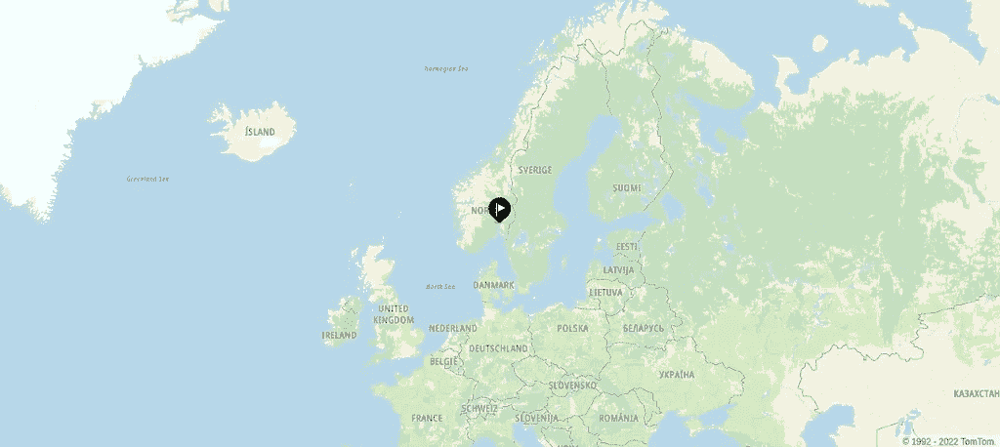

# 将 TomTom 地图与 React 路由配合使用

> 原文：<https://blog.devgenius.io/using-tomtom-maps-with-react-routing-ebe0f8aacef1?source=collection_archive---------10----------------------->



地图集成是车队监控应用和拼车服务等产品不可或缺的一部分。然而，从一开始就构建地图是具有挑战性的，并且可能需要很长时间来开发稳定的原型。我们可以通过使用 [TomTom 地图 API](https://developer.tomtom.com/products/maps-api)、Maps SDK 和 Map Styler 来节省时间(和许多麻烦),而不是试图自己寻找或创建地图并集成它。地图 API 包括地图显示 API、地图路由 API 和地图交通 API。地图 API 使我们能够轻松有效地将地图集成到我们的产品中。

地图 API 与 TomTom 的[地图 SDK](https://developer.tomtom.com/products/maps-sdk) 通信，后者为地图操作提供了所有必要的方法。通过结合 Maps SDK 和 Maps API，我们可以在地图上设置标记、搜索地点、使用反向地理编码等等。

本教程演示了如何使用 TomTom Maps API、Maps SDK 和一个 [React 路由器](https://reactrouter.com/)通过将 TomTom Maps 连接到 React 路由来动态更新地图。

# 教程概述

在本教程中，我们将把地图与 React 应用程序集成在一起。这张地图显示了不同的国家。在 React routing 的帮助下，我们将显示另一个国家，方法是将国家的名称附加到地址栏中的 URL，并使用 [TomTom 搜索 API](https://developer.tomtom.com/search-api/search-api-documentation) 进行搜索。

# 先决条件

要阅读本文，您需要以下内容:

*   对 React 的基本了解。为了对在 React 中集成地图有一个基本的了解，请查看这篇[文章](https://developer.tomtom.com/blog/build-different/adding-tomtom-maps-modern-react-app)。您必须在系统上安装 Node.js，因为您使用节点包管理器来安装不同的工具。如果你熟悉纱，你可以使用它，但我们不会在本教程中涉及它。
*   一个 TomTom 开发者账户。在[注册了这个账户的](https://developer.tomtom.com/user/register)之后，你将会得到一个用于你的应用的 API 密匙。开始我们首先创建并运行一个 React 应用程序。为此，请在终端中执行以下命令:

```
1 npx create-react-app tomtom-map2 cd tomtom-map3 npm start
```

之后，将打开一个新的浏览器选项卡，地址为 localhost:3000。每当您对代码进行更改时，选项卡都会相应地刷新和呈现。

该代码还会自动创建一个以应用程序名称命名的新目录。切换到 create-react-app 创建的 app 目录下的 src 目录。在目录中，打开 App.css 文件，并为地图添加此级联样式表(css)样式。该样式将贴图的高度设置为视口的 100%。

```
1.mapDiv{2  height: 100vh;3}
```

在接下来的小节中，我们将逐步修改 App.js 文件。提醒一下，这个文件在 src 目录中。

# 安装和添加依赖项

为了避免可能的错误，移除

元素，这样一个接近空的组件就像下面的一样。另外，请注意徽标图像导入的删除。

```
1import './App.css';23function App() {4  return (5    <div className="App">6    </div>7  );8}910export default App;
```

在这个文件中，我们需要添加地图的 SDK 依赖项和 react-router-dom 进行路由。因为 React 没有捆绑这些依赖项，所以我们必须使用以下命令安装它们:

```
npm i @tomtom-international/web-sdk-maps @tomtom-international/web-sdk-servicesreact-router-dom
```

然后，我们使用下面的代码片段添加依赖项:

```
1import './App.css';2import '@tomtom-international/web-sdk-maps/dist/maps.css'3import mapSDK from '@tomtom-international/web-sdk-maps';4import mapServices from '@tomtom-international/web-sdk-services';5import { React, useState, useEffect, useRef } from 'react'6import {7  BrowserRouter as Router,8  Routes,9  Route,10  useParams11} from 'react-router-dom';
```

# 设置地图

首先，删除 line export default App，因为默认情况下我们不会导出 App 组件。相反，我们使用 App 组件来获取坐标并显示地图。

为此，首先用下面的代码片段导出一个名为 CountryNameHelper 的组件:

```
1*/*This maps a country name URL parameter in the search bar*/*2export default function CountryNameHelper() {3  return (4    <Router>5      <div>6789        <Routes>10          <Route exact path="/:countryName" element={<App />} />11121314        </Routes>15161718      </div>19    </Router>20  );21}
```

该代码片段使用您在应用程序组件中使用的国家名称参数(country name)创建了一条路线。

在 App functional 组件中添加以下代码，该组件包含一个用于存储 API 键的常数，使用 useParams 方法获取国家名称参数，实例化地图，然后使用状态挂钩适当地存储初始状态变量。

```
1  *//your API key*2  const API_KEY = ''3  *//getting the country's name from the URL*4  let { countryName } = useParams();5  const mapContainer = useRef();6  *//default coordinates*7  const [countryLongitude, setCountryLongitude] = useState(-121.91599);8  const [countryLatitude, setCountryLatitude] = useState(37.36765);9  *//use this to change the zoom level of the map*10  const [zoomLevel, setZoomLevel] = useState(3);11  const [ourMap, setMap] = useState({});
```

之后，使用[模糊搜索服务](https://developer.tomtom.com/maps-sdk-web-js/documentation#Services.services.fuzzySearch)获取输入的国家首都的坐标，访问这些值，并适当地设置它们。选择第一个值，位置 0，因为它返回最高分的结果。

```
1*//fetching the coordinates for the typed country's administrative capital city*2  mapServices.services.fuzzySearch({3    key: API_KEY,4    query: countryName5  }).then(getCoordinates);67  function getCoordinates(response) {8    console.log(response.results)9    let latitude = response.results[0]["position"]["lat"];1011    let longitude = response.results[0]["position"]["lng"];1213    setCountryLatitude(latitude)1415    setCountryLongitude(longitude)16  }
```

使用页面加载时的默认坐标，使用 useEffect 钩子来呈现地图。这个钩子将 API 键、地图容器、坐标和缩放级别传递给 SDK 的地图对象。请注意，本教程使用的缩放级别为 3，为我们提供了一个更大的国家及其边界的视野。

现在，使用 setMap 方法以 map 对象(ourMap)作为参数来呈现地图。

```
1useEffect(() => {23    let ourMap = mapSDK.map({4      key: API_KEY,5      container: mapContainer.current,6      center: [countryLongitude, countryLatitude],7      zoom: zoomLevel8    });9    setMap(ourMap);10    */*values to listen to*/*11  }, [countryLongitude, countryLatitude]);
```

设置位置标记有助于快速识别目标位置。在 setMap 方法后，添加以下代码:

```
1let locationMarker = new mapSDK.Marker({2      draggable: false3    }).setLngLat([countryLongitude, countryLatitude]).addTo(ourMap);
```

我们在标记构造函数中设置所需的属性，使用 setLngLat 方法设置放置标记的坐标，然后使用 addTo 方法将其添加到地图中。最后，我们从 DOM 中卸载 map 组件来监听其他更改，并使用此方法刷新它。它位于设置标记的代码之后。

```
return () => ourMap.remove();
```

注意:本教程在每次选择一个新的国家时都会重新创建地图，这是为了演示的目的。实际上，创建一次地图实例并使用附加效果根据坐标值更新视图会更有效。

我们使用数组(useEffect 钩子的第二个参数)来设置监听变化的值。这样就不需要使用按钮和方法来更新地图。这是完整的 useEffect 钩子代码:

```
1  useEffect(() => {23    let ourMap = mapSDK.map({4      key: API_KEY,5      container: mapContainer.current,6      center: [countryLongitude, countryLatitude],7      zoom: zoomLevel8    });9    setMap(ourMap);10    *//setting the location marker to help easily identify the target*/*11    let locationMarker = new mapSDK.Marker({12      draggable: false13    }).setLngLat([countryLongitude, countryLatitude]).addTo(ourMap);14151617    return () => ourMap.remove();18    */*values to listen to*/*19  }, [countryLongitude, countryLatitude]);
```

在返回方法中，在 App `<div>`内添加一个`<div>`用于显示地图。

这里是几个国家的应用程序运行路线的截图:美国路线，南非路线和挪威路线。



# 结论

在本教程中，我们已经了解了如何从 URL 获取一个国家的名称，使用 Search API 搜索该国家的坐标，并根据检索到的坐标显示地图。有了 TomTom maps，将地图集成到 React 应用程序中并使用 React 路由器来更改位置显示变得毫不费力。

为了了解更多关于 TomTom 的地图技术，[注册了一个开发者账户](https://developer.tomtom.com/user/register)，今天就开始使用 TomTom。

【developer.tomtom.com/blog】本文原载于*。*