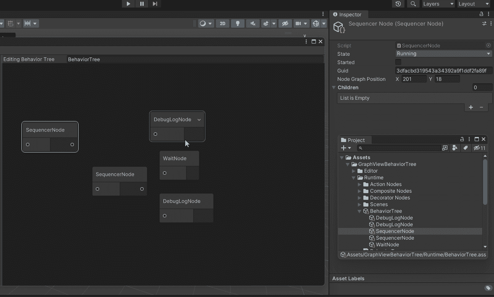

# 使用 Unity 的图形视图

> 原文：<https://blog.devgenius.io/using-unitys-graph-view-4cc55b704548?source=collection_archive---------2----------------------->

## 在编辑器中连接节点

现在我有了在编辑器上添加和删除节点的方法，我需要一种将节点连接在一起的方法。有些节点有子节点，有些没有。当节点连接后，需要正确设置子节点。图形视图节点是端口，我可以用它来帮助建立这些连接。

 [## 港口

### 实验性的:这个 API 是实验性的，将来可能会改变或删除。班级在…

docs.unity3d.com](https://docs.unity3d.com/ScriptReference/Experimental.GraphView.Port.html) 

# 创建端口

我的行为树节点视图需要一个输入端口和一个输出端口。

添加到行为树节点视图的输入和输出端口

现在我需要两种方法来创建我的端口。我创建了输入端口和输出端口，然后从构造函数中调用它们。

我将从创建输入端口开始，因为我的所有节点类型都将是相同的。现在图形视图节点有了一个名为 Instantiate Port 的方法，使创建端口变得容易。

 [## Unity 脚本 API:实验性的。GraphView.Node.InstantiatePort(方位、方向、类型)

### 感谢您帮助我们提高 Unity 文档的质量。虽然我们不能接受所有的提交，但我们…

docs.unity3d.com](https://docs.unity3d.com/ScriptReference/Experimental.GraphView.Node.InstantiatePort.html) 

这个方法有 4 个参数。

1.  方向—端口的方向。可以是[水平](https://docs.unity3d.com/2021.3/Documentation/ScriptReference/Experimental.GraphView.Orientation.Horizontal.html)(向左或向右流动的连接)或[垂直](https://docs.unity3d.com/2021.3/Documentation/ScriptReference/Experimental.GraphView.Orientation.Vertical.html)(向上或向下流动的连接)
2.  方向—端口的方向。可以是[输入](https://docs.unity3d.com/2021.3/Documentation/ScriptReference/Experimental.GraphView.Direction.Input.html)或[输出](https://docs.unity3d.com/2021.3/Documentation/ScriptReference/Experimental.GraphView.Direction.Output.html)
3.  容量—一个端口可以连接多少条边。可以是[单](https://docs.unity3d.com/2021.3/Documentation/ScriptReference/Experimental.GraphView.Port.Capacity.Single.html)(只能有单个连接)或[多](https://docs.unity3d.com/2021.3/Documentation/ScriptReference/Experimental.GraphView.Port.Capacity.Multi.html)(可以有多个连接)。(Unity 文档中未显示，但为必填项)。
4.  类型—端口的数据类型。通常用于确定端口是否可以连接到此端口。即输出端口只能连接到 int 的输入端口。

## 创建输入端口

我希望我的连接上下流动。所以我将使用垂直方向。这是一个输入，因此将输入方向。我将允许多个输入到一个节点，这将允许不止一个路径到达叶子。我将使用节点的数据类型。

如果由于某种原因，输入未能创建，就没有什么可做的了。否则，我将输入端口名设置为 nothing，它默认为数据类型的名称。最后需要做的是添加这个输入容器。我可以向输入容器中添加多个不同的输入，就像一些着色器图形节点一样。输入容器保存所有进入节点的输入。

行为树节点视图创建输入端口

创建了输入端口的我的行为树。

带有输入端口的行为树编辑器

## 创建输出端口

现在，输出端口将略有不同。这取决于我有什么输出端口的节点类型。动作节点将没有输出端口。复合节点将是垂直流、输出、多输出(因为它们允许多个子节点)，并且具有节点数据类型。装饰节点将是垂直流、输出、单输出(因为它们只允许有一个子节点)，并且具有节点数据类型。我将使用 switch 语句来确定要创建的输出端口。

打开节点创建输出端口

除了我将输出端口添加到输出容器之外，其余的输出创建与输入创建相同。现在我有了输入端口和输出端口。

将输出添加到容器

创建输出端口

需要输出端口的节点现在有了输出端口。

带有输入和输出端口的行为树编辑器

# 建立联系。

端口已创建，但它们不进行任何连接。我必须在行为树视图中覆盖一个方法来获得兼容的端口。此方法返回与起始端口兼容的端口列表。这决定了哪些端口相互兼容。

 [## Unity 脚本 API:实验性的。graph view . graph view . getcompatibleports

### 感谢您帮助我们提高 Unity 文档的质量。虽然我们不能接受所有的提交，但我们…

docs.unity3d.com](https://docs.unity3d.com/ScriptReference/Experimental.GraphView.GraphView.GetCompatiblePorts.html) 

我将使用 Linq 和 Lambda 表达式来确定哪些端口兼容哪些端口。

 [## 可查询。Where 方法(系统。Linq)

### 其中(IQueryable，Expression >)根据谓词筛选值序列。每个元素的索引用于…

docs.microsoft.com](https://docs.microsoft.com/en-us/dotnet/api/system.linq.queryable.where?view=net-6.0) 

我在图形视图中获得所有端口的列表，在条件匹配的地方获得 IEnumerable <tsource>。然后我必须将结果转换回一个列表。我返回转换后的列表。</tsource>

什么端口兼容什么端口？

1.  一个端口必须是输入，另一个必须是输出。
2.  节点无法连接到自身。
3.  端口必须是相同的端口类型。

获取兼容端口

我现在可以正确地连接我的节点。

建立联系

# 从联系中创造孩子

为了让我能够在编辑器中添加、删除子节点，或者从连接中获取节点的子节点，我需要创建一个方法，来添加子节点，从阳极中删除子节点，并从节点中获取子节点列表。

## 结节

我将从节点本身开始。这些将是空方法，实际实现这些方法(复合和装饰)将取决于有子节点的节点，但是行为树将能够调用这些方法。

节点添加子节点、删除子节点和获取子节点

## 装饰节点

装饰器只有一个子节点，所以添加子节点时，我只是将子节点设置为传入节点。为了移除子节点，我检查子节点是否是传入的节点，如果是，我将子节点设置为 null，Get 子节点返回一个包含子节点的列表。

## 复合节点

这个比较好做。我将孩子添加到孩子中，将孩子从孩子中移除并返回孩子。

## 行为树

行为树需要能够从父节点添加、移除和获取子节点。

行为树添加子对象、删除子对象、获取子对象

要在行为树中向父节点添加子节点，我首先需要确保父节点存在于节点中。如果没有，那么就没有必要继续下去；如果是，那么我将子节点添加到父节点。如果节点列表中不存在该子节点，我也会添加它。

行为树添加子树

要从行为树的父节点中移除子节点，我首先需要确保父节点存在于节点中。如果没有，那么就没有必要继续。如果是，那么我从父节点中移除子节点。

行为树删除子项

如果节点是父节点，我返回父节点的子节点，否则我返回一个空列表。

行为树获取子对象

## 行为树视图

要删除边，我需要挂钩到图形视图，更改要删除的元素，就像我在编辑器中添加和删除节点一样。

在每个循环的元素中，我将元素转换为边。如果这个元素是边，我从边输出节点视图得到父视图，从边输入节点得到子视图。然后，我从树的父视图节点中移除子视图节点。

行为树视图图形视图更改了方法 f 有要删除的元素

为了从父对象 I 创建子对象，要将图形视图中的钩子更改为创建边。

 [## Unity 脚本 API:实验性的。GraphView

### 感谢您帮助我们提高 Unity 文档的质量。虽然我们不能接受所有的提交，但我们…

docs.unity3d.com](https://docs.unity3d.com/ScriptReference/Experimental.GraphView.GraphViewChange-edgesToCreate.html) 

如果有边要创建，我就遍历所有的边。我从边的输出节点获得父视图，从边的输入节点获得子视图。然后，我将子视图节点添加到树上的父视图节点中。

如果有要创建的边，行为树视图图形视图更改了方法

我最终得到的方法是这样的。

行为树视图图形视图更改方法

现在我有了创建正确父子关系的边。

行为树编辑器在建立连接时添加子节点

如果我将选择更改为不同的行为树并返回，我仍然有正确的关系，但编辑器不再正确显示它。为了解决这个问题，我必须将它添加到 Populate View 方法中。

我需要遍历树中的所有节点

遍历树中的所有节点

接下来，我需要从节点获取行为树节点视图，这是包含我进行连接的端口的视图。幸运的是，Unity 为图形视图提供了完美的方法。

 [## Unity 脚本 API:实验性的。graph view . graph view . getnodebyuid

### 感谢您帮助我们提高 Unity 文档的质量。虽然我们不能接受所有的提交，但我们…

docs.unity3d.com](https://docs.unity3d.com/ScriptReference/Experimental.GraphView.GraphView.GetNodeByGuid.html) 

这需要一个 guid 字符串，碰巧我的节点包含这个字符串。现在这个方法给了我[实验。具有此 guid 的 GraphView.Node](https://docs.unity3d.com/ScriptReference/Experimental.GraphView.Node.html) 。碰巧我的行为树节点视图是一个[实验。我知道我可以安全地进行造型，并且我拥有的对象就是我想要的。](https://docs.unity3d.com/ScriptReference/Experimental.GraphView.Node.html)

获取父节点的节点视图

现在我需要浏览节点的所有子节点。

遍历所有子节点

我需要连接的端口是子行为树节点视图的输入，所以我将使用 [GraphView。获取视图的 GetNodeByGuid](https://docs.unity3d.com/ScriptReference/Experimental.GraphView.GraphView.GetNodeByGuid.html) 方法。

获取子行为树节点视图

我要做的就是建立联系。碰巧的是，Unity 为我提供了这样做的方法。

 [## Unity 脚本 API:实验性的。图表视图

### 实验性的:这个 API 是实验性的，将来可能会改变或删除。建议一个变化谢谢…

docs.unity3d.com](https://docs.unity3d.com/ScriptReference/Experimental.GraphView.Port.ConnectTo.html) 

[港口。ConnectTo](https://docs.unity3d.com/ScriptReference/Experimental.GraphView.Port.ConnectTo.html) 会给我一个[实验。GraphView.Edge](https://docs.unity3d.com/ScriptReference/Experimental.GraphView.Edge.html)

从连接父输出到子输入中获取边

这条边恰好是可以添加到图形视图中的可视元素。

将边添加到图表视图中

完整的循环看起来像。

将子项作为连接进行填充

我用 LINQ 表达式来做同样的事情来做同样的事情，我只是把它分解成解释上面的每个部分。LINQ 对我来说更容易阅读和理解我计划实现的目标。

对于通过将所有父节点连接到其子节点而得到的每条边，将边添加到图形视图中。

我的填充视图方法如下所示。

行为树填充视图现在填充到子节点的连接

# 结论

我已经使用端口在节点之间建立了连接。我已经加入到了 Graph View Changed 事件中，以使这些连接有意义，将行为树节点视图的可视元素更改为可脚本化对象节点的子节点。我带走了可脚本化对象节点的子节点，并使它们在编辑器中可视化显示。有许多事情可以做来改善这种情况。例如，使复合节点列表可重新排序，将输出端口更改为单输出列表，而不是多输出列表，为复合节点包含的每个子节点设置一个输出端口，并按子节点在输出上的顺序对其进行排序。[单位编辑者。实验性的。graph view。graph view](https://docs.unity3d.com/ScriptReference/Experimental.GraphView.GraphView.html)还有许多其他功能可以用来帮助处理事情。UnityEditor。实验性的。GraphView 命名空间有各种各样的东西，比如 [Blackboard](https://docs.unity3d.com/ScriptReference/Experimental.GraphView.Blackboard.html) 或[Graph View Blackboard Window](https://docs.unity3d.com/ScriptReference/Experimental.GraphView.GraphViewBlackboardWindow.html)等等。我建议您看看这些东西，或者更详细地看看本文中介绍的一些东西，比如[端口](https://docs.unity3d.com/ScriptReference/Experimental.GraphView.Port.html)或[节点](https://docs.unity3d.com/ScriptReference/Experimental.GraphView.Node.html)。