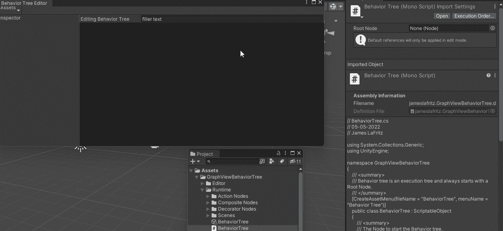
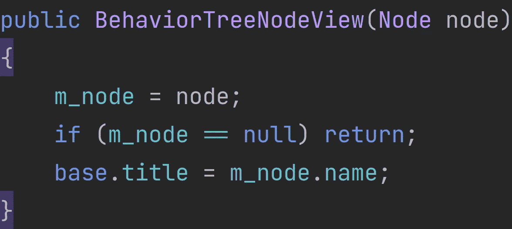
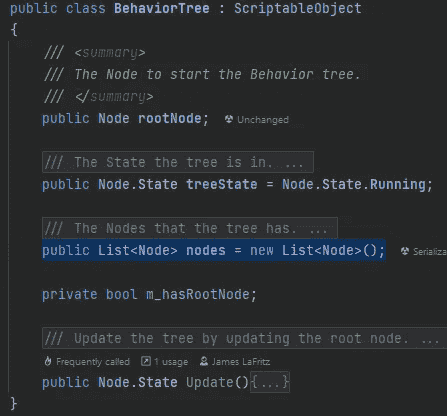
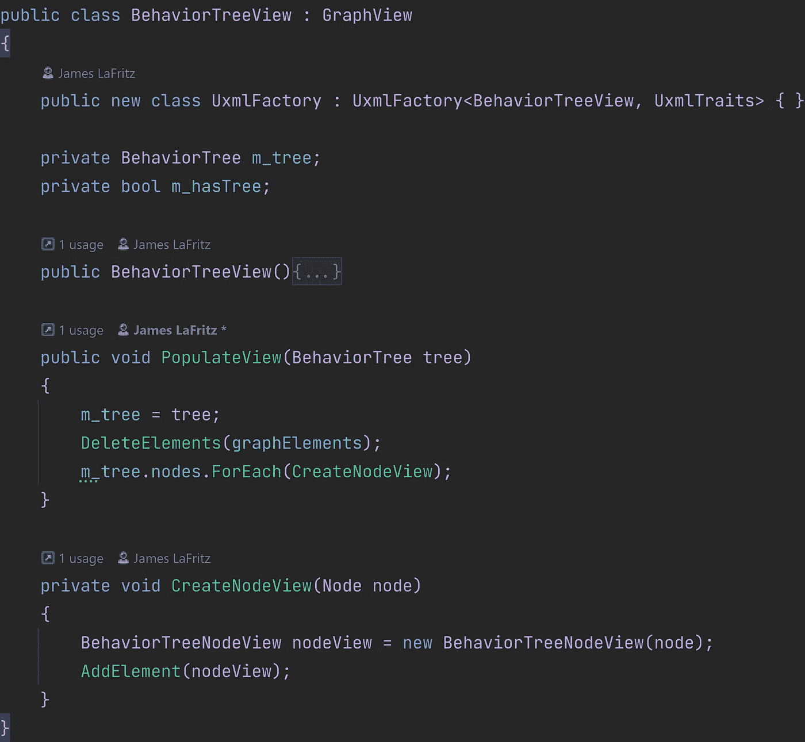
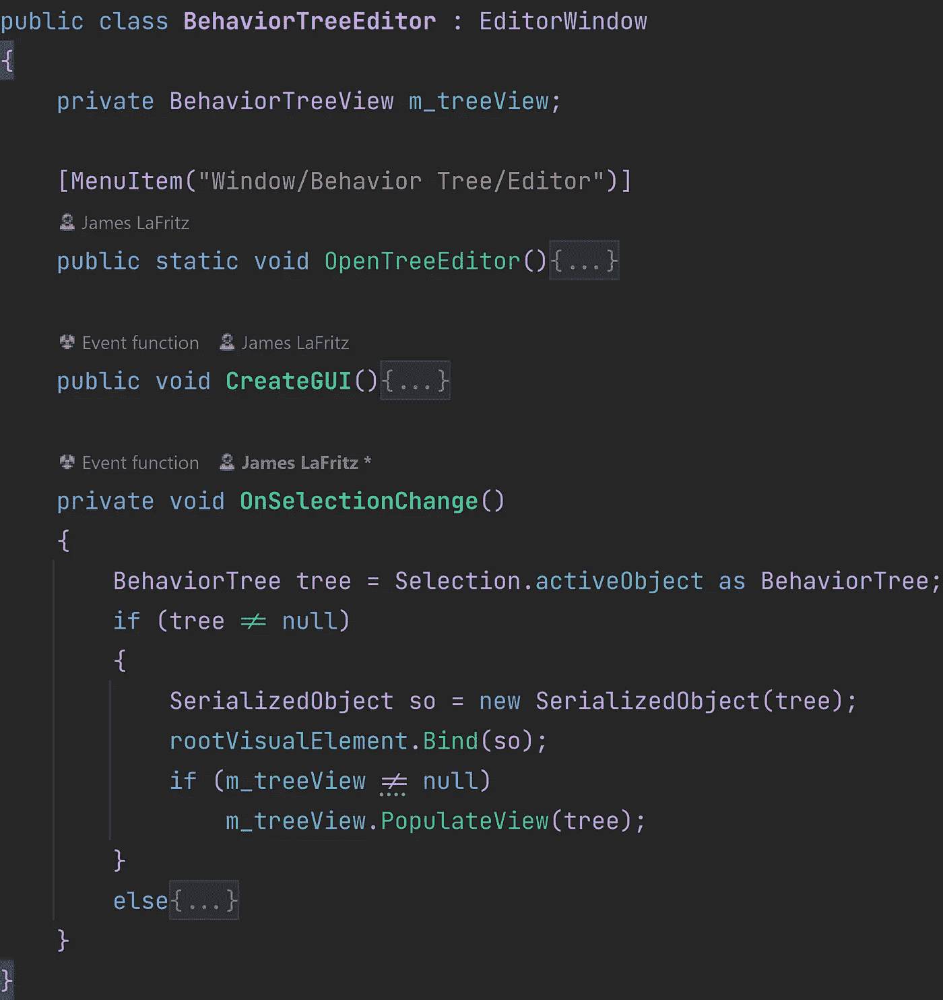
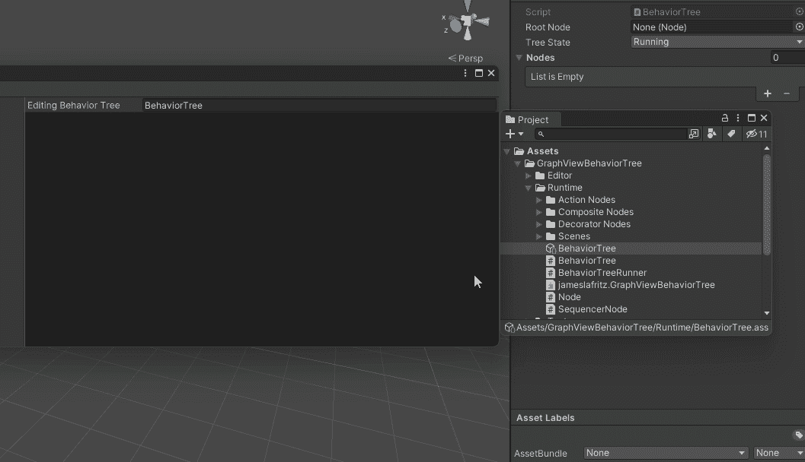
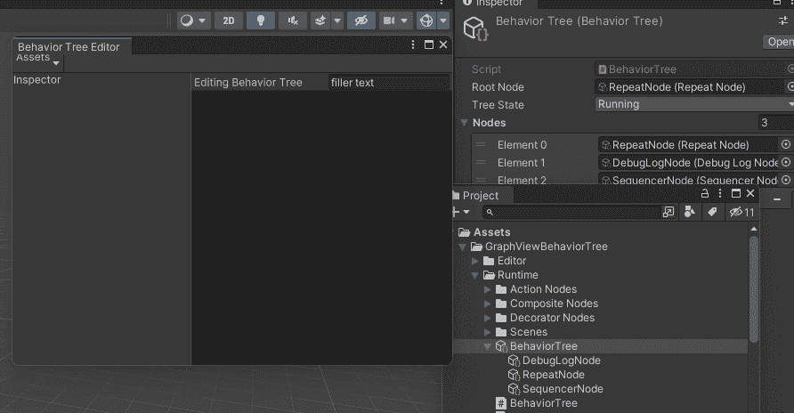
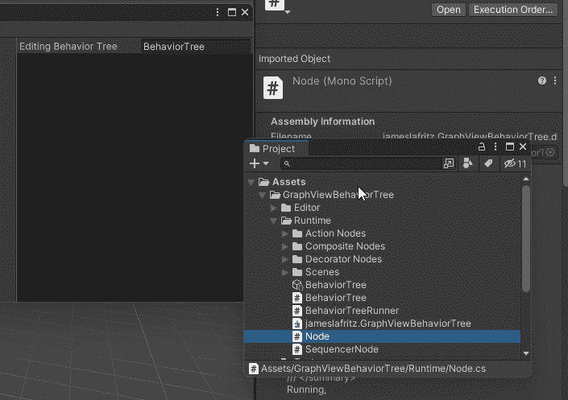

# 使用 Unity 的图形视图

> 原文：<https://blog.devgenius.io/using-unitys-graph-view-e9fb8e78980e?source=collection_archive---------1----------------------->

## 添加和删除节点

编辑:这段代码的基础主要基于 KiwiCoder 的行为树。

 [## 行为树编辑器——猕猴桃编码器

### 自由行为树编辑器！✅建立更好的人工智能✅加速你的原型✅定制和扩展现在下载

thekiwicoder.com](https://thekiwicoder.com/behaviour-tree-editor/) 

两者的主要区别在于样式表的链接方式和节点输入的行为。项目文件可以在 GitHub 上找到。

 [## 主 JamesLaFritz/graphview behavior tree/readme . MD

### 报告 Bug 请求功能我在硬盘上写了代码，用于行为树编辑器，激发了…

github.com](https://github.com/JamesLaFritz/GraphViewBehaviorTree/blob/main/README.md) 

在上一篇文章中，我向您展示了如何创建一个可以在 Unity 的 UI Builder 中使用的自定义控件，并创建了一个可以用来编辑我的行为树的图形视图。是时候利用图形视图的特性来制作行为树编辑器了。我已经使用 Unity 的 UI Builder 为我的行为树创建了一个编辑器。现在它唯一能做的就是显示我正在编辑的行为树的名称。我需要一种方法将节点添加到我的树中，这样我就可以让它做一些事情。

当前行为树编辑器

# 创建节点视图

我首先需要一个可视化元素来显示我的节点。统一编辑。GraphView 有一个名为 Node 的工具，可以很好地与我正在使用的图形视图配合使用。我将使用它作为我的行为树节点视图的基类。

从 GraphView 节点继承的行为树节点视图

接下来，我需要一个可以在节点视图中使用的行为树节点。

行为树节点

现在我需要一个构造函数，它接受将成为视图的节点。当我这样做时，我将把标题设置为节点的名称。

行为树节点视图构造器

我没有把它作为一种方式添加到 UI 生成器的库中，我需要一个节点来创建这个视图。

行为树节点视图

# 填充树视图

现在，当创建树时，将会添加一些节点，但是这些节点不会以任何方式相互连接。我需要一种方法来跟踪树中包含的所有节点。我将在行为树中添加一个节点列表。

添加了节点列表

现在我已经有了树的节点列表和节点的可视化元素，我需要一种方法来显示它们。首先，我需要创建要在树中显示的节点。我创建了一个创建节点视图的方法，它从行为树视图中的节点创建一个节点视图，并将该节点添加到树视图中。

在树视图中创建节点视图

现在我需要用它当前拥有的节点填充树视图。我做的第一件事是存储我正在填充视图的树。然后，我确保删除所有已经在树视图中的元素，这只是确保我从一个干净的石板开始。我需要做的最后一件事是遍历树的所有节点，并为它们创建一个视图。

填充树视图

树视图中增加了 2 个新方法

现在，在行为树编辑器中，我需要填充树视图。在将树的属性绑定到树视图中的元素之后，我将在 On Selection Change 方法中执行此操作。

在选择更改时填充中的树视图

行为树编辑器现在填充树视图。

# 向树中添加节点

现在我有一个问题，树没有节点显示，我也没有办法添加它们。

## 创建节点

我需要的第一件事是在树视图中创建新节点的方法。我需要知道要创建的节点的类型。如果树形视图没有树，那么就没有什么可做的。接下来，我创建节点可脚本化对象，设置它的名称和 GUID。我将节点添加到树中。我从节点创建了一个视图。因为每个行为树都需要一个根节点，所以我检查树是否是一个根节点，如果不是，我就把这个节点作为根节点。然后，我将节点添加到树资产中，这在 Unity 的树层次结构中创建了一个可脚本化的对象。

树形视图创建节点方法

## 在编辑器窗口中创建新节点

图形视图作为一个方法，我可以覆盖它，这样我就可以将菜单项添加到在编辑器窗口中右键单击时显示的菜单中。

 [## Unity 脚本 API:实验性的。graph view . graph view . build context menu

### 感谢您帮助我们提高 Unity 文档的质量。虽然我们不能接受所有的提交，但我们…

docs.unity3d.com](https://docs.unity3d.com/ScriptReference/Experimental.GraphView.GraphView.BuildContextualMenu.html) 

我想在我的系统中拥有所有非抽象的节点。Unity 提供了一个简洁的小类型缓存，里面加载了所有的程序集，我可以得到从 T 类型派生的所有类型。

 [## TypeCache

### 使用 TypeCache 访问属性和派生类型信息。这个缓存允许任意编辑器代码利用…

docs.unity3d.com](https://docs.unity3d.com/ScriptReference/TypeCache.html) 

我要做的就是遍历每个类型，如果类型是抽象的，我可以继续下一个类型。如果类型是一个具体的节点，那么我使用上下文菜单填充事件来获得下拉菜单。

 [## 下拉菜单

### UnityEngine 中的类。UIElements /建议更改感谢您帮助我们提高 Unity 文档的质量…

docs.unity3d.com](https://docs.unity3d.com/ScriptReference/UIElements.DropdownMenu.html) 

我可以在这个菜单上添加一个动作。

 [## Unity 脚本 API: UIElements。drop down menu . AppendAction(string，Action，Func，object)

### 感谢您帮助我们提高 Unity 文档的质量。虽然我们不能接受所有的提交，但我们…

docs.unity3d.com](https://docs.unity3d.com/ScriptReference/UIElements.DropdownMenu.AppendAction.html) 

我需要 2 个参数来使用这个字符串作为项目的名称(这个名称将显示在下拉菜单中)和一个回调，当用户在菜单中选择这个项目时执行。对于名称，我将使用基本类型名(Action、Composite、Decorator ),后跟类型名。对于该操作，我将使用 lambda 表达式作为默认方法，该方法调用传入类型的创建节点。

构建包含所有节点类型的上下文菜单以添加节点。

我现在可以向我的树中添加节点了

向树中添加节点

# 删除节点

现在我需要能够从树中删除节点。

我首先需要的是一个删除节点的方法。这将类似于创建一个节点。确保有一棵树。从树中删除该节点，如果该节点是根节点，则将根节点设置为空，如果树中仍有节点，则将列表中的第一个节点作为根节点。然后从资产数据库中删除该节点。

行为树视图删除节点

现在，我需要一种方法来挂钩图形视图更改方法。

 [## Unity 脚本 API:实验性的。graph view . graph view . graph view changed

### 感谢您帮助我们提高 Unity 文档的质量。虽然我们不能接受所有的提交，但我们…

docs.unity3d.com](https://docs.unity3d.com/2021.3/Documentation/ScriptReference/Experimental.GraphView.GraphView.GraphViewChanged.html) 

当我填充树视图时，我需要注册我还没有创建的新方法。在删除当前视图中的所有元素之前，我将从该方法中取消注册，并在完成这一步后向其注册。我不想仅仅因为我在改变不同的树而从我的树中删除节点。

挂钩到图形视图更改事件

现在我需要创建图表视图更改方法。此方法需要一个图形视图更改对象。这个对象是我可以截取的所有变化。如果我愿意，我可以修改图形视图更改，并返回修改后的版本。

 [## 图表视图更改

### 感谢您帮助我们提高 Unity 文档的质量。虽然我们不能接受所有的提交，但我们…

docs.unity3d.com](https://docs.unity3d.com/2021.3/Documentation/ScriptReference/Experimental.GraphView.GraphViewChange.html) 

为此，我只对要移除的元素感兴趣。

 [## Unity 脚本 API:实验性的。graph view . graph view change . elementstoremove

### 感谢您帮助我们提高 Unity 文档的质量。虽然我们不能接受所有的提交，但我们…

docs.unity3d.com](https://docs.unity3d.com/2021.3/Documentation/ScriptReference/Experimental.GraphView.GraphViewChange-elementsToRemove.html) 

我没有修改图形视图更改，我将检查正在删除的元素，如果它们是节点视图，那么我将删除节点视图包含的节点。

图形视图上的行为树视图已更改方法

现在我可以从树中删除节点。

删除节点

# 结论

使用图形视图为我提供的方法，我修改了上下文菜单以允许我添加节点，并且当节点视图元素被移除时，我挂钩到图形视图更改事件以删除节点。

添加和删除节点