# 使用 Unity 的 UI 生成器

> 原文：<https://blog.devgenius.io/using-unitys-ui-builder-5e793a90a5ae?source=collection_archive---------3----------------------->

## 添加自定义控件

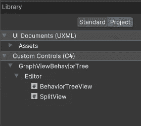

要在 UI 生成器中使用的自定义控件

编辑:这段代码的基础主要基于 KiwiCoder 的行为树。

 [## 行为树编辑器——猕猴桃编码器

### 自由行为树编辑器！✅建立更好的人工智能✅加速你的原型✅定制和扩展现在下载

thekiwicoder.com](https://thekiwicoder.com/behaviour-tree-editor/) 

两者的主要区别在于样式表的链接方式和节点输入的行为。项目文件可以在 GitHub 上找到。

 [## 主 JamesLaFritz/graphview behavior tree/readme . MD

### 报告 Bug 请求功能我在硬盘上写了代码，用于行为树编辑器，激发了…

github.com](https://github.com/JamesLaFritz/GraphViewBehaviorTree/blob/main/README.md) 

图形视图用于着色器图形、动画窗口和 unity 中其他基于节点的编辑器窗口。这里的概念可用于创建任何基于节点的树形视图编辑器窗口。一些例子是行为树，自定义状态机系统，甚至是我以前文章中的能力系统。因为我正在使用基于节点的行为树，所以我想在我的编辑器中使用图形视图，特别是[节点](https://docs.unity3d.com/ScriptReference/Experimental.GraphView.GraphView-nodes.html)和[端口](https://docs.unity3d.com/ScriptReference/Experimental.GraphView.GraphView-ports.html)。

如果您注意到 UI 构建器库中没有图形视图容器。

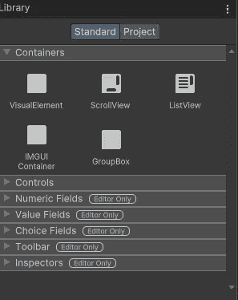

UI 生成器库

这是因为图表视图实际上是实验性的。

> 实验性的:这个 API 是实验性的，将来可能会被修改或删除。
> 
> 来源:[https://docs.unity3d.com/ScriptReference/Experimental.GraphView.GraphView.html](https://docs.unity3d.com/ScriptReference/Experimental.GraphView.GraphView.html)

幸运的是，我们可以创建自己的自定义控件在 UI 生成器中使用。

 [## 自定义控件

### UI Toolkit 允许您创建自定义控件。这使得创建复杂的控件或实现自定义控件成为可能

docs.unity3d.com](https://docs.unity3d.com/2021.3/Documentation/Manual/UIE-create-custom-controls.html) 

# 创建图形视图自定义控件

我们可以制作一个将在库中显示的自定义控件。

## 创建自定义控件类

我们首先需要的是一个从 Graph View 继承的类。我们还需要使用语句的实验图形视图。图形视图是一种视觉元素。

从图形视图继承的行为树视图

## 向 UXML 和 UI 生成器公开自定义控件

这仍然不能让它出现在图书馆里。为了做到这一点，我们需要从 Unity Engine UI 元素名称空间添加一个名为 UXML Factory 的东西。我们需要传入行为树视图的类型，以及一些从我们继承的图形视图中得到的特征。我没有创建自己的 UXML 特征，因为我使用了已经提供的特征，这使得事情不那么复杂。

 [## UxmlFactory

### UnityEngine 中的类。UIElements / /建议更改感谢您帮助我们提高 Unity 的质量…

docs.unity3d.com](https://docs.unity3d.com/ScriptReference/UIElements.UxmlFactory_1.html) 

或者

 [## UxmlFactory

### UnityEngine 中的类。UIElements /建议更改感谢您帮助我们提高 Unity 文档的质量…

docs.unity3d.com](https://docs.unity3d.com/ScriptReference/UIElements.UxmlFactory_2.html) 

> 描述
> 
> UXML 工厂的通用基类，使用从 UXML 文件中读取的数据实例化 VisualElement。
> 
> `*T0*`将被实例化的元素的类型。它必须从[视觉元素](https://docs.unity3d.com/ScriptReference/UIElements.VisualElement.html)中派生出来。
> 
> `*T1*`将被实例化的元素的特征。它必须来源于[uxmlthrits](https://docs.unity3d.com/ScriptReference/UIElements.BindableElement.UxmlTraits.html)。
> 
> 来源:[https://docs.unity3d.com/ScriptReference/UIElements.UxmlFactory_2.html](https://docs.unity3d.com/ScriptReference/UIElements.UxmlFactory_2.html)

从图形视图继承的行为树视图，带有新的 UXML 工厂类

自定义控件的 UI 生成器检查器中的 UXML 属性和 USS 属性由控件具有的 UXML 特征公开。

> 将自定义控件表示的属性及其行为的其他功能方面公开为 UXML 属性，将影响自定义控件外观的属性公开为 USS 属性。
> 
> 来源:[https://docs . unity 3d . com/2021.3/Documentation/Manual/UIE-create-custom-controls . html](https://docs.unity3d.com/2021.3/Documentation/Manual/UIE-create-custom-controls.html)

因为我没有为这个控件创建自己的 UXML 特征，所以我使用了第二个 UXML 工厂，并把图形传递给它

## 在 UI 生成器中使用自定义控件

现在，它显示在 UI 构建器库中的“项目”选项卡“自定义控件”下。我可以将它拖放到我的窗口中。

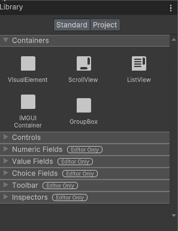

将新的行为树视图添加到我的编辑器窗口

现在它出现在我的编辑器窗口中，但是它的高度为零。为了解决这个问题，我需要改变伸缩增长高度为 1。

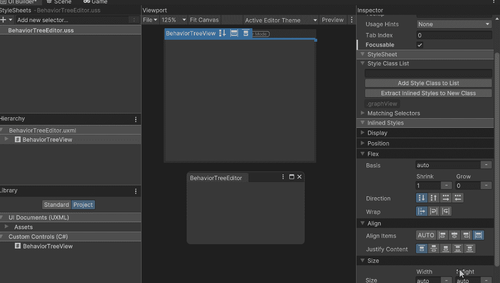

让新视图占据整个编辑器窗口

我不想每次都要做这样的改变，所以我添加了一个构造函数，并设置样式 Flex Grow 为 1。

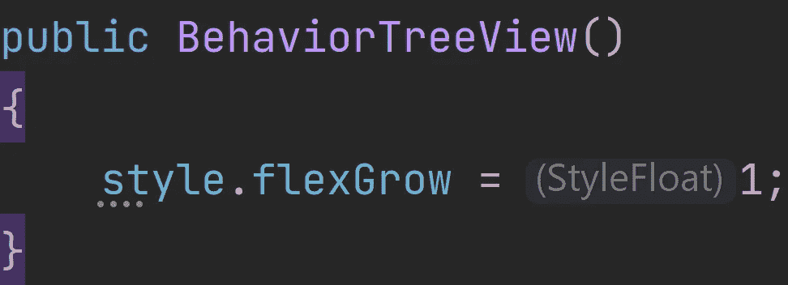

添加带有 Flex Grow 的构造函数。

现在，为了让我的编辑器看起来更好，我将添加网格背景，这也是实验命名空间的一部分。通过使用[插入方法](https://docs.unity3d.com/ScriptReference/UIElements.VisualElement.Insert.html)。这需要插入一个索引和一个可视元素。我这样做是为了确保网格背景是层次结构的第一个视觉元素。

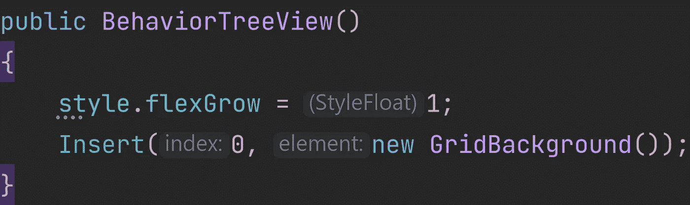

## 添加操纵器

现在我希望能够[放大/缩小](https://docs.unity3d.com/2021.3/Documentation/ScriptReference/Experimental.GraphView.ContentZoomer.html)，[围绕](https://docs.unity3d.com/2021.3/Documentation/ScriptReference/Experimental.GraphView.ContentDragger.html)，[移动](https://docs.unity3d.com/2021.3/Documentation/ScriptReference/Experimental.GraphView.SelectionDragger.html)周围的节点，并使用[矩形选择](https://docs.unity3d.com/2021.3/Documentation/ScriptReference/Experimental.GraphView.RectangleSelector.html)。为此，我需要[添加我想要的操纵器](https://docs.unity3d.com/ScriptReference/UIElements.VisualElementExtensions.AddManipulator.html)。还有其他几个可以用的[但是这些是我想要的。](https://docs.unity3d.com/2021.3/Documentation/ScriptReference/30_search.html?q=Manipulator)

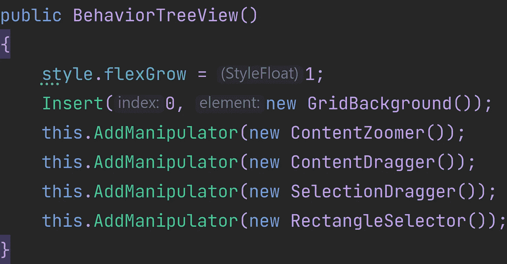

添加操纵器

# 拆分视图自定义控件

我想在编辑器中添加一个拆分视图。Unity 内置了一个名为[的双窗格分割视图](https://docs.unity3d.com/ScriptReference/UIElements.TwoPaneSplitView.html)，但它不会在 UI 生成器中显示。它位于 UI 元素名称空间中。

## 创建自定义控件类

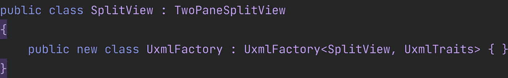

拆分视图

## 在 UI 生成器中使用自定义控件

将拆分视图拖放到层次结构中。现在拆分视图正好需要两个子视图。我在拆分视图中添加了行为树视图和一个可视化元素。现在，如果您注意到拆分视图在 UI Builder 窗口中可见，您将会收到一个错误，告诉您拆分视图正好需要 2 个子视图。

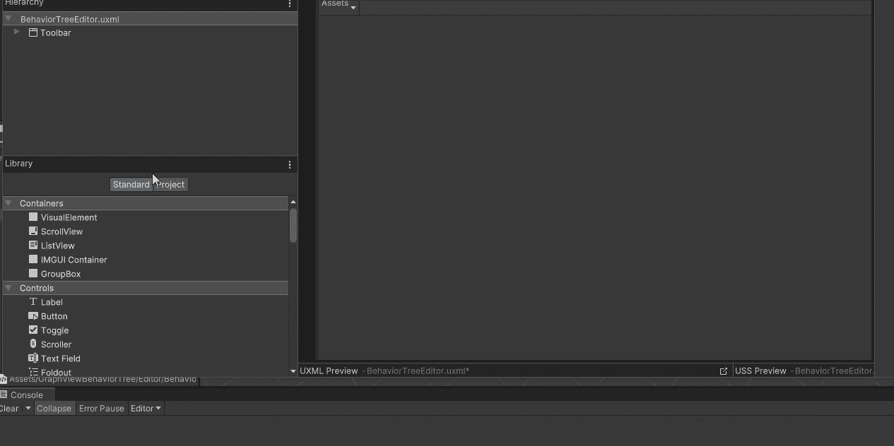

拆分视图错误

一旦你添加一个分割视图到你的窗口，并且你已经添加了两个子窗口，这个错误可以被忽略。只要知道当它在 UI 生成器的库中可见时，这个错误就会显示出来，可以忽略。如果您清除了错误，但拆分视图没有显示在库中，并且错误再次出现，这意味着您的窗口中有一个不符合此要求的拆分视图。要解决这个问题，只需在分割的 Viwe 上添加两个视觉元素。当然，我把我的面板命名为左面板和右面板，因为我使用的是水平方向的分割视图..

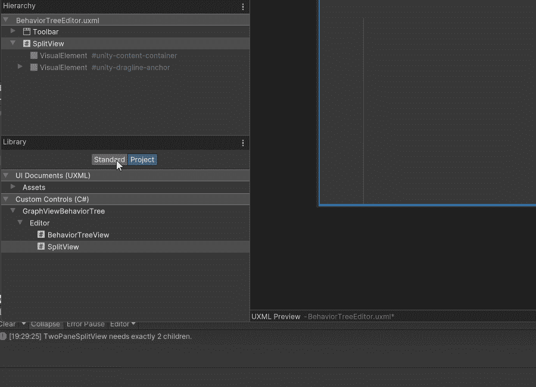

向拆分视图添加两个可视元素

当然，如果你的分割视图有 2 个以上的子视图，这个错误也会出现。要修复它，您需要通过删除它或使它成为拆分视图的两个主要子对象之一的子对象来移除额外的子对象。

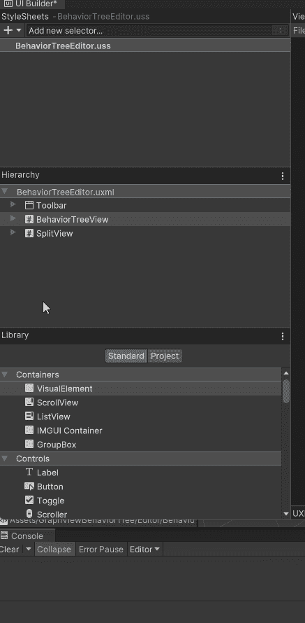

拆分包含多个子视图的视图

分割视图可以具有水平或垂直方向。它还具有固定窗格初始尺寸的大小。您可以控制哪个窗格是索引为 0 或 1 的固定窗格(拆分视图只能有 2 个子窗格)。

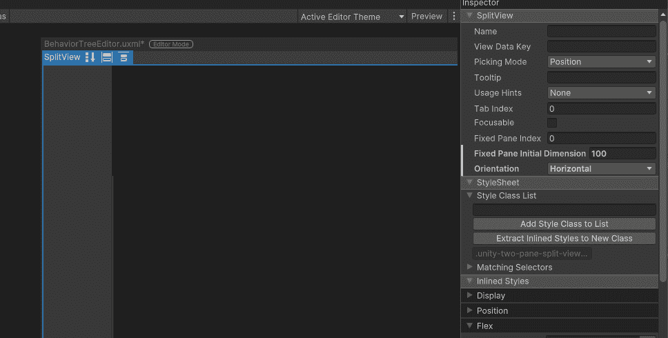

拆分视图属性

# 结论

这些方法可用于将您想要的任何自定义控件类型添加到 UI 生成器中。Unity 还有其他几个内置的视觉元素类型，它们不会在库中显示。你可以使用这些方法将你自己的控件添加到库中，并在 UI 生成器中进行拖放。请注意，在这里，我对图形视图进行了详细说明，并将其命名为行为树视图，而我对拆分视图进行了更通用的说明。分割视图已经设置好，所以我可以在我选择的任何地方使用它。图形视图更具体，因为我将使用图形视图方法，如构建上下文菜单，为行为树设置特定的图形视图。图形视图是一个强大的视图，可用于创建类似于动画和着色器图形的窗口。