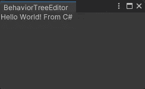
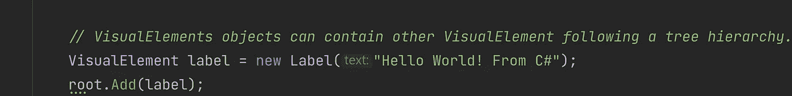
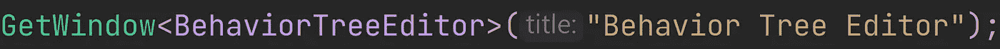

# 使用 Unity 的 UI 生成器

> 原文：<https://blog.devgenius.io/using-unitys-ui-builder-a86faf17bf27?source=collection_archive---------6----------------------->

## 基本设置

编辑:这段代码的基础主要基于 KiwiCoder 的行为树。

 [## 行为树编辑器——猕猴桃编码器

### 自由行为树编辑器！✅建立更好的人工智能✅加速你的原型✅定制和扩展现在下载

thekiwicoder.com](https://thekiwicoder.com/behaviour-tree-editor/) 

两者的主要区别在于样式表的链接方式和节点输入的行为。项目文件可以在 GitHub 上找到。

 [## 主 JamesLaFritz/graphview behavior tree/readme . MD

### 报告 Bug 请求功能我在硬盘上写了代码，用于行为树编辑器，激发了…

github.com](https://github.com/JamesLaFritz/GraphViewBehaviorTree/blob/main/README.md) 

我有一个[行为树](https://ktmarine1999.medium.com/behavior-trees-in-unity-20a738b5508c)，我需要一个编辑器窗口来创建它，这样我就可以摆脱在代码中构建树的令人讨厌的复杂性。

在代码中创建行为树

# Unity 中的 UI Builder 是什么？

在 2019.1 版本中，Unity 引入了使用 [UXML 格式](https://docs.unity3d.com/2019.1/Documentation/Manual/UIE-UXML.html)和 [Unity 样式表(USS)](https://docs.unity3d.com/2019.1/Documentation/Manual/UIE-USS.html) 的 [UI 元素](https://docs.unity3d.com/2019.1/Documentation/Manual/UIElements.html)，以帮助构建更好的用户界面，我相信最初它更多地是为编辑器窗口和检查器而设计的。在 2020.1 版本中，Unity 将其升级为 [UI 工具包](https://docs.unity3d.com/2020.1/Documentation/Manual/UIElements.html)，以帮助开发编辑器的自定义 UI，并运行 [UI 生成器](https://docs.unity3d.com/2020.1/Documentation/Manual/com.unity.ui.builder.html)(预览包，Unity 2019.1，可用性有限)。在 2021.1 版本中，Unity 将 [UI Builder](https://docs.unity3d.com/Packages/com.unity.ui.builder@1.0/manual/index.html) 作为一个内置包，默认为仅运行时 UI，但您可以[启用编辑器扩展创作](https://docs.unity3d.com/Packages/com.unity.ui.builder@1.0/manual/uib-getting-started-editor-ext.html)，它在库中有额外的元素。Unity 不断地在 [UI 工具包(Unity 博客)](https://unity.com/features/ui-toolkit)的基础上构建。在每个链接中阅读更多详细信息。如果你用的是 Unity 2020。你必须确保在包管理器中添加 UI 构建器。并非所有的 UI 生成器功能都能在 Unity 2020 中正常工作。x 或者至少上次我使用 Unity 时，我已经修复了错误(也就是说，UI 生成器的检查器中的所有字段都没有显示出来。它只显示一个名为 attributes 的空下拉菜单……)

如果你正在与一个团队合作，或者你的设计规范声明你需要在 2021 年之前使用 Unity 的一个版本。x 2021 年你可以一直用 UI Builder。x 来构建您的 UI，然后将文件复制/移动到 Unity 早期版本的项目中。

# 熟悉 UI 生成器

第一步是在 Unity 中打开 UI Builder 窗口。选择菜单窗口->UI 工具包->UI 生成器

打开 UI 生成器菜单

现在创建一个新的编辑器窗口。

(在项目视图中右键单击)(资产->创建->UI 工具包->编辑器窗口)

创建新的编辑器窗口

这将创建 3 个文件，一个代码文件(.cs)，一个样式表(。uss)，一个 a uxml 文件(。uxml)。

创建编辑器窗口

我们最终得到一个窗口，其中有一些示例文本。

新创建的窗口

这也应该会在 UI 生成器窗口中自动打开，如果没有打开，您可以双击。项目视图中的 uxml 文件。

新编辑器窗口的 UI 生成器窗口

确保您[启用编辑器扩展创作](https://docs.unity3d.com/Packages/com.unity.ui.builder@1.0/manual/uib-getting-started-editor-ext.html)

您将会知道您可以从中挑选的库是否启用了编辑器扩展创作。如果列表很短，则不会启用。如果列表很长，只有一堆编辑器，那么它是启用的。

未启用扩展创作库

启用扩展创作的库

确保将新创建的样式表添加到构建器中。点击+按钮添加现有。

这允许我们在编辑器中编辑样式。

编辑样式表

这比试图编辑代码更快更容易。如果在代码编辑器 IDE 或记事本中打开样式表，您将看到类似于

样式表代码

我们也可以在这里用 UI 生成器编辑 UXML 窗口。将库中的任何内容添加到我们的窗口中。改变每个元素的属性。

编辑行为树编辑器窗口

同样，这比试图编辑 UXML 代码更快更容易。

UXML 代码

使编辑器窗口匹配 UXML。

你会注意到的第一件事是窗口看起来不像我们的画布。

我们需要做的第一件事是让我们的窗口实时重新加载。右键单击行为树编辑器窗口并选择 UI 工具包实时重新加载。现在，当我对 UI 生成器进行更改时，它将重新加载我的编辑器窗口。

UI 工具包实时重新加载

“否”窗口看起来与我们在 UI 生成器中看到的类似。我们的编辑器窗口中仍然有额外的内容。这是因为编辑器窗口是如何创建的，请记住代码文件(cs)嗯，它需要一点点，但编辑。当 Unity 创建这个文件时，它是为了展示我们可以用来构建编辑器窗口的不同方法(一个小例子)。

删除第 28 行到第 35 行。

要移除的样式表行

行为树编辑器窗口

现在在第 27 行，我们需要将可视化树资产克隆到根上，而不是实例化它。

将第 27 行从

第 27 行应该改成这样

越来越近了。

行为树编辑器窗口

最后，我们需要删除 Hello World！从 C#标签中删除第 20 到 24 行。

删除第 20 至 24 行

现在，我们的编辑器窗口与我们在 UI 生成器中看到的相匹配。唯一不在这里的是画布属性只处理 UI 构建器。它不会改变我们的编辑器窗口的外观。

编辑器窗口匹配 UI 生成器。

接下来，将第 9 行更改为菜单中的不同位置。我把我的放在窗口菜单里，但是你可以把它放在任何你喜欢的地方。这是个人喜好，不需要做。

更改第 9 行

我的新 9 号线

我做的最后一个修改是在第 12 行和第 13 行。我删除了第 13 行，修改了第 12 行，只得到一个窗口，使用了一个重载来修改标题。同样，这是个人偏好，不需要做出决定。

旧 12 号线和 13 号线

新 12 号线

现在我们已经为行为树创建了编辑器窗口。

我的行为树编辑器窗口最终代码

# 结论

这里的概念可以用来创建任何编辑器窗口或任何其他使用 UXML 甚至 Inspectors 的定制 UI。UI 生成器是一个强大的工具，可用于在 Unity 中创建 UI。这确实是一种你所见即所得的创建用户界面的方式。您可以使用它来轻松地更改您的样式表和 uxml 文件，UI 生成器会为您处理所有代码。使用 UI 生成器还有很多概念，比如创建可在库中使用的自定义控件、数据绑定以及使用样式表。