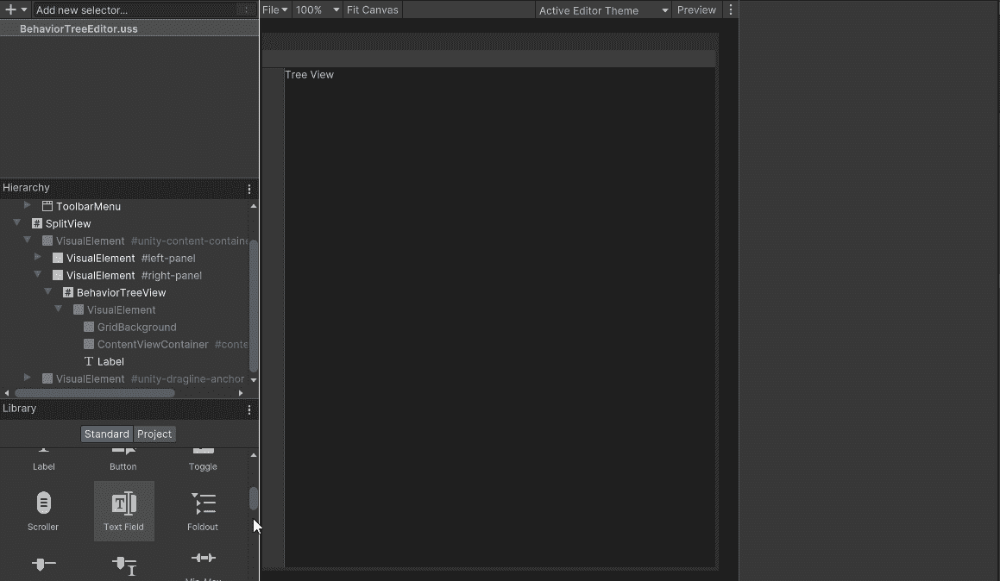
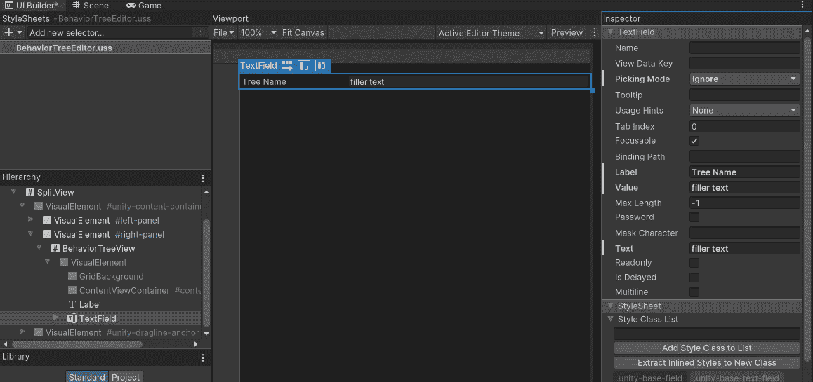
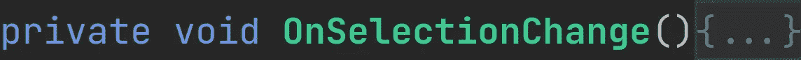
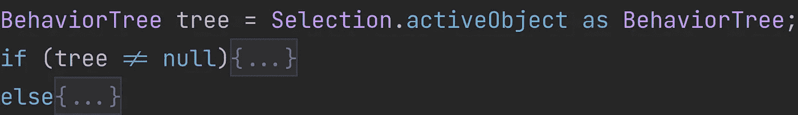
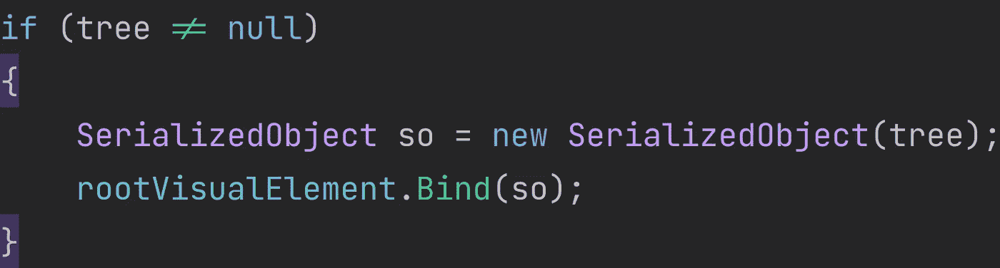
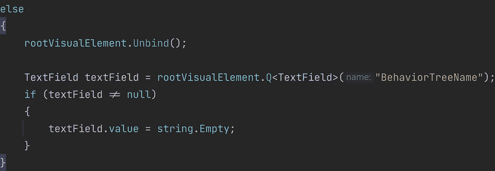
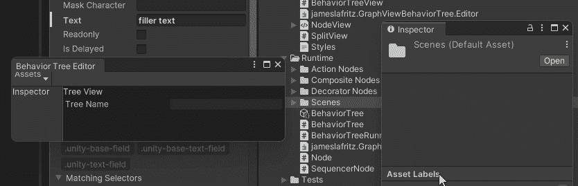
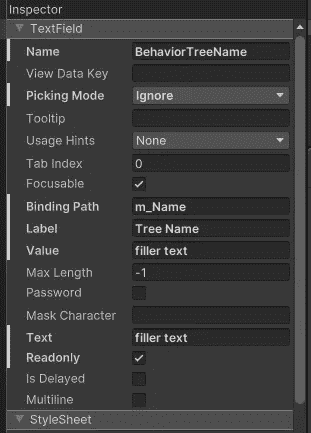

# 使用 Unity 的 UI 生成器

> 原文：<https://blog.devgenius.io/using-unitys-ui-builder-bc058e1c7d17?source=collection_archive---------5----------------------->

## 序列化对象数据绑定

编辑:这段代码的基础主要基于 KiwiCoder 的行为树。

 [## 行为树编辑器——猕猴桃编码器

### 自由行为树编辑器！✅建立更好的人工智能✅加速你的原型✅定制和扩展现在下载

thekiwicoder.com](https://thekiwicoder.com/behaviour-tree-editor/) 

两者的主要区别在于样式表的链接方式和节点输入的行为。项目文件可以在 GitHub 上找到。

 [## 主 JamesLaFritz/graphview behavior tree/readme . MD

### 报告 Bug 请求功能我在硬盘上写了代码，用于行为树编辑器，激发了…

github.com](https://github.com/JamesLaFritz/GraphViewBehaviorTree/blob/main/README.md) 

如果改变编辑器中的值不会改变您正在编辑的对象的值，那么拥有一个自定义编辑器有什么用呢？为了展示这是如何工作的，我将在我的编辑器中添加一个文本框来更改我的行为树的名称。请注意，这只是为了演示，因为这是最简单的方法，在没有重命名 ScriptableObject 文件的情况下，永远不要更改 ScriptableObject 的名称。有关可绑定可视元素的列表，请参见 https://docs.unity3d.com/Manual/UIE-bindable-elements.html。

添加文本字段以更改树的名称

使用 UXML 的方式是通过数据绑定。进行数据绑定最简单的方法是在 UXML 中设置绑定路径(这可以在 UI Builder 中设置), C#脚本使用 Bind 和 Unbind 方法。

 [## 用 UXML 和 C#脚本绑定

### 版本:2021.3+这个例子演示了如何用 UXML 创建一个绑定和设置绑定路径，并调用…

docs.unity3d.com](https://docs.unity3d.com/2021.3/Documentation/Manual/UIE-create-a-binding-uxml-bind.html) 

还有其他几种方法来进行数据绑定。

 [## 绑定示例

### 本页包括一组绑定示例。

docs.unity3d.com](https://docs.unity3d.com/2021.3/Documentation/Manual/UIE-binding-examples.html) 

绑定仅适用于序列化对象(即 MonoBehaviour、ScriptableObject、UnityEngine)。对象)，并且您只能绑定到序列化的属性。

 [## 序列化对象数据绑定

### 数据绑定同步非 UI 对象的属性，例如(用户界面)允许用户与您的…

docs.unity3d.com](https://docs.unity3d.com/Manual/UIE-Binding.html) 

行为树资源是一个可脚本化的对象，所有可脚本化的对象都有一个名为 m_Name 的序列化属性。

在 UI 生成器中，我确保选择了文本字段。我给它一个名称，并将绑定路径属性设置为 m_Name。

设置文本字段名称和绑定路径

放置绑定和解除绑定代码的最佳位置是在选择改变方法的[编辑器窗口中。](https://docs.unity3d.com/ScriptReference/EditorWindow.OnSelectionChange.html)

选择更改时的行为树

我需要做的第一件事是获取当前选择的对象，并检查它是否是一个行为树。

检查所选对象是否是树。

如果选择的对象是一个行为树，那么我从行为树创建一个序列化的对象。然后，我将层次结构的根绑定到序列化对象。Unity 将施展魔法，将正确的视觉元素绑定到正确的属性上。

如果这是一个行为树，绑定序列化对象

如果选择的对象不是行为树，那么我解除视觉树元素的绑定。作为额外的奖励，我还清除了文本字段。

如果所选对象不是行为树

现在，当我选择行为树时，名称会发生变化，我可以通过在文本框中更改树的名称来更改它。

在编辑器中更改树的名称。

我喜欢显示选中的树的名称，所以我将把它保留在那里。为了防止名称被更改，我只需将文本字段设置为只读。

将文本字段设为只读

选择更改方法的行为树

# 结论

当使用 UXML 甚至 Inspectors 创建任何编辑器窗口或任何其他自定义 UI 时，这里的概念可用于将属性绑定到您的对象。设置的唯一区别是代码文件(。cs)。

对于使用 UXML 的检查员，您的类将从编辑器继承，并使用 Create Inspector GUI 而不是 Create GUI。

使用 UI 生成器创建 UXML 的示例检查器

对于游戏用户界面，你不能使用 Unity 编辑器命名空间中的任何东西。Unity 有一个在 Unity 2021 中创建运行时 UI 的演练。x，其他版本的 Unity 也会差不多。或者您可以创建自己的解决方案，使用 UI 画布和 MonoBehaviour 将 UXML 文档加载到画布上。

 [## 创建您的第一个运行时 UI

### 本页将指导你使用工具包建立一个简单的字符选择屏幕的步骤。它涵盖了…

docs.unity3d.com](https://docs.unity3d.com/2021.3/Documentation/Manual/UIE-HowTo-CreateRuntimeUI.html)