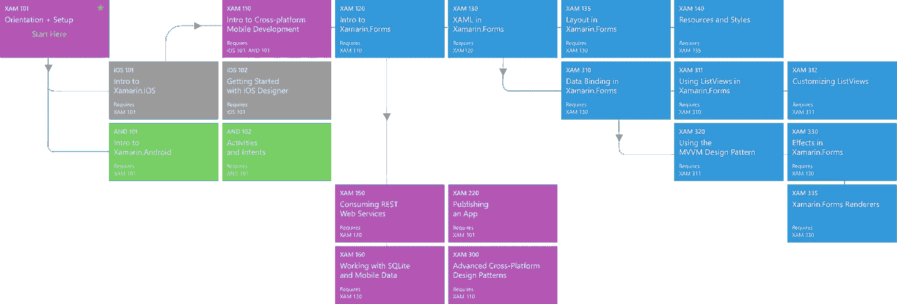
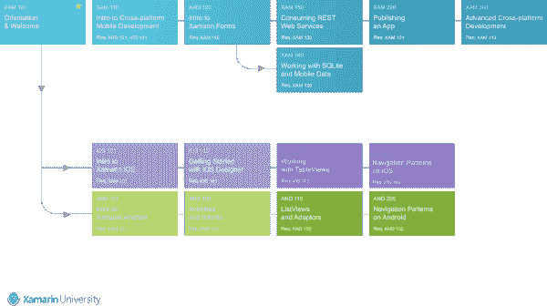

# 利用 Xamarin 大学资源学习移动开发

> 原文：<https://blog.devgenius.io/usingxamarinuniversitytolearnmobiledevelopment-808b6dec3e8b?source=collection_archive---------3----------------------->

## 免费学习 XAMARIN 的指南

## 学习基于 C#的原生 iOS 和 Android 开发的初学者指南！

罗曼·辛克维奇在 [Unsplash](https://unsplash.com?utm_source=medium&utm_medium=referral) 上拍摄的照片

W 几年前我们学习 Xamarin 的时候，“Xamarin 大学”是学习和理解快速发展的 Xamarin 框架([现在是毛伊岛](https://devblogs.microsoft.com/dotnet/introducing-net-multi-platform-app-ui/))的一个很好的资源。这是获得 Xamarin 认证和提升公认技能的官方途径。Xamarin 大学填补了一个空白，这是一条学习和成为自信的 Xamarin 专业人士的结构化道路，所以我们与 Luis Pujols 合作，深入了解初学者可以做什么。

## 有一所 Xamarin 大学存在？

6 年来，任何对基于 C#的原生移动开发感兴趣的人，只需花每月 83 美元，就可以完成“XamarinUniversity.com”上的课程。有些课程是录制的，而其他一些课程则需要在直播过程中进行。[决定停止](https://www.theregister.co.uk/2018/12/14/xamarin_university_to_close_its_doors_in_2019/) XamU，由于其在行业中的价值，许多人在它关闭之前就冲进去获得认证。最后一堂课是通过 twitch 向所有人直播的，它的结尾有一个非常棒的致敬视频。

第一个原型是一家新兴的移动应用程序设计和开发咨询小型企业，专门从事 Xamarin 表单和本机应用程序。在 [*我们的网站*](https://thefirstprototype.com/mobile-app-development-windsor-ios-android.html) *，* [*支持*](http://twitter.com/prototypemakers) *我们在* [*社交媒体*](http://instagram.com/prototypemakers) *上注册，了解我们在*[*iOS*](https://apps.apple.com/app/numberbomb/id1560372045)*&*[*Android*](https://play.google.com/store/apps/details?id=com.tfp.numberbomb)*上的五星数字炸弹游戏等项目的简单创新*

## 所有的资源呢？

他们说，这些视频将在 YouTube 上公开。他们说，它将向所有人开放。一年后，你只能在 YouTube 频道上找到大约 10 分钟的 Xamarin 大学视频，但你在任何地方都找不到 1-2 小时的课程视频，或“Xamarin Developer”或“Xamarin Professional”课程的大纲。我们的朋友想提高他们的 Xamarin 表单技能，所以我们不知道如何最好地指导他们浏览大量的资源。微软学习应该在某种程度上取代 XamU，但是还不清楚如何取代。现在，MS Learn 为 Xamarin 提供了 [2 条学习路径](https://docs.microsoft.com/en-us/learn/browse/?term=xamarin&terms=xamarin&resource_type=learning%20path)，但是没有**视频，没有太多练习，也没有官方指南**描述一旦你完成这些课程和练习，你将达到什么水平。

## 我可以访问旧的内容吗？

经过大量的挖掘和谷歌搜索，我们最终发现 Github 账户和库仍然在运行。它有所有类的源代码，更好的是，这些类的视频仍然是开放的，但只能通过其中的链接访问。大多数说明都是相关的！我还在谷歌上偶然发现了这张图片，上面有 XamU 的“Xamarin 认证移动专业人员”教学大纲:

Xamarin 大学教学大纲

## 我能用 MS Learn 吗？

当您将教学大纲与 MS Learn 学习路径进行比较时，您会意识到这两条学习路径涵盖了本教学大纲中的所有内容，因此您应该具备成为 Xamarin 专业人员所需的知识。这意味着你应该能够专业和自信地使用新的和现有的 Xamarin。使用 2 MS Learn 学习路径的表单应用程序。

然而，对于 Xamarin.Native 来说，情况并非如此。对于 Xamarin Native，你至少需要了解列表、闪屏、应用程序图标、导航模式等的本机实现。

来自 Xamarin 大学的图片片段

## **那么 Xamarin 呢。原生？**

你可以看看 2022 年的这篇关于[如何开始使用 Xamarin Native](https://prototypemakers.medium.com/getting-started-xamarin-native-vs-xamarin-forms-maui-for-ios-android-d07139737722) 的文章。此外，如果你去 Xamarin 大学的 [GitHub 知识库](https://github.com/XamarinUniversity)并通过“IOS”或“and”过滤，你会注意到那里的所有其他课程。

我们来看看 iOS 110——使用表格视图。有[说明](https://xamarinuniversity.github.io/IOS110)、带练习的  [Git Repo](https://github.com/XamarinUniversity/IOS110) 和[课程视频](https://www.youtube.com/watch?v=zRDFuTRAvns)，将包含您使用 Xamarin 熟练构建 iOS 表格视图所需的一切。所以，如果你只是浏览了所有的“IOS”和“and”课程，你应该准备好应对任何 Xamarin。原生项目也是！

## **我们的想法**

有一些有效的方法可以指导对学习 Xamarin 感兴趣的人，而不必自己创建材料和练习，也不必为 Udemy 或 Pluralsight 付费。在短短的几周内，学生们就可以通过一条实用且经过验证的途径，掌握并学习大量关于 Xamarin 的知识！在学习 Xamarin 的同时，还可以在 StackOverflow 上提问。别忘了看看下面的资源，看看 Xamarin 每天是如何变化和改进的，包括快速完成复杂工作的技巧和诀窍！

## **其他有用资源**

*   [**行星 Xamarin**](https://www.planetxamarin.com/preview)**——**来自 xa marin 社区成员的内容的伟大聚合器，在这里你可以在你的新闻阅读器、他们的网站或 [twitter 账户](https://twitter.com/PlanetXamarin)上看到社区成员每天生成的所有最新内容。
*   [**每周 Xamarin 简讯**](http://weeklyxamarin.com/)**——**每周精选的 Xamarin 最佳开发链接。每周五出版，免费。
*   [**微软 Xamarin 博客**](https://devblogs.microsoft.com/xamarin/)**——**由 Xamarin 团队维护的官方博客，以及客座社区作家。
*   [**Xamarin Show—Channel 9**](https://channel9.msdn.com/Shows/XamarinShow)**—**加入 [James Montemagno](https://channel9.msdn.com/Niners/JamesMontemagno) 和他的嘉宾，一起讨论构建移动应用、集成 SDK、扩展移动应用、最新的 xa marin 新闻、开发者正在构建的优秀应用等等。
*   [**Xamarin 好看 UI 的 GitHub 项目**](https://github.com/jsuarezruiz/xamarin-forms-goodlooking-UI)**——**一个美女 Xamarin 的策划名单。展示如何用 Xamarin.Forms 创建一个好看的 UI 的表单示例