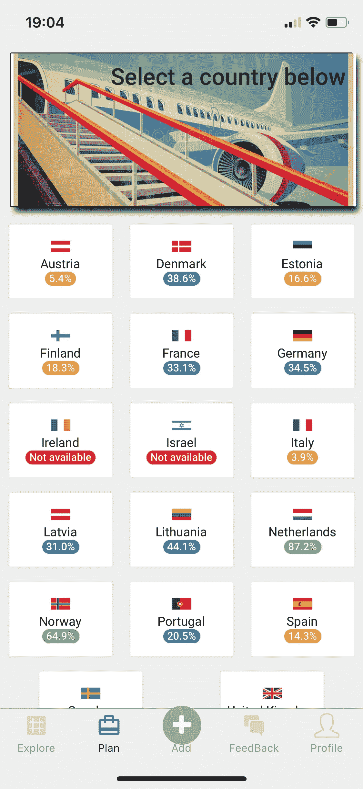

# 在我的应用上利用机器学习

> 原文：<https://blog.devgenius.io/utilizing-machine-learning-on-my-app-3d418e1af02?source=collection_archive---------15----------------------->

在过去的 9 个月里，我一直在开发一个应用程序，它可以利用我一直在研究的机器学习来理解移民过程。

老实说，第一个版本没有解决任何问题。这只是应用程序能做什么的一个支点，但它可以决定未来的研究方向。

由于我没有很多追随者，这里我解释一下我的应用程序是什么:

> ClusterStack 是一个应用程序，它聚集了生活在国外的移民和想要移居国外的潜在移民。

是的，这是众多应用中的另一个，它试图为一个特定的细分市场创建社交媒体。那么，这其中的关键是什么，机器学习在哪里？

在开发这款应用的这一个月里，我一直在研究和收集数据，其中包含一系列信息:

*   在过去 5 年中，来自不同国家的移民申请欧盟、美国、英国、加拿大和南方共同市场国家的人数
*   过去 5 年被不同国家拒绝的移民人数
*   在这些国家申请并被批准/拒绝的技术移民
*   各国对移民和本国签证的规定
*   移民来自的所有国家的平均生活成本**来自**
*   所有国家移民的平均生活成本都适用于**到**
*   从和**到**的平均工资

**有了这些信息，我可以创建并生成 3 个机器学习模型，其中 2 个还没有足够的干净数据，但有一个我可以利用:**

*   **一个人从一个国家到一个欧洲国家的签证批准百分比**
*   **一个人可以根据自己的信息寻求申请欧洲国家的最佳签证类型**
*   **获取移民平均生活成本的最佳国家**

**有了所有这些信息，我在我的应用程序中创建了一个名为 **Plan** 的功能，用户可以计划移居国外。**

**我已经可以使用签证批准的百分比，这是显示信息的屏幕:**

****

**如您所见，我的应用程序现在可以检查用户的原籍国，根据我的模型进行预测，并移动自己的百分比变化。看起来有点，其实很多。这需要一定的时间来开发，并且有一个端到端的应用程序可以显示它，几乎没有时间，由一个人开发。这是一份相当不错的工作。**

**当然，应用程序不只有这个特性，但本文中重要的是机器学习部分。那么，这些百分比意味着什么，低百分比意味着用户很少有机会搬到那个国家？不完全是。**

**该模型是根据历史数据训练的，这个百分比是该类型用户的情况，其中签证的批准率在 100%以内，没有可能延迟其申请的过程中的问题。**

**为了更加准确，该模型仍然需要微调，来自美国、加拿大和英国的更多数据被加入其中。现在有一个额外的挑战，使基于**点的系统**正常化，这些国家不仅要显示批准的百分比，还要返回最有可能成功的签证**类型**用户将能够申请移居这些国家。**

**你想看到这个工作吗？您可以在这里下载该应用程序:**

*   **Google Play:【https://play.google.com/store/apps/details? id = com . cluster stack . cluster stack**
*   **应用商店:[https://apps.apple.com/ie/app/clusterstack/id1495723069](https://apps.apple.com/ie/app/clusterstack/id1495723069)**

**干杯！**