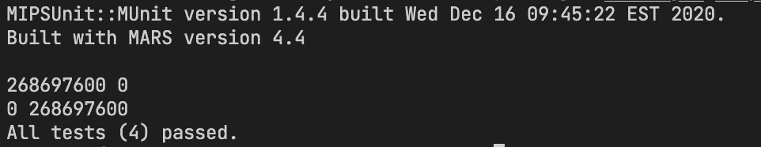
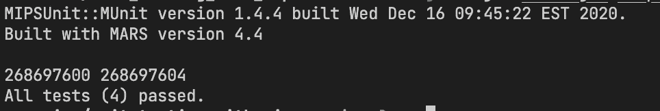
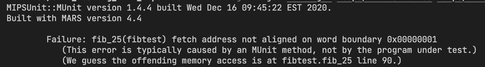
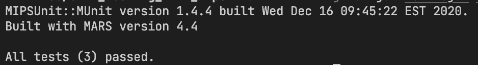

# 在程序集中使用堆

> 原文：<https://blog.devgenius.io/utilizing-the-heap-in-assembly-1f10011cdc1b?source=collection_archive---------7----------------------->

如何在代码运行后释放的结构上进行单元测试？

[](https://github.com/daminals/Unit_Testing_with_MUnit)

在 GitHub 上查看这个项目！

> 在本文中，我将在 MIPS 中向堆引入动态内存分配，并扩展在我以前的文章中定义的测试用例模型[来测试我的代码。如果你不熟悉 MIPS 编程语言，你可以看看这篇文章](https://medium.com/@danielkoganx/list/munit-and-mips-testing-77aed8ce48dc)

# 堆简介

在编程中，堆是内存的一部分，可以存储动态分配的变量。在许多不同的编程语言中，堆是一种重要的数据结构，用于管理和分配计算机系统中的内存。

堆支持在运行时而不是编译时分配内存，这是它的主要优点之一。因此，软件不再需要预先确定它需要多少内存，而是可以根据需要请求更多的内存。这对于内存需求波动或不可预测的程序尤其有用。

此外，堆是至关重要的，因为它们使内存分配和释放更有效。当不再需要内存时，程序可以将内存释放回堆，使其可供其他软件组件使用。这有助于防止内存泄漏，随着时间的推移，内存泄漏会导致程序消耗越来越多的内存，最终导致性能问题甚至崩溃。

除了内存管理之外，在数据排序和搜索算法中也经常使用堆。它们是程序员工具箱中的一个关键工具，知道如何正确地利用它们对于开发有效和高效的代码是至关重要的。

# 编码示例

在本文中，我将使用两个编码示例，一个简单的函数演示了堆如何工作以及我们如何对它们进行单元测试，然后一个复杂的示例应用了我在本文和前两篇文章中演示的概念。

## 保存到缓冲区

第一个例子是一个“save_to_buffer”函数，它将在堆中分配空间，将一个值保存到堆中，然后将堆地址存储在提供的缓冲区中。

我还将介绍一个我将在这个函数中使用的宏。

```
.macro allocateHeapSpace(%a)
  # ALLOCATE HEAP SPACE
  addi $sp, $sp, -4 
  sw $a0, 0($sp)
  li $v0, 9
  li $a0, %a 
  syscall
  lw $a0, 0($sp)
  addi $sp, $sp, 4
.end_macro
```

MIPS 中的宏类似于高级编程语言中的函数。对于 MIPS 中的函数，我们传统上必须在跳转和链接到代码中的另一个标签之前将$ra 存储在堆栈中，这可能会引入许多错误和不必要的复杂性。宏允许我们编写代码，这些代码可以在编译时简单地复制并粘贴到我们的函数中。我们也将在编译时用适当的寄存器替换`%a`。

这个宏将允许我们在堆中分配空间，我们将用它来保存我们的值。

第一个例子很简单，下面是代码:

```
.globl save_to_buffer
save_to_buffer:
  # a0 = buffer, a1 = value, a2 = where_to_store_in_buffer
  allocateHeapSpace(4) # saves address to v0
  sw $a1, 0($v0)       # save value to heap
  sll  $a2, $a2, 2     # Multiply by 4
  add $a0,$a0,$a2      # find correct locale in buffer to store
  sw $v0, 0($a0)       # save heap address to buffer
  jr $ra
```

我现在将展示我们的单元测试文件，以及一些预定义的测试。

```
import org.junit.*;
import org.junit.rules.Timeout;

import java.util.*;
import java.io.*;
import java.util.concurrent.TimeUnit;

import static edu.gvsu.mipsunit.munit.MUnit.Register.*;
import static edu.gvsu.mipsunit.munit.MUnit.*;
import static edu.gvsu.mipsunit.munit.MARSSimulator.*;

import org.junit.rules.Timeout;
import java.util.concurrent.TimeUnit;

public class buffertest {

  int sp = 0;
  int s0 = 0;
  int s1 = 0;
  int s2 = 0;
  int s3 = 0;
  int s4 = 0;
  int s5 = 0;
  int s6 = 0;
  int s7 = 0;
  int gp = 0;

  @Before
  public void preTest() {
    s0 = get(s0);
    s1 = get(s1);
    s2 = get(s2);
    s3 = get(s3);
    s4 = get(s4);
    s5 = get(s5);
    s6 = get(s6);
    s7 = get(s7);
    sp = get(sp);
    gp = get(gp);
  }

  @After
  public void postTest() {
    Assert.assertEquals("Register convention violated $s0", s0, get(s0));
    Assert.assertEquals("Register convention violated $s1", s1, get(s1));
    Assert.assertEquals("Register convention violated $s2", s2, get(s2));
    Assert.assertEquals("Register convention violated $s3", s3, get(s3));
    Assert.assertEquals("Register convention violated $s4", s4, get(s4));
    Assert.assertEquals("Register convention violated $s5", s5, get(s5));
    Assert.assertEquals("Register convention violated $s6", s6, get(s6));
    Assert.assertEquals("Register convention violated $s7", s7, get(s7));
    Assert.assertEquals("Register convention violated $sp", sp, get(sp));
    Assert.assertEquals("Register convention violated $gp", gp, get(gp));
  }

  @Rule
  public Timeout timeout = new Timeout(30000, TimeUnit.MILLISECONDS);

  @Test
  public void save_12() {
    Label output_buffer = wordData(0,0,0,0,0,0,0,0,0,0,0,0,0,0,0,0,0,0,0,0,0,0,0,0,0,0,0,0,0,0,0,0,0,0,0,0,0,0,0,0,0,0,0,0,0,0,0,0,0,0,0,0,0,0,0,0,0,0,0,0,0,0,0,0,0,0,0,0,0,0,0,0,0,0,0,0,0,0,0,0,0,0,0,0,0); 
    run("save_to_buffer", output_buffer, 12,0);
    Assert.assertEquals(12, getWord(getWord(output_buffer.address())));
  }

  @Test
  public void save_47() {
    Label output_buffer = wordData(0,0,0,0,0,0,0,0,0,0,0,0,0,0,0,0,0,0,0,0,0,0,0,0,0,0,0,0,0,0,0,0,0,0,0,0,0,0,0,0,0,0,0,0,0,0,0,0,0,0,0,0,0,0,0,0,0,0,0,0,0,0,0,0,0,0,0,0,0,0,0,0,0,0,0,0,0,0,0,0,0,0,0,0,0); 
    run("save_to_buffer", output_buffer, 47, 0);
    Assert.assertEquals(47, getWord(getWord(output_buffer.address())));
  }

  @Test
  public void save_ascii() {
    Label ascii = asciiData(true, "I love MIPS!");
    Label output_buffer = wordData(0,0,0,0,0,0,0,0,0,0,0,0,0,0,0,0,0,0,0,0,0,0,0,0,0,0,0,0,0,0,0,0,0,0,0,0,0,0,0,0,0,0,0,0,0,0,0,0,0,0,0,0,0,0,0,0,0,0,0,0,0,0,0,0,0,0,0,0,0,0,0,0,0,0,0,0,0,0,0,0,0,0,0,0,0); 
    run("save_to_buffer", output_buffer, ascii,0);
    Assert.assertEquals("I love MIPS!", getString(getWord(getWord(output_buffer.address()))));
  }

  @Test
  public void save_12_and_47() {
    Label output_buffer = wordData(0,0,0,0,0,0,0,0,0,0,0,0,0,0,0,0,0,0,0,0,0,0,0,0,0,0,0,0,0,0,0,0,0,0,0,0,0,0,0,0,0,0,0,0,0,0,0,0,0,0,0,0,0,0,0,0,0,0,0,0,0,0,0,0,0,0,0,0,0,0,0,0,0,0,0,0,0,0,0,0,0,0,0,0,0); 
    run("save_to_buffer", output_buffer, 12,0);
    Assert.assertEquals(12, getWord(getWord(output_buffer.address())));
    run("save_to_buffer", output_buffer, 47,1);
    Assert.assertEquals(47, getWord(getWord(output_buffer.address()+4)));
  }
}
```

运行之后，我们的测试用例似乎表明我们的代码运行正确。然而，让我们添加一种方法来查看我们的缓冲区到我们的`save_12_and_47`函数中的内容:

```
 @Test
  public void save_12_and_47() {
    Label output_buffer = wordData(0,0,0,0,0,0,0,0,0,0,0,0,0,0,0,0,0,0,0,0,0,0,0,0,0,0,0,0,0,0,0,0,0,0,0,0,0,0,0,0,0,0,0,0,0,0,0,0,0,0,0,0,0,0,0,0,0,0,0,0,0,0,0,0,0,0,0,0,0,0,0,0,0,0,0,0,0,0,0,0,0,0,0,0,0); 
    run("save_to_buffer", output_buffer, 12,0);
    Assert.assertEquals(12, getWord(getWord(output_buffer.address())));
    for (int i=0; i<2; i++) System.out.print(getWord(output_buffer.address()+i*4) + " ");
    System.out.println();
    run("save_to_buffer", output_buffer, 47,1);
    Assert.assertEquals(47, getWord(getWord(output_buffer.address()+4)));
    for (int i=0; i<2; i++) System.out.print(getWord(output_buffer.address()+i*4) + " ");
    System.out.println();
  }
```

并观察输出:



缓冲区未更新，堆地址相同

如您所见，我们的缓冲区没有更新，我们的堆地址也完全相同。理论上，应该在堆中分配新的空间(*地址 268697604* )，但是，似乎两个值使用了同一个空间。

嗯，在单元测试 MIPS 中，堆在每个单独的函数之后被释放。这意味着每次为每个单独的功能分配相同的空间。这就引出了一个问题:我们如何测试利用堆的 MIPS 函数？

做这件事的最佳方式实际上是在 mips 中将测试用例写成一个函数，然后在 MUnit 中测试这个函数。我举个例子吧！

```
# ...continued from save_to_buffer...

.globl save_12_and_47_test
save_12_and_47_test:
  # a0 = buffer // do not take in // a1=value a2=where_to_store_in_buffer
  addi $sp,$sp,-4
  sw $ra, 0($sp)
  li $a1,12
  li $a2,0
  jal save_to_buffer
  lw $ra, 0($sp)
  li $a1,47
  li $a2, 1
  jal save_to_buffer
  lw $ra, 0($sp)
  addi $sp,$sp,4
  jr $ra
```

```
 @Test
  public void save_12_and_47() {
    Label output_buffer = wordData(0,0,0,0,0,0,0,0,0,0,0,0,0,0,0,0,0,0,0,0,0,0,0,0,0,0,0,0,0,0,0,0,0,0,0,0,0,0,0,0,0); 
    run("save_12_and_47_test", output_buffer);
    int[] solutions = {12,47};
    for (int i=0; i<2; i++) System.out.print(getWord(output_buffer.address()+i*4) + " ");
    System.out.println();
    for (int i=0; i<solutions.length; i++) Assert.assertEquals(solutions[i],getWord(getWord(output_buffer.address()+i*4)));
  }
```

让我们来看看结果:



堆地址是正确的

太好了！堆地址符合我们的预期，测试用例已经通过了！

## 记忆化的斐波那契

对于这个编码示例，我想使用记忆化修改我在第一篇 MUnit 文章中写的 fibonacci 函数。记忆化是一种提高函数速度的技术，它通过缓存昂贵的函数调用的结果，并在再次使用相同的输入时返回缓存的结果。

在我们的新版本中，我们将在堆中分配空间来存储 Fibonacci 函数以前的值。在我们的 Fibonacci 函数中，除了 n 之外，我们还将接受这个存储堆的地址。这个堆地址将作为一个地址数组，指向堆中的点，结果是不同的 Fibonacci 数。数组将按顺序存储，这意味着数组[0]的地址指向第一个斐波那契数，数组[1]指向第二个，依此类推。我们将检查这个数组，看它是否存储了 Fibonacci(n)的答案，如果没有，我们将运行递归函数，将每个新数字保存到数组中。

下面是我们在堆中创建的数据结构的伪代码示例:

```
buffer fib_array:
  words[addressToFib1, addressToFib2, addressToFib3,...., addressToFib100]
```

这被表示为一个标签，指向包含我们的斐波纳契数解的地址或 null 的字的数组。

现在是这样的:

```
# Compute the nth fibonacci number
#
# n: the index of the fibonacci number to compute
#
# return: the nth fibonacci number

.globl fibonacci
fibonacci:
    # inputs: a0=n
    # Check if n is 0 or 1
    li $t0, 1
    beqz $a0, return_0
    beq $a0, $t0, return_1

    # Compute the (n-1)th and (n-2)th fibonacci numbers
    addi $sp, $sp, -16    # allocate space on the stack
    sw $ra, 4($sp)       # save return address
    sw $a0, 0($sp)       # save n
    addi $a0, $a0, -1    # n-1
    jal fibonacci        # call fibonacci(n-1)
    sw $v0, 8($sp)       # store fib(n-1) in the stack
    lw $a0, 0($sp)       # restore n
    addi $a0, $a0, -2    # n-2
    jal fibonacci        # call fibonacci(n-2)
    sw $v0, 12($sp)      # store fib(n-2) in the stack
    lw $ra, 4($sp)       # restore return address
    # Return the sum of the (n-1)th and (n-2)th fibonacci numbers
    lw $v0, 8($sp)       # load fib(n-1)
    lw $v1, 12($sp)      # load fib(n-2)
    add $v0, $v0, $v1

    addi $sp, $sp, 16     # deallocate space on the stack
    jr $ra

return_0:
    li $v0, 0    # return 0
    jr $ra

return_1:
    li $v0, 1    # return 1
    jr $ra
```

除了 allocateHeapSpace 之外，我还编写了一些更有用的宏。

```
.macro getFibFrom(%address, %n)
  # preserve s registers
  addi $sp, $sp, -8
  sw $s0, 0($sp)
  sw $s1, 4($sp)
  # logic
  li $s0,4
  mul $s0, %n, 4
  add $s0, $s0, %address
  lw $s1, 0($s0) # s1 now contains pointer to answer
  beqz $s1, fib_not_present # if no pointer exists, return false
  li $v1, 1 # return true
  lw $s0, 0($s1) # return answer
  move $v0, $s1
  j end_getFibFrom
  fib_not_present:
  li $v0, -1 # return false
  li $v1, -1
  # end logic
  end_getFibFrom:
  lw $s0, 0($sp)
  lw $s1, 4($sp)
  addi $sp, $sp, 8
.end_macro
```

```
.macro saveFibTo(%address, %n, %fib)
  # preserve s registers
  addi $sp, $sp, -8
  sw $s0, 0($sp)
  sw $v0, 4($sp)
  # logic
  li $s0,4
  mul $s0, %n, 4
  add $s0, $s0, %address
  allocateHeapSpace(4) # 4 bytes = 1 word
  sw %fib, 0($v0) # save fib to heap address
  sw $v0, 0($s0) # save heap address to array
  # end logic
  lw $s0, 0($sp)
  lw $v0, 4($sp)
  addi $sp, $sp, 4
.end_macro
```

```
.macro allocateHeapSpaceReg(%a)
  # ALLOCATE HEAP SPACE WITH REGISTER INSTEAD OF IMMEDIATE
  addi $sp, $sp, -4 
  sw $a0, 0($sp)
  li $v0, 9
  move $a0, %a 
  syscall
  lw $a0, 0($sp)
  addi $sp, $sp, 4
.end_macro
```

以及使用堆创建新的 fib 号数组的函数:

```
.globl instantiate_array
instantiate_array:
  # a0 = array size
  allocateHeapSpaceReg($a0)
  move $a1, $v0
  # set elements 0, 1 in buffer as base case
  li $t0,1
  saveFibTo($a1,$0,$0)
  saveFibTo($a1,$t0,$t0)
  move $v0, $a1
  jr $ra
```

现在，让我们把它们放在一起，得到我们新的斐波那契函数！

```
.globl fibonacci
fibonacci:
    # inputs: a0=n a1=buffer
    # check if buffer contains answer:
    getFibFrom($a1, $a0)
    bgtz $v1, end_fibonacci

    # set elements 0, 1 in buffer as base case
    li $t0,1
    saveFibTo($a1,$0,$0)
    saveFibTo($a1,$t0,$t0)
    addi $sp, $sp, -4
    sw $ra, 0($sp)
    jal fibonacci_helper # run fib function
    lw $ra, 0($sp)
    addi $sp,$sp, 4
    end_fibonacci:
      jr $ra

.globl fibonacci_helper
fibonacci_helper:
    # inputs: a0=n a1=buffer
    # Check if n is 0 or 1
    li $t0, 1
    beqz $a0, return_0
    beq $a0, $t0, return_1

    addi $sp, $sp, -4
    sw $0, 0($sp) # marker to save result to buffer
    # check if fib(n) is in the list
    getFibFrom($a1, $a0)
    addi $sp, $sp, 4
    bgtz $v0, return_fib_result
    addi $sp, $sp, -4
    li $t0, 1
    sw $t0, 0($sp) # marker to save result to buffer

    # Compute the (n-1)th and (n-2)th fibonacci numbers
    addi $sp, $sp, -16   # allocate space on the stack
    sw $ra, 4($sp)       # save return address
    sw $a0, 0($sp)       # save n
    addi $a0, $a0, -1    # n-1
    jal fibonacci_helper # call fibonacci(n-1)
    sw $v0, 8($sp)       # store fib(n-1) in the stack
    lw $ra, 4($sp)       # save return address
    lw $a0, 0($sp)       # restore n
    addi $a0, $a0, -2    # n-2
    jal fibonacci_helper # call fibonacci(n-2)
    sw $v0, 12($sp)      # store fib(n-2) in the stack
    lw $ra, 4($sp)       # restore return address
    # Return the sum of the (n-1)th and (n-2)th fibonacci numbers
    lw $v0, 8($sp)       # load fib(n-1)
    lw $v1, 12($sp)      # load fib(n-2)
    add $v0, $v0, $v1    # solution
    lw $a0, 0($sp)       # restore n
    addi $sp, $sp, 16    # deallocate space on the stack
    j end_fibonacci_n

    return_0:
      li $v0, 0    # return 0
      jr $ra

    return_1:
      li $v0, 1    # return 1
      jr $ra

    end_fibonacci_n:
      lw $t0, 0($sp)
      beqz $t0, return_fib_result
        # save result
        move $t0, $v0 # avoid using special registers as inputs
        saveFibTo($a1,$a0,$t0)
        addi $sp, $sp, 4
      return_fib_result:
        jr $ra
```

这里我们修改了原始代码的几个部分。我们添加了一个新的 helper 函数，它包含了我们大部分的旧代码，并放弃了`fibonacci`标签，包含了对我们的值的缓冲区搜索，并为我们添加了基本案例。在`fibonacci_helper`中，我们添加了一个检查来查看 fib(n-1 或 n-2)是否包含在缓冲区中，否则求解它们并将结果添加到缓冲区中的正确位置。

这里使用的例子并不是一个很好的利用堆的例子，因为我们存储了指向 int 的指针，而 int 可以很好地工作，然而这更多的是为了示范而不是最有效的代码。我们编写的代码的主要优点是不再需要计算两次斐波那契数，当我们多次运行该函数时，它将保持快速而不是缓慢。

我已经为我们的新功能修改了我在本文的[中展示的测试用例，然后创建新的测试用例来充分利用这些特性！](https://medium.com/dev-genius/introduction-to-unit-testing-in-munit-4ce7e24ff3f4)

```
 @Test
  public void test_zero() {
    run("instantiate_array", 20);
    run("fibonacci", 0,get(v0));
    Assert.assertEquals(0, get(v0));
  }

  @Test
  public void test_one() {
    run("instantiate_array", 20);
    run("fibonacci", 1,get(v0));
    Assert.assertEquals(1, get(v0));
  }

  @Test
  public void fib_25() {
    run("instantiate_array", 120);
    int address = get(v0);
    for (int n=2; n<25; n++){
      run("fibonacci", n, get(v0)); 
      Assert.assertEquals("fibonacci failed at n=" + n, fibonacci_nums[n], get(v0));
      // test buffer
      for (Integer i=0; i<n; i++) Assert.assertEquals("failed at buffer_val=" + i.toString(), fibonacci_nums[i], getWord(getWord(address+i*4)));    
    }
  }
```

现在在测试`fib_25`时出现了一个问题，我们得到的错误是:



穆尼特没能得到一个词

这也是我们之前遇到的问题，MUnit 覆盖了之前分配的堆空间。因此，我们测试此代码的最佳方式是编写基于 MIPS 函数的测试用例，以展示此新函数可以使用实例化的数组和以前 fib 编号的值。

```
# ...continued from fibonacci_helper...

.globl test_fib_0
test_fib_0:
  # inputs: a0=array_size
  addi $sp, $sp, -8
  sw $ra, 0($sp)

  jal instantiate_array
  lw $ra, 0($sp)
  move $a1, $v0
  sw $v0, 4($sp)

  li $a0, 14
  jal fibonacci
  lw $ra, 0($sp)
  li $a0, 21
  jal fibonacci
  lw $ra, 0($sp)
  lw $v1, 4($sp)
  addi $sp, $sp, 8
  jr $ra
```

```
 @Test
  public void test_fib_0() {
    run("test_fib_0", 100); 
    Assert.assertEquals(fibonacci_nums[21], get(v0));
    for (int n=0;n<21;n++) Assert.assertEquals("fibonacci failed at n="+n, fibonacci_nums[n], getWord(getWord(get(v1)+n*4)));
  }
```

当我们运行我们的测试用例时，我们可以看到它们是成功的！



成功！

有大量的其他测试案例可以应用到这个函数上，因为它有很多可能出错的地方。然而，由于本文的目的是演示如何在 MUnit 中测试缓冲区，我将把这些额外的测试用例留给读者作为练习。请随意分叉这个项目的存储库，如下所示！

[](https://github.com/daminals/Unit_Testing_with_MUnit) [## GitHub-da minals/Unit _ Testing _ with _ MUnit

### 学习使用基于 JUnit 的测试框架 MUnit…

github.com](https://github.com/daminals/Unit_Testing_with_MUnit) 

不要害怕看我以前关于这个话题的文章，看看下面的列表吧！


丹尼尔·科岗

## MIPS 和 MUnit 测试

[View list](https://medium.com/@danielkoganx/list/mips-and-munit-testing-77aed8ce48dc?source=post_page-----1f10011cdc1b--------------------------------)4 stories