# UX 案例研究—重新设计 M-Tix 机票订购和支付流程

> 原文：<https://blog.devgenius.io/ux-case-study-redesigning-m-tix-ticket-ordering-and-payment-flow-ef302539420a?source=collection_archive---------5----------------------->

*免责声明:我们不是 M-Tix 开发团队的成员。这项研究是与 Binar Bootcamp 产品管理团队合作进行的。*

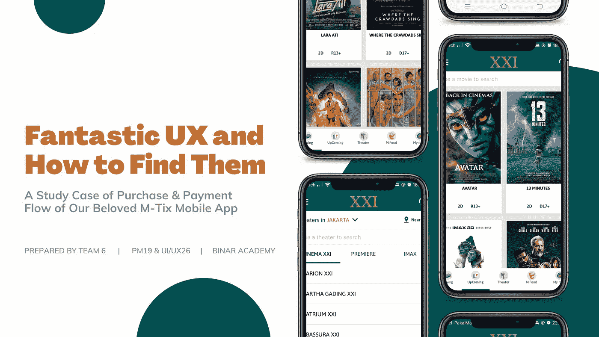

# **概述**

从 2022 年 7 月开始，我参加了 Binar 学院举办的 UI/UX 研究和设计训练营。随着训练营即将结束，请允许我向您介绍我的第一个 UI/UX 案例研究，它是与我的 UI/UX 学生同伴以及产品管理团队成员合作完成的。

我们被指派重新设计我们自己选择的应用程序，通过 3 名产品经理(pm)和 3 名 UI/UX 设计师之间的讨论，我们决定重新设计 **M-Tix** 应用程序，特别是在**机票订购和支付流程**中。M-Tix 是由 Cinema XXI 开发的在线票务应用程序，Cinema XXI 是印度尼西亚最大的影院利益相关者之一。

我们实施了为期两周的设计冲刺，第一周的重点是通过研究了解我们的用户，并根据访谈结果构思解决方案。然后，在第二周，我们通过原型制作和测试来关注我们想法的实现。在 sprint 期间，除了做用户界面和 UX 设计，我还被赋予了一项职责，那就是在制定研究问题和构建谷歌表单方面发挥促进作用，同时还利用亲和图促进 Miro 中的构思过程。

## **团队成员:**

*   **UI/UX 研究与设计:**杰森·威尔伯特、恩西克·穆罕默德·法伊祖尔·尼萨姆、拉斐尔·阿尔多。
*   **产品管理团队** : Eurlich Allan，Ibrahim Hanif，Mei Lusiana Lubis。
*   **导师和主管**:dienabullah Putri，Ariel Liauw

# **简要背景**

## 谁不爱看电影？

随着媒体和互联网的兴起，电影是当今社会的主要内容，尤其是在印度尼西亚。人们倾向于在电影院通过顶部扬声器和大屏幕获得更好的观看电影的体验。随着 Tix-Id、M-Tix、Go-Tix 等在线票务应用的兴起，订票也变得很容易。

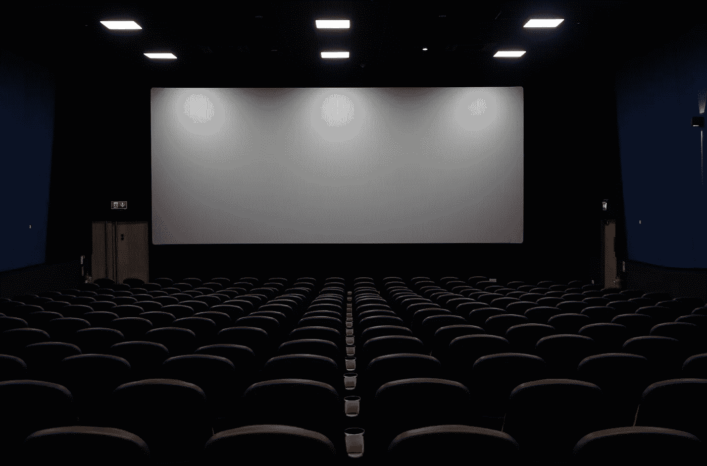

电影院(来源:unsplash.com)

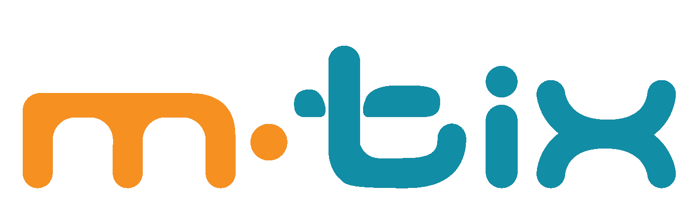

M-Tix 和 XXI 影院标志

作为印尼最大的影院利益相关者开发的应用程序，M-Tix 已经落后于其竞争对手，在谷歌 Play 商店和 iOS 应用商店的评分分别为 3.5 和 2.4。

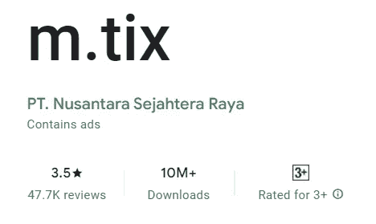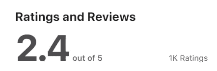

谷歌 Play 商店(左)和苹果应用商店(右)的 M-Tix 评分

即使评级很低，人们仍然使用 M-Tix 作为他们主要的在线票务应用程序，特别是在印度尼西亚东部，因为 Cinema XXI 拥有那里的大部分市场。然而，随着 CGV 和 Cinepolis 等其他影院竞争对手的崛起和扩张，这可能会成为 Cinema XXI 重新考虑改善在线票务体验的关键点，以竞争和维持对他们有利的市场。因此，通过这项研究，我们作为 Cinema XXI 的一个团队，承担了重新设计在线售票应用程序 M-Tix 的任务。

## **了解业务**

在我们开始重新设计 M-Tix 应用程序之前，首先我们想了解 M-Tix 和 Cinema XXI 作为一个企业是如何运作的。我们试图了解什么是关键活动，他们的收入，以及谁是他们的目标客户群。我们将我们的发现整理成了下面的商业模式。

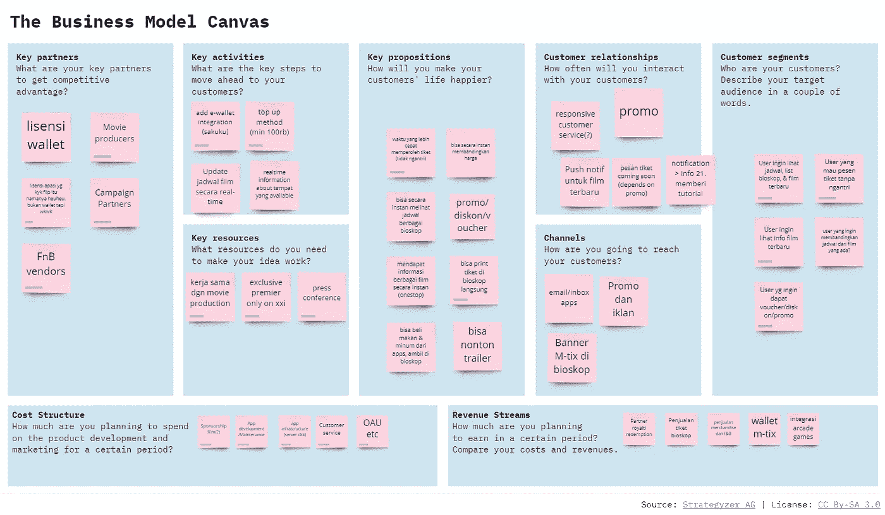

M-Tix 的业务模型画布(BMC)

基于我们构建的 BMC，我们能够识别 M-Tix 应用在 Cinema XXI 收入流及其目标客户群中的存在。

# **设计流程**

## **感同身受**

## **那么……有什么问题吗？为什么收视率这么低？**

我们决定阅读一些 M-Tix 用户评价较低的评论，并为每个评论贴上核心痛点的标签。

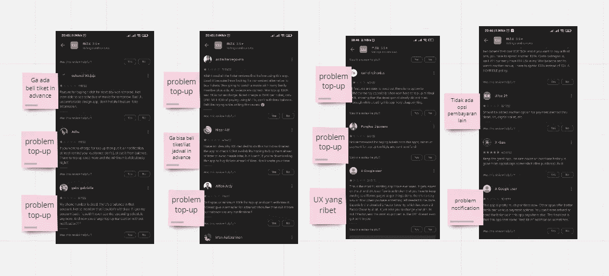

Miro 中的问题识别

我们发现用户在使用 M-Tix 应用程序时有 4 个不同的核心问题。这些问题包括:

1.  用户有一个糟糕的 UX 体验。
2.  用户无法提前查看电影时间表。
3.  M-Tix 的钱包有一大笔充值费。
4.  M-Tix 钱包里面的钱是无法找回的。

通过这种方法，我们假设用户在使用 M-Tix 时遇到了支付系统问题，并且在网上订购机票时有糟糕的体验(通过糟糕的 UX 体验点)。由于我们拥有的数据仍然是一个假设，我们决定对一些 M-Tix 用户进行用户研究，以验证我们的假设。

## **研究！研究！研究！！**

我们设计了一个研究计划，在研究过程中帮助指导我们。研究计划包括:

> **研究目的:**验证我们关于 M-Tix 问题的假设
> 
> **研究方法:**对选定的调查受访者(最少:5 名受访者)进行调查和访谈
> 
> **参与者标准:**劳动人民(？)年龄 20–30 岁。
> 
> **调查期:**2022 年 9 月 13 日至 18 日(5 天:3 天调查，2 天访谈)
> 
> **所用工具:
> - Google 表单:**进行调查
> - **Whatsapp 和 Discord:** 联系被选中的受访者进行进一步的访谈
> - **Zoom:** 进行访谈
> - **Miro:** 分析访谈结果。

## **调查问题**

我们制定的调查问题侧重于用户使用 M-Tix 的体验，特别是在查找电影时间表、在线订票和 M-Tix 的支付流程方面。

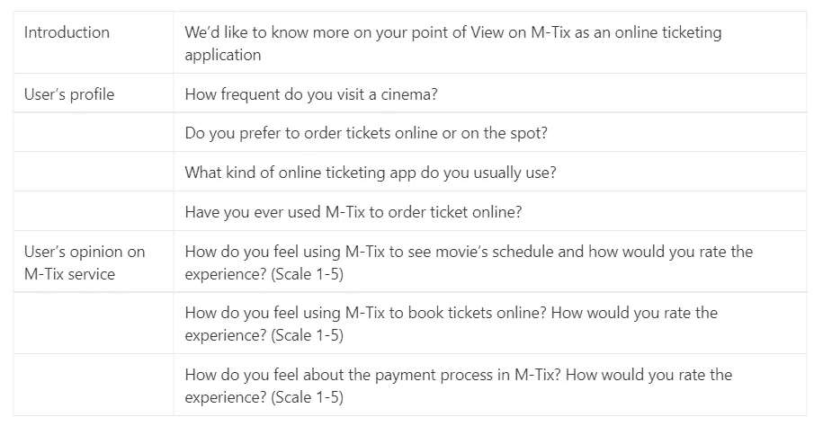

表中汇编的调查问题。

## **面试流程**

我们从调查中选择了 5 名受访者进行进一步的访谈，以更深入地了解他们在使用 M-Tix 应用程序时遇到的问题。用于选择受访者的标准包括:

1.  使用过 M-Tix 的用户
2.  对调查中询问的最少一项 M-Tix 服务相对不满意
3.  自愿接受采访的用户

面试过程在两天内完成(2022 年 9 月 17 日至 18 日)，使用 Zoom 作为面试平台。每个回答者都被分配了一个任务来操作当前的 M-Tix 应用程序，特别是 M-Tix 的三个主要功能(电影时间表、订购门票和支付)。在此过程中，面试官将询问每个用户在每项任务中遇到的主要问题，并确定他们的难点，同时突出他们在调查中的答案。我们以这种方式进行采访，是为了在用户操作 M-Tix 应用程序时对他们有一个更清晰的了解，同时让用户感觉参与到这个过程中来。

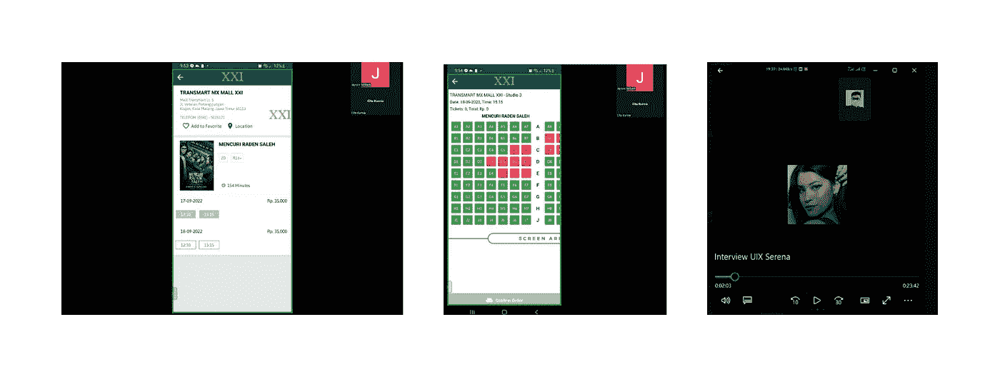

与选定受访者的访谈过程

# **定义**

## 研究见解

我们使用亲和图作为主要工具，从调查和访谈中收集数据。

## **调查**

我们从调查中收集了 21 份回复。通过调查，我们发现大多数用户(81%)更喜欢在线订票。66.7%的受访者将 Tix-id 作为他们预订机票的主要应用。

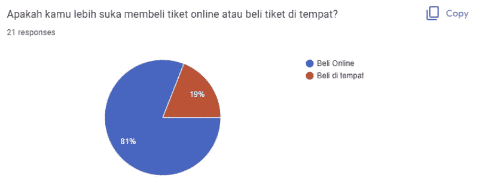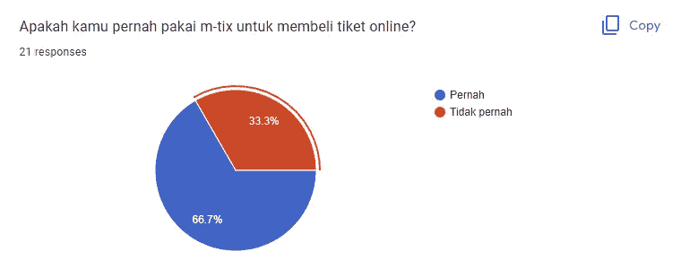

我们发现的一个独特见解是，21 名受访者中有 14 人使用过 M-Tix 订票，我们认为有些人表示用户退而使用了其他应用程序。

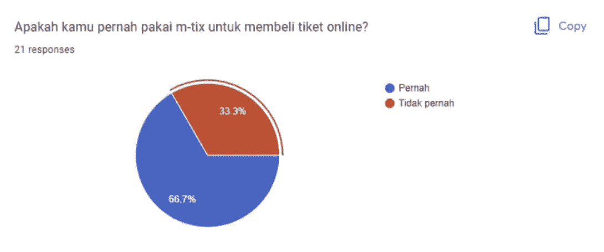

然后，我们根据之前设定的标准选择了 5 名受访者，他们在采访中的回答被编入亲和力图表。

## **亲和图**

我们汇编了每个用户的每一个回复，并将他们归类到相关的组中，以确定他们在使用 M-Tix 应用程序时发生的一些问题。

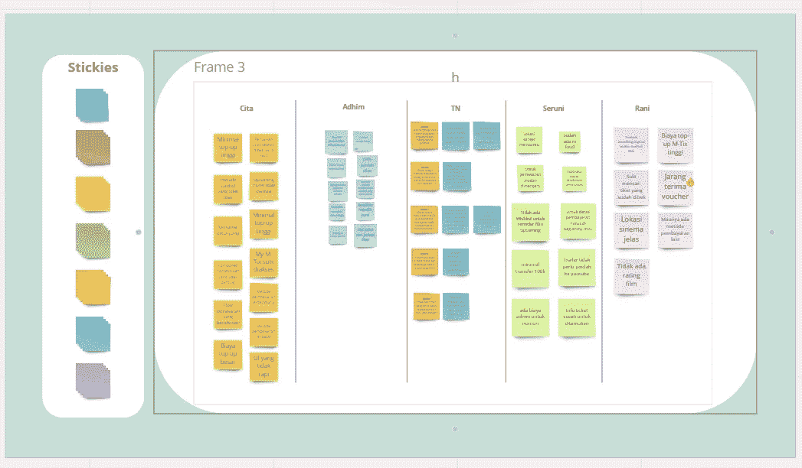

米罗面试回应的亲和图

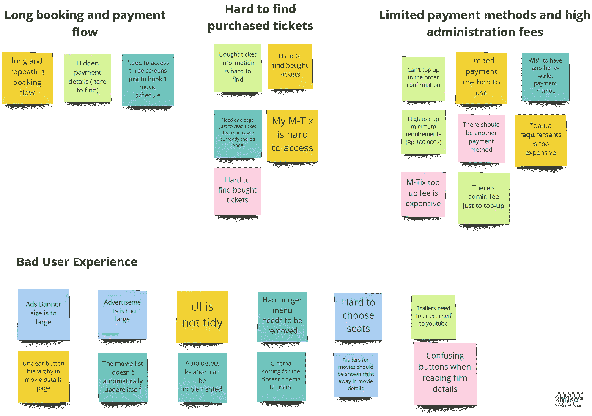

响应分类

一些最初的假设是正确的，包括“坏 UX”和“有限的支付方式”我们注意到用户遇到的另外两个核心问题是我们从最初的假设中没有得到的，包括“很难找到购买的门票”和“长时间的预订和支付流程”

识别出主要问题后，我们制作了一个图表，通过思考用户的**观点(POV)来了解他们的困难。**这将有助于我们正确地定义我们的主要问题，并有助于我们未来的发展

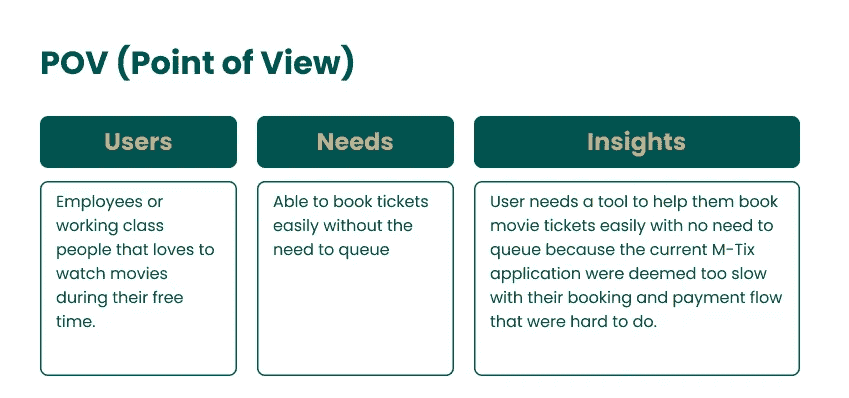

M-Tix 用户视点

## **用户角色**

我们还创建了一个用户角色，作为我们定位和指定目标用户的指南。查尔斯是一家科技公司的员工，他喜欢在空闲时间去电影院看电影。

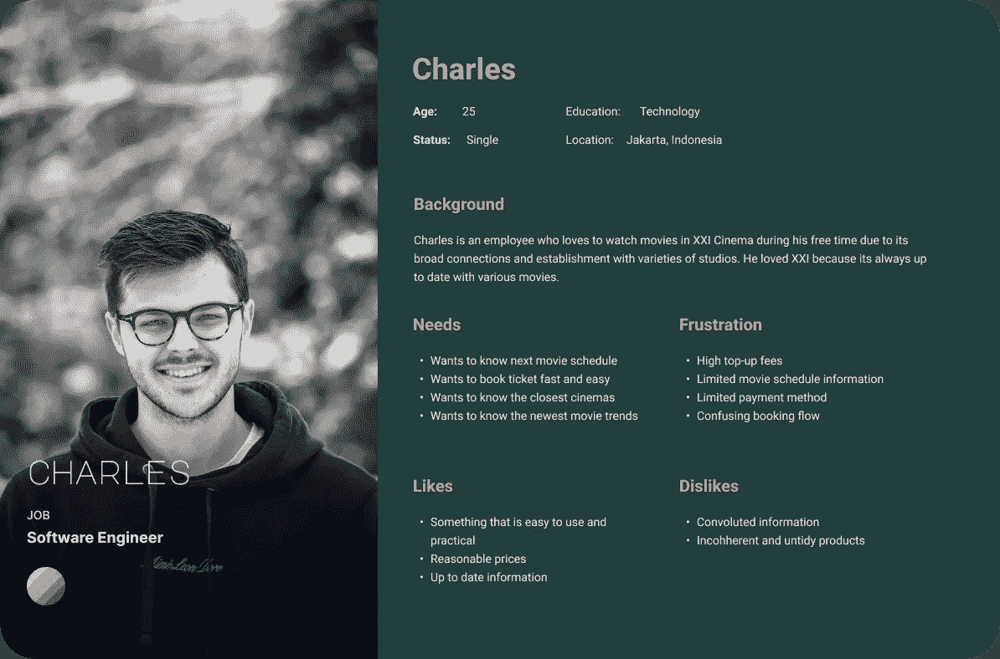

查尔斯作为 M-Tix 用户角色

## **用户旅程图**

当然，我们还设计了 Charles 使用 M-Tix 作为他的主要在线票务应用的旅程，并指出他在预订过程中的痛点。根据用户旅程图，我们希望特别改进预订流程，因为 Charles 在使用 M-Tix 时似乎在预订和支付流程方面存在很大问题。

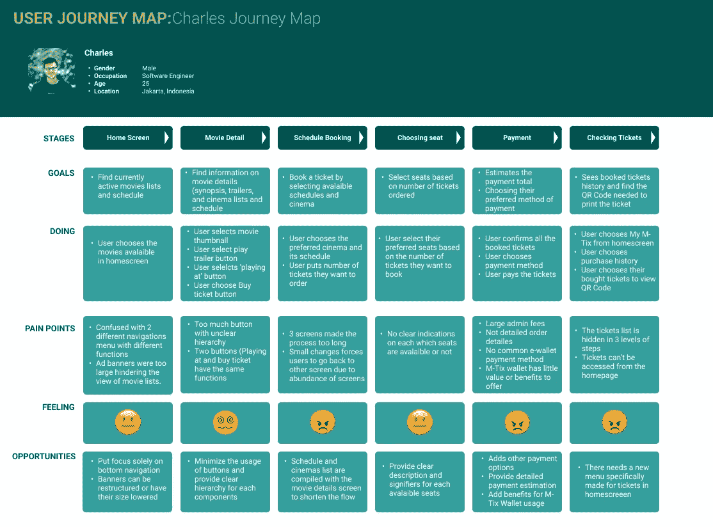

查尔斯用户旅程地图，使用 M-Tix 预订机票

## **我们怎么可能(HMW)**

随着对我们的用户和问题的理解，我们通过“如何可能”框架提出了几个问题

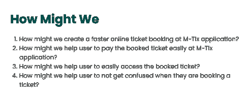

# **构思**

我们根据亲和力图中的 4 个主要问题类别一起构思了解决方案。

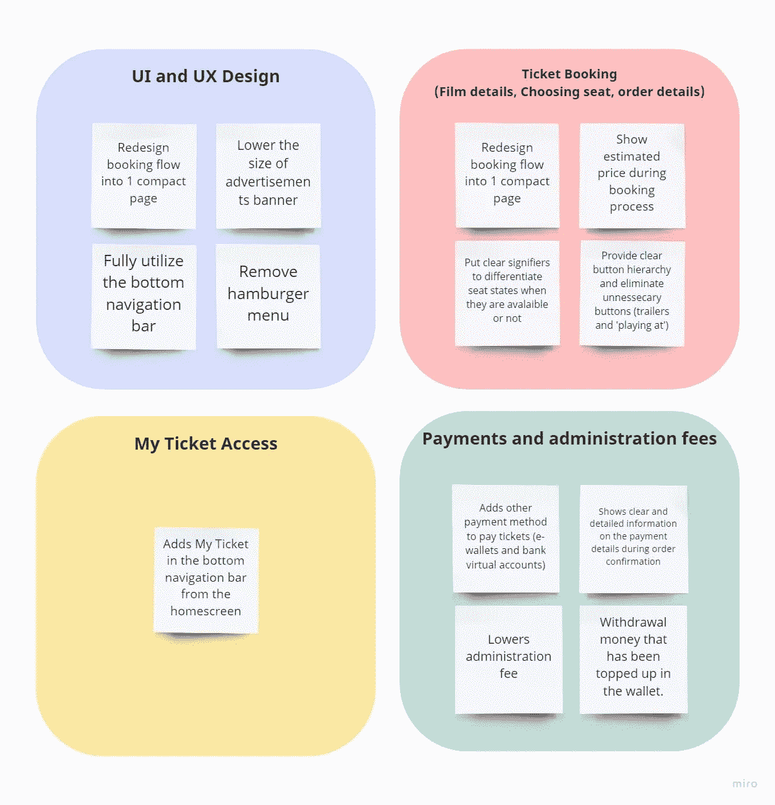

通过 Miro 生成解决方案

然后，我们使用艾森豪威尔矩阵来决定哪些有想法的解决方案将被用作我们的主要优先事项。我们决定不在支付和 M-Tix 钱包充值期间对管理费进行任何修改，也不进行任何与 M-Tix 钱包系统修改相关的修改，因为这些修改将影响 M-Tix 的业务效果，特别是通过管理费损失 M-Tix 的一个收入流。

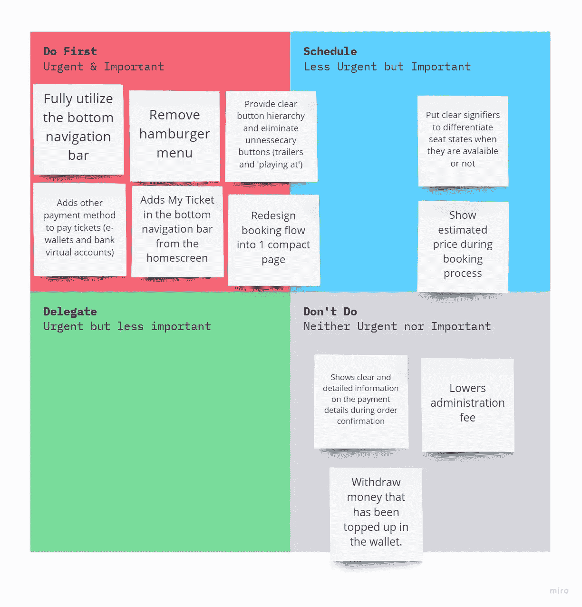

通过 Miro 确定问题优先级

## **添加:** **其他支付方式添加的问题。**

在最终模型和原型设计完成并经过充分测试后，我们开始了另一次设计冲刺迭代，在构思过程中，有一件事一直萦绕在我们脑海中，那就是增加电子钱包和虚拟账户作为替代支付方式。这些支付方法的增加可以为用户提供直接的好处，因为对他们来说更容易的选择是可用的。然而，这些变化可能有其不利之处，因为它们可能会降低 M-Tix 钱包的使用数量，而这是 M-Tix 应用程序的主要收入之一。因此，为了解决这个问题，我们与团队一起进行了一次构思会议，以提高 M-Tix 钱包的使用率。

M-Tix 钱包的最初问题是，它有一个很大的最低充值要求，除了支付电影票和食物之外，钱包本身几乎没有价值。一次 M-Tix 钱包充值可以支付 2 到 3 张电影票，如果用户只想预订一张票，这实际上伤害了他们。然而，改变最低充值要求或管理费，如我们之前所说，实际上可能会影响公司的收入。因此，考虑到这一点，本次会议的结果是为用户提供更多优惠，通过专为 M-Tix wallet 使用提供的促销和优惠券来推动 M-Tix wallet 的使用。如果人们使用 M-Tix 钱包支付门票，他们将获得更多的好处和优势。一些优惠可能包括买一送一的促销活动、免费饮料和其他优惠。

## **史诗和用户故事**

有了公式化的 HMW 问题，我们产品管理团队设计了史诗和用户故事来指导我们的 UI/UX 设计师

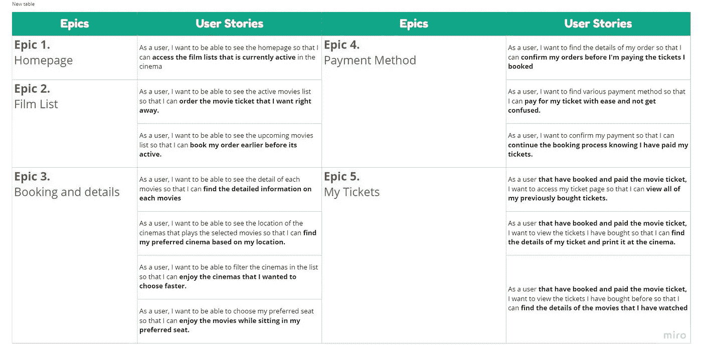

M-Tix 应用重新设计的史诗和用户故事

## **网站地图和用户流量**

继续设计产品，我们使用史诗和用户故事作为网站地图和用户流的基础。在这里，UI/UX 团队划分任务来设计它们，我参与制作网站地图、用户流、线框、模型和原型。

由于 M-Tix 网站地图的旧结构，用户无法从主页或仪表板访问他们的门票。用户需要访问他们的个人资料，然后选择购买历史来访问他们已经购买的门票。事实证明，访问已购买门票的过程很难找到，可能会给用户带来问题。因此，在我们新修改的流程中，我们决定将“我的票证”添加到主页底部的导航栏中，以帮助用户轻松访问他们的票证，并帮助流程更快地进行。

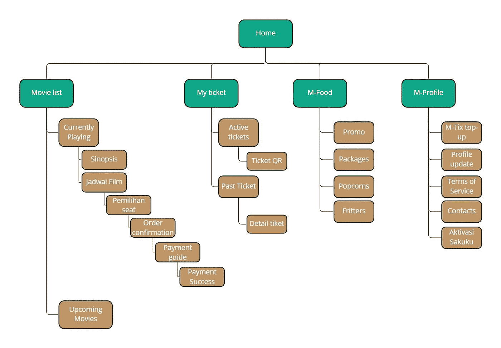

新设计的网站地图

## **用户流量**

我们决定通过缩短来修改预订流程。最初的流程要求用户浏览三个屏幕来查找电影时间表、地点和选择观看电影的时间。我们将这三个步骤合并到一个屏幕上，用户可以在这个屏幕上找到电影的时间表和地点，同时还可以立即选择观看时间。此外，用户现在能够在完成购票流程后立即访问他们的机票信息。

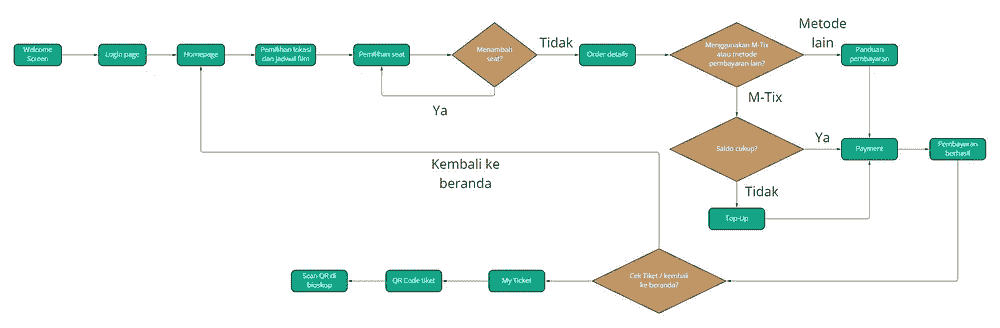

M-Tix 应用的旧用户流程(左)和新设计的流程(右)

# **原型**

## **线框和线流**

有了新达成的网站地图和用户流，我们为新的 M-Tix 布局创建了线框和线流。

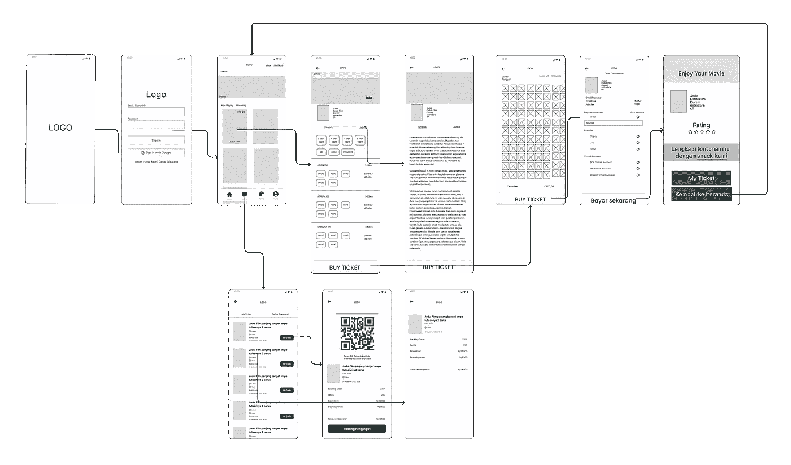

基于新设计的用户流的新设计的 M-Tix 应用的 Wireflow

订票流程

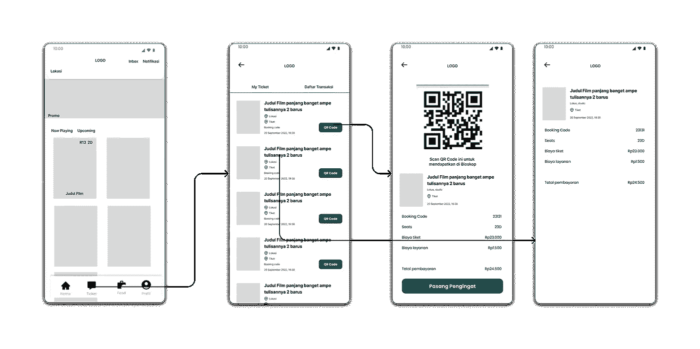

我的票证访问流程

## 高保真样机设计

在我们转向模型设计之前，需要一个 UI 工具包来确保设计的一致性。

## **UI 套件**

用于 M-Tix 重新设计的 UI 套件

我们决定使用原始的绿色来保持 M-Tix 的品牌身份，并添加我们自己的金色辅助色。这种颜色来自最初的 Cinema XXI 标志，因为它符合原色。

我们选择的类型空间是 Poppins。我们希望通过使用无衬线字体(如 Poppins)来保持“干净、简约和现代的电影院感觉”。

所使用的图标源自羽毛图标套件。增加了 Iconify 生成的图标。

## **实体模型设计**

每一个样机设计都考虑到了改进和解决旧的 M-Tix 应用程序设计的问题。对于每个屏幕之间更清晰的交互，你可以在原型中找到。

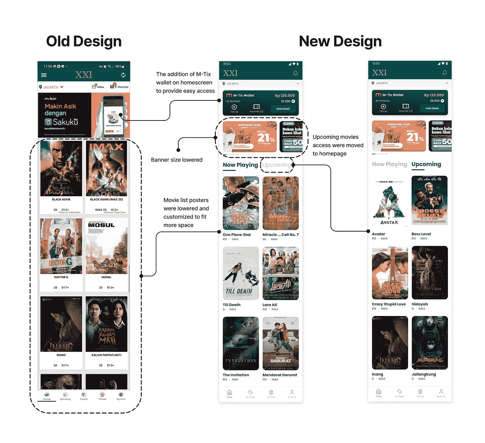

主页的样机设计

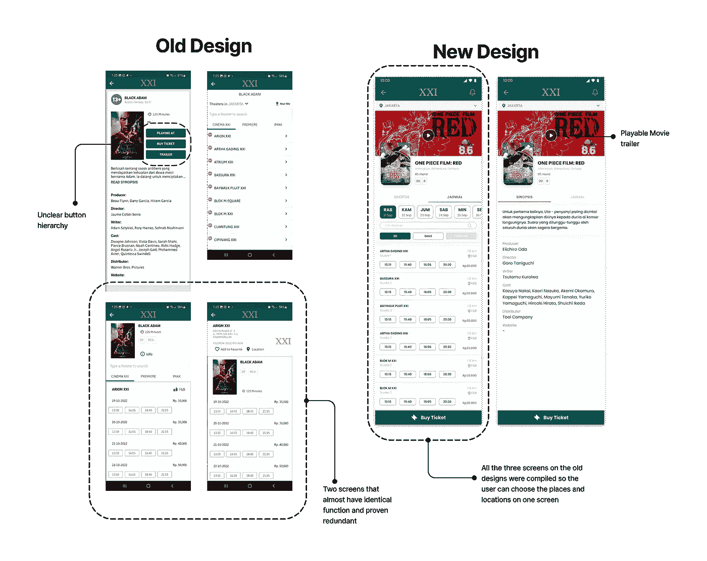

机票预订流程的模拟设计

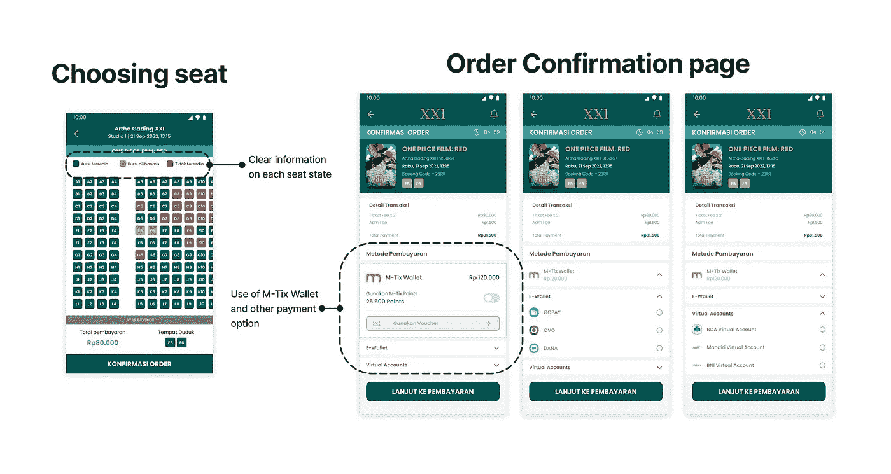

用于选择座位和确认订单的样机设计

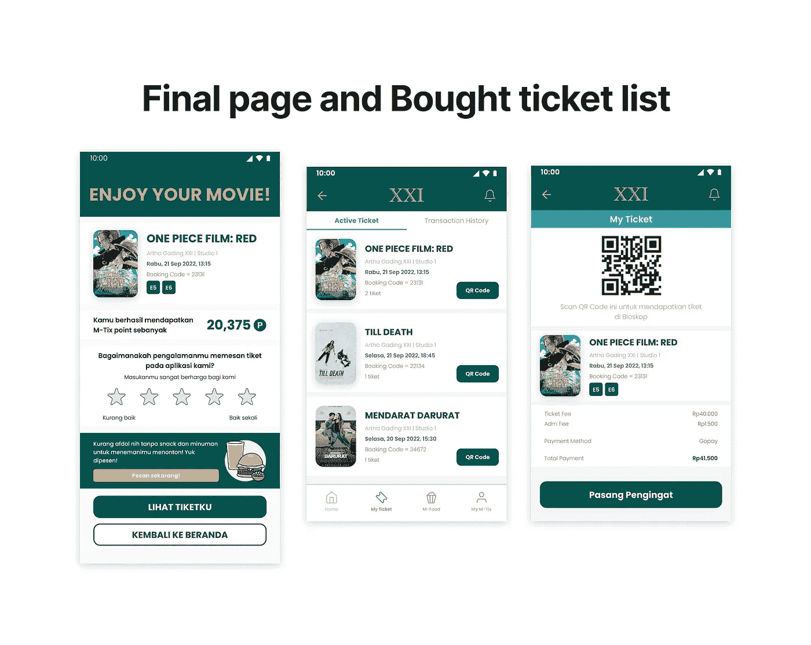

已购机票列表模型设计

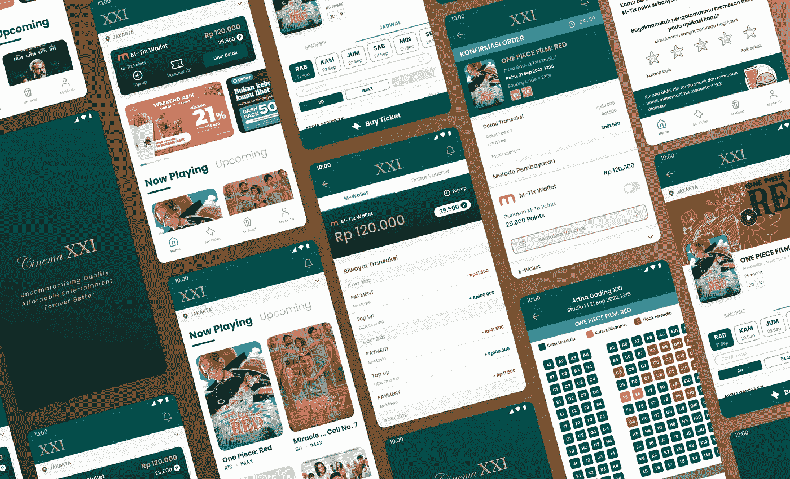

新设计的 M-Tix 应用程序的实体模型设计

## **原型制作**

完成的样机设计然后被连接成一个工作原型，你可以在下面访问！
在这个原型中，您可以使用两个主要功能:

1.  订购一张:红色电影票。
2.  从主页上的“我的机票”菜单中查找预订的机票。
3.  订购电影票时应用优惠券并阅读支付细节

由新设计的模型制成的原型

# **评估**

为了评估我们制作的原型，制定了可用性研究计划。通过这项研究，我们希望确保原型的功能和想法得到测试。

> **可用性研究计划**
> 
> **研究目标:**测试已经做好的原型，直接分析用户如何与原型交互。
> 
> **研究方法**:利用迷宫作为主要工具进行研究的自由可用性研究。
> 
> **研究期间:**2022 年 9 月 24 日至 25 日
> 
> **参与者标准:**年龄在 20-30 岁之间的工作人员(最好是之前被采访过的用户)
> 
> **研究工具:**迷宫
> 
> **性能指标:**系统可用性量表得分> 70

## **研究设计**

用户将有三项任务来操作 M-Tix 原型。这些任务包括:

1.  订购《海贼王》电影:红色门票(预订 2 个座位)
2.  使用 OVO 电子钱包选项作为付款方式支付订购的电影票。
3.  从我的机票部分找到购买的二维码。

## **成功指示器**

我们测量了可用性研究的三个主要指标，包括:

1.  任务时间(用户完成任务所花费的时间)
2.  SUS 分数(原型可用性的量化参数)
3.  转化率(用户完成任务的成功率)

## **研究结果**

我们成功地从不同用户那里收集了 5 份调查反馈。下图记录了每个任务的转化率。大多数任务由用户成功完成，任务 1 和 2 由迷宫记录为间接成功。这种间接的成功被记录下来是因为一些用户在研究中探索可用的组件并与之交互。这使得 Maze 将其误读为用户的误点击。

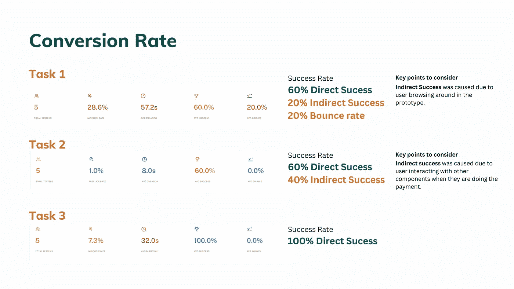

可用性研究的用户转化率。

**检测到退回率** 第一个任务有 1 个用户从流程中退回。根据 Maze 的记录，检测到用户在电影院选择座位时有困难。

当用户被问及为什么没有完成任务时，他们说这是因为在这个过程中“缺乏图像和丰富的文本”,这对我们来说没有太大的意义。

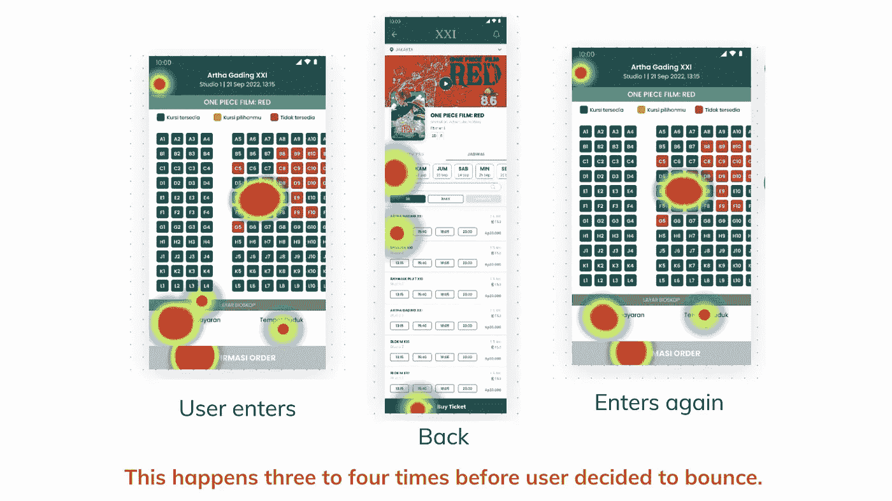

反弹的用户运动

基于我们的发现，我们分析了让用户放弃任务的两个原因。

*   选择座位的流程是先选择“E5”，然后选择“E6”。
*   任务没有清晰地呈现给用户，这使得他们停留在屏幕上。

为了防止将来发生类似的事情，我们决定通过考虑原型中的每个可能的流程，为用户提供更清晰的反馈，比如当用户选择“E6”座位时提供反馈。

**MAZE 记录的可用性分数** Maze 还提供了每个任务的可用性分数，每个分数分配给流程中使用的每个屏幕。对迷宫给出的一些低分进行分析，以确定给出的低分背后的推理。

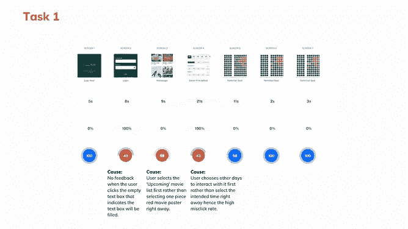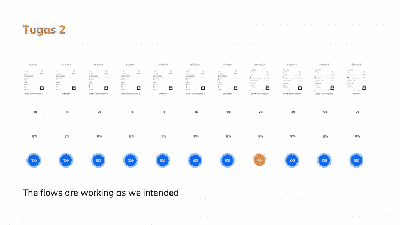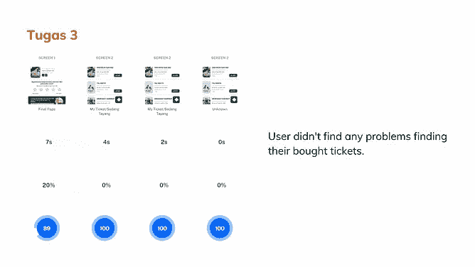

通过迷宫记录每个任务的可用性分数

**系统可用性等级(SUS)评分**

我们还收集了每个任务的可用性得分，并进行计算和汇总，我们总共获得了 **93%的可用性得分**，这证明了原型的每个预期功能和特性都工作正常。

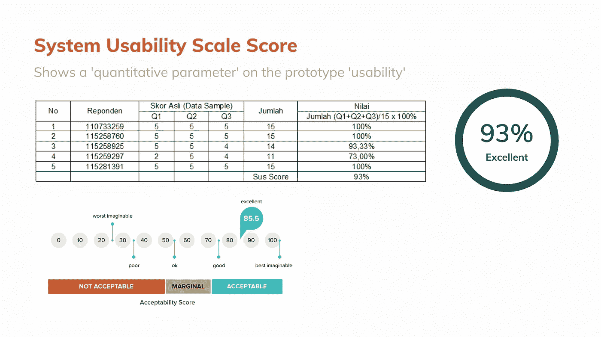

SUS 分数计算

## **现在！我们能改进什么？**

总的来说，我们设计的应用程序是成功的。根据我们进行的可用性研究，用户是满意的。有一些小的改进，我们认为可以简化预订和支付过程。当前可以完成的改进过程实际上很小，因为它只影响可用性研究的表现。

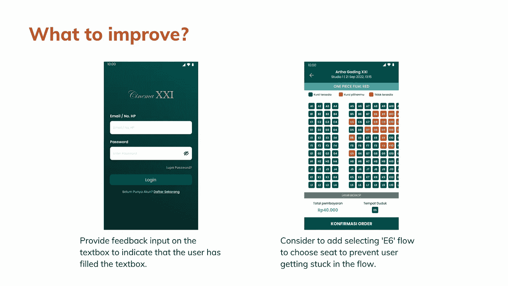

当前 M-Tix 应用程序重新设计的可能改进

随着设计过程的完成，重新设计的产品将被投入市场。我们希望该设计能够改善 M-Tix 用户轻松预订电影票的体验。推出的设计将在开发的后期阶段进行进一步评估，我们将确定哪些进展顺利，哪些不顺利。

设计过程将在迭代过程中完成，因为有很多东西我们仍然可以改进。

# 回顾过去。

终于！案例研究到此结束。我们注意到这项研究本身并不完美，因为还有很多地方需要改进。以下是我们从与项目经理和 UI/UX 团队的会议中获得的一些反馈。

## **什么奏效了**

*   项目管理团队和 UI/UX 团队成员之间的沟通非常清晰
*   头脑风暴过程很快就完成了
*   我们设法在规定的期限内完成了所有要求的文件。

## **什么没做好**

*   很难找到符合我们标准的特定用户
*   我们没有真正考虑我们的一些想法对公司业务方面的影响，我们只是在迭代过程中注意到了这些。

## **有哪些可以改进的地方**

*   团队每个成员之间的进一步沟通可以得到改善
*   优化研究过程，扩大我们对更具体用户群的覆盖面
*   熟悉使用 Figma 工具帮助有效设计

# **闭幕词**

非常感谢您阅读本案例研究！我希望你从阅读这项研究中有所收获。如果你有什么想和我一起讨论的，请尽管说！

## **杰森·威尔伯特| UI/UX 设计与研究训练营第 26 批**

## **📧:**[**jayson.wilbertt@gmail.com**](mailto:jayson.wilbertt@gmail.com)