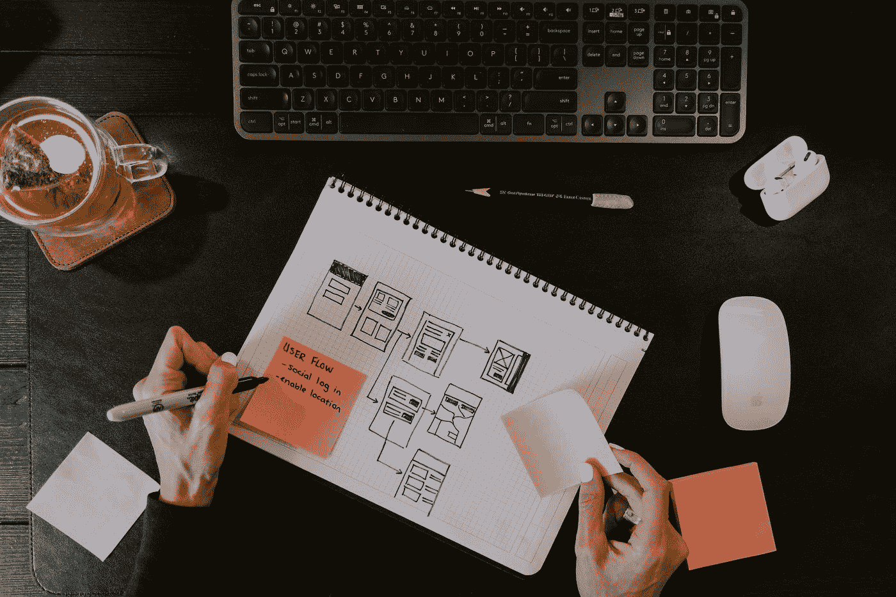
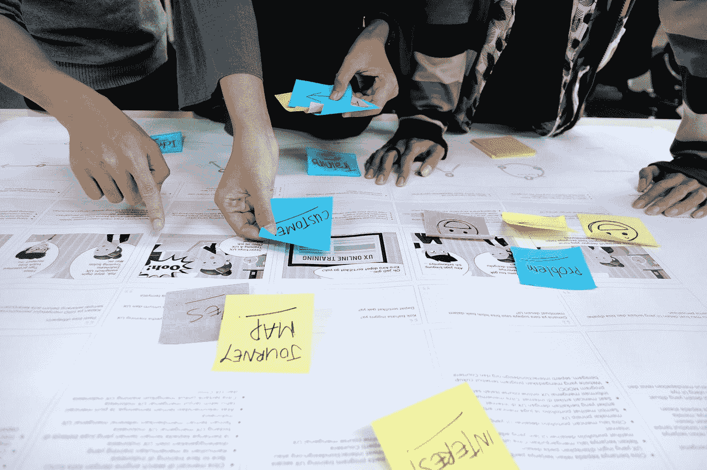
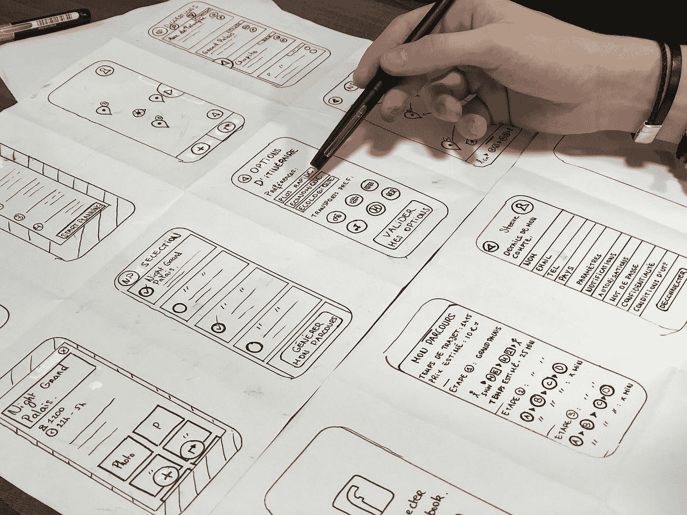
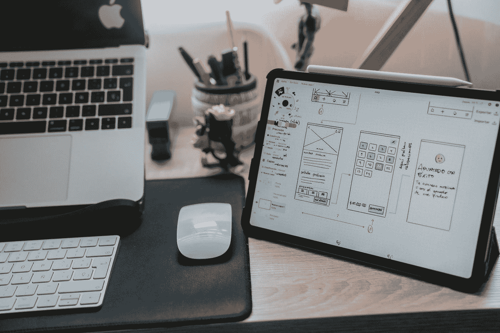
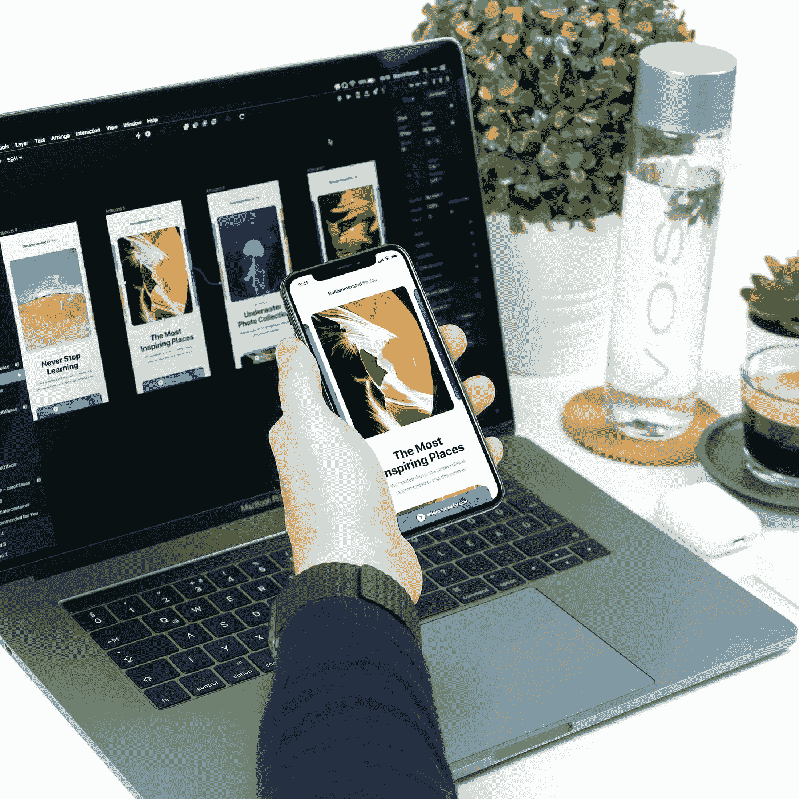

# 11 项关键的 UX 设计技能以及如何培养这些技能

> 原文：<https://blog.devgenius.io/ux-design-skills-beginners-44734902d065?source=collection_archive---------10----------------------->

要成为一名熟练的 UX 设计师，你需要关注基础知识、用户研究策略、视觉传达设计、响应设计等。

图片由 [UX 店](https://unsplash.com/@uxstore?utm_source=medium&utm_medium=referral)在 [Unsplash](https://unsplash.com?utm_source=medium&utm_medium=referral) 上拍摄

UX 设计师负责优化最终用户与其公司的每一次互动。术语 UX 设计，是用户体验设计的缩写，指的是人和产品之间交互的所有方面。这些体验包括品牌、网站设计、移动应用导航、信息架构、产品可用性、交互元素等。

UX 设计主要与数字体验有关，但也可以应用于物理产品设计及其用户交互，如在耐克商店试穿新鞋，或利用不可抗拒的苹果商店体验为 UX 设计购买新机器。

作为一名 UX 设计师，你需要了解动机，以确保最终用户的“用户体验”是高效和愉快的。你将参与产品和服务的美学和设计。

请继续阅读，了解用户体验设计职业所需的技术和软技能。

# 成为一名 UX 设计师需要哪些技能？

UX 的设计师从事着非常不同类型的工作——一系列核心活动和职责——专注于产品开发中所有重要的设计相关方面，包括设计、可用性、功能、测试甚至营销。

UX 设计是一个非常容易进入的专业。要成为一名成功的 UX 设计师，你需要学习基本的技术技能，以便在竞争激烈的就业市场中取得成功。

掌握这些应用技能会让你受益匪浅。

## 线框、用户界面原型和实体模型

线框是低保真度的设计草图，代表不同的屏幕，以绘制用户在使用产品或服务时采取的每一步。这是产品开发过程中必不可少的一部分，它提供了产品在整个用户旅程中不同阶段的视觉理解。

线框图是一种早期视觉效果，可用于与客户一起审查，以建立可能的设计解决方案的结构和流程。建立基本结构有助于发现限制和机会，以弥合抽象需求和实际解决方案之间的差距。

图片由[凯莉·西克玛](https://unsplash.com/@kellysikkema?utm_source=ghost&utm_medium=referral&utm_campaign=api-credit)拍摄

线框不是原型，原型也不是实体模型。

*   线框图在交互设计过程中对于检验概念如何适应终端用户和商业需求非常有价值。从实践的角度来看，线框成为 UI 原型和创作过程的主要协作工具。
*   **UI 原型**是你想出点子的阶段——这些点子将根植于你的研究中，专注于商业目标的设计。它涉及到在将最终设计传递给负责开发过程的利益相关者之前，对线框图进行彻底的可用性测试并验证想法。
*   **Mockup** 是一个现实的视觉模型，包括更多的风格和视觉 UI 细节，最终的网页或应用程序会是什么样子。

线框和用户界面原型是展示你的 UX 敏锐度的关键 UX 技能。你可以从笔和纸开始，为你经常使用的应用程序或网站勾勒出线框和用户流，以熟悉组件，了解你自己的行为、需求甚至动机。

如果你刚刚开始，学习一些流行的线框和原型工具，如 UXPin，InVision，Sketch 或 Adobe XD。这里有一些学习交互设计元素的最佳资源。这些资源将涵盖诸如线框图、原型、用户研究、可用性测试和设计软件等技能。

*   用户界面/UX 设计课程 ←技能分享
*   [UX 设计师纳米学位](https://kngr.me/uxd2) ←由 UX 行业专家讲授，重点是投资组合设计和工作协助。

## UX 研究和测试

UX 设计师是研究人员，这一技能非常关键，因此大多数公司在设计团队中都有一个专门的角色，被称为 UX 研究员。

UX 设计需要像人口统计、经济和产品研究这样的研究，这些是体验设计的主要组成部分。因此，你必须学会如何调查方法和进行研究，以了解目标受众，以及如何将你的发现转化为有背景和见解的产品设计。

UX 设计师从学者、市场研究员、UX 数据科学家和其他人那里借鉴设计研究技术。在这些研究方法中，UX 设计师收集关于目标受众的数据和见解，并综合这些数据以提高可用性。数据驱动设计研究的主要目标是从最终用户的心态出发，为设计过程提供信息。这个过程包括可用性测试，这有助于防止我们为自己设计。

图片由 [UX 印尼](https://unsplash.com/@uxindo?utm_source=ghost&utm_medium=referral&utm_campaign=api-credit)

如果你刚刚开始你的 UX 设计之旅，现在不要太担心 UX 研究的细微差别。UX 研究是技术性的，但是如果你只是按照其他设计师的模式和指示去做也没问题。这里是我们找到的一些学习 UX 研究和可用性测试的基本概念的最佳资源。

*   [可用性基础](https://kngr.me/udx3)
*   [进行 UX 研究并测试早期概念](https://kngr.me/uxd4)

## UX 写作

UX 写作就像一门艺术学科，强调美学和创作自由，用出现在数字产品(网站、应用程序等)界面上的文本来补充设计的可用性。).

随着互联网在复杂的技术、趋势和全球用户体验方面变得越来越先进，对清晰度的需求也在增长，以提供流畅的视觉体验。因此，UX 设计师必须进行全面的 UX 研究，从内到外传递关于其产品和服务的正确信息——从主屏幕、产品页面、销售流程和联系信息到按钮复制和推送通知。

图片由[艾米利·莫里雄](https://unsplash.com/@amayli?utm_source=ghost&utm_medium=referral&utm_campaign=api-credit)拍摄

面试 UX 角色的公司总是在寻找能够为自己所采取的举措辩护的设计师，包括但不限于为什么他们选择了一个特定的词作为标签和其他词的选择。出于这个原因，他们必须拥有非凡的 UX 研究能力，来解释为什么一个特定的单词或语句是比另一个更好的选择。

UX 设计师通过承担跨职能任务来定义自己的角色职责，如生成线框、制定指南、起草编辑策略等。UX 设计师是讲故事的人，天生擅长预测什么时候缺什么词。

这里有一些有抱负的 UX 设计师的资源，不仅可以了解更多的实践，也可以向其他人传播福音。

*   [UX 写作入门](https://kngr.me/uxd5)(微缩版)←技巧分享

## 视觉传达设计

UX 设计专业人士创造和管理视觉设计的生产，以通知，教育，说服，甚至激发最终用户。

最终用户由视觉线索引导，学习如何结合视觉艺术和技术来传达想法将对你的设计产生重大影响。学习良好的视觉传达，比如让元素看起来可以点击，形成视觉层次，使用排版和色彩理论，包括对你有利的用户控制，以限制对说明书的需求，这些都是 UX 设计师必须掌握的关键技能。

阿尔瓦罗·雷耶斯拍摄的图片

UX 设计师使用视觉设计软件，如 Figma、Frame、Sketch、InDesign、Illustrator 和 Photoshop，来创建产品和服务的视觉元素。除了熟练掌握这些应用程序之外，还要建立最佳视觉设计实践的知识，如排版、色彩理论、布局、运动、图标等。

UX 设计师对设计元素有着高度专业化的观点，作为一个新手，提高你的视觉沟通技能通常意味着首先要学习平面设计、排版、摄影、标志设计等等。

这里有一些互联网上学习视觉传达设计的最佳资源。

*   [戴维·卡森平面设计](https://kngr.me/uxd6) ←强烈推荐大师班

## 信息架构— IA

UX 设计中的信息架构是以一种连贯的方式组织和构建内容。

UX 设计师让最终用户轻松了解他们在哪里，他们需要去哪里，下一步是什么。这就需要理解视觉层次，去优先化信息，设计交互式 UI 元素，诱导人们采取行动，通过 web 和移动设备上的行动号召元素来引导转化。

信息架构与 UX 研究和可用性测试交织在一起，因为调查最终用户的需求对于创建有效的信息架构设计至关重要。这有助于用户找到他们正在寻找的信息或轻松完成他们的任务。

图片由[丹尼尔·科尔派](https://unsplash.com/es/@danielkorpai?utm_source=ghost&utm_medium=referral&utm_campaign=api-credit)拍摄

层次和导航是 IA 的重要组成部分。第一个建立了内容的结构，包括大小，而第二个阐明了最终用户将如何浏览它。这个规程(IA)建立了平衡，并帮助以满足用户需求和业务需求的方式组织信息。

信息架构最基本的例子是网站地图。

> [*https://kanger.dev/sitemap.xml*](https://kanger.dev/sitemap.xml)

在以用户为中心的设计背景下，学习信息架构的基本原则对于每一个想从事设计工作的雄心勃勃的 UX 设计师来说都是必不可少的。这项技能也很重要，因为大多数公司在他们的 UX 设计团队中都有一个专门的角色，被称为 UX 建筑师。

*   [信息架构简介](https://kngr.me/uxd7) ←技能分享
*   [信息架构介绍](https://kngr.me/uxd9) ←复数视线

## UX 响应设计

UX 设计师不需要编写代码或开发应用程序——那是网络开发人员的任务——但是，它有助于理解应用程序开发过程，并拥有 HTML、CSS 和 JavaScript 或 P5.Js 的基本知识

响应式设计需要设计在形式和功能上适应所有设备、平台、媒体查询和屏幕尺寸的网站/应用程序。

这非常重要，因为全球大约 59%的[网站流量](https://www.statista.com/statistics/277125/share-of-website-traffic-coming-from-mobile-devices/)是由手机产生的。因此，设计和开发应该根据平台、显示器纵横比和方向来响应最终用户的行为和环境。

Gif by [Echovme](https://echovme.in/blog/responsive-design-mistakes/)

UX 设计师应该高度熟悉响应式设计的概念，以确保设计在不同的屏幕上显示不同。要开始你的 DesignOps 职业生涯，你可以从了解响应式网页设计的基本技能开始。

响应式网站设计主要是在任何设备上提供无缝的用户体验，你可以学习如何创建一个响应式网站，从开始到结束，线框图，通过网站地图迭代，直到最后阶段。

掌握基本的编码技能将大大有助于您完成项目，并简化设计人员和开发人员之间的交接。

*   [响应式网页设计要点](https://kngr.me/uxd8) ←技巧分享
*   [响应式网页设计简介](https://www.youtube.com/watch?v=srvUrASNj0s) ←免费代码营

# UX 分析公司

UX 的设计师们被期望对他们的用户如何与网站、移动应用、数字产品和服务互动有更深的理解。

我们可以快速更新 Web 和移动应用程序设计，以满足最终用户的需求。但是，您如何弄清楚这些需求是什么，甚至了解这些需求是如何变化的呢？简短的回答是 UX 分析。

像数据分析师和市场研究人员一样，UX 设计师依赖分析工具来检查用户数据，以改善用户体验。这也让 UX 的设计师们能够识别错误，设计故障，减少客户摩擦，优化销售渠道，减少噪音等。

图片由[横杆](http://crossbar.com/)

UX 的设计师需要非常了解如何应用分析信息来迭代高质量的设计，并以真实的数字作为支持。毕竟，理解交互是困难的，但是你可以利用从数据中获得的洞察力来提出设计建议。

UX 分析有助于了解用户的旅程，如会话历史、热图、转化率计算器、用户流量图、用户细分、网络指标、事件、实时分析等。

这项技能至关重要，一些公司在他们的 UX 团队中有一个专门的角色，称为 UX 数据科学家。虽然你不需要知道 UX 数据分析的每一个细节，但你可以通过了解基础知识来强化你的简历。

*   [面向用户体验设计的人机交互](https://kngr.me/uxd11) ← MIT

# 成为 UX 设计师需要哪些软技能？

除了掌握技术技能，UX 设计师还必须具备软技能和能力，为 UX 设计公司的业务提供服务，以管理关系并简化包含多种工作环境的设计流程。

# 敏捷项目管理

作为一名 UX 设计师，你必须具备领导、协调和保持进度的能力，以支持所有利益相关者的高效产品开发过程。

要成为一名成功的 UX 设计师，你不需要知道项目管理的每一个细节，因为你并不单独负责产品的开发。

> *了解一些基本知识可以让你的简历更精彩。*

# 批判性思维

批判性思维是概念化，应用，分析，检查和综合从可靠来源收集的信息，作为信念和行动的指南。

UX 设计师必须能够质疑所有的假设，理解他们自己的思维过程，并发展卓越的远见，做出基于经验的设计建议。

> 所有的 UX 设计师都知道在用户研究、采访和测试中提问的重要性，包括愚蠢的问题。

# 好奇心

好奇的 UX 设计师可以有目的地接触客户、产品和挑战。

好奇心引领着清晰思考的洞见之旅，更深入地参与到问题中，以提供解决方案。

> UX 是一个不断变化的领域，设计师必须充满好奇心才能跟上潮流。

# 神入

同理心是体会他人情绪的能力。UX 强调积极的客户体验。这就是为什么最好的 UX 设计师进行彻底的研究，以了解他们的目标受众和他们的倾向。

> *同理心让 UX 的设计师创造出真正吸引人、令人愉悦的产品。*

# 沟通和协作

强大的沟通技巧有助于 UX 设计师轻松创造、协作、调整和改进产品。因此，沟通和协作在 UX 设计中至关重要。

你必须具备传达产品理念、解释设计灵感背后的想法以及与其他团队合作的能力。

> *UX 设计师的工作需要讲故事的元素。*

**结论**

作为一名 UX 设计师，你应该既能自我指导又能合作，但你必须有创造力。创造力和对细节的关注是这个职位成功的关键。

谢谢你坚持到最后…

> 我们的观众支持 kanger.dev。我们可以从购买本网站的链接中赚取代销商佣金。