# UX 设计师工作坊——学习与遗忘的循环

> 原文：<https://blog.devgenius.io/ux-designer-workshop-cycle-of-learning-unlearning-183d9995123b?source=collection_archive---------3----------------------->

你好！我是乌代·德奥里，一名机械工程师。管理学毕业生，在金融科技领域拥有 3 年以上的商业分析师工作经验。大声说出我是一名分析师，现在正试图踏上一条完全陌生而又诱人的道路，这让我感觉既临床又兴奋，而 UX UI 可以为我设置这条道路。出于对设计和人类认知的好奇，这些资深的算法大师们鼓励我探索这个工作室，尝试一下，从行业资深人士[阿努迪普·阿亚加里](https://medium.com/u/85f52d41044e?source=post_page-----183d9995123b--------------------------------)的角度一窥 UX 设计的世界。

“是的，你能做到！!"

这个自定进度的研讨会持续了 14 天，充满了丰富的信息和结构化的方法，以尽可能非教科书的方式学习所有的东西 *UX-UI* 。此外，与志同道合的人(来自各种背景)一起使用不和谐服务器只会帮助我们肯定我们的学习和遗忘。希望我的文档可以阐明从练习册练习和整个课程和现场会议的头脑风暴中收集的见解和技能。我可以将课程分为现场会议、自定进度视频和 Figma 练习(我个人最喜欢的部分😍).

启动研讨会，从一开始，我们就对打开/关闭风扇开关这一简单行为进行了初步而深入的讨论，讨论了为什么要这样制作开关，我们如何知道如何打开/关闭开关等等。在我们知道之前，这个练习以最实际的方式教会了我**设计思维**(读为“给出常识性的答案，没有术语”)！

了解到我们**不是用户**，需要将其内化，以改变我们的思维模式，减少偏见，并以最务实的方式解决问题。不管用什么媒介，一个好的 UX 设计师应该内化-

1.  **为用户设计** —具有相关的定性和定量原理
2.  **交付业务影响** —使用设计思维驱动和衡量 KPI
3.  **设计工具**——不要和工具结婚，继续学习让设计工作流程更简单的工具

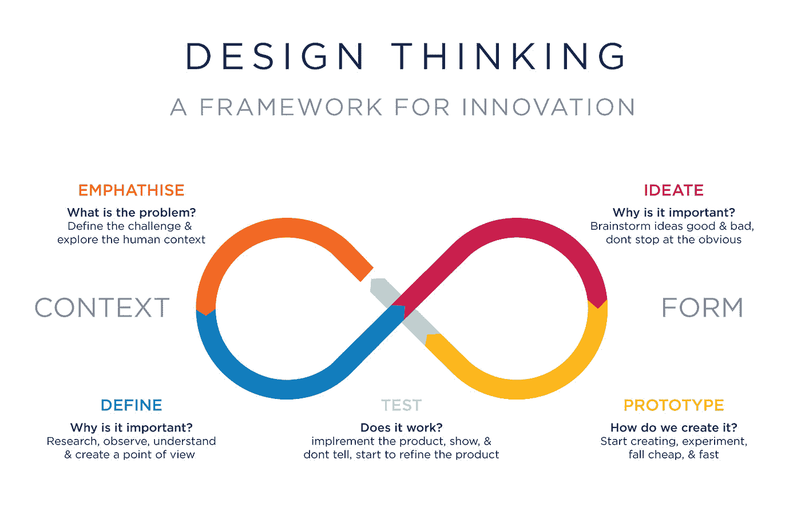

学会问“为什么”**很重要，这一点我可以从我目前的职业中体会到，引出实际需求和分析问题的根本原因是一种常态。问“5 个为什么”可以让我们找到问题的根源。**

# **💥UX 设计原则:**

**直奔主题。Anudeep 和他的非教科书式的方法也让我们知道了一些经验法则——经过多年的研究后支配我们人类认知的法则，以及这些法则是如何在设计领域中实现的。**

## ****1)雅各布定律—****

*   *****用户把大部分时间花在其他网站上，这意味着用户更喜欢你的网站以和他们已经知道的所有其他网站一样的方式工作。*****

**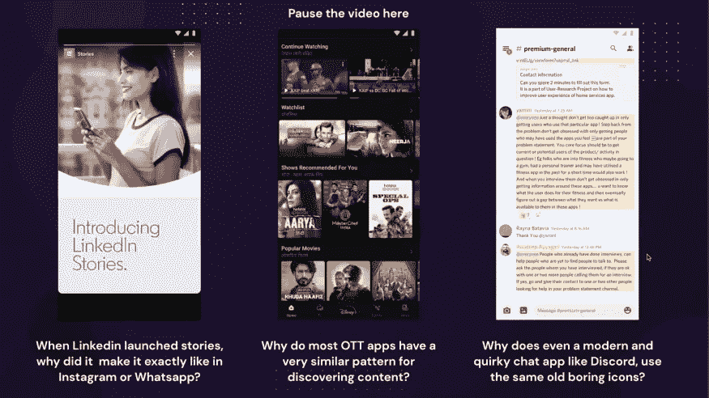**

**我们已经进化到寻找容易发现的熟悉模式。不需要重新发明轮子，因此不需要引入额外的不必要的变化，以执行类似的功能在其他应用程序或网站。这将通过最少的培训或入职培训来提高适应能力。**

## **2)菲特定律—**

*   *****获取目标的时间是目标距离&大小的函数。*****

**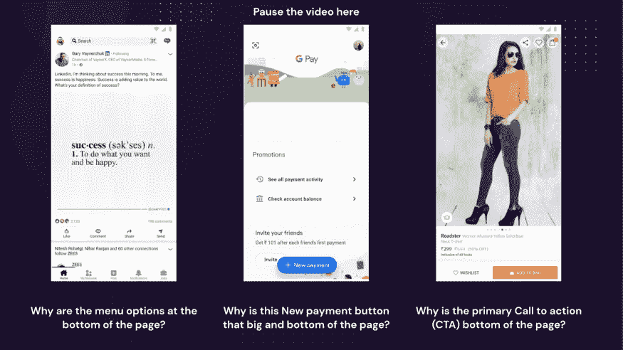**

**对于下面的移动应用程序，由于我们的拇指(由解剖学决定)位于最靠近屏幕底部的位置，导航栏和 CTA 按钮很容易访问，以执行主要或关键功能。**

## **3)希克定律—**

*   **做决定所需的时间随着选择的复杂程度而增加。**

**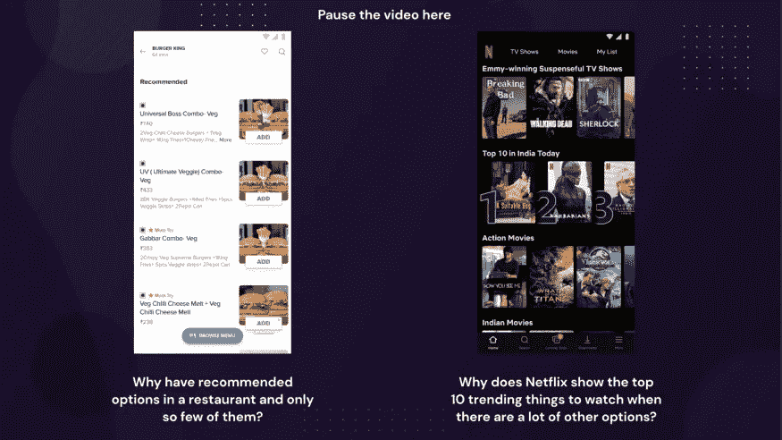**

**从任何事物中选择的选项越少，做出决定就越容易，而不是在从给定的列表或选项中选择任何事物时更加混乱。多即是少；需要摆脱选择的悖论。**

## **4)多尔蒂的阈值—**

*   **当一台计算机的用户以一定的速度(< 400 毫秒)互动，确保双方都不必等待对方时，生产率就会大幅提高。**

**用户不喜欢等待更长的时间来获得出现在屏幕上的东西，如果对某些东西的反应或交互没有在预期的时间内出现，用户可能会以误点击结束。**

**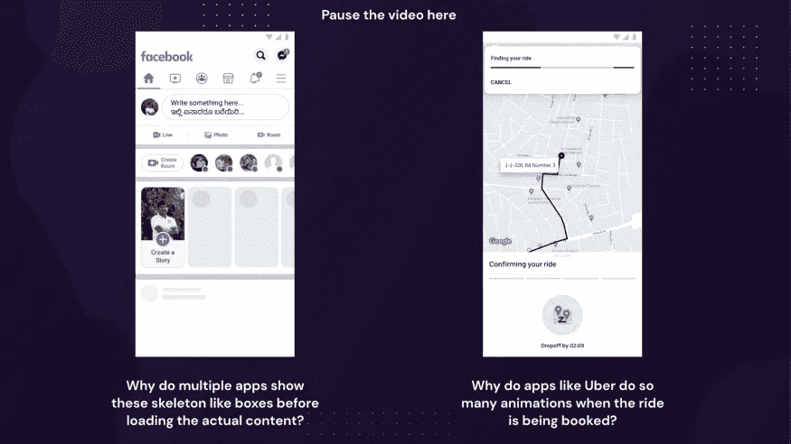**

**我们可能会看到，在加载登陆页面或主页之前使用任何应用程序时，总会先出现页面的骨架，或者在网上订餐或预订任何 ola/uber 后，你会在屏幕上看到很多动画。为什么他们通常会这样做？**

**优步和 facebook 利用动画来显示状态变化，甚至缓冲时间来抑制用户的挫折感，并不断实时传达状态变化。**

## **5)美学可用性效果—**

*   **用户通常认为美观的设计是非常好的设计。**
*   **在屏幕上工作时，元素的间距为 4 或 8 的倍数，以保持一致性。**

## **6)公共区域法—**

*   **每当在定义的边界内有多个元素时，无论是可见的还是不可见的边界，都被认为是组合在一起或一起工作，并且彼此相关。**

## **7)邻近定律—**

*   **当与彼此分离的元素相比时，彼此靠近的元素被认为是相关的。**

# **💥雅各布·尼尔森的可用性启发法:**

**在设计任何供用户消费的产品时，要牢记最重要的原则，同时也要结合公平设计。**

**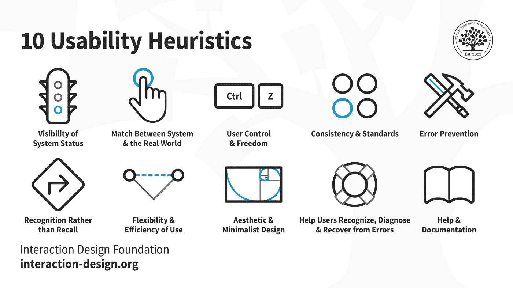**

*   **一致性和标准**
*   **认可而不是回忆**
*   **用户控制自由**
*   **系统状态的可见性**
*   **美学和简约设计**
*   **使用的灵活性和效率**
*   **系统和现实世界之间的匹配**
*   **错误预防**
*   **帮助用户识别、诊断错误并从中恢复**
*   **帮助和文档。**

# **💥UX 设计的商业影响:**

1.  ****Nir Eyal 的**钩子框架—**

**Eyal 的框架帮助设计师和产品所有者接近产品开发，这是基于通过一个循环周期创造习惯行为的**，该循环周期包括一个触发器、一个动作、一个可变奖励和持续投资**。**

**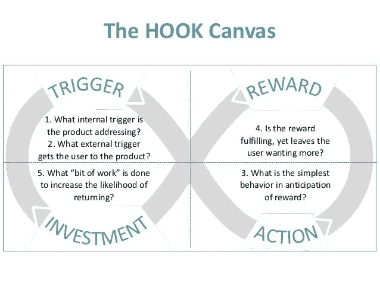**

**2.探索业务指标(KPI)—insta gram 示例:**

**‣‣ **转换指标** —**

**为什么离开了故事，故事还会不断播放？**

**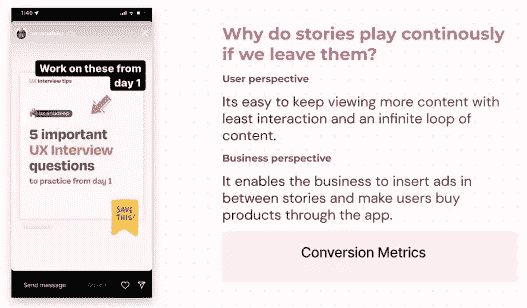**

**‣‣ **会话长度指标—****

**为什么会有无限的内容卷轴？**

**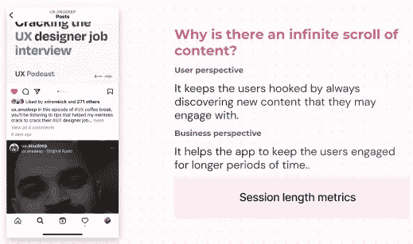**

**‣‣ **活跃用户指标(每日)——****

**为什么 Instagram 上发布内容的方式那么多？**

**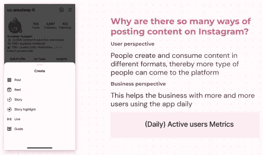**

**‣‣ **保留指标—****

**既然有其他聊天平台，为什么还要有消息功能？**

**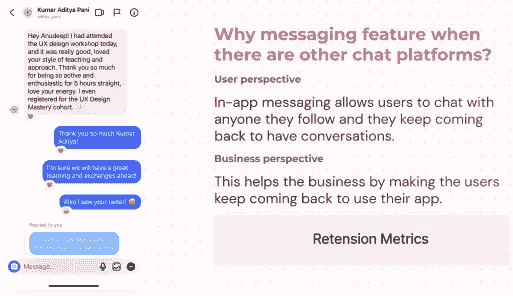**

**3.被低估的超能力— **软技能**—**

**另外，在一个现场会议中，Anudeep 分享了一个实例，在这个实例中，横向思考也很重要，不要盲目遵循不同利益相关者提出的问题陈述，这些利益相关者不直接参与设计流程。作为一名优秀的 UX 设计师，我们需要能够提出正确的问题，引出并达到实际的需求。在我目前作为一名文学学士的角色中，我学到了拥有良好的沟通技巧是至关重要的，对于这个角色也是如此。我们需要解决并让利益相关者看到真正的问题在哪里，并用适当的理由来支持它。**

# **💥行业学习工具——fig ma**

**就像 Anudeep 说的，在任何交易中，不管我们的理论有多好，它的应用和把它放到画布上在整个过程中同样重要。**

**从制作简单的计算器开始，向我们介绍 Figma 关于右边面板中的形状、框架和属性控件的基础知识。让我们探索基础和快捷键可以帮助我们开始找到我们的工作流风格。使用它感觉非常直观，特别是如果你是来自平面设计师背景，因为它类似于 Photoshop，Adobe XD，Blender 等。(雅各布的熟悉定律在这里也起了作用😏。)**

**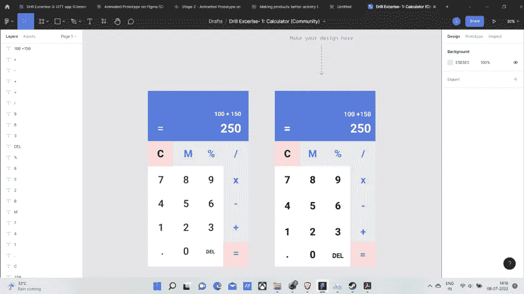**

**这个练习首先向我详细介绍了 Figma 上的框架尺寸，以及将图标、图片、对齐和其他所需资源导入 Figma 的基本知识。甚至在 retrospect 上探索不同的插件，使我们的工作流程更容易、更高效地使用。**

**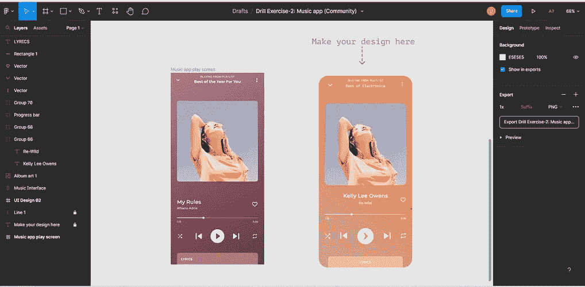****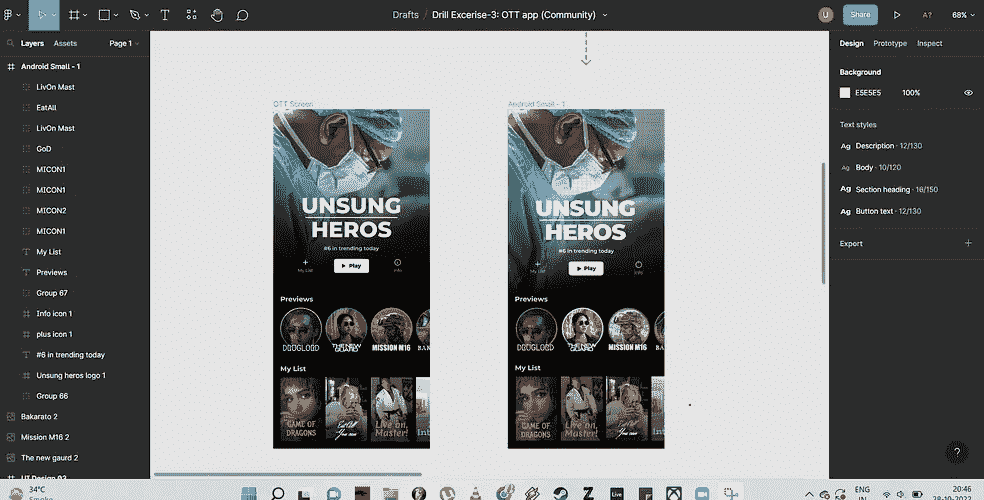**

**音乐播放器和 OTT 的高保真屏幕**

**接下来，我们参考音乐播放器和 OTT 应用程序的屏幕制作了一些高保真原型。**

**它的结构方式、练习传授了关于对象分组及其重要性、层和遮罩、文本案例如何工作以及它们如何用于描述屏幕上的层次结构、与您正在使用的任何屏幕上的间隔对象相关的一些一般实践、Fitt 法则的实际应用、公共区域法则和美学可用性效果的知识。**

**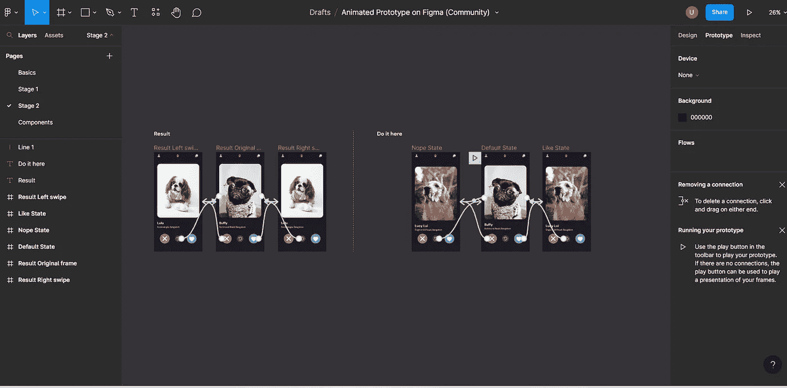**

**为狗制作类似 Tinder 的应用原型！！！**

****

**最后一个练习深入研究了 Figma 上的动画机制，大型项目中组件的重要性以及如何设置样式和复杂的动画。**

**感谢 Anudeep 的能量和他独特的“常识性方法”来教导和推动我们走出舒适区，尝试新的水域。对我来说，最重要的是使用一个包含一系列问题的练习册，迫使我们向内看，从我们的过去和现在找到我们固有的优势和弱点，并相应地找到并努力提高我们的品质，帮助我们成为一个优秀的 UX UI。**

**感谢 Growthschool & Anudeep 带来了这样的教学方法和热情，帮助我开始了解未知，并为我们提供基础知识，以进一步学习和深化我们的知识！！**