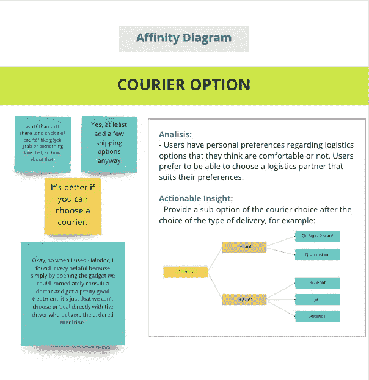

# UX 研究案例研究:Halodoc

> 原文：<https://blog.devgenius.io/ux-research-case-study-halodoc-681941cf19ab?source=collection_archive---------9----------------------->

由 [**马里穆里亚**创建的图像](https://medium.com/@marifmulya)

## **概述**

我和我的团队计划评估 Halodoc 医疗应用程序的交付功能，这是一家拥有在线医疗保健(远程医疗)细分市场的数字公司。这项研究旨在发现用户在使用 Halodoc 及其竞争对手应用程序中的功能和服务时的行为。我做了一项调查，并采访了 Halodoc 的活跃用户。而它的竞争对手，在收集了所需的数据后，我继续分析，从已经得到的漆点中得到解决方案。

**角色:** UX 研究员
**时间线:** 1 周
**工具:** Google Sheet、Google Form、Miro、Figma。

## 研究时间表

2 周:

*   第一周(研究计划)
*   第 2 周(进行研究、分析和报告)

## 过程

> ***利益相关者讨论***

*了解项目背景，想要获得的洞察，时间线。*

> ***研究目标***

了解研究的目的，并提出将涵盖哪些人的问题。

> ***研究计划***

*研究期间要涵盖的细节，如方法受访者和主题。*

> ***进行研究***

*找到有意义的见解。*

> ***报告***

*找出模式和行为，提出可行的见解和建议。*

## 研究目标

本研究的目的是，我如何理解用户在使用 Halodoc 应用程序及其竞争对手的应用程序时的行为，在什么情况下他们会使用 Halodoc，理解用户在使用 Halodoc 上的服务和交付功能时的感知和行为，以及用户在投入使用时会遇到什么困难。该应用程序，我如何了解用户在 Halodoc 应用程序及其竞争对手上进行交易时的行为，以及用户在使用这种医疗应用程序时需要什么。

## 方法

在本研究中，我们同意使用定性的方法来获得更多的洞察力，使用定量的方法来筛选潜在的受访者，并验证所获得的定性数据。

## 关键信息

*   用户概要
*   使用药物输送功能(Halodoc)时的一般行为
*   使用药物输送功能时的一般行为(Halodoc 竞争产品)

## 响应目标

将被选中的目标受访者是那些在过去 3 个月中 1-2 次积极使用 Halodoc 及其竞争对手并与之进行交易的人。我们已经创建并使用了筛选问题，以获得同意尽快接受采访的潜在和合适的受访者。

> ***筛选问题:*** 在社交媒体上进行 blast 筛选问题的目的是选择适合面试环节的潜在活跃回答者。

## 定性研究

我和我的团队对 Halodoc 的活跃用户进行了采访，以获得关于他们使用 Halodoc 的体验、动机、期望和期望的定性数据。我们采访了通过社交媒体发布的筛选问题流程的用户。9 个回答者成功，同意我接受采访(深度采访)。

**要了解更多关于我们面试的信息，您可以查看我们的* [**面试结果。**](https://docs.google.com/spreadsheets/d/18Qc5619Q1g9VS-gtcJg7L_Cd7uh-f68cB5jKWeVPR7o/edit?usp=sharing)

## 发现和洞察力

在对几位受访者进行采访后，我们深入了解了用户在使用 Halodoc 中的功能时的体验。我们分析了以亲和图、用户角色和客户旅程图的形式获得的洞察。

## 亲和图

在对 9 名受访者进行采访后，所获得的见解相当多样化，这使我们更容易分析所获得的每一种见解。我们将这些见解分为 4 个部分，包括:

*   跟踪
*   连接到驱动程序
*   快递选项
*   交付时间长

关联图跟踪问题的图像

关联图的图像连接到驱动程序问题

亲和图 Courier 选项问题的图像

形象亲和传递需要很长时间的问题

## 用户角色

我们的研究中有两个人物角色，第一个是主动使用 Halodoc 进行咨询的用户，另一个是前段时间在新冠肺炎疫情期间使用 Halodoc 的新用户。我们想知道每种角色的行为、需求、目标和痛点，希望这能帮助我们获得更多的洞察力。

## 客户旅程图

从客户旅程图来看，用户的痛点有:

*   不能选择快递。
*   没有实时跟踪快递员
*   无法与快递员沟通

## 问题和前进的道路

在遇到许多问题后，本研究的目标是评估 Halodoc 医疗应用程序的交付功能。在经历了一系列的研究过程后，进行了访谈并分析了所获得的见解。我们最终设法为用户感受到的痛点确定了一个推荐的解决方案。

> ***快递员现场跟踪***

**前进方向:**制作一个功能，用户和药店可以使用即时交付的实时地图跟踪司机的实时位置，因此买家和卖家可以看到准确的司机位置。

> ***不能选择快递员***

**前进方式:**在发货方式选项后做发货公司的子选项，用户可以选择自己放心的发货公司。

> ***无法与司机*沟通**

**前进之路:**制作一个功能，用户可以通过聊天连接司机或呼叫司机进行即时交付，这样用户可以在需要时联系司机。

## 关闭

做了这项研究后，我学到了很多关于如何计划进行研究，定性和定量方法在研究中如何工作，寻找受访者，以及在采访中成为一个好的倾听者……这个项目帮助加强了我的技能。这是我和我的两个同事 Kevin 和 Esty 做的第一个项目。老实说，完成这项研究花费了很多精力。

> **反正这篇文章里你知道可以鼓掌 50 次吗？
> 试起来？**

## **附录**

[调研计划、讨论指南&筛选](https://docs.google.com/spreadsheets/d/18Qc5619Q1g9VS-gtcJg7L_Cd7uh-f68cB5jKWeVPR7o/edit#gid=0)
[面试结果](https://docs.google.com/presentation/d/1_rPZpK1-UK8AHCE4bduDW2BdLRNHxh7aVHqcfWEDWck/edit#slide=id.g13dc9c3c164_0_505)
[亲和力图](https://miro.com/app/board/uXjVOjxmtYg=/#tpicker-content)
[领英](http://linkedin.com/in/marifmulya)