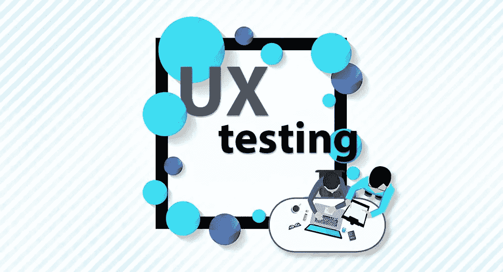

# UX 测试方法

> 原文：<https://blog.devgenius.io/ux-testing-methods-777442a6ee26?source=collection_archive---------13----------------------->

可用性测试或 UX 测试可以为你提供关于用户行为和对你的产品的反应的宝贵见解。这个过程对于创造更有效的 UX 元素是有价值的。

如你所知，[**【UX】**](/different-forms-of-user-experiences-8c10f34200c6)**用户体验可以描述为用户在与 [**用户界面**](/different-forms-of-user-interfaces-and-features-d1c8152ab69) 交互时所经历的体验。**

**但是，什么是 UX 测试呢？让我们看一看。**

> *****“用户体验测试可以定义为对用户体验的不同方面进行测试的过程，以便为应用程序定义与用户交互的最佳方式&*****

**用户体验测试可以遵循几种方法。让我们看看这些 UX 测试方法及其优缺点。**

# ****1。适度可用性测试****

**适度可用性测试是一种基于用户对设计系统反馈的测试方法。在这种情况下，可以使用原型或全功能系统来收集反馈。**

**在中度可用性测试中，主持人直接与测试参与者实时交流，如果用户需要，他会提供澄清或进一步的指导。此外，主持人还将观察并记录测试参与者的行为。即使测试参与者的数量有限，也可以通过这种测试方法获得详细的反馈。**

****优点:****

*   **主持人可以与测试参与者直接互动。因此，参与者的肢体语言、行为变化和并发症等情况都可以被实时观察到。**
*   **主持人可以确保参与者正确理解系统，或者在必要时提供指导。**
*   **主持人可以问后续问题，并从测试参与者那里获得详细的反馈。**

****缺点:****

*   **只能使用有限数量的测试参与者。**
*   **会耗费额外的时间和资源。**

# ****2。未经授权的可用性测试****

**与有节制的可用性测试不同，在无节制的可用性测试中，主持人并不与用户实时互动。非托管测试还允许收集大量用户的大量数据样本。此外，在非自主测试中没有正式的指导方针。**

****优点:****

*   **不受限制的测试可以在任何时间、任何地点进行。**
*   **当用户在他或她的自然环境中测试应用程序时，有时会更有效。**
*   **成本更低。**
*   **可以有多种参与者作为测试用户。**

****缺点:****

*   **测试用户没有实时支持。**
*   **用户可能没有正确地参与测试过程，并提供不准确的反馈。**

# ****3。卡片分类****

**卡片分类是可用性测试的另一种方法。这是一个非常简单的方法，特别是在 [*菜单驱动界面*](/different-forms-of-user-interfaces-and-features-d1c8152ab69) 测试中使用。**

**在这种方法中，为界面上的每个菜单项创建一个卡片，并要求用户自己按照舒适的顺序排列卡片。根据卡片的排列顺序，开发者将能够了解用户的使用模式。**

****优点:****

*   **卡片分类简单易行。**
*   **这是一种非常便宜的技术。**
*   **卡片分类很快。**
*   **当用户排列卡片时，它以用户为中心。**

****缺点:****

*   **结果可能各不相同且不一致。**
*   **卡片分类结果的分析需要时间。**
*   **卡片分类可能无法提供所需的深刻见解。**

# ****4。A/B 测试****

**在 A/B 测试方法中，应用程序的两个版本将相互比较，以找出哪一个在给定目标方面表现更好。**

**有时，两种变体之间的差异可能仅仅是文本样式的改变。因此，这种方法也可以被认为是一种实验。A/B 测试方法可能是有效的，因为它可以持续地用于改善给定的体验。根据参与 A/B 测试的用户的反馈，可以改进设计的界面和功能。**

****优点:****

*   **A/B 测试可用于获得性能的明确证据。**
*   **用这种方法可以检验新想法。**
*   **可用于回答特定的设计问题。**

****缺点:****

*   **A/B 测试会耗费大量的时间和资源。**
*   **只对小而具体的目标有效。**
*   **对于一个已经被几个可用性问题困扰的复杂设计，可能不会产生准确的结果。**

# ****5。采油树测试****

****树测试又称*倒卡排序技术*** 。这是一种测试方法，可用于评估节目菜单层级中某个项目的查找能力。**

**如果找不到项目或者花费的时间比预期的要长，那么界面设计就会被认为是一个复杂的、可用性较差的设计。这样，设计者可以根据测试结果对设计进行更多的改进。**

****优点:****

*   **采油树测试很快，可以远程执行。**
*   **它也具有成本效益。**
*   **结果分析可以很快完成。因此，这些发现也可以更快地付诸行动。**
*   **树测试可以在设计阶段完成。因此，可以相对容易地做出改变。**

****缺点:****

*   **树测试是远程完成的。因此，无法获得来自用户的详细反馈。**
*   **由于界面结构是其基本形式，用户可能会发现没有视觉元素很难导航。**

# ****6。第一次点击测试****

**首次点击测试是另一种测试方法，通过发现在界面上完成给定任务的难易程度来衡量设计的可用性。**

**这种方法用于评估设计者所使用的技术的效率，并观察用户的注意力是否被界面的预期元素有效地吸引。如果用户花了更多的时间，或者没有按照最初预期的方式执行和点击，这意味着设计可以进一步改进，以增强其可用性。**

****优点:****

*   **可用于有效地识别用户对界面上项目位置的期望。**
*   **可以得到快速反馈。**
*   **成本效益是首次点击测试的另一个优势。**

****缺点:****

*   **用户可能会发现没有视觉元素的设计令人困惑，特别是如果测试是用线框完成的。**

**观看以下视频了解更多关于这个话题的信息。**

***对此你有什么想法？如果你有任何问题或其他事实，请在下面评论。敬请关注下一篇文章。***

***业务查询，可以在这里* ***找我* [***。***](https://linktr.ee/Chamod_Kavishka)****