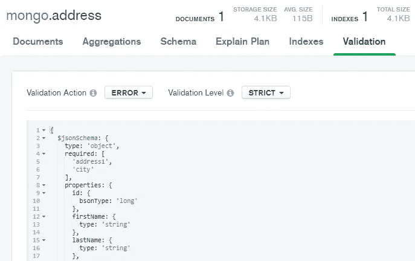

# 在 Spring Boot 验证 MongoDB 文档

> 原文：<https://blog.devgenius.io/validating-mongodb-documents-in-spring-boot-fe4ed5ff3368?source=collection_archive---------20----------------------->

使用 MongoDB 有两种**方法来验证存储在 Spring Boot 应用程序中的文档**。在前一篇文章中描述了这样一个应用程序的基本结构[之后，本文将把重点放在**特定的验证问题**上。](https://bootify.io/mongodb/setup-spring-boot-mongodb.html)

MongoDB 允许在任何时候持久化任何数据结构的任何集合。然而，对于一个打算长期用于生产的应用程序，并且其他应用程序也可能访问数据库，**一个显式定义的数据库模式是一个优势**。这样，开发人员就知道会发生什么，编程也就简化了。

## 通过约束进行验证

一种方法是将来自`javax.validation`包的字段验证直接添加到我们的应用程序包含的文档中。为了激活这些约束，我们首先需要**包含一个依赖项**，这在 Spring Boot 中是默认不存在的:

```
implementation('org.springframework.boot:spring-boot-starter-validation')
```

我们还需要**扩展我们的配置类**，以便我们的持久层实际执行验证。

```
@Configuration
@EnableMongoRepositories("io.bootify.mongo.repos")
public class MongoConfig {

    // ...

    @Bean
    public ValidatingMongoEventListener validatingMongoEventListener(
            final LocalValidatorFactoryBean factory) {
        return new ValidatingMongoEventListener(factory);
    }

}
```

▴ *将 ValidatingMongoEventListener 作为 bean 提供*

现在我们可以**使用众所周知的注释来确保我们字段的有效性**。以下文件中列出了几个例子，如`@NotNull`(必填字段)或`@Size`(字符串长度)。现在将在保存前检查这些内容。

```
@Document
public class Address {

    // ...

    @NotNull
    @Size(max = 510)
    private String address1;

    @Pattern(regexp = "[0-9]{5}")
    private String postalCode;

}
```

▴ *向我们的地址文档添加约束*

## 通过 JSON 模式进行验证

MongoDB 提供了为集合指定一个**显式 JSON 模式的可能性。这将检查为所有保存的文档定义的限制，因此这些限制也适用于希望在数据库中存储数据的其他应用程序。在我们的例子中，我们检查必填字段和数据类型。**



▴ *一个带有基本 JSON 模式的 MongoDB 集合*

为了创建这样一个模式，使用 Mongock 执行的 ChangeLog 是一个好主意。当我们的应用程序启动时，这会用定义的模式初始化集合。因为在事务中创建集合是不可能的，所以我们在这里使用了`@BeforeExecution`钩子。下一篇文章将解释如何设置 Mongock。

```
@ChangeUnit(id = "init-address", order = "001", author = "bootify")
public class InitCollectionsChangeLog {

    @BeforeExecution
    public void beforeExecution(final MongoTemplate mongoTemplate) {
        mongoTemplate.createCollection("address", CollectionOptions.empty()
                .validator(Validator.schema(MongoJsonSchema.builder()
                        .required("address1", "city")
                        .properties(
                                JsonSchemaProperty.int64("id"),
                                JsonSchemaProperty.string("firstName"),
                                JsonSchemaProperty.string("lastName"),
                                JsonSchemaProperty.string("address1"),
                                JsonSchemaProperty.string("postalCode"),
                                JsonSchemaProperty.string("city")).build())));
    }

    // @RollbackBeforeExecution, @Execution, @RollbackExecution

}
```

▴ *用附加选项初始化我们的地址集合的变更日志*

在 Bootify 的免费计划中，Spring Boot 应用程序可以配置自定义数据库模式。当选择 MongoDB 作为数据库时，会生成**文档以及它们的约束**。在专业计划中，Mongock 是一个额外的选项**用一个基本的 JSON 模式**初始化集合。

[**了解更多**](https://bootify.io/quickstart.html)

## 进一步阅读

[MongoDB 模式验证](https://docs.mongodb.com/manual/core/schema-validation/)
[javax.validation 约束](https://docs.oracle.com/javaee/7/api/javax/validation/constraints/package-summary.html)