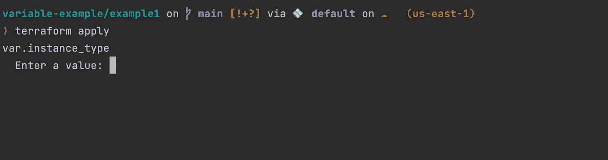
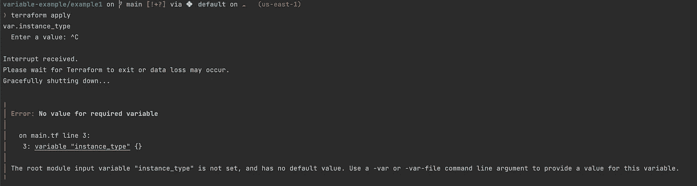
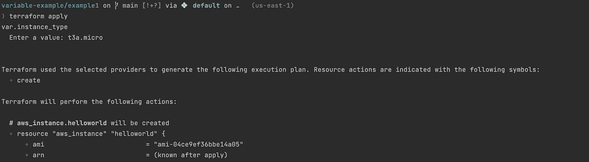
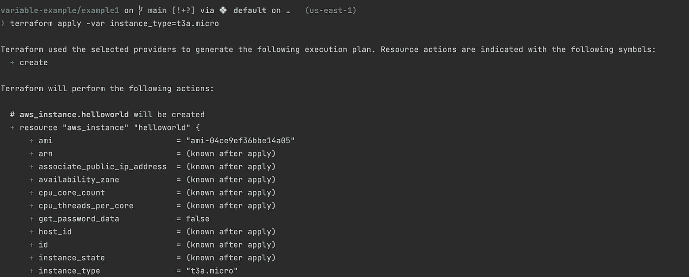
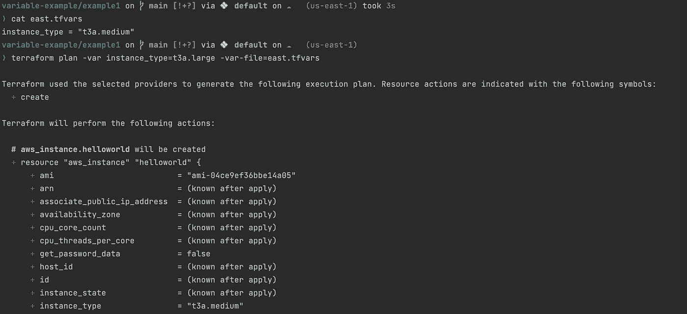

# Terraform 中的变量优先级

> 原文：<https://blog.devgenius.io/variable-precedence-in-terraform-f32dd283dcb9?source=collection_archive---------1----------------------->

和 3 种向 terraform 代码中的变量传递值的方法

erraform 变量有助于定义服务器细节，而不必记住特定于基础设施的值。它们同样便于重用共享参数，比如不会在配置之间改变的公共 SSH 密钥。在计算机程序中，变量有多种用途。变量用于在程序中存储信息，如果需要，可以访问和修改这些信息。变量有许多用途。它还可以用程序读者可以清楚理解的名称来标记数据。这同样适用于地形。

作为以下示例的一部分，我们尝试在 us-east-1 地区创建一个 AWS 实例。在第 3 行，第 11 行声明并使用了变量 instance_type。

Terraform 示例代码

使用命令`terraform init && terraform plan && terraform apply`执行代码。以下是执行该命令后的输出。要创建 EC2，必须提供一个值。

terraform 应用命令的执行输出

如果未提供值，将出现以下错误。

未提供变量时出错

成功创建 AWS 实例的第一种方法是为 instance_type 变量提供一个值，最好是从 EC2 实例类型页面中提供。

提供实例类型值时的响应

第二种方法是将值内联传递给`terraform apply`命令。例如，`terraform apply -var instance_type=t3a.micro`就应该做到这一点。任何作为参数传递给 cli 的内容都优先。像在 bash 中一样，我们也可以在 terraform 中将环境变量作为变量值传入。如果有我们不想保存为版本控制的一部分的敏感值，传递环境变量是有帮助的。

内联传递变量值。

第三种也是最后一种方法是使用一个 *tfvars* 文件。请创建一个新文件，将其命名为 *terraform.tfvars* ，并添加行`instance_type = "t3a.medium"`。在执行 terraform 计划时，您应该看到 EC2 的*实例类型*被设置为 *t3a.medium* 。我们还可以创建一个 *us-east.tfvars* 并在其中添加`instance_type = "t3a.medium"`行。然后对 *terraform plan/apply* 命令，传递参数`--var-file=us-east.tfvars`，你应该看到 *instance_type* 值生效。请注意，传递的`-var`标志优先于 *tfvars* 文件。

> 如果同时传递了 var 文件和-var instance_type=t3a.medium，则参数的顺序非常重要。第二个参数优先于第一个参数。

参数优先级