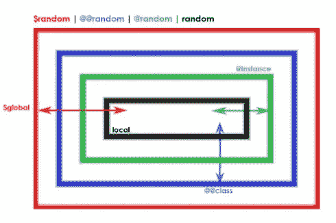

# Ruby 中的变量作用域

> 原文：<https://blog.devgenius.io/variable-scope-in-ruby-7b344bef16c?source=collection_archive---------10----------------------->

所有 Ruby 开发人员都必须理解作用域的概念。为什么？因为这是许多错误消息和混乱的原因。范围到底是什么？变量的范围指的是在任何给定的时间什么变量是可用的。各种类型的变量有不同的范围。范围可以很窄(局部变量)，也可以很宽(全局变量)。为了避免状态突变和名称冲突的问题，您应该使用尽可能窄的范围。

# 局部变量范围

局部变量的范围最有限。特别是，方法返回后，方法中定义的局部变量将不再存在。

## 示例 1

你期望`apple` 打印什么？

解决方法如下:当你调用`apple`时，它总是打印`100`。

an 在方法外被定义为 50 对方法内的`a` 变量没有影响。它们是截然不同的变量。

把作用域想象成一个气泡…
当你调用一个方法，任何方法，你进入一个新的空气泡。在第一个`a = 50`之后，你进入到方法的“气泡”中，你对`a`所做的任何改变都不会反映到气泡之外。即使我们在方法的“气泡”内部创建了一个新变量，也不能从方法外部访问它。

当这种方法结束时……泡沫破裂了。气泡内的变量消失了，再也无法访问。这就是局部变量的工作方式。

> *局部变量的范围是首次定义该变量的块、方法定义或程序(以较小者为准)。*

当有疑问时，记住上面的咒语来帮助你确定一个给定的局部变量存在于哪个“气泡”中。

# 实例变量范围

实例变量的范围更广。它们专门用于 Ruby 对象中的数据共享。

## 示例 2

`@quantity`在这个例子中对于`more_juice` 和`less_juice` 方法是相同的变量。这是所有方法共享的值。但是，在这个类之外，甚至在不同的`Fruit` 对象上，`@quantity`会有所不同。

## 示例 3

每个对象的实例变量都是唯一的。在本例中，orange 的`@quantity`为 100，apple 的`@quantity`为 50。就像不同的人有不同的名字，年龄，国家等等。

# 块中的可变范围

说到范围，块是非常有趣的。按照我们的泡沫类比，一个块从当前的泡沫带来局部变量。你可以接触并控制它们。在程序级定义的块存在于与程序级局部变量相同的气泡中，而在方法定义中定义的块存在于方法的气泡中。积木还会在这个外部气泡中产生一个较小的气泡。

## 实例 4

但是，气泡仍然会弹出，删除块中创建的任何新的局部变量。这难道不令人着迷吗？

## 实例 5

不仅如此，积木还会带着它们被创造出来时的气泡。这意味着该气泡中定义的所有变量都可以从块中访问。这就是所谓的“终结”请记住，这个“气泡”是在源代码中的特定点可以访问的所有变量的集合。它是封装为对象的作用域。在 Ruby 中，这被称为绑定。

# 结论

我们已经看到，变量有不同的作用域，这取决于它们在 Ruby 代码中的定义方式。局部变量只能从创建它们的“气泡”中访问，例如，在一个方法中创建一个变量意味着在该方法之外不能访问它，但是块可以访问初始化它们的气泡中的变量。另一方面，实例变量在它们的类“bubble”中的任何地方都是可访问的，但是一个类的每个实例可能有它自己的与一个实例变量相关联的值。最后，块固有的“气泡”是在其中创建的，它们可以改变气泡内的变量，但是在块本身内创建的任何变量在它运行后都会被删除。