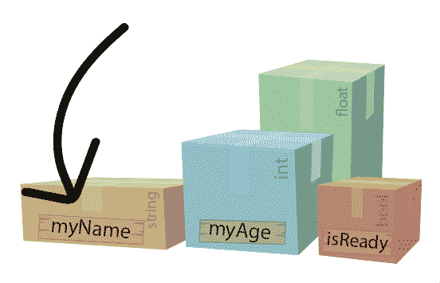

# 变量:数据存储容器

> 原文：<https://blog.devgenius.io/variables-data-storage-containers-b79804e2a4e2?source=collection_archive---------17----------------------->

变量就像保存信息的数据容器，可以随时修改。

常见速度变量的示例，表示为数据容器

**目标**:理解用于声明变量的 4 个元素以及变量的值可以改变的不同方式。

声明任何变量都需要四个元素:

*   **访问修饰符**(公有，私有……)
*   **数据类型** (string、int、float、bool 等)
*   **变量名** ( *myName，myAge，speed，isReady* 等)
*   (可选)**值**

**访问修饰符**

当您声明一个变量时，您需要指定它对其他类的可访问性。最常见的有**公有**和**私有**。

**公共**访问修饰符

通过将你的变量声明为 **public** ，你是说任何其他脚本都可以访问它，并且它可以在检查器中修改，甚至是实时修改；它就像一个开放的信息盒子，任何人都可以交换数据。

当你声明一个变量为私有变量时，你只是在声明它的脚本中给出了对它的访问权；对于程序的其他部分来说，它就像一个封闭的盒子，不能被任何其他类修改，也不能被检查员修改。

**公共**(开放框)vs **私有**(封闭框)访问修饰符

*关于私有变量的一些注释:*

*   命名私有变量时，最好从“_”开始，尤其是当脚本变得复杂，包含数百行代码时。
*   如果一个变量被明确标记为 private…或者它既没有被声明为 public 也没有被声明为 private，那么这个变量就是 private。
*   在私有变量上添加**【serialize field】**允许在检查器中修改它，同时仍然保持它对其他类的私有性。

在私有变量上添加**【serialize field】**使得它可以从检查器中访问

**数据类型**

您必须声明您的变量将是哪种数据类型。

**浮点**数据类型

有 4 种基本数据类型:

*   **字符串**:以单词或句子的形式存储字母、数字和其他特殊字符。字符串值写在双引号内。

=====> **【鲍勃】**…**【6099 美元】** … **“这些都是字符串。”**

*   **int** :存储正或负的整数。

= = = = = >**13**…**10056**…**-6**

*   **float** :存储浮点数(分数)。

= = = = = >**3.5f**……**0.000016 f**……**-1.0f**

*   **bool** :布尔型存储**真**或**假**值。

=====> **真** … **假** ( *只有这两个是可能的布尔值)*

把数据类型想象成*类型的容器*，可以保存相应类型的信息。就像一个装信的信封(*绳子*)，一个装弹珠的袋子( *int* )，一个装药水的小瓶( *float* )，等等…

不同的容器用于盛装特定类型的材料

出于我们的目的，让我们把这些不同的容器类型想象成 ***彩色*** 盒子，它们的类型标在侧面。

按其保存的信息类型标记的彩色容器

**变量名**

你必须给你的变量一个唯一的**名**(在每个脚本中*是唯一的)。*

给定变量名:**速度**

变量名就像在盒子上贴了一个标签，标识里面是什么；或者在我们的例子中，**它保存什么类型的信息**。

给变量容器命名以标记它们所代表的内容

理想情况下，您的变量名应该短小精悍，非常容易理解，因为这个名称将被用来代替它所代表的任何值。

**值** ( *可选*)

最后，当你声明一个变量时，你可以选择给它一个默认的**值**。

为**速度**声明一个默认的浮点值( **3.5f** ，同时将**最高速度**留空

只要遵循每种数据类型所需的特殊语法，就可以将值赋给变量容器。

就像弹珠袋装弹珠，信封装信件一样，设计用来装液体的小瓶既不会装弹珠也不会装信件。

类似地，int 容器保存整数，string 容器保存“引号中的字符串”，但是 float 容器意味着保存分数(*标有* **f** )，而不是整数或“引号中的字符串”。

**条件变量的一个例子**

变量允许我们定义一些东西的值——在这个例子中，玩家以一定的速度移动( **3.5f** )。虽然我们可以将这个值硬编码到我们的脚本中，但是变量的强大之处在于我们有许多方法可以随时轻松地更改这个值。

例如，当某些*条件*发生时，我们可以触发该值的变化。在这种情况下，每当我们在移动时按住**左移**，速度加倍(3.5f * 2)。每当我们不保持左移，回到我们原来的速度(3.5f)。

按住**左移**使数值翻倍，就像在我们的浮动容器中添加一个原始速度变量的副本，或者在我们的药水瓶中倒入两倍的液体。

按住**左移**使速度变量的值加倍。

变量是编码的重要组成部分，它给了我们动态改变这些值的灵活性。