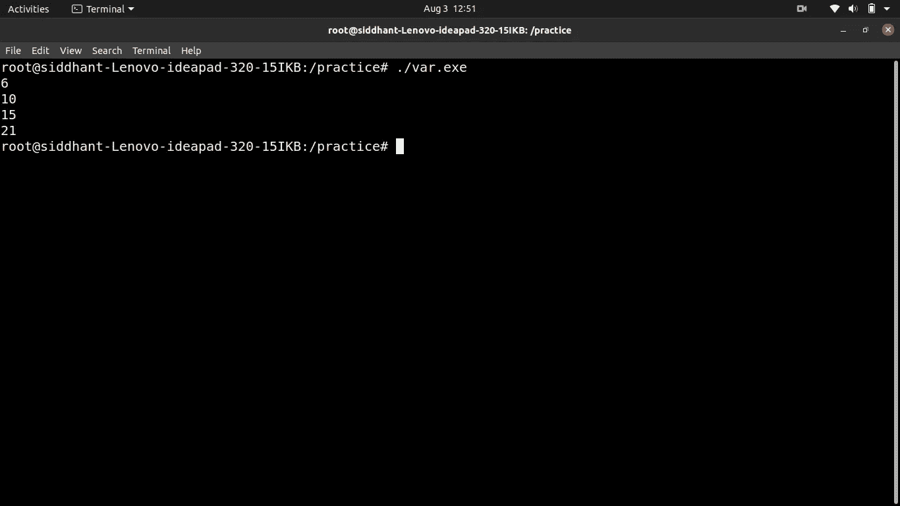

# C 语言中的变元函数

> 原文：<https://blog.devgenius.io/variadic-functions-in-c-c480e85e86e9?source=collection_archive---------7----------------------->

可变函数是那些接受可变数量的参数的函数，因为我们很多人总是好奇 printf 和 scanf 是如何工作的，因为我们可以用可变数量的参数来调用它们。


麦克斯韦·尼尔森在 T2 的照片

> 这是如何工作的？

你可以用最后一个参数函数(a，b，c，…)将变元函数声明为与其他函数相同的函数，这里“…”表示函数可以有可变数量的参数。看起来像是:

```
int sum(int n, …)
```

为了使用这个语法，你必须像这样在头文件中包含 **stdarg.h** 头文件。

```
#include<stdarg.h>
```

现在我们将学习一些将在变量函数中使用的宏。

**va_list :** va_list 宏用于初始化参数指针。

```
va_list argumentsList;
```

**va_start :** va_start 宏用于初始化带有参数列表的 va_list，它接受两个参数，第一个是指向 va_list 的指针，第二个是变量参数的计数。

```
va_start(argumentsList,n);
```

**va_arg :** va_arg 宏最初指向我们调用的参数列表的第一个元素，然后它移动到下一个元素，它接受两个参数第一个是指向 va_list 的指针，第二个是 va_arg 指向的元素的数据类型。

```
int t=va_arg(argumentsList, int)
```

**va_end :** va_end 用于清理 va_list。

```
va_end();
```

理解多元函数的一个非常基本的例子。

```
#include<stdarg.h>
#include<stdio.h>
int add(int n, ...)
{
int i,sum=0;
va_list argumentsList;
va_start(argumentsList,n);
for(i=0;i<n;i++)
{
sum+=va_arg(argumentsList,int);
}
return sum;
}
int main()
{
printf("%d\n",add(3,1,2,3));
printf("%d\n",add(4,1,2,3,4));
printf("%d\n",add(5,1,2,3,4,5));
printf("%d\n",add(6,1,2,3,4,5,6));
return 0;
}
```

该程序的输出将是:



**结论:**在本文中我们学习了什么是变函数以及如何实现它，如果您有任何疑问和建议请添加备注。

谢谢你。