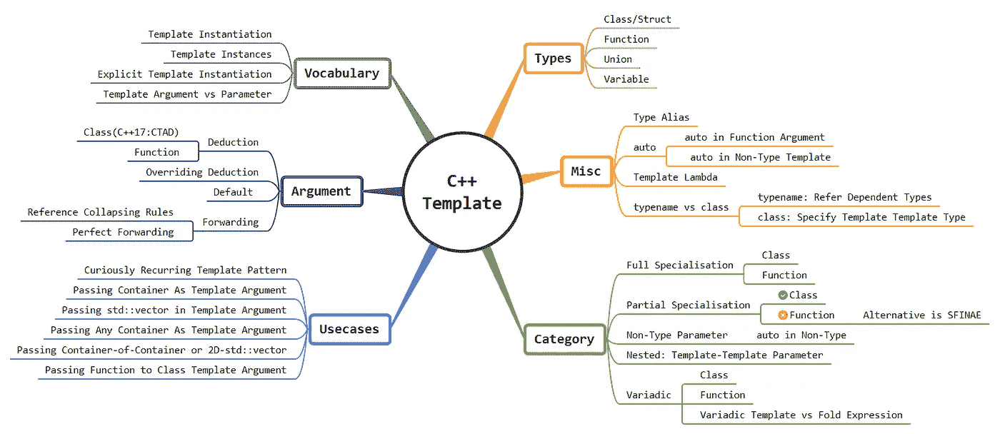

# 可变模板 C++:实现简单的元组

> 原文：<https://blog.devgenius.io/variadic-template-c-implementing-unsophisticated-tuple-b5fb1cf70d0?source=collection_archive---------23----------------------->



从 C++11 开始，`[std::tuple](https://en.cppreference.com/w/cpp/utility/tuple)`是对[现代 C++](http://www.vishalchovatiya.com/21-new-features-of-modern-cpp-to-use-in-your-project/) 的惊人扩展，它提供了一个固定大小的不同值的集合。当然，用传统的方式来处理这些问题可能会有些可疑。但是，随后发布的 C++标准引入了几个特性&助手，大大减少了必要的工作量。因此，在本文中，我将借助简单的元组实现来解释 C++中的变量模板。并带您了解 tuple 的一个棘手部分，即 tuple 元素的循环。尽管事实上我在之前的文章中已经掩盖了可变模板，即 [C++模板:快速更新查看](http://www.vishalchovatiya.com/cpp-template-a-quick-uptodate-look/)。因此，我在这里的重点是混合可变模板&元组实现和更多最新的 C++规范。

> */！\:原载@ www.vishalchovatiya.com*[](http://www.vishalchovatiya.com/)**。**

# *动机*

*   *定义接受可变数量和类型的参数的类/结构/联合/函数通常很有用。*
*   *如果你已经使用过 C 语言，你会知道`printf`函数可以接受任意数量的参数。这些功能完全通过宏或[省略号运算符](https://stackoverflow.com/questions/3792761/what-is-ellipsis-operator-in-c)实现。正因为如此，它有几个缺点，如[类型安全](http://www.vishalchovatiya.com/cpp-type-casting-with-example-for-c-developers/)，不能接受引用作为参数，等等。*

# *可变类模板:实现元组类*

*   *所以，让我们借助变量模板构建自己的 [ADT](https://en.wikipedia.org/wiki/Abstract_data_type) 和`[std::tuple](https://en.cppreference.com/w/cpp/utility/tuple)`一样。*
*   *C++中的变量模板通常从通用(空)定义开始，这也是后面专门化中模板递归终止的基础:*

```
*template <typename... T>
struct Tuple { };*
```

*   *这已经允许我们定义一个空结构，即`Tuple<> object;`，尽管这还不是很有用。接下来是递归案例专门化:*

```
*template<
            typename T, 
            typename... Rest    // Template parameter pack
        >
struct Tuple<T, Rest...> {      // Class parameter pack
    T first;
    Tuple<Rest...> rest;        // Parameter pack expansion Tuple(const T& f, const Rest& ... r)
        : first(f)
        , rest(r...) {
    }
};Tuple<bool>                 t1(false);           // Case 1
Tuple<int, char, string>    t2(1, 'a', "ABC");   // Case 2*
```

# *可变类模板是如何工作的？*

*为了理解可变类模板，考虑上面的用例 2，即`Tuple<int, char, string> t2(1, 'a', "ABC");`*

*   *声明首先匹配专门化，产生一个具有`int first;`和`Tuple<char, string> rest;`数据成员的结构。*
*   *rest 定义再次与专门化匹配，产生一个具有`char first;`和`Tuple<string> rest;`数据成员的结构。*
*   *rest 定义再次匹配这个专门化，创建自己的`string first;`和`Tuple<> rest;`成员。*
*   *最后，这最后一个 rest 与基本用例定义相匹配，产生一个空结构。*

*您可以这样想象:*

```
*Tuple<int, char, string>
-> int first
-> Tuple<char, string> rest
    -> char first
    -> Tuple<string> rest
        -> string first
        -> Tuple<> rest
            -> (empty)*
```

# *可变函数模板:为元组类实现 get <>()函数*

*   *到目前为止，我们已经设计了具有可变数量和类型的数据成员的数据结构。但是，它仍然没有用，因为没有从我们的元组类中检索数据的机制。所以让我们设计一个:*

```
*template<
            size_t idx, 
            template <typename...> class Tuple, 
            typename... Args
        >
auto get(Tuple<Args...> &t) {
    return GetHelper<idx, Tuple<Args...>>::get(t);
}*
```

*   *如您所见，这个 get 函数在`idx`上被模板化了。所以用法可以像`get<1>(t)`，类似`[std::tuple](https://en.cppreference.com/w/cpp/utility/tuple)`。然而，实际的工作是由一个助手类中的静态函数完成的，例如`GetHelper`。*
*   *还要注意 C++14 风格的`auto`返回类型的使用使我们的生活变得非常简单，否则，我们将需要一个非常复杂的返回类型表达式。*
*   *如此继续到助手类。这一次我们将需要一个空的 forward 声明和两个专门化。首先是空的声明:*

```
*template<
            size_t idx, 
            typename T
        >
struct GetHelper;*
```

*   *现在是基本情况(当`idx==0`)。在这个专门化中，我们只返回第一个成员:*

```
*template<
            typename T, 
            typename... Rest
        >
struct GetHelper<0, Tuple<T, Rest...>> {
    static T get(Tuple<T, Rest...> &data) {
        return data.first;
    }
};*
```

*   *在递归情况下，我们递减`idx`并为 rest 成员调用`GetHelper`:*

```
*template<
            size_t idx, 
            typename T, 
            typename... Rest
        >
struct GetHelper<idx, Tuple<T, Rest...>> {
    static auto get(Tuple<T, Rest...> &data) {
        return GetHelper<idx - 1, Tuple<Rest...>>::get(data.rest);
    }
};*
```

*   *举个例子，假设我们有元组数据，我们需要`get<1>(data)`。*
*   *这调用了`GetHelper<1, Tuple<T, Rest...>>>::get(data)`(第二个专门化)。*
*   *进而调用`GetHelper<0, Tuple<T, Rest...>>>::get(data.rest)`。*
*   *并且最终返回(通过第一次特化，因为现在`idx`是 0) `data.rest.first`。*

*原来如此！下面是完整的功能代码，以及 main 函数中的一些使用示例:*

```
*// Forward Declaration & Base Case -----------------------------------------
template<
            size_t idx,
            typename T
        >
struct GetHelper { };template <typename... T>
struct Tuple { };
// -------------------------------------------------------------------------// GetHelper ---------------------------------------------------------------
template<
            typename T,
            typename... Rest
        >
struct GetHelper<0, Tuple<T, Rest...>> { // Specialization for index 0
    static T get(Tuple<T, Rest...> &data) {
        return data.first;
    }
};template<
            size_t idx,
            typename T,
            typename... Rest
        >
struct GetHelper<idx, Tuple<T, Rest...>> { // GetHelper Implementation
    static auto get(Tuple<T, Rest...> &data) {
        return GetHelper<idx - 1, Tuple<Rest...>>::get(data.rest);
    }
};
// -------------------------------------------------------------------------// Tuple Implementation ----------------------------------------------------
template<
            typename T,
            typename... Rest
        >
struct Tuple<T, Rest...> {
    T                   first;
    Tuple<Rest...>      rest; Tuple(const T &f, const Rest &... r)
        : first(f)
        , rest(r...) {
    }
};
// ------------------------------------------------------------------------- // get Implementation ------------------------------------------------------
template<
            size_t idx, 
            template <typename...> class Tuple, 
            typename... Args
        >
auto get(Tuple<Args...> &t) {
    return GetHelper<idx, Tuple<Args...>>::get(t);
}
// ------------------------------------------------------------------------- int main() {
    Tuple<int, char, string> t(500, 'a', "ABC");
    cout << get<1>(t) << endl;
    return 0;
}*
```

# *可变模板 vs 折叠表达式*

*   *有两种方法处理 C++参数包，即*

1.  *递归*
2.  *折叠表达式(来自 C++17)*

*   *在任何可能的情况下，我们都应该用折叠表达式处理参数包，而不是使用递归。因为它有一些好处:*
*   *需要编写的代码更少*
*   *更快的代码(没有优化)，因为你只有一个单一的表达式，而不是多个函数调用*
*   *编译速度更快，因为您处理的模板实例更少*

# *用递归处理参数包*

*   *正如我们前面看到的，可变模板从空定义开始，即递归的基本情况。*

```
*void  print()  {}*
```

*   *然后是递归案例专门化:*

```
*template<   
            typename First, 
            typename... Rest                    // Template parameter pack
        >     
void print(First first, Rest... rest) {         // Function parameter pack
    cout << first << endl;
    print(rest...);                             // Parameter pack expansion
}*
```

*   *这就足以让我们使用变量数目和变量类型的打印函数了。例如:*

```
*print(500, 'a', "ABC");*
```

# *用折叠表达式处理参数包*

```
*template <typename... Args>
void print(Args... args) {
    (void(cout << args << endl), ...);
}*
```

*   *看，不需要神秘的样板。这个解决方案看起来不是更整洁吗？*
*   *总共有 3 种折叠方式:一元折叠、二元折叠和逗号折叠。这里我们已经完成了对逗号的左折叠。你可以点击阅读更多关于折叠表达式[的内容。](https://www.codingame.com/playgrounds/2205/7-features-of-c17-that-will-simplify-your-code/fold-expressions)*

# *在 C++中循环遍历/迭代元组元素*

*   *如果我给你一个打印元组元素的任务，你首先想到的是:*

```
*template <typename... Args>
void print(const std::tuple<Args...> &t) {
    for (const auto &elem : t) // Error: no begin/end iterator
        cout << elem << endl;
}*
```

*   *但是，这样不行。`[std::tuple](https://en.cppreference.com/w/cpp/utility/tuple)`没有`begin` & `end`迭代器。*
*   *好吧！所以，现在你可以尝试原始循环，对吗？*

```
*template <typename... Args>
void print(const std::tuple<Args...>&   t) {
    for (int i = 0; i < sizeof...(Args); ++i)
        cout << std::get<i>(t) << endl;    // Error :( , `i` needs to be compile time constant
}*
```

*   *不要！你不能。我知道`std::get<>`使用一个数字作为[非类型模板参数](http://www.vishalchovatiya.com/cpp-template-a-quick-uptodate-look/#Non-Type_Template_Parameter)。*
*   *但是，这个数字必须在编译时保持不变才能工作。所以有很多解决方案，我们会一一列举。*

# *C++11:循环遍历元组元素*

```
*// Template recursion
template <size_t i, typename... Args>
struct printer  {
    static void print(const tuple<Args...> &t) {
        cout << get<i>(t) << endl;
        printer<i + 1, Args...>::print(t);
    }
};// Terminating template specialisation
template <typename... Args>
struct printer<sizeof...(Args), Args...> {
    static void print(const tuple<Args...> &) {}
};template <typename... Args>
void print(const tuple<Args...> &t) {
    printer<0, Args...>::print(t);
}tuple<int, char, string> t(1, 'A', "ABC");
print(t);
// Note: might not work in GCC, I've used clang*
```

*   *相信我，这并没有看起来那么复杂。如果你知道递归和模板专门化，你不会花超过 30 秒的时间来弄清楚这里发生了什么。*
*   *对于我们的例子`tuple<int, char, string> t(1, 'A', "ABC");`，`printer::print()`每次用递增的非类型模板参数`i`调用模板递归，即`template<size_t i, typename... Args> struct printer{};`。当`i == sizeof...(Args)`出现时，我们的回收通过调用模板特殊化即`template<typename... Args> struct printer<sizeof...(Args), Args...> { };`停止。*

# *C++17:循环遍历元组元素*

*   *用 C++ 17，稍微好一点，因为我们有 Fold 表达式。所以，我们不再需要递归了。*

```
*template <typename... Args>
void print(const std::tuple<Args...> &t) {
    std::apply([](const auto &... args) {
        ((cout << args << endl), ...);
    }, t);
}*
```

*   *`[std::apply](https://en.cppreference.com/w/cpp/utility/apply)`设计为元组助手，接受仿函数或 [lambda 表达式](http://www.vishalchovatiya.com/learn-lambda-function-in-cpp-with-example/)。虽然如果想要根据类型分派到不同的实现，您可以做得更好，但是您可以使用`overloaded`类:*

```
*template <class... Ts>
struct overloaded : Ts... {
    using Ts::operator()...;
};// Deduction guide, google `CTAD for aggregates` for more info
template <class... Ts>
overloaded(Ts...) -> overloaded<Ts...>;   // not needed from C++20auto f = overloaded {
    [](const int &a)        { cout << "From int: " << a << endl; },
    [](const char &b)       { cout << "From char: " << b << endl; },
    [](const string &c)     { cout << "From string: " << c << endl; },
};tuple<int, char, string>    t(1, 'A', "ABC");
std::apply([&](const auto &... e) { (f(e), ...); }, t);*
```

# *C++23:循环遍历元组元素*

```
*template <typename... Args>
void print(const std::tuple<Args...> &t) {
    for... (const auto &elem : t)
        cout << elem << endl;
}*
```

*   *因此，从 C++23 我们可能有[扩展语句](http://wg21.link/p1306)也就是`for...()`。这看起来像一个循环，但它不是。它只是用模板标出每个调用范围，如下所示:*

```
*template <typename... Args>
void print(const tuple<Args...> &t) {
    {
        const auto &elem = get<0>(t);
        cout << elem << endl;
    }
    {
        const auto &elem = get<1>(t);
        cout << elem << endl;
    }
    {
        const auto &elem = get<2>(t);
        cout << elem << endl;
    }
}*
```

*   *而且很明显，没有`break` & `continue`因为它不是循环。*
*   *它基本上适用于所有可以通过`std::get<>()`访问的标准容器。例如，普通数组、`std::tuple`、`std::pair`、`std::array`、未展开的参数包、constexpr 范围等。*

# *结束语*

*我们的 tuple 类中还缺少很多东西，比如[复制构造函数](http://www.vishalchovatiya.com/all-about-copy-constructor-in-cpp-with-example/)、[移动构造函数](http://www.vishalchovatiya.com/move-constructor-assignment-operator-with-shared-ptr/)，一些操作符和 helper 类(比如 [std::tuple_size](https://en.cppreference.com/w/cpp/utility/tuple/tuple_size) )。但是我希望现在你明白了如何使用可变模板来实现它。顺便说一下，实现那些缺失的东西将是你自己学习 variadic template 的良好开端。*

*[有什么建议，查询或者想说](http://www.vishalchovatiya.com/contact-2/) `[Hi](http://www.vishalchovatiya.com/contact-2/)` [？减轻压力，只需点击一下鼠标。](http://www.vishalchovatiya.com/contact-2/) 🖱️*