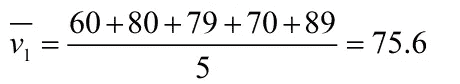

# 使用 R 中的向量进行数据操作

> 原文：<https://blog.devgenius.io/vector-programming-in-r-d24f0933d342?source=collection_archive---------9----------------------->

数据科学家喜欢数据结构，这种结构使他们能够以批量格式操作数据，并针对最佳性能进行了优化。他们不想使用 for 循环来访问数据结构的每个元素并进行更新。R 中的向量被优化以获得最佳性能，并用于以批量格式操作数据，因此我们不需要使用 for 循环来按元素方式操作数据。本文对向量操作中最重要的主题进行了全面的论述，比如处理向量中的缺失数据、类型强制、向量算术以及改变向量的数据类型。

在本文中，我们将讨论以下主题

*   R 中的基本数据类型
*   如何创建向量
*   向量算术
*   处理向量中的缺失数据
*   向量的类型强制
*   更改向量的数据类型
*   访问向量元素
*   命名向量
*   向向量添加元素
*   从向量中移除元素


迈克·科诺诺夫在 [Unsplash](https://unsplash.com?utm_source=medium&utm_medium=referral) 上拍摄的照片

# R 中的基本数据类型

在 R 中我们有 5 种基本的数据类型

## 1.数字数据类型

数字数据类型用于存储实数，如 3.1415、2.0、50 等

```
class(200)
## [1] "numeric"class(3.1415)
## [1] "numeric"class(-6987)
## [1] "numeric"class(-2.3056)
## [1] "numeric"
```

## 2.整数数据类型

整数数据类型用于存储整数值，如 20L、698L、452L 等

```
class(20L)
## [1] "integer"class(-9874L)
## [1] "integer"
```

## 3.字符数据类型

字符数据类型用于存储文本值，如城市名、州名或人名

```
class('abdul ahad')
## [1] "character"class('A')
## [1] "character"class('Tree')
## [1] "character"
```

## 4.逻辑数据类型

逻辑数据类型用于存储布尔值，如 TRUE 和 FALSE。在 R 中，真和假也分别用 T 和 F 表示。

```
class(TRUE)
## [1] "logical"class(FALSE)
## [1] "logical"class(T)
## [1] "logical"class(F)
## [1] "logical"
```

## 5.复杂数据类型

复杂数据类型用于存储由+符号分隔的实部和虚部，如 2+3i 和 50+200i。

```
class(12+6i)
## [1] "complex"class(6i)
## [1] "complex"
```

# 如何创建向量

相同数据类型的元素的有序序列。c()用于创建一个向量。向量可以有不同的长度，但是向量的所有元素必须是相同的数据类型。

*   使用 ***c()*** 函数创建数字、字符和逻辑数据类型的三个向量 x、y 和 z
*   ***(X)***类用于查找向量 ***X*** 的数据类型。
*   整数值被写成 200L，但数值被写成 200

```
numeric_vector <- c(10, 12, 13, 15, 40, 48)
character_vector <- c('Ahad', 'Anshrah', 'Hafsa', 'Rafay')
boolean_vector <- c(TRUE, TRUE, FALSE)
integer_vector <- c(200L, 300L, 600L)
complex_vector <- c(2+3i, 7+6i, 2+i, 50i)print(numeric_vector)
## [1] 10 12 13 15 40 48print(character_vector)
## [1] "Ahad"    "Anshrah" "Hafsa"   "Rafay"print(boolean_vector)
## [1]  TRUE  TRUE FALSEprint(integer_vector)
## [1] 200 300 600print(complex_vector)
## [1] 2+ 3i 7+ 6i 2+ 2i 0+50iclass(numeric_vector)
## [1] "numeric"class(character_vector)
## [1] "character"class(boolean_vector)
## [1] "logical"class(integer_vector)
## [1] "integer"class(complex_vector)
## [1] "complex"
```

# 向量算术

矢量操作的算术运算符如下所示

*   ***“+”***用于添加向量
*   ***-****为减法向量*
*   ****“*”***为乘向量*
*   ****“/***”进行矢量分割*
*   ****【^】***或“**”为取幂运算*
*   ****" % "***为模数*
*   ****"%/%"*** 为整数除法*

*创建两个向量 v1 和 v2*

*   *用向量 v1 添加一个常数*
*   *将向量 v1 和 v2 相加*
*   *从矢量 v1 中减去矢量 v2*
*   *从矢量 v2 中减去矢量 v1*
*   *将向量 v1 和 v2 相乘*
*   *将向量 v2 除以向量 v1*

```
*v1 <- c(1, 5, 8)
v2 <- c(2, 4, 6)v1 + 10
## [1] 11 15 18v1 + v2
## [1]  3  9 14v1 - v2
## [1] -1  1  2v2 - v1
## [1]  1 -1 -2v1 * v2
## [1]  2 20 48v2 / v1
## [1] 2.00 0.80 0.75*
```

*在下面的例子中，我们将 v1 除以 v2*

```
*v1 <- c(10, 20, 48)
v2 <- c(2, 4, 6)v1 %/% v2
## [1] 5 5 8*
```

*在下面的例子中，我们将向量 v1 除以 v2，并返回余数*

```
*v1 <- c(10, 20, 48)
v2 <- c(7, 13, 6)v1 %% v2
## [1] 3 7 0*
```

## *回收(*添加不同长度的向量)**

*向量 v1 的长度是 3，向量 v2 的长度是 6。这意味着向量 v1 的长度是向量 v2 的倍数，所以 R 编程语言的解释器不会给出任何警告。*

```
*v1 <- c(1, 2, 3)
v2 <- c(4, 5, 6, 7, 8, 9)
v1 + v2
## [1]  5  7  9  8 10 12*
```

*向量 v1 的长度是 4，向量 v2 的长度是 6。这意味着向量 v1 的长度不是向量 v2 的倍数，所以 R 编程语言的解释器将返回带有警告的结果。*

```
*v1 <- c(1, 2, 3, 4)
v2 <- c(4, 5, 6, 7, 8, 9)
v1 + v2
## Warning in v1 + v2: longer object length is not a multiple of shorter object
## length
## [1]  5  7  9 11  9 11*
```

# *处理向量中的缺失数据*

*例如，我们有一个 7 名学生的班级，下面的向量给出了学生的分数*

*为了找出班上的学生人数，我们使用了***【length()】***函数。*

*向量 v1 的空值不被计数，因为它们从不存在，而另一方面，向量 v2 的 NA 值被计数。*

*NULL 表示该值根本不存在，NA 值表示它是缺失值的占位符。*

*通常，当处理向量中的缺失值时，我们倾向于 n a。NULL 值会删除该元素，就像它从未存在过一样。*

```
*v1 <- c(60, 80, NULL, 79, 70, NULL, 89)
v2 <- c(60, 80, NA, 85, 70, NA, 95)print(v1)
## [1] 60 80 79 70 89
print(v2)
## [1] 60 80 NA 85 70 NA 95length(v1)
## [1] 5
length(v2)
## [1] 7*
```

*如果我们取 v1 的平均值，则计算中不考虑空值。*

**

```
*mean(v1)
## [1] 75.6*
```

*在用数字替换 NA 值或明确忽略 NA 值之前，不会计算向量 v2 的平均值。*

```
*mean(v2)
## [1] NAmean(v2, na.rm = TRUE)
## [1] 78*
```

****is.na()*** 非常有用，可以告诉我们哪里缺少值*

```
*v2 <- c(60, 80, NA, 85, 70, NA, 95)is.na(v2)
## [1] FALSE FALSE  TRUE FALSE FALSE  TRUE FALSEv2[is.na(v2)]
## [1] NA NAv2[!is.na(v2)]
## [1] 60 80 85 70 95*
```

*用 0 替换缺少的值*

```
*v2 <- c(60,80,NA,85,70,NA,95)v2
## [1] 60 80 NA 85 70 NA 95v2[is.na(v2)] = 0
v2
## [1] 60 80  0 85 70  0 95*
```

*用平均值替换向量的缺失值*

```
*v2 <- c(60,80,NA,85,70,NA,95)v2
## [1] 60 80 NA 85 70 NA 95v2[is.na(v2)] = mean(v2, na.rm = TRUE)v2
## [1] 60 80 78 85 70 78 95*
```

*完全删除丢失的值*

```
*v2 <- c(60,80,NA,85,70,NA,95)
v2
## [1] 60 80 NA 85 70 NA 95v = v2[!is.na(v2)]
v2 = v
v2
## [1] 60 80 85 70 95*
```

# *向量的类型强制*

*向量必须总是相同的数据类型，如果不是，R 将强制它们成为相同的类型*

*   *创建一个整数值向量*
*   *打印向量的元素*
*   *打印矢量的数据类型*

```
*my_vector <- c(20L, 25L, 29L, 6L, 50L)print(my_vector)
## [1] 20 25 29  6 50class(my_vector)
## [1] "integer"*
```

*整数向量中的一个数值足以将其强制转换为数值数据类型。值 20 是数字，所有其他值都是整数数据类型。*

```
*my_vector <- c(20L, 25L, 29L, 6L, 50L, 20)
print(my_vector)
## [1] 20 25 29  6 50 20class(my_vector)
## [1] "numeric"*
```

*如果我试图创建一个包含数值和逻辑值的向量，那么 R 强制数据类型为数值*

```
*v <- c(1, FALSE, TRUE, 0, 1, 1)
print(v)
## [1] 1 0 1 0 1 1class(v)
## [1] "numeric"*
```

*如果我试图创建一个包含数字和复数的向量，那么 R 会强制向量数据类型为复数*

```
*x <- c(1, 2i, 6, 2.5, 3.1415, 7+2i)
print(x)
## [1] 1.0000+0i 0.0000+2i 6.0000+0i 2.5000+0i 3.1415+0i 7.0000+2iclass(x)
## [1] "complex"*
```

*如果我试图创建一个包含字符和复数值的向量，那么 R 会强制向量的数据类型为字符*

```
*x <- c('a', 2i,55,33,99,5+9i)
print(x)
## [1] "a"    "0+2i" "55"   "33"   "99"   "5+9i"class(x)
## [1] "character"*
```

*如果我们试图创建一个所有基本数据类型的向量，那么这个字符应该获胜，因为 R 中数据类型强制的顺序是*

****字符>复数>数值>整数>逻辑****

*这意味着逻辑数据类型的优先级最低，字符数据类型的优先级最高。*

```
*x <- c(1, 'two', 3L, 4+2i, FALSE)
print(x)
## [1] "1"     "two"   "3"     "4+2i"  "FALSE"class(x)
## [1] "character"*
```

# *更改向量的数据类型*

*我们将使用以下函数来改变向量的数据类型*

```
*as.integer()
as.numeric()
as.logical()
as.character()
as.complex()*
```

*我们将创建一个数值向量 ***v.****

*   *显示元素矢量 ***v****
*   *显示矢量 ***v*** 的数据类型*

```
*v <- c(2, 4, 6.56, 3.1415)
v
## [1] 2.0000 4.0000 6.5600 3.1415
class(v)
## [1] "numeric"*
```

*将数值向量转换为整数向量，并打印其元素和数据类型。*

```
*v <- as.integer(v)
v
## [1] 2 4 6 3
class(v)
## [1] "integer"*
```

*将矢量 ***v*** 转换为字符数据类型。打印其元素和数据类型*

```
*v <- as.character(v)
v
## [1] "2" "4" "6" "3"
class(v)
## [1] "character"*
```

*转换回数字向量并打印其元素和数据类型。*

```
*v <- as.numeric(v)
v
## [1] 2 4 6 3
class(v)
## [1] "numeric"*
```

*将矢量 ***v*** 转换为复杂数据类型。打印其元素和数据类型*

```
*v <- as.complex(v)
v
## [1] 2+0i 4+0i 6+0i 3+0i
class(v)
## [1] "complex"*
```

*将数值向量转换为逻辑向量，并将逻辑向量转换为数值向量*

```
*l <- c(1,1,0,0,1)
l
## [1] 1 1 0 0 1l <- as.logical(l)
l
## [1]  TRUE  TRUE FALSE FALSE  TRUEclass(l)
## [1] "logical"l <- as.numeric(l)
l
## [1] 1 1 0 0 1class(l)
## [1] "numeric"*
```

# *访问向量元素*

*创建一个七个元素的字符向量*

```
*countings <- c("one", "two", "three", "four", "five", "six", "seven")*
```

*打印矢量的所有元素*

```
*countings
## [1] "one"   "two"   "three" "four"  "five"  "six"   "seven"*
```

*找出向量的第一个和第七个元素*

```
*countings[1]
## [1] "one"countings[7]
## [1] "seven"*
```

*找出从 2 到 5 的元素范围*

```
*countings[2:5]
## [1] "two"   "three" "four"  "five"*
```

*使用向量索引找到向量的第二个和第五个元素*

```
*countings[c(2, 5)]
## [1] "two"  "five"*
```

*排除第三个元素，打印没有第三个元素的向量*

```
*countings[-3]
## [1] "one"   "two"   "four"  "five"  "six"   "seven"*
```

*使用布尔值向量作为索引来访问向量的元素。索引 1st、4th、6th 和 7th 为真，因此返回相应的向量元素，并且排除与假索引相关联的元素。*

```
*countings[c(TRUE, FALSE, FALSE, TRUE, FALSE, TRUE,TRUE)]
## [1] "one"   "four"  "six"   "seven"*
```

*创建前 9 个自然数的向量，并打印大于 5 的数字*

```
*my_vector <- c(1:9)
my_vector
## [1] 1 2 3 4 5 6 7 8 9my_vector[my_vector > 5]
## [1] 6 7 8 9*
```

# *命名向量*

*我们可以通过使用向量的名称来索引命名的向量*

*   *创建学生计算机、统计和数学成绩的命名向量*
*   *获取第二个位置的元素*
*   *在统计中访问学生的分数*

```
*student_grades <- c(Computer = 95, Statistics = 98, Math = 91)student_grades[2]
## Statistics 
##         98student_grades['Statistics']
## Statistics 
##         98*
```

# *向向量添加元素*

*我们将创建一个数字向量和一个字符向量，向向量添加一个元素，并向向量添加一个向量。*

*   *创建一个由 4 个数字组成的向量，名为 ***v****
*   *将一个值与矢量**v连接***
*   *将一个矢量与矢量**v连接***

```
*v <- c(10,20,30,40)
v
## [1] 10 20 30 40v <- append(v, 50)
v
## [1] 10 20 30 40 50v <- append(v, c(60, 70, 80, 90))
v
## [1] 10 20 30 40 50 60 70 80 90*
```

*   *在第一个元素后附加一个向量 c(11，12，13，14，15，16，17，18，19)*

```
*v <- append(v, c(11, 12, 13, 14, 15, 16, 17, 18, 19), after = 1)
v
##  [1] 10 11 12 13 14 15 16 17 18 19 20 30 40 50 60 70 80 90*
```

*   *创建一个字符向量并添加一个字符向量*
*   *将一个元素附加到向量上*

```
*v <- c('one', 'two', 'six', 'seven')v
## [1] "one"   "two"   "six"   "seven"v <- append(v, c('three', 'four', 'five'), after = 2)
v
## [1] "one"   "two"   "three" "four"  "five"  "six"   "seven"v <- append(v, 'eight')
v
## [1] "one"   "two"   "three" "four"  "five"  "six"   "seven" "eight"*
```

# *从向量中移除元素*

*创建一个前 10 个自然数的向量，并通过子集化和负索引删除向量的元素*

*   *创建前 10 个自然数的向量，并将其存储在变量 v 中*
*   *通过子集化移除向量 ***v*** 的最后 4 个元素*
*   *使用负分度移除第三个元件*

```
*v <- c(1:10)
v
##  [1]  1  2  3  4  5  6  7  8  9 10v <- v[1:6]
v
## [1] 1 2 3 4 5 6v <- v[-3]
v
## [1] 1 2 4 5 6*
```

# *结论*

*在本文中，我们讨论了几乎所有与 R 编程语言中的向量创建和操作相关的重要主题。*